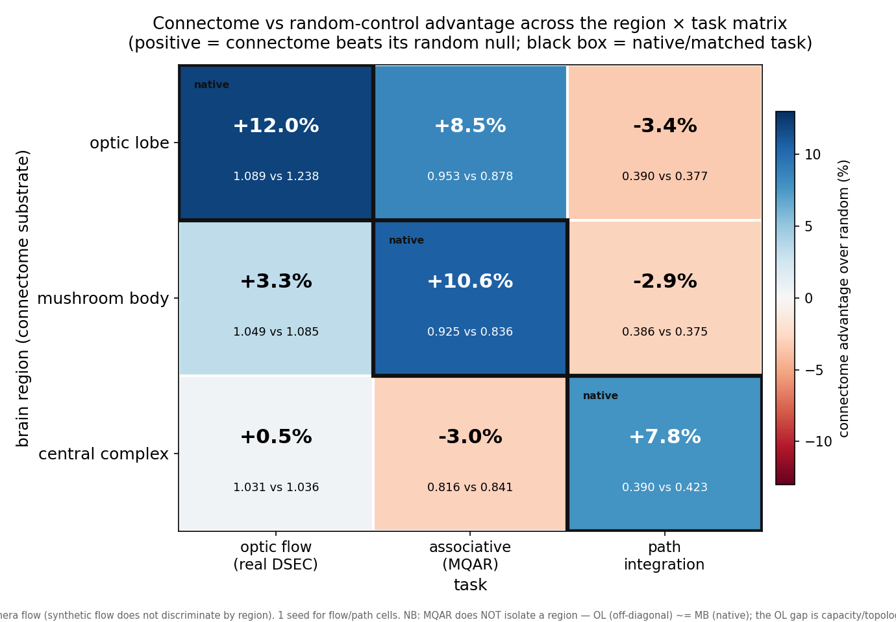

# Connectome-derived RNNs: task–region alignment

**A brain region's wiring is matched to the computation that region evolved to perform — and that
match carries over to artificial networks.** We seed matched recurrent networks with connectomes from
three *Drosophila* brain regions (optic lobe, mushroom body, central complex) and show that each
region's wiring confers a **task-specific advantage on its native task** over size- and
degree-matched random controls: structure→function alignment, demonstrated causally.

The effect is **sharpest for the central complex on path integration** — its connectome beats a
uniform-random control *and* a degree-matched-random control (the degree-matched network is, if
anything, *worse* than random), so the advantage is the region's **specific wiring topology**: not
generic sparsity, not the degree distribution, not the synaptic weights. The optic lobe leads on
optic flow and the mushroom body on associative recall, filling out the region × task alignment grid.



> Cell = connectome's % advantage over its random control (sign-corrected, + = connectome better);
> black box = each region's native task. Per-cell numbers, controls, and statistics:
> [`docs/results/region_task_matrix/`](docs/results/region_task_matrix/README.md).

---

## Repository map

| path | what's here |
|---|---|
| **`src/`** | the library — connectome loading, control generation, models, training (`src.train`, `src.connectome`, …). All scripts import from here. |
| **`scripts/`** | entry points, grouped by topic — see [`scripts/README.md`](scripts/README.md). |
| **`connectomes/`** | prepared connectome substrates (adjacency `.npz` + structure runs), used as `--matrix` inputs. *(git-ignored data; regenerable via `scripts/connectome/`.)* |
| **`data/`** | external datasets (DSEC flow, MNIST, Omniglot, larva). *(git-ignored.)* |
| **`outputs/`** | raw run artifacts (checkpoints, metrics), grouped under `outputs/results/<topic>/` — see [`outputs/README.md`](outputs/README.md). *(git-ignored.)* |
| **`docs/`** | method writeups (`docs/<topic>.md`) and **curated results** with figures (`docs/results/<experiment>/`). Index: [`docs/results/README.md`](docs/results/README.md). |
| **`experiments/`** | experiment configs. **`flywire_cache/`** raw connectome dumps. **`plumetracknets/`** plume sub-project. **`tests/`** unit tests. |

### `scripts/` layout
`connectome/` (build substrates) · `flow/` (optic flow, DSEC) · `mqar/` (associative recall) ·
`associative/` (mushroom-body associative learning + benchmarks) · `arbitrary/` (foreign-task battery) ·
`path/` (central-complex path integration & dynamics) · `continual/` · `plume/` · `classification/` ·
`transfer/` · `figures/` (plotting) · `benchmarks/` · `patent/` · `setup/`.

---

## Quickstart

```bash
pip install -r requirements.txt          # GPU box setup: docs/aws_g7e_amazon_linux_setup.md

# regenerate the headline figure
python scripts/figures/plot_region_task_heatmap.py

# the central-complex / path result (strongest, degree-control-surviving cell)
python scripts/path/run_path_offdiagonal.py \
  --regions CX:connectomes/cx_polar_bump_seed0 --out-root outputs/results/path/cx_deg \
  --seeds 0 1 2 --epochs 12 --train-count 8000      # models: connectome / random / weight_shuffle / degree_shuffle

# a task-specificity control (sequential MNIST — foreign to every region)
python scripts/arbitrary/run_arbitrary_tasks.py --task seq_mnist \
  --matrix connectomes/flywire_mushroom_body/adjacency_unsigned.npz \
  --models hemibrain_seeded weight_shuffle random_sparse no_recurrence --seeds 0 1 2
```

The original frozen-connectome benchmark CLI (`run_benchmark.py`) and its scientific notes are
preserved in [`docs/cx_bpu_benchmark.md`](docs/cx_bpu_benchmark.md).

---

## Key results — `docs/results/<experiment>/`

- **`region_task_matrix/`** — the region × task alignment grid (figure above) + per-cell numbers.
- **CX → path (degree-matched control)** — the central complex's connectome beats random *and*
  `degree_shuffle`; degree-matched random is *worse* than random, so the advantage is the **specific
  wiring pattern** — not sparsity, degree distribution, or weights. The cleanest demonstration that
  region-specific structure encodes a task-aligned inductive bias.
- **OL → optic flow** — the optic-lobe connectome learns flow fastest, a region-aligned
  sample-efficiency gain on real DSEC event-camera data.
- **MB → associative recall** — the mushroom-body connectome reaches near-ceiling associative recall
  with a ~1.8× sample-efficiency boost over random.
- **Task-specificity (controls)** — the advantage is *absent* on tasks foreign to every region
  (sequential MNIST, arithmetic — with recurrence proven load-bearing), confirming it tracks the task,
  not network size.

Per-cell numbers, multi-seed statistics, and boundary cases:
`docs/results/region_task_matrix/README.md`.

## Controls vocabulary (used throughout)
`connectome`/`hemibrain_seeded`/`connectome_bpu` = real wiring · `random`/`random_sparse` = uniform
random support · `weight_shuffle` = same topology, scrambled weights (isolates weights vs topology) ·
`degree_shuffle`/`degree_preserving_random` = random topology with matched degree sequence ·
`no_recurrence` = `W_rec` zeroed (proves recurrence is load-bearing).
