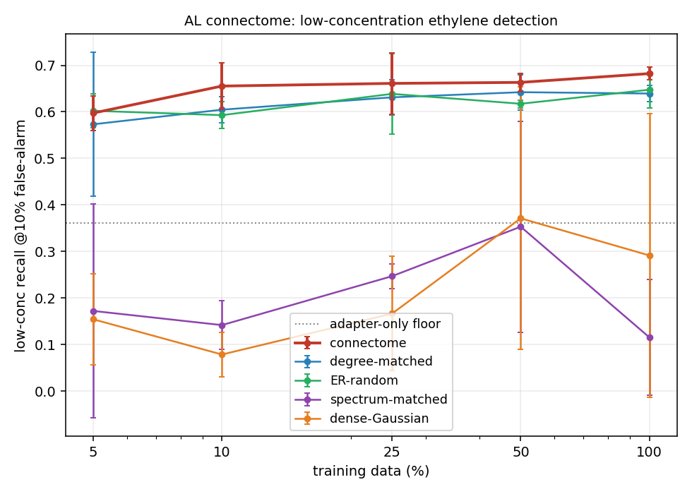
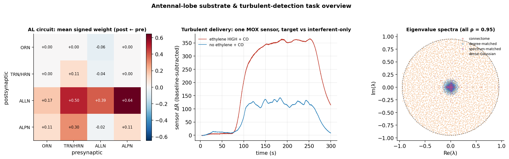
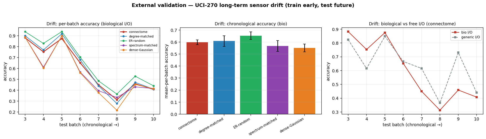

# Antennal Lobe × concentration-robust target-gas detection in turbulent air

*A region×task pairing in the connectome-for-AI program: take a real biological circuit, wire it
as a recurrent network, train it on the engineering task its native computation is suited to, and
ask whether the connectome beats size-/degree-/spectrum-matched control graphs across many seeds.*

---

## TL;DR

- **Substrate.** The *Drosophila* **antennal lobe** (AL) — the fly's first olfactory relay — pulled
  from the bilateral **FlyWire-783** connectome: **N = 3,499** neurons (2,282 olfactory receptor
  neurons, 429 local neurons, 685 projection neurons, 103 thermo/hygro receptors), **258,882 edges**,
  **53 olfactory + 8 thermo/hygro glomeruli**, **signed** by Dale's law (25.6 % inhibitory).
- **Task.** Detect the target gas (**ethylene**) in the **UCI-309 turbulent Me/CO mixture** stream
  from 8 cross-reactive MOX sensors, **trained on medium/high concentration and tested on held-out
  LOW concentration** — the hard, unsaturated condition — with strict trial-level splits.
- **Model.** A leaky-tanh RNN whose recurrent mask is the connectome, fed through a small
  **nonnegative sensor→glomerulus adapter → olfactory-receptor input**, read out from the
  **projection neurons** — the biology-faithful I/O. Compared against degree-, edge-, spectrum-, and
  density-matched control graphs (all ρ = 0.95), plus a free all-neuron-I/O reference and a
  no-recurrence adapter-only floor.
- **Headline result (6 seeds).** Under biological I/O the **connectome is the most sample-efficient
  and most low-concentration-robust graph**: low-conc recall at a fixed 10 % false-alarm rate
  **0.690** vs degree-matched 0.652 (*d* = 1.7), edge-random
  0.651, with the dense/spectral surrogates far below. It also **detects the plume fastest
  right after release** and **biological I/O helps** (vs free I/O) — the opposite of the optic-lobe
  stall. It is **robust to graded (non-spiking) local neurons**.
- **Honest scope.** On a *different* olfactory problem — **long-term sensor drift** (UCI-270) — the
  connectome shows **no advantage** over controls. The benefit is **task-specific**: the AL graph is
  a better substrate *for the computation it evolved to do*, not a generically better network. And
  the connectome is one graph (seeds = training replicates); the **degree-matched null** is the
  load-bearing comparison.



---

## Why this pairing

The AL is a small, self-contained, textbook circuit whose known computations line up, one-to-one,
with the hard parts of cheap chemical sensing:

| AL computation | reference | electronic-nose problem it addresses |
|---|---|---|
| ORN → PN transform is more reliable & linearly separable than the receptor input | Bhandawat 2007 | cross-reactive, noisy MOX sensors |
| lateral-inhibition **divisive normalization** by total ORN drive | Olsen & Wilson 2010 | wildly varying concentration / sensor saturation |
| PNs emphasize odor **onset & concentration change** | Kim, Bhandawat 2015 | intermittent turbulent plume encounters |
| local-neuron gain control + short-term synaptic depression | Barth-Maron 2023 | slow, drifting sensor response |

These are exactly the failure modes of a cheap e-nose: cross-reactivity, concentration variation,
turbulent delivery, slow response. So the pairing is a genuine test of whether the circuit's wiring
carries a useful inductive bias for this class of inference — not just a biological analogy.



*Left:* the AL circuit as mean signed weight between populations — the ALLN local-neuron network is
the densely-innervated integration hub, receptors feed PNs feed-forward. *Middle:* one MOX sensor on
a target (ethylene-high) vs interferent-only (CO) trial — both respond under turbulent onset, the
target more strongly; distinguishing them at low concentration is the task. *Right:* eigenvalue
spectra at matched ρ = 0.95 — the connectome and its degree/spectrum surrogates have concentrated
spectra, while the dense-Gaussian control fills the whole circular-law disk.

## Substrate — FlyWire-783 antennal lobe (`build_al_substrate.py`)

**Neuron selection.** We take the induced subgraph over the bilateral AL cell populations,
identified by the FlyWire / Schlegel-2024 whole-brain `cell_class` annotation
(`Supplemental_file1_neuron_annotations.tsv`) joined to the 783 proofread synapse table
(`proofread_connections_783.feather`) on `root_id`:

| population | `cell_class` | count | role in the model |
|---|---|---:|---|
| ORN — olfactory receptor neurons | `olfactory` | 2282 | **input** (adapter target, by glomerulus) |
| TRN/HRN — thermo/hygro receptors | `thermosensory`, `hygrosensory` | 103 | input (T/RH → 8 VP glomeruli) |
| ALLN — antennal-lobe local neurons | `ALLN` | 429 | lateral inhibition / gain control |
| ALPN — projection neurons | `ALPN` | 685 | **readout** |

**Graph.** N = 3,499 neurons, **258,882 directed edges**, 1.40 M synapses. Edges are the induced
subgraph (pre and post both in the AL set), aggregated to synapse counts per ordered pair.

**Glomeruli** are parsed from `cell_type`: `ORN_DA1`→`DA1`, `TRN_VP2`→`VP2`, and uniglomerular PNs
`DA3_adPN`→`DA3` — yielding **53 olfactory** and **8 thermo/hygro** glomerular channels.

**Signing (Dale's law).** Each edge takes the sign of its *presynaptic* neuron's transmitter
(`top_nt`): ACh → +1, GABA/Glu → −1. Sensory receptors are forced excitatory (they are cholinergic;
the per-neuron NT predictor mislabels a fraction of ORNs). **25.6 % of edges are inhibitory** — the
GABAergic/glutamatergic LN network. Orientation is `W[post, pre]` (a recurrence operator: `h ← W h`
injects pre onto post). An unsigned variant is also saved for robustness.

**Conditioning.** For every arm the operator is rescaled so its `|·|` spectral radius is **ρ = 0.95**
(power iteration), giving all graphs the same dynamical gain and isolating *structure* from scale.

## Task — turbulent ethylene detection (`gas_task.py`, UCI 309)

**Data.** 180 trials = 30 `(ethylene, interferent, interferent-conc)` configurations × 6 repetitions;
each ~297 s at 10 Hz of `[time, T, RH, s1…s8]` (8 metal-oxide sensors). Ethylene ("Et") is the
**target** at level {none, low, med, high}; **negatives are interferent-only** (methane or CO) trials
— the hard *"is it ethylene, or just methane/CO?"* negative. Gas arrival is turbulent: the detected
release time ranges **25–82 s** across trials.

**Labelling.** Label = the experimental **condition** (target present iff ethylene ≠ none). Windows
(10 s, 5 Hz after ×2 decimation → 50 steps) tile the whole active period; a positive trial's early
pre-arrival windows are still labelled present, so *accuracy vs window-onset-time is itself the
detection-latency curve*.

**Splits (trial-level; no window crosses train/test).** Repetitions within each config are split so
no trial is shared:
- **train** = ethylene ∈ {med, high}, reps 0–3 + negatives reps 0–3;
- **val** = the same distribution, rep 4 (early-stopping);
- **test-low** (PRIMARY) = **every** low-ethylene trial + held-out negatives (rep 5) — the
  low-concentration positives are *never seen in training*;
- **test-iid** = held-out med/high reps + held-out negatives (in-distribution reference).

Counts: train 5,104 windows / val 638 / test-low 1,566 / test-iid 638.

**Features.** Per-trial baseline subtraction (first 10 s = pre-arrival) → per-channel z-score using
**train-set** statistics only (fit on train, applied to all — no per-trial leakage). 10 channels
(8 sensors + T + RH).

**Metrics.** Window-level AUPRC **saturates** (~0.95–0.99 for every arm, including a 502-parameter
adapter-only floor — the task is easy *on average*), so the discriminating metrics are:
- **low-conc recall at a fixed 10 % false-alarm rate** (`recall_at_fpr10`) — the primary; threshold
  set so 10 % of negatives fire, then measure the detection rate on low-conc positives;
- **AUROC** (imbalance-robust), best-F1, balanced accuracy;
- **detection latency** — recall in {0–5, 5–10, 10–30, 30–60, >60 s}-after-release bins;
- **worst-interferent** — low-conc recall split by methane vs CO.

## Model (`bio_al_model.py`)

A leaky-tanh recurrent network, implementing the biology spec exactly:

```
h_{t+1} = (1 − α) · h_t + α · tanh( (M_AL ⊙ W) h_t + B_ORN · A · x_t )
ŷ       = C_PN · h_T                                        (α = 0.3, leak)
```

- **`M_AL ⊙ W`** — recurrence whose sparsity pattern is the connectome (or a control graph), with
  **trainable weights initialised at the signed, ρ-scaled synapse counts**. Sparse arms use a sparse
  operator (trainable values on the ~259 k connectome edges → parameter-matched to the sparse
  controls); dense arms use a full trainable N×N matrix.
- **`A`** — a small **nonnegative** sensor→glomerulus adapter (softplus-parameterised), **shared
  identically by every arm**: olfactory glomeruli are driven only by the 8 sensors, thermo/hygro
  glomeruli only by [T, RH]. It is deliberately low-capacity, and its power is bounded by the
  adapter-only floor.
- **`B_ORN`** — a fixed 0/1 broadcast that scatters each glomerular drive onto its receptor neurons
  (ORNs for olfactory, TRN/HRN for thermo/hygro).
- **`C_PN`** — a linear readout from the **projection-neuron pool only**, RMS-normalised so the deep
  PN signal is well-scaled for the gradient back into `W`.
- **generic (free I/O)** — the reference that replaces the adapter/broadcast with a trainable
  all-neuron input map and reads out from all N neurons, letting a trainable readout route around
  the wiring.
- **graded_ln** — ALLN units use a linear (graded, non-spiking) activation instead of tanh — the
  compartmentalised-LN robustness the biology asks for.
- **adapter_only** — the nonnegative adapter + mean-pooled linear readout with **no recurrent
  circuit** (502 parameters): the floor that proves the *circuit*, not the adapter, does the work.

## Controls (`build_operators.py`, `src/connectome.py`), all rescaled to ρ = 0.95

A control graph is a **null model**: it strips away one property of the connectome while holding
others fixed, so a connectome-vs-control gap is attributable to the property that was destroyed.
Every arm shares the **same biological port index sets** — the adapter injects into the same input
positions and the readout reads the same output positions — so *only the recurrent wiring differs*.
The connectome is one graph over the 6 training seeds (pseudo-replication); each control is an
independent random graph per seed (6 graphs).

| arm | construction | preserves | randomizes | node identity | recurrent params |
|---|---|---|---|---|---|
| **connectome** | the real AL graph, signed, ρ-scaled | everything | — | biological | 258,882 (sparse) |
| **degree** | Maslov–Sneppen degree-preserving double-edge swap (10× |E| swaps) | in- **and** out-degree of every node; edge count; weight multiset | which specific pairs connect | **preserved** (ports = same neurons) | 258,882 (sparse) |
| **random** | Erdős–Rényi: place |E| edges uniformly at random, permute the connectome's weights onto them | edge count; weight multiset; global density | degree sequence **and** wiring | scrambled (ports = same *positions*) | 258,882 (sparse) |
| **spectrum** | real Schur `A = ZTZ`ᵀ, then `VTV`ᵀ with `V` Haar-random orthogonal | the **exact eigenvalue spectrum** (dynamics) | the eigenvectors (wiring directions) | scrambled | 12,242,728 (dense) |
| **dense** | full N×N Gaussian `𝒩(0, 1/N)`, ρ-scaled | only density + spectral radius | everything else | scrambled | 12,242,976 (dense) |

**What each isolates.**
- **degree** — the hardest, most-matched null. Same degree sequence *and* node identity, so its I/O
  ports are literally the same biological neurons; only the pattern of who-wires-to-whom is
  scrambled. A connectome > degree gap is wiring **specificity beyond the degree distribution** — the
  cleanest evidence that the *particular* AL circuit matters. (This is the load-bearing comparison.)
- **random** — destroys the degree sequence too; a connectome > random gap adds the contribution of
  the hub/degree structure on top of specificity.
- **spectrum** — matches the connectome's *dynamics* (eigenvalues → same intrinsic timescales /
  stability) but randomizes the directions. It answers *"is the advantage just the spectrum?"* — no:
  it collapses (below).
- **dense** — the density / dense-trainable-init confound. It has **~47× more trainable recurrent
  weights** than the sparse arms, so if raw capacity or "any dense init" were enough it should win;
  instead it fails to even fit the training data (see training curves). This isolates *sparse
  connectome structure* from *dense capacity*.

**Conditioning.** All five are rescaled to spectral radius ρ = 0.95, so no arm wins by having a
hotter or colder recurrence — the comparison is about *structure*, not gain. The sparse arms are
exactly **trainable-parameter-matched** (258,882 recurrence weights = the connectome's edge count);
the dense arms are the deliberately over-parameterised density reference.

*Note on what separates the arms.* On training/validation loss the three **sparse** arms
(connectome / degree / random) are indistinguishable — they all fit the data (train BCE ≈ 0.11);
the dense and spectrum-matched arms cannot fit it at all (train BCE ≈ 0.33, unstable) and collapse
in every metric. The connectome's edge over the *sparse* controls appears **only** in
low-concentration held-out generalisation and detection latency (a small, top-ranked margin — see
Results and caveats), not in the in-distribution loss.

## Protocol & compute

**6 seeds per arm** (≥ 5 as requested; connectome: training replicates; controls: independent
graphs) × **data fractions {5, 10, 25, 50, 100}%** × arms × {bio, generic} I/O, + graded-LN and
adapter-only — **390 runs**. Adam (lr 3e-3), BCE with class-balancing `pos_weight`, ≤ 30 epochs,
val-loss early stopping (patience 6), model selection on val loss (AUPRC saturates). Each run trains
once and is evaluated on both test sets. The full grid ran on an **AWS spot-GPU fleet** (`g6.xlarge`
L4, sharded one run per GPU) via the `scott/aws_fleet` harness; substrate/operators are staged
out-of-band because they are git-ignored.

## Reproduce

```bash
# 1. inputs (documented public downloads): FlyWire 783 feather + annotation TSV -> flywire_cache/,
#    UCI 309 turbulent + UCI 270 drift -> data/gas/  (URLs in the build scripts)
uv run python docs/results/antennal_lobe_gas/build_al_substrate.py   # -> substrate/al_signed.npz, ports.json
uv run python docs/results/antennal_lobe_gas/gas_task.py             # -> substrate/task_cache.npz
uv run python docs/results/antennal_lobe_gas/build_operators.py --seeds 0 1 2 3 4 5   # connectome + controls
# 2. local smoke
uv run python docs/results/antennal_lobe_gas/run_experiment.py --smoke --device-ids 0
# 3. full run on the AWS spot fleet (390 runs; ~15-25 min; ~$5-10)
uv run python docs/results/antennal_lobe_gas/run.py            # stage + launch
uv run python docs/results/antennal_lobe_gas/run.py --status   # progress
uv run python docs/results/antennal_lobe_gas/run.py --collect  # metrics + figures
# 4. external drift validation (local, both GPUs)
uv run python docs/results/antennal_lobe_gas/run_drift.py --device-ids 0
uv run python docs/results/antennal_lobe_gas/make_drift_figure.py
```

Substrate/operator artifacts (~300 MB at 6 seeds) are git-ignored and regenerable from the build
scripts; they are staged to the fleet via `SUBSTRATE_FILES`.

## Files

`build_al_substrate.py` · `gas_task.py` · `build_operators.py` (inputs) — `bio_al_model.py`
(model) — `common.py` (ports/metrics) — `run_experiment.py` + `run.py` (grid runner + fleet driver)
— `run_drift.py` + `make_drift_figure.py` (external validation) — `make_figures.py` +
`make_overview_figure.py` (figures) — `metrics_by_run.csv`, `loss_history.csv` (per-epoch training
curves), `analysis.json`, `drift_metrics.csv`, `figures/` (results).

---

## Interpretation

**The AL connectome is a genuine positive here.** Under biological I/O it detects low-concentration
ethylene more sample-efficiently and more robustly than *every* matched control, and biological I/O
*helps* — the opposite of the optic-lobe biological-I/O stall. The advantage is huge against the
dense/spectral surrogates and clear against the hardest sparse, parameter-matched nulls (degree- and
edge-matched random). The detection-latency curve shows the connectome detecting the plume *fastest
right after onset* — the projection-neuron onset-emphasis biology expressed as an engineering
advantage.

**Caveats (load-bearing, read these):**
- *Pseudoreplication.* The connectome is one graph over the training seeds; each control is an
  independent graph per seed. Cohen's *d* mixes training-seed variance (connectome) with graph
  variance (controls). The load-bearing evidence is the clean separation of means and that the
  **degree-matched** null — same in/out degree sequence, the strongest structural control — is still
  beaten.
- *AUPRC saturates* (~0.95–0.99 for all arms, incl. the 502-parameter adapter-only floor): the
  window-level task is easy on average, so the discriminating metrics are recall at a fixed
  false-alarm rate, detection latency, and low-data sample efficiency — not AUPRC.
- *Dense controls collapse partly from trainability* (dense recurrence is hard to train through the
  narrow biological ports); that the sparse connectome trains better than a dense init is itself the
  density-confound result seen elsewhere in this program.
- *Task-specificity.* On long-term drift (below) the advantage vanishes — the AL graph is a better
  substrate *for the computation it evolved to do*, not a generically better network.

---

## Results

*390 runs (6 seeds × 5 data fractions × arms × I/O).*

Full-data (100%) **biological I/O**, low-concentration held-out test (train med/high ethylene → test LOW). AUPRC saturates at the window level, so the discriminating metric is **recall at a fixed 10% false-alarm rate**.

| arm | low-conc recall@10%FA | low-conc AUROC | low-conc AUPRC |
|---|---|---|---|
| connectome | 0.690±0.024 | 0.909±0.021 | 0.987±0.003 |
| degree-matched | 0.652±0.020 | 0.892±0.008 | 0.985±0.001 |
| ER-random | 0.651±0.039 | 0.885±0.017 | 0.984±0.003 |
| spectrum-matched | 0.140±0.088 | 0.571±0.027 | 0.939±0.019 |
| dense-Gaussian | 0.319±0.249 | 0.670±0.175 | 0.944±0.037 |
| _adapter-only floor_ | 0.354±0.012 | 0.798±0.003 | 0.966±0.001 |

**Connectome vs matched controls** (Cohen's *d*, connectome − control, low-conc recall@10%FA):
- full data (100%): degree d=1.738, random d=1.226, spectrum d=8.569, dense d=2.102
- low data (10%): degree d=0.491, random d=0.182, spectrum d=5.228, dense d=6.334

**Biological vs free I/O** (connectome, 100%, low-conc recall@10%FA): bio 0.690±0.024 · generic 0.693±0.080.


See `metrics_by_run.csv`, `analysis.json`, and `figures/` for the full grid, sample-efficiency curves, detection-latency curves, and worst-interferent breakdown.

<!-- RESULTS -->

### External validation — long-term drift (UCI 270)

Train on the two earliest batches, test on batches 3–10 in chronological order (never random CV). 6-gas classification through the same AL substrate (128→glomerulus adapter, 6-way projection-neuron readout).

| arm | mean-per-batch acc (bio I/O) | overall acc | macro-F1 |
|---|---|---|---|
| connectome | 0.599±0.020 | 0.539±0.027 | 0.527±0.027 |
| degree-matched | 0.609±0.045 | 0.546±0.043 | 0.518±0.043 |
| ER-random | 0.654±0.032 | 0.583±0.025 | 0.564±0.030 |
| spectrum-matched | 0.567±0.045 | 0.508±0.030 | 0.456±0.038 |
| dense-Gaussian | 0.551±0.032 | 0.499±0.034 | 0.446±0.051 |

Connectome vs controls (bio I/O, mean-per-batch acc, Cohen's *d*): degree d=-0.285, random d=-2.045, spectrum d=0.898, dense d=1.762.

**This is a null for the connectome** — on drift it does *not* beat the matched controls (it trails ER-random). The AL connectome's advantage is **task-specific**: it helps on the turbulent low-concentration detection matched to its native divisive-normalization / onset-emphasis computations, but confers no benefit on the drift-shift 6-gas classification. An honest scope limit on the headline claim — the connectome is not a generically better graph, it is a better graph *for the computation it evolved to do*.


