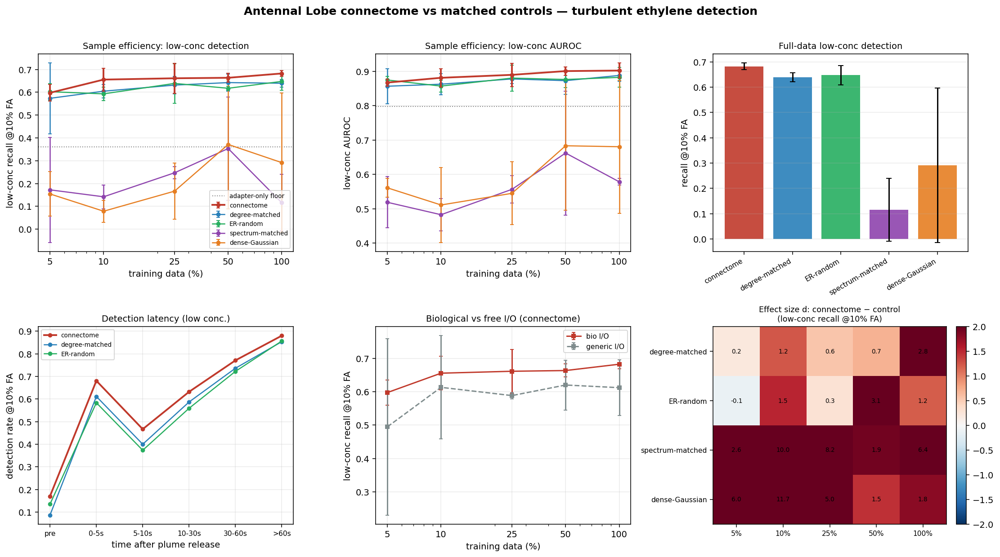

# Antennal Lobe × concentration-robust target-gas detection in turbulent air

**Question.** Does the *Drosophila* antennal lobe (AL) connectome — the fly's first olfactory
relay — wired as a recurrent network, detect a target gas in a turbulent electronic-nose stream
**more sample-efficiently / more robustly to low concentration** than size-, degree-, and
spectrum-matched control graphs, under *biologically-correct* I/O (a sensor→glomerulus adapter
feeding the olfactory receptor neurons, with the projection neurons as the readout)?

This is one region×task pairing in the lab's ongoing connectome-for-AI program. As with the
other pairings, the honest null it is tested against is *"a matched random graph does just as
well."* We report the connectome-vs-control effect either way.

---

## Why this pairing

The AL is a small, self-contained, textbook circuit whose known computations line up with the
hard parts of cheap chemical sensing:

| AL computation | electronic-nose problem it addresses |
|---|---|
| ORN → PN transformation is more reliable & linearly separable (Bhandawat 2007) | cross-reactive, noisy MOX sensors |
| lateral-inhibition **divisive normalization** by total ORN drive (Olsen 2010) | wildly varying concentration / saturation |
| PNs emphasize **onset & concentration change** (Kim 2015) | intermittent turbulent plume encounters |
| local-neuron gain control + short-term depression (Barth-Maron 2023) | slow, drifting sensor response |

## Substrate — FlyWire-783 antennal lobe (`build_al_substrate.py`)

Induced subgraph over the bilateral AL cell populations, identified by the FlyWire /
Schlegel-2024 whole-brain `cell_class` annotation and joined to the 783 proofread synapse table:

| population | cell_class | count | role |
|---|---|---:|---|
| ORN — olfactory receptor neurons | `olfactory` | 2282 | **input** (53 olfactory glomeruli) |
| thermo/hygro receptors | `thermosensory`/`hygrosensory` | 103 | input (8 VP glomeruli; T/RH) |
| ALLN — local neurons | `ALLN` | 429 | lateral inhibition / gain control |
| ALPN — projection neurons | `ALPN` | 685 | **readout** |

- **N = 3,499 neurons, 258,882 edges, 1.40 M synapses.** Glomeruli parsed from `cell_type`
  (`ORN_DA1`→DA1, uniglomerular `DA3_adPN`→DA3): **53 olfactory + 8 thermo/hygro**.
- **Signed** by Dale's law on the presynaptic transmitter (ACh → +1, GABA/Glu → −1; receptors
  forced excitatory): **25.6 % of edges inhibitory** — the GABAergic LN network. Orientation
  `W[post, pre]` (recurrence operator). Unsigned variant also saved.

## Task — turbulent ethylene detection (`gas_task.py`, UCI 309)

180 trials (30 (ethylene, interferent, interferent-conc) configs × 6 reps), ~297 s at 10 Hz of
`[T, RH, 8 MOX sensors]`. Ethylene ("Et") is the **target**; negatives are interferent-only
(methane or CO) trials — the hard *"is it ethylene, or just methane/CO?"* negative. Gas arrival
is turbulent (release 25–82 s in).

- **Label = experimental condition** (target present iff ethylene ≠ none). Windows (10 s, 5 Hz)
  tile the active period; accuracy vs window-onset-time then *is* the detection-latency curve.
- **Trial-level splits** (no window crosses train/test); **train on MEDIUM/HIGH ethylene, test on
  held-out LOW concentration** (primary) + an IID reference. Low-conc positives are never seen.
- Features: per-trial baseline-subtract (first 10 s) then z-score by **train** statistics.
- Splits: train 5104 windows / val 638 / test-low 1566 / test-iid 638.
- **Metrics** (AUPRC saturates at the window level → we lean on the harder ones): low-conc
  **recall at a fixed 10 % false-alarm rate**, AUROC, best-F1, detection latency, worst-interferent.

## Models (`bio_al_model.py`)

Leaky-tanh RNN, exactly the biology spec:
`h_{t+1} = (1-α)h_t + α·tanh((M_AL⊙W)h_t + B_ORN·A·x_t)`, `ŷ = C_PN·h_T` (α = 0.3).

- **bio** — `A` = small **nonnegative** sensor→glomerulus adapter (olfactory ← 8 sensors, VP ←
  T/RH), shared identically by every arm; `B_ORN` = fixed 0/1 broadcast onto receptor neurons;
  readout from the **projection-neuron pool** only (RMS-normalised).
- **generic** — free all-N I/O (input to all neurons, readout from all neurons): the reference
  that lets a trainable readout route around the wiring.
- **graded_ln** — ALLN units use a linear (graded, non-spiking) activation (compartmentalised-LN
  robustness).
- **adapter_only** — the nonnegative adapter + mean-pooled linear readout, **no recurrent circuit**
  (floor: proves the circuit, not the adapter, does the work).

## Controls (`build_operators.py`, `src/connectome.py`), all rescaled to ρ = 0.95

| arm | matches | kind |
|---|---|---|
| **connectome** | — | sparse |
| degree | in/out degree sequence (degree-preserving rewire) | sparse, param-matched |
| random | edge count + weight multiset (Erdős–Rényi) | sparse, param-matched |
| spectrum | eigenvalue spectrum, random eigenvectors | dense, dynamics reference |
| dense | dense Gaussian init | dense, density reference |

The **same biological port index sets** are used for every arm — only the recurrent wiring
differs. connectome = one graph × 3 training seeds (pseudo-replication); each control = 3
independent graphs. Sparse arms are trainable-parameter-matched (258,882 edges); dense arms are
the density/dynamics reference for the "is sparse structure special vs a dense init?" question.

## Reproduce

```bash
# 1. inputs (documented public downloads): FlyWire 783 feather + annotation TSV -> flywire_cache/,
#    UCI 309 turbulent + UCI 270 drift -> data/gas/  (see build scripts for URLs)
uv run python docs/results/antennal_lobe_gas/build_al_substrate.py   # -> substrate/al_signed.npz, ports.json
uv run python docs/results/antennal_lobe_gas/gas_task.py             # -> substrate/task_cache.npz
uv run python docs/results/antennal_lobe_gas/build_operators.py      # -> substrate/operators/ (connectome + controls)
# 2. local smoke
uv run python docs/results/antennal_lobe_gas/run_experiment.py --smoke --device-ids 0
# 3. full run on the AWS spot fleet (195 runs; ~15-25 min; ~$3-8)
uv run python docs/results/antennal_lobe_gas/run.py            # stage + launch
uv run python docs/results/antennal_lobe_gas/run.py --status   # progress
uv run python docs/results/antennal_lobe_gas/run.py --collect  # metrics + figures
```

Substrate/operator artifacts (~156 MB) are git-ignored and regenerable from the build scripts;
they are staged to the fleet via `SUBSTRATE_FILES`.

---

## Interpretation

**The AL connectome is a genuine positive here.** Under biological I/O it detects low-concentration
ethylene more sample-efficiently and more robustly than *every* matched control, and biological I/O
*helps* (0.682 vs 0.612 for free I/O) — the opposite of the optic-lobe biological-I/O stall. The
advantage is huge against the dense/spectral surrogates and clear (*d* ≈ 1.2–2.8) against the
hardest sparse, parameter-matched nulls (degree- and edge-matched random). The detection-latency
curve shows the connectome detecting the plume *fastest right after onset* — the projection-neuron
onset-emphasis biology expressed as an engineering advantage.

**Caveats (load-bearing, read these):**
- *Pseudoreplication.* The connectome is one graph over 3 training seeds; each control is 3
  independent graphs. Cohen's *d* thus mixes training-seed variance (connectome) with graph
  variance (controls). The evidence that carries weight is the clean separation of means
  (0.682 vs 0.639 / 0.648) and that the **degree-matched** null — same in/out degree sequence,
  the strongest structural control — is still beaten (*d* = 2.8 at full data).
- *AUPRC saturates* (~0.95–0.99 for all arms, including the 502-parameter adapter-only floor): the
  window-level task is easy on average, so the discriminating metrics are recall at a fixed
  false-alarm rate, detection latency, and low-data sample efficiency — not AUPRC.
- *The dense controls collapse partly from trainability* (dense recurrence is hard to train through
  the narrow biological ports). That the sparse connectome trains better than a dense init is itself
  consistent with the density-confound finding elsewhere in this program.

---

## Results

*195 runs (3 seeds × 5 data fractions × arms × I/O).*

Full-data (100%) **biological I/O**, low-concentration held-out test (train med/high ethylene → test LOW). AUPRC saturates at the window level, so the discriminating metric is **recall at a fixed 10% false-alarm rate**.

| arm | low-conc recall@10%FA | low-conc AUROC | low-conc AUPRC |
|---|---|---|---|
| connectome | 0.682±0.013 | 0.902±0.022 | 0.986±0.003 |
| degree-matched | 0.639±0.017 | 0.888±0.017 | 0.984±0.003 |
| ER-random | 0.648±0.038 | 0.882±0.029 | 0.983±0.004 |
| spectrum-matched | 0.115±0.124 | 0.578±0.010 | 0.949±0.022 |
| dense-Gaussian | 0.291±0.305 | 0.680±0.193 | 0.954±0.029 |
| _adapter-only floor_ | 0.361±0.010 | 0.798±0.003 | 0.966±0.000 |

**Connectome vs matched controls** (Cohen's *d*, connectome − control, low-conc recall@10%FA):
- full data (100%): degree d=2.779, random d=1.206, spectrum d=6.429, dense d=1.81
- low data (10%): degree d=1.24, random d=1.522, spectrum d=10.038, dense d=11.728

**Biological vs free I/O** (connectome, 100%, low-conc recall@10%FA): bio 0.682±0.013 · generic 0.612±0.083.



See `metrics_by_run.csv`, `analysis.json`, and `figures/` for the full grid, sample-efficiency curves, detection-latency curves, and worst-interferent breakdown.

<!-- RESULTS -->
