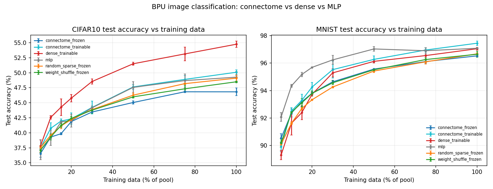

# BPU Image Classification — Results (MNIST / CIFAR-10)

Connectome-as-fixed-recurrent (BPU-faithful) vs trainable-recurrent vs dense vs
size-matched MLP vs random/weight-shuffle controls, on the BPU paper's image
tasks. FlyWire optic-lobe substrate capped to 5000 neurons
(all sensory inputs kept), 10 BPU timesteps,
seeds [0, 1, 2], sparse lr 0.001 / dense lr 0.0001.
Full run: 288 jobs across 2 GPUs in ~64 min.



## Headline: full-data test accuracy (mean ± std over 3 seeds)

### MNIST
| model | test acc (%) |
|---|---|
| connectome_trainable | 97.45 ± 0.16 |
| mlp | 97.08 ± 0.03 |
| dense_trainable | 97.05 ± 0.10 |
| random_sparse_frozen | 96.68 ± 0.06 |
| weight_shuffle_frozen | 96.65 ± 0.21 |
| connectome_frozen | 96.53 ± 0.09 |

### CIFAR-10
| model | test acc (%) |
|---|---|
| dense_trainable | 54.75 ± 0.53 |
| connectome_trainable | 50.08 ± 0.42 |
| mlp | 49.27 ± 0.93 |
| random_sparse_frozen | 49.10 ± 0.47 |
| weight_shuffle_frozen | 48.50 ± 0.13 |
| connectome_frozen | 46.82 ± 0.65 |

## Negative result (vs the BPU paper)

**The load-bearing comparison is confound-free: connectome-init vs random-init BPU,
the identical fixed-recurrent architecture differing only in the recurrent matrix.**
The size-matched MLP is a *feedforward* net, so a connectome-vs-MLP gap would conflate
architecture (recurrent vs feedforward) with the connectome question; we therefore do
not lean on it. The clean contrast is connectome_frozen vs random_sparse_frozen /
weight_shuffle_frozen:

- MNIST: connectome 96.53 vs random 96.68 → connectome **−0.15** (random slightly better)
- CIFAR-10: connectome 46.82 vs random 49.10 → connectome **−2.28** (random significantly better)

So within the identical architecture, **the connectome wiring confers no advantage over
a random sparse matrix — and on CIFAR-10 it is significantly *worse***. Its biologically
specific connectivity is a mildly unhelpful inductive bias for static object discrimination.

The RNN-vs-MLP confound does not rescue the connectome, and in fact cuts the other way:
this is not a sequence-over-pixels RNN (it is a fixed input iterated T steps, closer to a
weight-tied deep MLP), and when the recurrent weights are made **trainable** the model
*beats* the MLP on both tasks (connectome_trainable 97.45 > MLP 97.08; 50.08 > 49.27), and
dense beats it on CIFAR-10 (54.75). So `connectome_frozen` is not dragged down by "being an
RNN" — it is dragged down because (a) frozen features lose to trained features (true for all
frozen models, random included), and (b) among frozen models the connectome is no better than
random. The value is in *training* and *capacity*, neither of which is about the connectome.

(None of these models are convolutional, so absolute CIFAR accuracy is low by design — the
experiment isolates the connectome contrast via matched controls, it is not trying to win
CIFAR-10.)

## Sample-efficiency regime (mean test acc % by training-data fraction)

### MNIST
```
fraction                 5      10     20     50     100
model                                                   
connectome_frozen      90.54  92.36  93.81  95.57  96.53
connectome_trainable   89.91  92.50  94.26  96.27  97.45
dense_trainable        89.31  91.62  93.73  96.13  97.05
mlp                    92.08  94.34  95.69  97.03  97.08
random_sparse_frozen   90.11  91.61  93.33  95.42  96.68
weight_shuffle_frozen  90.17  92.42  93.80  95.52  96.65
```

### CIFAR-10
```
fraction                 5      10     20     50     100
model                                                   
connectome_frozen      36.52  39.29  41.88  45.05  46.82
connectome_trainable   37.45  40.75  42.32  47.64  50.08
dense_trainable        37.77  42.57  45.78  51.50  54.75
mlp                    37.19  39.15  42.01  47.57  49.27
random_sparse_frozen   37.54  39.59  42.22  46.27  49.10
weight_shuffle_frozen  37.08  39.30  42.41  45.99  48.50
```

Even at 5–10% data there is **no robust sample-efficiency advantage** for the
connectome structure: it is competitive with dense on MNIST but never leads (MLP
does), and is worst throughout on CIFAR-10. This supports being explicit about the
negative result rather than claiming a connectome win on these tasks.
