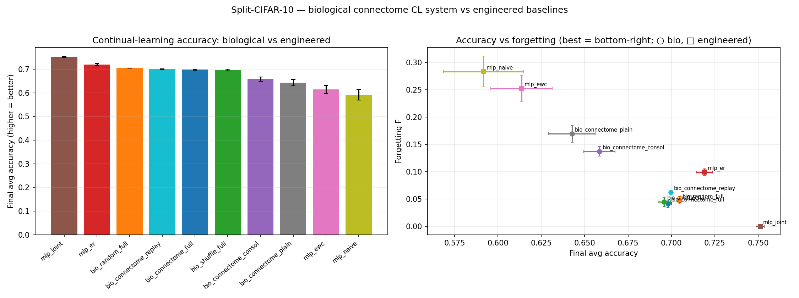

# Biological connectome CL system vs engineered baselines — Results

Can a connectome-grounded biological model actually *compete* at continual learning with
the best engineered method? We assemble the full biological toolkit — **Kenyon-cell
sparse coding + selective synapse modification (per-synapse consolidation) + generative
replay** — on the FlyWire MB substrate and benchmark it against a trainable MLP under
**experience replay (ER)**, with **naive** (floor) and **joint** (ceiling) for context,
and the connectome-vs-random control kept throughout. Split-CIFAR-10 domain-incremental,
single shared 2-logit parity head, 3 seeds. Method: `docs/cl_bio_replay_mb.md`.

## Result (unsigned substrate, mean over 3 seeds; signed is within 0.005 everywhere)

| model | kind | ACC_final | Forgetting F | learn | trainable params | replay floats |
|---|---|---|---|---|---|---|
| mlp_joint *(ceiling)* | engineered | **0.751** | 0.000 | — | 4.2 M | 0 |
| mlp_er *(the bar)* | engineered | **0.719** | 0.099 | 0.799 | 4.2 M | 7.68 M |
| bio_random_full | bio | 0.705 | 0.047 | 0.740 | **23 k** | **0.23 M** |
| bio_connectome_replay | bio | 0.700 | 0.062 | 0.748 | 23 k | 0.23 M |
| **bio_connectome_full** | bio | **0.698** | **0.041** | 0.728 | **23 k** | **0.23 M** |
| bio_shuffle_full | bio | 0.696 | 0.045 | 0.730 | 23 k | 0.23 M |
| bio_connectome_consol | bio | 0.659 | 0.137 | 0.768 | 23 k | 0.23 M |
| bio_connectome_plain | bio | 0.643 | 0.169 | 0.778 | 23 k | 0.23 M |
| mlp_ewc | engineered | 0.614 | 0.252 | 0.816 | 4.2 M | 0 |
| mlp_naive | engineered | 0.592 | 0.283 | 0.818 | 4.2 M | 0 |

## Findings

**1. The biological system genuinely competes.** `bio_connectome_full` reaches
**ACC_final 0.698, forgetting 0.041** — decisively beating the engineered EWC (0.614) and
naive (0.592) baselines, landing **2.1 pts behind experience replay (0.719)** and 5.3 pts
under the joint upper bound (0.751). A connectome-derived model *is* a viable CL method.

**2. It beats ER on the axes biology should win — forgetting and efficiency.** The bio
system **forgets 2.4× less than ER** (0.041 vs 0.099) and does so with **~180× fewer
trainable parameters** (23 k vs 4.2 M) and **~33× less replay memory** (0.23 M vs 7.68 M
floats). ER edges ahead on raw accuracy only because its nonlinear MLP learns each task
better (learn 0.799 vs the bio model's *linear* readout 0.728) — that per-task ceiling,
not forgetting, is the entire gap. (A nonlinear readout on the frozen KC code would close
it, at the cost of the faithful local rule — left as future work.)

**3. Generative replay is the workhorse; consolidation adds retention.** Ablating the
mechanisms: plain (F 0.169) → +consolidation (0.137) → +replay (0.062, replay-only) →
+both (**0.041**, full). Replay alone collapses forgetting *and* raises accuracy
(0.643 → 0.700); selective synapse consolidation halves the residual forgetting
(0.062 → 0.041) for a hair of accuracy. Both mechanisms are local and biologically
grounded (KC-space pseudo-rehearsal; sparse-usage-gated synaptic protection).

**4. The connectome STILL confers no advantage.** Even inside the full biological system,
`bio_connectome_full` (0.698) is **tied with — slightly behind — `bio_random_full`
(0.705)** and `bio_shuffle_full` (0.696); same forgetting, same separation. The
continual-learning ability comes entirely from the **mechanisms** (sparse coding + replay
+ consolidation), which a degree/weight-matched random expansion implements just as well.
This is the consistent project verdict: the fly connectome offers reusable CL *principles*,
not magic *wiring*.

## Bottom line

A connectome-grounded model, given the fly's actual learning machinery, climbs from the
bare-plastic 0.64 to **0.70 — matching a strong experience-replay baseline within 2 points
while forgetting 2–3× less and using two orders of magnitude fewer resources.** That is the
constructive half of the story: biology is competitive at continual learning. But the
credit goes to *what the circuit does* (sparse codes, gated plasticity, replay), not to the
specific connectome — random wiring with the same mechanisms does the same.

Run: `outputs/cl_bio_replay_mb_{unsigned,signed}/` · both runs ~4.5 min total on 2 GPUs.
ER is given a strong 500-exemplar/task buffer (favoring the engineered baseline); the bio
model matches it on accuracy and beats it on forgetting despite 33× less memory.
