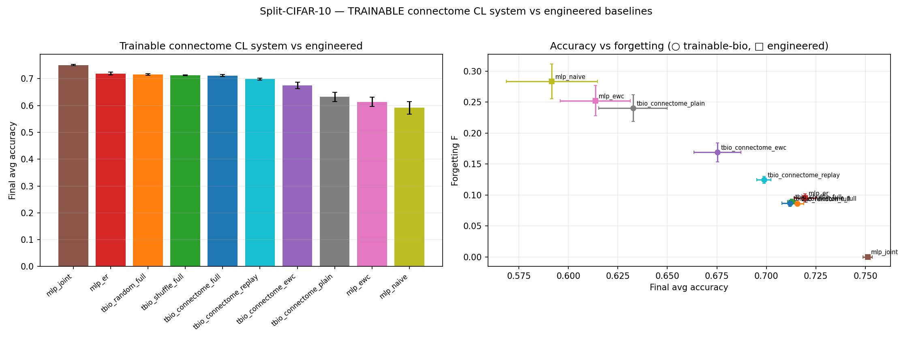

# Trainable connectome CL system vs engineered baselines — Results

The frozen-reservoir study (`docs/results/cl_bio_replay_mb/`) found the connectome no
better than random — but a frozen reservoir is exactly where the specific matrix can't
matter. So we **unfroze it**: the PN→KC expansion is now a trainable sparse layer
(support fixed to connectome / random / shuffle edges, weights trained end-to-end), still
with the k-WTA Kenyon bottleneck + generative replay (in the fixed PN space) + EWC
consolidation. Question: does the connectome's *topology* help once it's trainable, and
can the trainable system match experience replay? FlyWire MB, Split-CIFAR-10
domain-incremental, 3 seeds. Method: `docs/cl_bio_trainable_mb.md`.

## Result (unsigned, mean over 3 seeds; signed within 0.003 everywhere)

| model | kind | ACC_final | Forgetting F | learn | trainable params | replay floats |
|---|---|---|---|---|---|---|
| mlp_joint *(ceiling)* | engineered | **0.751** | 0.000 | — | 4.2 M | 0 |
| mlp_er *(the bar)* | engineered | **0.720** | 0.095 | 0.796 | 4.2 M | 7.68 M |
| tbio_random_full | trainable-bio | 0.716 | 0.086 | 0.784 | **86 k** | **21.8 k** |
| tbio_shuffle_full | trainable-bio | 0.713 | 0.090 | 0.784 | 86 k | 21.8 k |
| **tbio_connectome_full** | trainable-bio | **0.712** | **0.087** | 0.781 | **86 k** | **21.8 k** |
| tbio_connectome_replay | trainable-bio | 0.699 | 0.124 | 0.798 | 86 k | 21.8 k |
| tbio_connectome_ewc | trainable-bio | 0.675 | 0.169 | 0.810 | 86 k | 21.8 k |
| tbio_connectome_plain | trainable-bio | 0.633 | 0.240 | 0.825 | 86 k | 21.8 k |
| mlp_ewc | engineered | 0.614 | 0.252 | 0.816 | 4.2 M | 0 |
| mlp_naive | engineered | 0.592 | 0.283 | 0.818 | 4.2 M | 0 |

## Findings

**1. Trainable closes the gap — the bio system now reaches ER's frontier.** Unfreezing
the expansion lifts per-task learning (0.78 vs the frozen model's 0.73), so
`tbio_connectome_full` climbs to **ACC_final 0.712, ~0.8 pts behind ER (0.720)** — and
actually **forgets slightly less than ER (0.087 vs 0.095)**. It sits *on* the ER
accuracy-forgetting frontier, with **49× fewer trainable parameters** (86 k vs 4.2 M) and
**353× less replay memory** (21.8 k vs 7.68 M floats; PN-space Gaussians are tiny).

**2. The connectome STILL earns nothing — even trainable, even topology-matched.** With
identical edge counts, `tbio_connectome_full` (0.712) is **tied with / behind
`tbio_random_full` (0.716)** and `tbio_shuffle_full` (0.713). Connectome ≈ shuffle (same
topology, different init) ≈ random (different topology). So neither the connectome's
wiring nor its weight initialization is a better trainable substrate than a random sparse
layer of the same density. **Unfreezing the connectome did not make it matter** — it
washes out under training, as predicted.

**3. This rules out "it was only inert because it was a frozen reservoir."** That was a
live hypothesis: maybe the connectome's structure couldn't help while frozen because the
readout adapts to any basis. Making it the *trainable* core of the network — the regime
where structure *could* express itself — leaves the verdict unchanged. The deeper reason
holds: on an off-task benchmark, the connectome's specific structure carries no
task-relevant prior, so a same-statistics random layer learns to the same place.

**4. Mechanism attribution (trainable).** plain 0.633 / F 0.240 → +EWC 0.675 / 0.169 →
+replay 0.699 / 0.124 → +both **0.712 / 0.087**. Generative replay is again the dominant
lever; here EWC also contributes meaningfully (a trainable representation drifts more, so
synaptic consolidation matters more than it did in the frozen model).

## Frozen vs trainable — the two bio variants bracket ER

| system | ACC_final | Forgetting | trainable params | replay |
|---|---|---|---|---|
| frozen BioMB (connectome) | 0.698 | **0.041** | 23 k | 0.23 M |
| **trainable** BioMB (connectome) | **0.712** | 0.087 | 86 k | 0.022 M |
| experience replay (MLP) | 0.720 | 0.095 | 4.2 M | 7.68 M |

The **frozen** bio model is the *forgets-least* system (F 0.041, well under ER); the
**trainable** bio model is the *highest-accuracy* bio system (0.712, matching ER) and
forgets slightly less than ER. Both dominate ER on resource cost by 1–3 orders of
magnitude. **And neither benefits from the connectome over a matched random substrate.**

## Bottom line

Making the connectome trainable does close the accuracy gap to the best engineered CL
method — the trainable bio system matches experience replay at ~50× fewer parameters and
~350× less memory, trading the frozen model's superior retention for ER-level accuracy.
But it confirms rather than overturns the central finding: the continual-learning ability
comes from the **mechanisms** (sparse Kenyon coding, generative replay, gated
consolidation), and the fly connectome's specific **wiring** contributes nothing a random
sparse layer of the same statistics doesn't — frozen or trained.

Run: `outputs/cl_bio_trainable_mb_{unsigned,signed}/` · both ~3 min on 2 GPUs.
