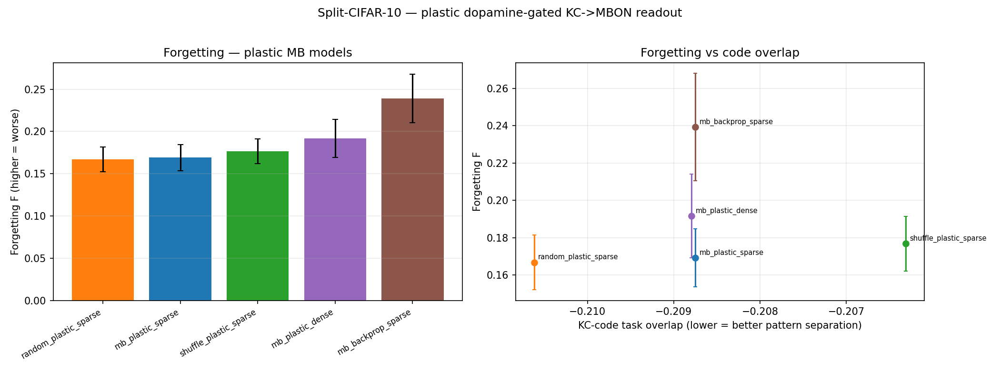

# Plastic Mushroom-Body Continual Learner — Results

Can we model the mushroom body *faithfully* — with **plastic, dopamine-gated KC→MBON
synapses on a sparse Kenyon-cell code**, instead of a frozen adjacency matrix trained by
backprop — and does that change the continual-learning story? Split-CIFAR-10
domain-incremental, single shared 2-logit parity head, FlyWire MB substrate
(PN=1089 / KC=11518 / MBON=1418), 3 seeds. Method: `docs/cl_plastic_mb.md`.

## Headline: forgetting (F, lower = better) at matched learning

Signed substrate, mean over 3 seeds (unsigned is within noise — see below):

| model | Forgetting F | ACC_final | learning_acc | code_overlap | w_out_drift |
|---|---|---|---|---|---|
| random_plastic_sparse | **0.164** | 0.654 | 0.785 | −0.210 | 19.1 |
| mb_plastic_sparse | **0.166** | 0.644 | 0.776 | −0.209 | 17.8 |
| shuffle_plastic_sparse | 0.176 | 0.640 | 0.780 | −0.206 | 17.8 |
| mb_plastic_dense | 0.187 | 0.625 | 0.775 | −0.209 | 15.9 |
| mb_backprop_sparse | 0.231 | 0.612 | 0.797 | −0.209 | 78.1 |
| *static-matrix models (all)* | *~0.24–0.26* | *~0.62* | *~0.81* | *—* | *—* |

(`docs/results/continual_learning_mb/` has the static-matrix table: connectome_frozen
F=0.240, random_sparse_frozen 0.238, dense 0.253, mlp 0.255, signed substrate.)

## Three findings

**1. The faithful plastic model forgets substantially less than every static-matrix
model — at comparable learning.** F drops from ~0.24 (static) to **0.166** (plastic
sparse), a ~31% reduction, while learning accuracy stays comparable (0.78 vs 0.81).
Localizing plasticity to a sparse KC→MBON readout — modeling *where the fly actually
learns* — is a real continual-learning win that the static-matrix BPU framing misses
entirely. This is the constructive half of the negative-results story: the connectome's
value for CL is a **principle** (sparse code + local gated plasticity), not a wiring
diagram you freeze and backprop through.

**2. The win is the architecture, not the connectome.** The connectome expansion
(0.166) is **statistically tied with a degree/weight-matched random expansion (0.164,
marginally better)** and a weight-shuffled one (0.176); all three produce the same code
separation (overlap ≈ −0.21). Consistent with every other experiment in this repo: on
non-fly tasks the connectome's *specific* wiring confers no advantage over random. What
matters is the *sparse high-dimensional code*, which any random expansion provides.

**3. Decomposing the mechanism — both sparsity and the local rule matter:**
- **Sparse vs dense code:** sparse 0.166 < dense 0.187. Removing the k-WTA (dense KC
  code) increases forgetting — pattern separation reduces interference, as predicted.
- **Local rule vs backprop:** local three-factor **0.166** ≪ Adam **0.231** *on the
  identical sparse code*. This is the sharp one: train the very same KC→MBON readout
  with global Adam and forgetting jumps back to the static-matrix level (~0.24). Adam
  fits each task slightly better (learn 0.797) but moves the readout ~4× as far
  (`w_out_drift` 78 vs 18), overwriting old tasks. The biologically realizable **local,
  dopamine-gated** update is *why* this model resists forgetting — not merely the sparse
  features.

## Signs don't matter (as everywhere else)

| model | F (unsigned) | F (signed) |
|---|---|---|
| mb_plastic_sparse | 0.169 | 0.166 |
| random_plastic_sparse | 0.167 | 0.164 |
| mb_plastic_dense | 0.192 | 0.187 |
| mb_backprop_sparse | 0.239 | 0.231 |

## Answering the two questions that prompted this

- *"Can we model it faithfully with plastic synapses rather than a static matrix, while
  still learning similarly to the controls?"* — **Yes.** The plastic KC→MBON model learns
  to ~0.78 (controls ~0.81) and forgets markedly less (0.166 vs 0.24).
- *"Shouldn't an RNN already learn plastically?"* — A backprop-trained RNN's plasticity
  is **global and ungated**: every weight moves on every task, so it overwrites
  (`mb_backprop_sparse` F=0.231, like the static models). The fly's plasticity is
  **local, sparse, and reward-gated** — that is the anti-forgetting mechanism, and a
  static adjacency matrix run through backprop cannot express it. Modeling it explicitly
  recovers the benefit — *with a random expansion just as well as the connectome.*

Run: `outputs/cl_plastic_mb_{unsigned,signed}/` · figures
`cl_plastic_mb_{unsigned,signed}.png` · both runs ~2 min total on 2 GPUs.
