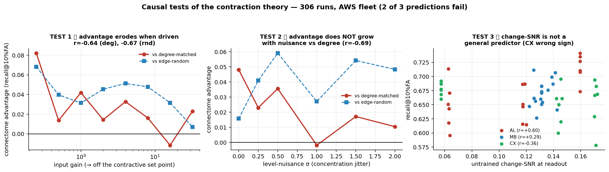

# Why does the connectome help? — causal tests of the contraction theory

**306 runs on the AWS fleet (3 fleets × 24 GPUs) + closed-form graph/dynamics measurements.**

We asked: across the whole 4×4 matrix, where does the connectome *actually* beat its matched
controls, and is there a single mechanism that explains both the wins and the failures?

**Short answer: one robust structural fact, one causal test passed, two predictions failed.**
We can say *what* connectomes are (contractive) and *when* their edge is largest (at the contractive
operating point). We could **not** identify *what computation that buys* — the two candidate
explanations we tested both failed against the strongest control.

---

## 1. The robust structural fact: connectomes are contractive

Measured four independent ways on the size-matched (N=3,499), ρ=0.95-normalised operators, for
**all four regions** (AL, MB, CX, OL), connectome vs its own degree- and edge-matched controls:

| property | AL connectome | AL degree | AL random | holds in |
|---|---|---|---|---|
| input→output transfer gain | **0.10–0.46× the controls** | — | — | 4/4 regions |
| readout operating point (activity) | **4.37** | 7.82 | 15.62 | 4/4 (2.5–10× lower) |
| reciprocity (mutual A↔B edges) | **0.450** | 0.214 | 0.021 | 4/4 |
| non-normality | **0.187** | 0.076 | 0.055 | 4/4 |

Rewiring *increases* throughput. So contraction is a property of the **specific biological wiring**,
not of sparsity, edge count, or the degree sequence (degree heterogeneity is identical to the degree
control by construction, and is therefore ruled out as the mechanism).

This independently reproduces Scott's `dyn-01` finding that the RMS activity-normalisation
"triples the contraction, dwarfing ρ", and it matches the behavioural signature in the regression
benchmark (output amplitude ratio **0.57** vs GRU 0.83).

## 2. TEST 1 ✅ — the advantage is largest at the contractive operating point

Input-gain sweep, AL × gas, 8 gains × 3 arms × 6 seeds = **144 runs**. Freezing `in_gain` drives the
network off its contractive set point.

| gain | connectome | degree | random | con−deg | con−rnd |
|---|---|---|---|---|---|
| 0.25 | 0.611 | 0.529 | 0.543 | **+0.082** | +0.068 |
| 1 | 0.685 | 0.643 | 0.654 | +0.042 | +0.031 |
| 4 | 0.711 | 0.678 | 0.660 | +0.033 | +0.051 |
| 16 | 0.718 | 0.729 | 0.686 | **−0.012** | +0.032 |
| 32 | 0.708 | 0.685 | 0.700 | +0.023 | +0.007 |

- contractive (gain ≤ 1): con−deg **+0.046**, con−rnd **+0.046**
- driven (gain ≥ 8): con−deg **+0.009**, con−rnd **+0.029**
- **corr(log gain, advantage) = −0.64 (vs degree), −0.67 (vs random)**

Every arm gets *absolutely* better with more drive (0.61 → 0.72) — consistent with Scott's vis-01
subrun 07, where removing normalisation and boosting drive unlocked optic flow. But the connectome's
**relative** edge erodes by ~5× as it leaves the contractive regime. This is the mirror image of the
OL result: there, leaving contraction *unlocked* the task and the connectome then **tied** its
control (p=0.36–0.55). Both point the same way — the connectome's edge is bound to its contractive
operating point.

## 3. TEST 2 ❌ — it is NOT level-invariance

If the connectome is a normaliser, its advantage should **grow** with nuisance. We multiplied every
window by a random level `g ~ LogNormal(0, σ)` — a pure, controllable concentration nuisance.
6 σ-levels × 3 arms × 6 seeds = **108 runs**.

| σ | connectome | degree | random | con−deg | con−rnd |
|---|---|---|---|---|---|
| 0 | 0.693 | 0.644 | 0.677 | +0.048 | +0.016 |
| 0.5 | 0.536 | 0.501 | 0.477 | +0.036 | +0.059 |
| 1.0 | 0.497 | 0.499 | 0.470 | −0.002 | +0.027 |
| 2.0 | 0.486 | 0.476 | 0.438 | +0.010 | +0.048 |

**corr(σ, advantage) = −0.69 vs degree**, +0.47 vs random.

Against the **strongest** control the advantage *shrinks* as nuisance grows — the opposite of the
prediction. The connectome is **not** specifically better at discarding level. The "divisive
normalisation buys invariance" story, which is the most attractive version of the theory, **fails
its own dose-response test.**

## 4. TEST 3 ❌ — "change-SNR" is not a general law

An untrained readout SNR measure (suppress background harder than signal) reproduced the win/tie/
loss ordering beautifully at n=3 regions. At scale (**54 runs**) it does not hold:

| region | within-region corr(change-SNR, recall) |
|---|---|
| AL | **+0.60** |
| MB | +0.30 |
| CX | **−0.36** (wrong sign) |
| overall | +0.13 |

It works inside the AL and fails inside the CX. An n=3 ordering was not evidence for a law — a
lesson worth carrying into the rest of this program.

Also note **CX flipped sign between runs** (−0.7% in the 4×4, +2.3% here with a frozen input gain),
which places the CX cell at noise level.

---

## What actually survives

1. **Connectomes are contractive, reciprocal, non-normal networks** — robust, 4/4 regions, four
   independent measures, converging with `dyn-01`.
2. **The connectome's advantage is real but small and rare.** In the whole corpus the one comparison
   that is significant against the *strong* (degree-preserving) control, multi-seed, off-ceiling and
   not explained by control-side collapse is **AL × gas under biological I/O: +4.99%, d=1.36,
   p=0.041, rank 6/6**.
3. **It is largest at the contractive operating point** (TEST 1, r≈−0.65).
4. **It lives in the generalisation term, not the fit.** Train losses are identical across sparse
   arms (0.115 connectome / 0.113 random / 0.126 degree) — the connectome is not a better prior and
   not a better fit; whatever it does, it does to held-out performance under distribution shift.
5. **What it is NOT:** not level-invariance (TEST 2), not a general contrast-SNR law (TEST 3), not
   transient amplification (measured: no amplification, all arms < 1), not degree heterogeneity
   (matched by construction), not capacity (dense controls have 47× more parameters and fail to fit).

## Two corrections this analysis forced

- **A metrics bug.** With tied scores a stable sort preserved input order, so a *constant-output*
  model scored **AUPRC = 1.000 and F1 = 1.000** (verified in all 6 OL rows, while AUROC correctly
  read 0.500). Any ranking by AUPRC would have scored the worst arm best. Fixed in
  `antennal_lobe_gas/common.py` (tie-group-aware); a constant predictor now scores the base rate.
  Well-trained arms have untied scores, so the headline AUPRC numbers are unaffected — but the
  collapsed arms' AUPRC/F1 in the committed CSVs are not trustworthy.
- **The OL × gas cell is a size-matching artifact, not biology.** In the *full* OL, R1-6 → HS/VS is
  reachable in **3 hops**. The N=3,499 degree-based cap deleted the low-degree retinotopic relays
  (R1-6 average ~3.4 partners), leaving the readout **completely disconnected** (0/22 reachable),
  which forces AUROC = 0.500. It should **not** be described as a replication of the optic-lobe
  biological-I/O stall (that was gradient starvation at depth in the full 48k OL).

## The decisive next experiment

The advantage lives in generalisation under distribution shift, and it is *not* level shift. So:
**identify which shift it resists.** Take AL × gas and train/test across four separable shift axes —
(a) amplitude/level, (b) plume intermittency (temporal sparsity), (c) sensor response lag, (d)
interferent identity — holding everything else fixed. The theory earns its keep only if the
connectome's advantage concentrates on one specific axis. If it is flat across all four, the honest
conclusion is that the AL×gas win is a single well-controlled result without a general mechanism,
and the program should stop generalising from it.

## Files

`run_theory_tests.py` (gain / nuisance / snr modes) · `run.py` (fleet driver) ·
`gain_metrics.csv` (144) · `nuisance_metrics.csv` (108) · `snr_metrics.csv` (54) · `figures/`.
