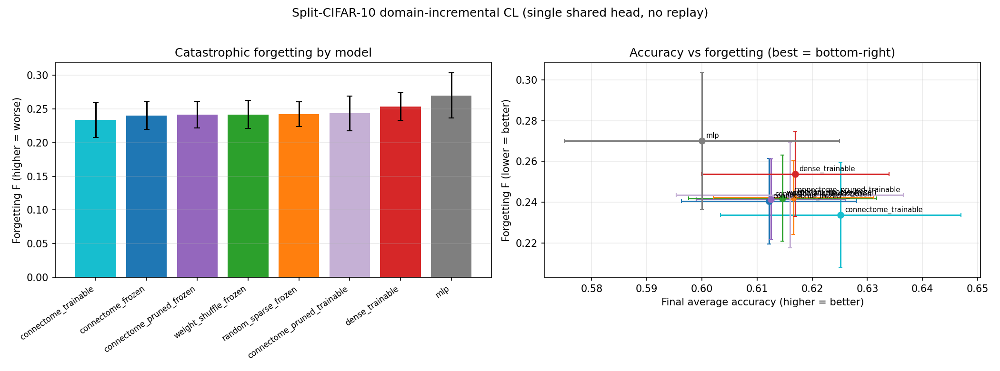

# Continual Learning — Split-CIFAR-10 (domain-incremental) Results

Single shared 2-logit head, 5 binary CIFAR-10 pair-tasks, no replay/regularizer.
Substrate cap 5000 neurons, 10 timesteps, seeds [0, 1, 2],
sparse lr 0.001 / dense lr 0.0001. 24 streams across 2 GPUs in ~5.4 min.
All frozen models verified bit-identical (`w_rec_drift`=0); every task learned (diagonal > 0.80).

## Summary (mean over 3 seeds, sorted by least forgetting)

| model | ACC_final | Forgetting F (±SE) | rep_drift | w_rec_drift |
|---|---|---|---|---|
| connectome_trainable | 0.625 | 0.234 ± 0.026 | 5.08 | 9 |
| connectome_frozen | 0.612 | 0.240 ± 0.021 | 2.00 | 0 |
| connectome_pruned_frozen | 0.612 | 0.241 ± 0.020 | 1.89 | 0 |
| weight_shuffle_frozen | 0.615 | 0.242 ± 0.021 | 1.27 | 0 |
| random_sparse_frozen | 0.617 | 0.242 ± 0.018 | 1.10 | 0 |
| connectome_pruned_trainable | 0.616 | 0.244 ± 0.026 | 5.03 | 6.9 |
| dense_trainable | 0.617 | 0.254 ± 0.021 | 3.92 | 5.6 |
| mlp | 0.600 | 0.270 ± 0.034 | 61.08 | 0 |

(BWT mirrors F with the opposite sign; both mean forgetting.)

## The load-bearing comparison is confound-free (same architecture)

The clean test of "does connectome structure help" is the three **frozen** models
that share the *identical* fixed-recurrent architecture and differ only in the
recurrent matrix:

- connectome_frozen F = 0.240
- weight_shuffle_frozen F = 0.242
- random_sparse_frozen F = 0.242
- connectome_pruned_frozen F = 0.241

These are **statistically indistinguishable** (all within ~0.002, SE ≈ 0.021).
**The connectome's wiring does not reduce catastrophic forgetting versus a random
sparse matrix** — another explicit negative result, and the pruned protagonist does
not win either.

## What DOES matter is plasticity, not the connectome

Forgetting rises with trainable capacity: frozen backbones (~0.24) <
dense_trainable (0.254) < mlp (0.270). The `rep_drift` attribution
confirms the mechanism: the MLP's representation collapses across tasks
(rep_drift ≈ 61) while frozen backbones stay stable (≈ 2.0).
But this is about *freezing*, not biology — random_sparse_frozen is at least as stable
(rep_drift 1.10) as connectome_frozen (2.00). A fixed sparse
backbone buys forgetting-resistance; the connectome is not the reason.

`connectome_trainable` has the nominally lowest forgetting (0.234) and highest
accuracy (0.625), but within ~0.4 SE of random_sparse_frozen — not a robust
connectome-specific win.

## Conclusion

The hypothesis that connectome-derived structure (or pruning-derived statistics) helps
continual learning is **not supported** on this benchmark. Consistent with the
BPU image-classification result: the fly connectome is not special for general AI or
continual learning; its measurable benefit is on the fly-native optic-flow task.

## Caveats

Domain-incremental parity with a single shared head is hard (ACC ≈ 0.61, chance 0.50),
so absolute forgetting is high for all models and between-model gaps are small relative
to it. 3 seeds; treat <1 SE differences as ties. Substrate is the top-activity 5000-neuron
optic-lobe subnetwork. No replay/EWC (a plain architectural lower bound by design).
