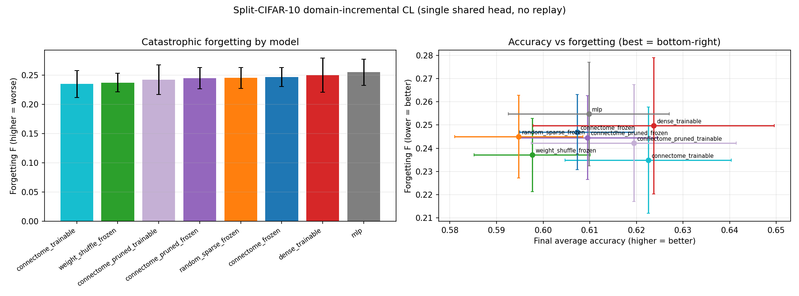

# Continual Learning on the MUSHROOM BODY connectome (Split-CIFAR-10)

Same domain-incremental protocol as the optic-lobe CL run (single shared head, 5
binary CIFAR-10 pair-tasks, no replay), but on the **hemibrain mushroom-body**
connectome — the fly's learning & memory center, the biologically apt substrate
for a learning/forgetting task. Cap 5000 neurons, 10 timesteps,
seeds [0, 1, 2]. 24 streams across 2 GPUs in ~10 min. All frozen models verified
bit-identical (`w_rec_drift`=0).

## Summary (mean over 3 seeds, sorted by least forgetting)

| model | ACC_final | Forgetting F (±SE) | rep_drift |
|---|---|---|---|
| connectome_trainable | 0.623 | 0.235 ± 0.023 | 5.4 |
| weight_shuffle_frozen | 0.598 | 0.237 ± 0.016 | 0.5 |
| connectome_pruned_trainable | 0.619 | 0.242 ± 0.025 | 5.0 |
| connectome_pruned_frozen | 0.609 | 0.245 ± 0.018 | 1.4 |
| random_sparse_frozen | 0.595 | 0.245 ± 0.018 | 0.4 |
| connectome_frozen | 0.607 | 0.247 ± 0.016 | 1.5 |
| dense_trainable | 0.624 | 0.250 ± 0.029 | 4.5 |
| mlp | 0.610 | 0.255 ± 0.022 | 61.8 |

## Same negative result as the optic lobe — even on the learning center

The confound-free comparison (frozen models, identical architecture, differ only in
the recurrent matrix):

- connectome_frozen F = 0.247
- weight_shuffle_frozen F = 0.237  (best frozen model)
- random_sparse_frozen F = 0.245

The mushroom-body connectome does **not** reduce catastrophic forgetting versus random
or weight-shuffle — connectome_frozen (0.247) is in fact nominally *worse* than both.
Using the fly's dedicated learning/memory circuit as the substrate does not rescue the
hypothesis.

## MB vs optic-lobe substrate (connectome_frozen − random_frozen forgetting)

| substrate | connectome_frozen F | random_frozen F | Δ (conn − rand) |
|---|---|---|---|
| optic lobe | 0.240 | 0.242 | -0.002 |
| mushroom body | 0.247 | 0.245 | +0.002 |

Both substrates give the same answer: **no connectome-specific advantage in continual
learning** (Δ within ~1 SE of zero, and the sign is non-favorable on both). What reduces
forgetting is a frozen (non-plastic) backbone, and any random sparse backbone does it
equally — consistent with the BPU image-classification and (forthcoming) larva results.
