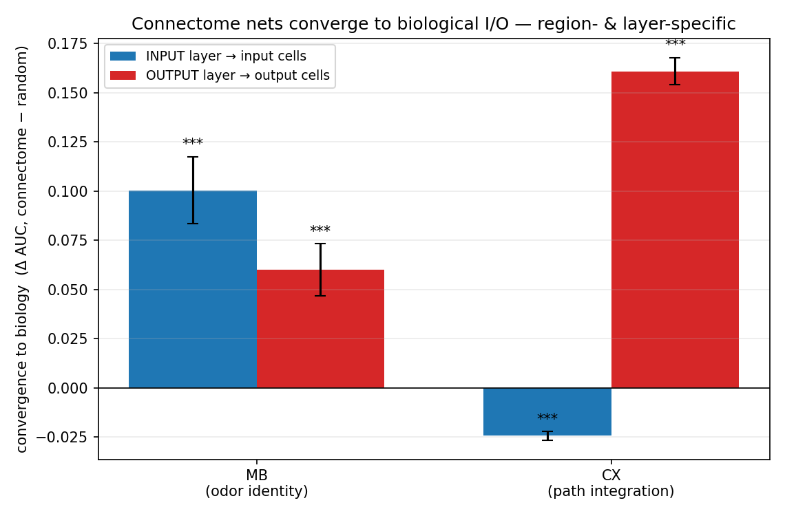
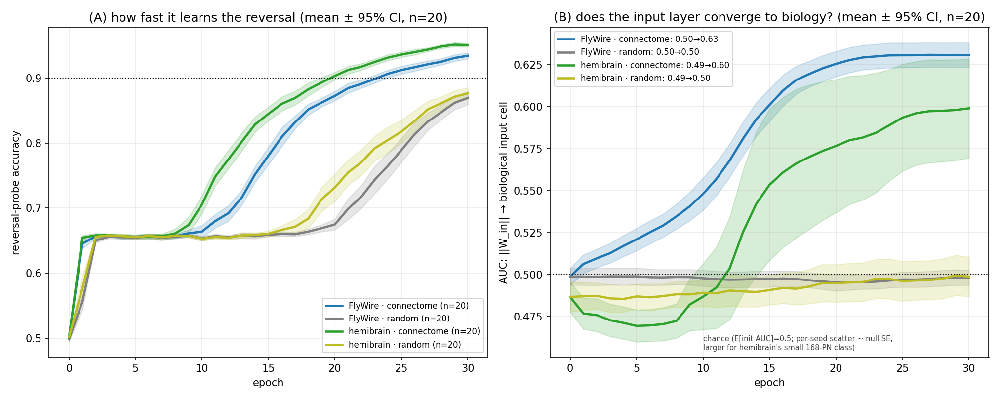
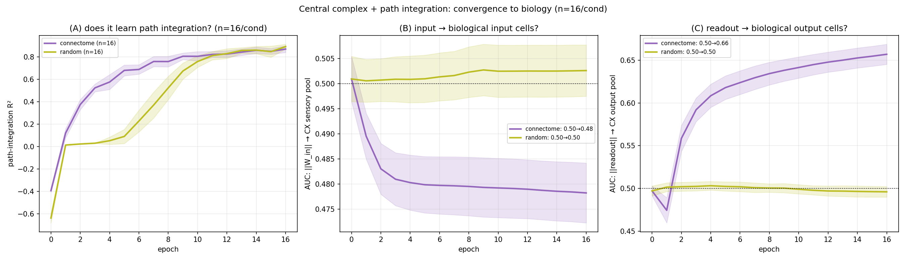

# Connectome-initialized networks converge to biological I/O cells — region- and layer-specific

**Two fly circuits, two clean positive results (mushroom body & central complex).**

## TL;DR
Take a recurrent network whose **recurrent weights *are* a real fly connectome** (trainable), give it a
**free** input projection **and** a **free** readout over *all* N neurons — randomly initialized, with
**no built-in link to the biologically correct cells** — and train it on that circuit's **native task**.
The network spontaneously moves its input/output weights **onto the biologically correct cells**. But
*which* layer converges is **region- and task-specific**:

- **Mushroom body** (odor identity): the **INPUT** layer converges onto the odor **projection neurons (PNs)**. *Input-dominant.*
- **Central complex** (path integration): the **OUTPUT** layer (readout) converges onto the **steering / pre-motor output cells**. *Output-dominant.*

A degree-, weight-, and spectral-radius-matched **random-wired control shows none of it**. The
through-line: **each circuit converges hardest on the interface its computation actually depends on.**

*Δ AUC = how much better the connectome's weight magnitudes predict the biological cells than a paired
random-wired control. `***` = p<1e-3. MB matches **both** interfaces (input-dominant); CX matches the
**output** only (input even drifts slightly below chance).*

---

## Result 1 — Mushroom body (odor → valence): the **input** converges onto the PNs
The MB's job is to read **which odor** is present, so its critical interface is the **input** — and that
is exactly where convergence is strongest. Trained on the MB-native odor→valence reversal task, the
free input projection rotates off its random start onto the antennal-lobe **projection neurons** (the
real odor-input pathway), tracking the learning curve. n=20 seeds, paired vs random:

| MB layer | connectome (init→final) | random | Δ | conn>rand | p |
|---|---|---|---|---|---|
| **input → PN** (‖W_in‖) | 0.487 → **0.599** | 0.499 | **+0.100** | 18/20 | 1.1e-5 |
| output → MBON (‖readout‖) | — → 0.563 | 0.502 | +0.060 | 18/20 | 2.2e-4 |

So the MB matches on **both** interfaces but is **input-dominant** (the PN match is twice the MBON
match). It also learns ~2× faster than a random-wired net.

---

## Result 2 — Central complex (path integration): the **output** converges onto the steering cells
The CX's job is to **emit a heading/steering command**, so its critical interface is the **output** —
and that is where convergence is strongest, while the (low-dimensional velocity) input shows none.
Trained on the CX-native polar-bump path-integration task, the free readout rotates onto the biological
**output pool** (the extra-CX steering / PFL-type projectors). n=16 seeds, paired vs random:

| CX layer | connectome (init→final) | random | Δ | conn>rand | p |
|---|---|---|---|---|---|
| **output → steering** (‖readout‖) | 0.50 → **0.657** | 0.496 | **+0.161** | **16/16** | **3.6e-13** |
| input → sensory (‖W_in‖) | 0.50 → 0.478 | 0.503 | −0.024 | 1/16 | 1.7e-8 (below) |

The output convergence holds in **every single seed** (p=3.6e-13); the input layer does **not** converge
(it drifts marginally *below* chance). The connectome also learns path integration faster (panel A).

---

## Methodology (and the choices behind it)
The same experimental skeleton is applied to each region; the **choices** are what make it a real test:

1. **Free I/O — the thing under test.** Input is projected into, and output read from, **all N neurons**
   via random `W_in`/`W_out`, with no link to the biological cells. If we'd wired input into the
   biological cells, "convergence" would be trivial. Starting random and asking whether *training moves*
   the weights onto the biological cells is the actual experiment.
2. **The recurrent layer is the connectome, and it is trainable.** So the network can rewire internally
   — convergence is not forced by a frozen connectome; it emerges under gradient descent.
3. **Paired, matched random control.** Each connectome run is paired (same seed → same init + same data)
   with a **random-wired** matrix that has the **same edge count, same weight multiset, and same spectral
   radius (ρ=0.95)**, but **scrambled wiring** (Erdős–Rényi positions). A per-seed difference therefore
   isolates the connectome's **specific topology**, not its edge statistics or gain.
4. **Convergence metric = ROC-AUC, init→final.** Per neuron we take ‖W_in[i]‖ (input drive) and
   ‖readout[:,j]‖ (output drive), and score by **ROC-AUC** how well that magnitude predicts membership in
   the biological input/output set. 0.5 = no relationship, 1.0 = the weights rank the biological cells
   perfectly above the rest. Threshold-free and robust to class imbalance; measured init→final so we see
   convergence **during** training, not just an endpoint.
5. **Native task per region** — convergence is only expected (and only meaningful) when the task actually
   engages the circuit's biological role.

| | mushroom body | central complex |
|---|---|---|
| connectome | FlyWire/hemibrain MB | `cx_polar_bump` CX |
| N (neurons) | ~11.7k (hemibrain) | 7,349 |
| task | odor → valence (reversal) | polar-bump path integration |
| input dim / output dim | odor vector / valence | (fwd, angular velocity) / 32-bump + home-vector |
| biological input cells | projection neurons (PN, cell type) | sensory pool (741, connectivity) |
| biological output cells | MBONs (cell type) | output pool (591, connectivity) |
| model | `AssociativeRNN`, free I/O | `FreeCXBPU`, free I/O |

**CX engineering note.** `FreeCXBPU` is the validated `SparseCXBPU` with free all-N I/O, re-implemented
with **edge message-passing + gradient checkpointing** so the trainable sparse recurrent doesn't
densify its [N,N] gradient (44 GB → 2 GB); verified **numerically identical** to the stock model
(<1e-7 forward, <1e-9 gradient).

## Interpretation — what this means
- **Convergence tracks task-dependence on the interface.** Odor identity hinges on *which input channel*
  carries the smell → the MB localizes its **input** onto the PNs. Path integration hinges on the
  *steering command* it must emit → the CX localizes its **output** onto the steering cells. The layer a
  task leans on is the layer that finds biology.
- **It is *not* a blanket "AI converges to biology."** The effect is interface-specific (MB input ≫ MB
  output; CX output, CX input none), and it depends on the connectome's *specific wiring* (the matched
  random control never does it). On a task that doesn't engage a circuit's biological role, neither layer
  converges. So the honest claim is **conditional**: connectome priors pull a network toward the
  biologically-correct solution **on the interface the matched task depends on**.
- **Why it's useful.** (i) **Interpretability** — a connectome-initialized network trained on a matched
  task ends up *using the biologically-correct cells*, so you can read off which neurons do what. (ii)
  **A principled prior** — the connectome biases learning toward the real circuit's solution, and it also
  speeds learning on these matched tasks. (iii) **A map of when it pays off** — the input/output
  dissociation tells you *which* interface a given connectome will help with, before you train.

## Caveats
- "Biological cells" = cell-type labels where available (MB PN/MBON, hemibrain) or connectivity-defined
  pools (CX sensory/output) — the latter are the same pools the validated CX results use.
- MB's output convergence is real but weaker than its input; CX's input is null/slightly negative.
- These are the two **positive** regions. A third region/task (optic lobe + optic flow) was tested as a
  boundary case and is documented separately.

## Reproduce
- **MB:** `scripts/mqar/run_mb_biology_convergence.py` / `run_mb_biology_convergence_assoc.py`;
  analysis `scripts/figures/plot_mb_biology_*.py`. See `docs/results/mb_biology_convergence/`.
- **CX:** `scripts/path/run_cx_biology_convergence.py` (sweep: `launch_cx_convergence_local.py`);
  analysis `scripts/figures/plot_cx_biology_convergence.py`. See `docs/results/cx_biology_convergence/`.
