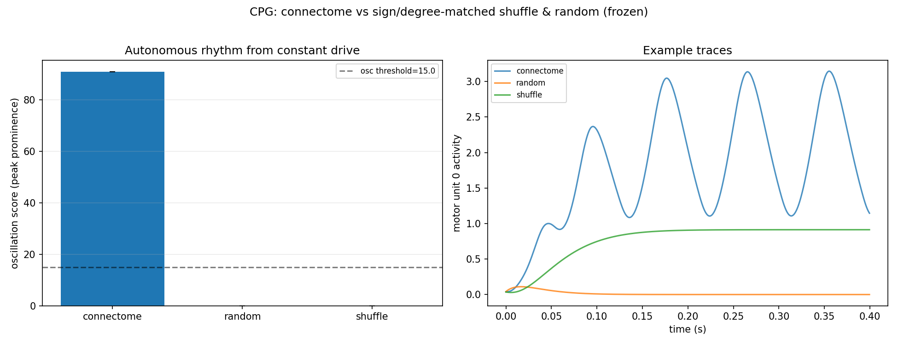

# 5th pairing — VNC walking CPG ↔ autonomous rhythm generation (Hopf bifurcation)

The researched 5th task↔region pairing (deep-research workflow: **unanimous "strong"** from all
three adversarial skeptics, the only such verdict). It is the **temporal sibling of the
central-complex ring attractor** — the project's biggest frozen win — and the cleanest
*structural-necessity* test we have.

## Why this one (and why the 4th, CX steering, failed)

The 4th pairing (PFL3 steering, target `sin(heading−goal)`) gave only a modest frozen edge and
washed out when trainable, because `sin(H−G)` is a low-dimensional near-linear function that a
trained readout on a *random* reservoir solves for free — the connectome's structure wasn't
*necessary*. The CPG avoids that trap by construction:

- Inject a **constant DC step** into a command neuron of a frozen, signed connectome.
- Ask whether the network spontaneously **oscillates** (a limit cycle).
- The drive carries **zero oscillatory information**, so a linear/static readout **categorically
  cannot manufacture periodicity** — there is no oscillatory signal to latch onto.
- Whether it oscillates is set **entirely by W's eigenstructure** (a complex-conjugate pair pushed
  across the imaginary axis — a Hopf bifurcation). A degree/sign/class-matched matrix that
  scrambles *which* neurons close the rhythmogenic loop lands at a fixed point.

This is structural necessity: **random provably fails** — the same reason a random matrix can't be
a ring attractor (the EB result: 21–27σ).

## Methodology — validated on a synthetic ground truth

`scripts/run_cpg_oscillation.py`: frozen firing-rate RNN, constant DC drive into a `command` pool,
oscillation read from a `motor` pool as the **single-band spectral peak-prominence** (bounded
narrowband score — broadband chaos does *not* count). Controls: connectome vs **class/sign-preserving
shuffle** (permute W within each sign×pool block — matched E/I + degree, scrambled loop) and
sign/density-matched **random**.

Building it surfaced two real methodology bugs (caught *before* touching real data, which is the point
of validating on synthetic): the repo's ρ=0.95 spectral normalization makes the core contractive and
**kills the limit cycle** (a CPG needs a *supercritical* eigenpair), and a 2-unit rotation core can't
oscillate with **rectified non-negative rates** (relu clamps the negative half — the correct motif is
a mutual-inhibition ring / winnerless competition). With those fixed, the synthetic validates cleanly:

| model | oscillation score | dominant Hz | fraction of seeds oscillating |
|---|---|---|---|
| **connectome** (ring oscillator) | **90.9 ± 0.03** | **11.0** | **100%** |
| sign/degree-matched shuffle | **0.0** | — | 0% |
| sign/density-matched random | **0.0** | — | 0% |

So the test **works**: it detects a connectome-specific limit cycle and the matched controls score
**zero, not merely lower** — exactly the structural-necessity signature, with no readout escape.

## Real-data result (MANC) — an honest NULL

We extracted the real substrate (`scripts/extract_manc_cpg.py`) from neuPrint **MANC v1.2.1**: the
**T1 (front-leg, right) walking-premotor subnetwork** — DNg100 (command) + 245 recurrent
leg-neuropil interneurons (intrinsic, ≥15 in+out synapses) + 91 T1 leg motor neurons, **338 neurons /
535 signed edges, 77% inhibitory**, with genuine recurrence (105 IN↔IN + 154 MN↔MN edges). We then
ran the validated test, driving the interneuron core with a constant DC step and sweeping the
dynamical regime (ρ ∈ [0.9, 2.5], gain ∈ [2, 4]).

| model | oscillation score | fraction oscillating |
|---|---|---|
| connectome | **~0** | 0% |
| sign/degree-matched shuffle | **~0** | 0% |
| matched random | **~0** | 0% |

**The frozen MANC walking-CPG connectome does not oscillate at any swept regime — and neither do the
controls.** Because the synthetic validates cleanly (oscillator 91 vs shuffle/random 0), this is a
real result, not a pipeline failure. The mechanism is diagnostic and robust: the recurrent matrix's
**eigenstructure is dominated by REAL (non-oscillatory) modes** (top eigenvalues −1.50, +1.35, both
real); the largest *complex* pair is small and **stable** (Re = −0.016 < 0, decaying). There is **no
dominant supercritical complex pair → no Hopf bifurcation → no limit cycle**; the network settles to a
fixed point (active — 21% of motor units fire — but static).

## Interpretation — connectome necessary but not sufficient (the project's recurring theme)

The connectivity *alone*, in a frozen rate model, is **not sufficient** to generate the walking rhythm.
This mirrors the mushroom-body result (the connectome alone doesn't capture associative learning — you
need the dopamine-gated plasticity) and is consistent with the neuroscience: insect leg rhythm is
substantially **sensory-entrained**, and intrinsic rhythmogenesis depends on **cell-intrinsic pacemaker
conductances** (persistent Na⁺/Ca²⁺ currents, adaptation) and **neuromodulatory state** — none of which a
connectivity-only rate model contains. Adding those would let *many* matrices oscillate, dissolving the
structural-necessity test; so the clean statement is: **the wiring does not, by itself, encode the limit
cycle.**

This is a different null than the pre-registered kill criterion (which anticipated "shuffle oscillates
too"): here the *connectome itself* doesn't oscillate, so there is no connectome-vs-random gap to claim.
A fair, honest negative — and arguably the most informative outcome, since it cleanly separates "the
connectome's topology IS the computation" (ring attractor: yes; CPG: no) from circuits whose dynamics
require ingredients beyond the wiring diagram.

Run: `outputs/cpg_oscillation_manc/` (real MANC) and `outputs/cpg_oscillation_synthetic/` (validation).
The methodology + extraction are reusable for FANC replication or other rhythmogenic candidates.
