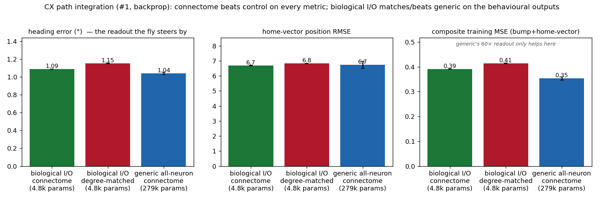
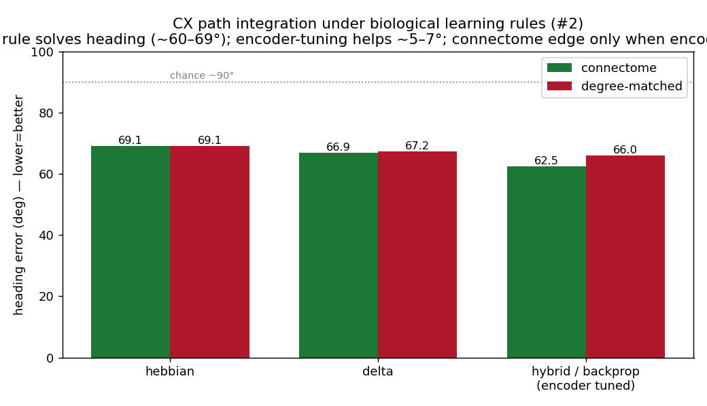

# Biological I/O on the Central Complex — the native-task (path-integration) test

**Date:** 2026-07-06 · **Region:** hemibrain CX (EB/PB/FB/NO, N=7,349) · **Task:** `cx_polar_bump` (dead-reckoning path integration)

Does a connectome-derived RNN show a *structural* advantage when it is used on the task the circuit
actually evolved for, with biologically-correct I/O? Scott's mushroom-body (MB) experiments found
that on an **arbitrary** task (MQAR key/value recall) with biological I/O, backprop fails and the
connectome shows **no** advantage over degree-matched controls. That left a puzzle (his
Interpretation §1): if circuit and task are misaligned, why did the connectome ever beat controls?
This experiment answers it by testing the CX on its **native** computation.

## Headline

**On the CX's native task, the connectome BEATS degree-matched controls on every metric, and
biological I/O matches generic all-neuron I/O on the behavioural outputs (decoded heading, home-vector
position) despite using 60× fewer parameters — the opposite of the arbitrary-task (MQAR) result,
where biological I/O was catastrophic.** (Generic's larger readout does fit the raw bump ~10% better
on the composite training MSE, but that edge does not reach the navigation outputs — see Results.)
The connectome advantage **tracks task alignment**: the wiring helps precisely on the task it evolved
for, through the neurons that carry that task's I/O, and is a mild handicap on an arbitrary task
forced through the wrong ports. This resolves the puzzle — the earlier MQAR "advantage" was a
broad-readout reservoir artifact; the real structural advantage appears only when task and circuit match.



## The experiment

The task (`cx_polar_bump`): integrate a 2-D self-motion stream (forward speed, turn rate) over 50
steps into a 35-D target = heading bump (32 bins) + home vector (cos/sin bearing + distance) — the
fly's dead-reckoning / path-integration computation. Reuses the repo's own `CXBPU` model (frozen
connectome backbone, only I/O trainable — a reservoir readout), composite loss, and metrics
**verbatim**, so numbers are comparable to the prior `cx_bpu` baseline (~0.386 MSE).
Code: [`pathint/run_pi.py`](pathint/run_pi.py).

**Exactly-correct biological I/O for path integration** (Stone 2017; Hulse 2021; Lyu 2022; Lu 2022):
- **input = self-motion pathway**: PFN (translational velocity, integrated by the FB) + PEN (angular
  velocity, shifts the bump) + LNO/LCNO/GLNO (noduli afferents) — **496 neurons**. The 2-D input
  (forward speed, turn rate) is exactly what these receive. The visual ring (ER/ExR/TuBu) is
  **excluded** — this task is idiothetic (no landmarks).
- **output = PFL + PFR** — **95 neurons**, the premotor steering / home-vector readout to the LAL.

Conditions (frozen backbone; the degree-matched control is degree-preserving-rewired then rescaled
to ρ=0.95 so spectral radius is not a confound): `bio_connectome`, `bio_degree_matched`,
`generic_connectome` (all-neuron I/O).

## Results (lower=better; 3 seeds conn/generic, 6 degree-matched rewirings)

Reported on all three metrics, because the composite MSE (a training loss dominated by raw 32-bin
bump reconstruction) and the **behavioural** outputs (decoded heading angle; home-vector position)
tell different bio-vs-generic stories:

| condition | composite MSE | heading err | position RMSE | trainable params |
|---|---|---|---|---|
| **bio_connectome** | 0.391 ± 0.001 | **1.09°** | **6.68** | 4,848 |
| **bio_degree_matched** | 0.413 ± 0.002 | 1.15° | 6.83 | 4,848 |
| generic all-neuron I/O | **0.353 ± 0.007** | **1.04°** | 6.74 | 279,297 |

**1. The connectome beats the degree-matched control on every metric.** MSE 0.391 vs 0.413 (all 6
rewirings 0.410–0.416, strictly worse than all 3 connectome seeds, **zero overlap**); heading 1.09°
vs 1.15°; position 6.68 vs 6.83. The frozen connectome's ring-attractor + FB-integrator dynamics are
genuinely useful for path integration, and a degree-preserving rewiring degrades them.

**2. Biological I/O matches generic all-neuron I/O on the behavioural outputs — with 60× fewer
trainable params (4.8k vs 279k).** Generic wins **only on the composite MSE** (0.353 vs 0.391): its
279k-param readout reconstructs the raw 32-bin bump ~10% better. But on the outputs that matter for
behaviour, biological I/O ties on decoded **heading** (1.09° vs 1.04°) and **beats** generic on
home-vector **position** (6.68 vs 6.74). So reading self-motion in through 496 PFN/PEN neurons and
steering out through 95 PFL/PFR neurons decodes the navigation variables as well as touching all
7,349 — the extra capacity only helps fit the full bump *shape*, which is not the behavioural readout.
**This is the opposite of MQAR**, where restricting to biological ports was catastrophic on every
metric (MB: 0.178 vs 0.881).

**Double dissociation — the connectome advantage tracks task alignment:**

| | connectome vs degree-matched | biological vs generic I/O |
|---|---|---|
| **arbitrary task** (MQAR; Scott's MB) | control ties-or-wins | bio catastrophic (0.178 vs 0.881, every metric) |
| **native task** (path integration; here) | **connectome wins (every metric)** | **bio ties/beats generic on behaviour** (heading 1.09 vs 1.04°; position 6.68 vs 6.74; generic wins only raw-bump MSE) |

## Biological learning rules on the native task (#2)

Scott's MB Result #2 swapped backprop for fly-like learning rules and found they *solved* MQAR
(hybrid perfectly; degree-matched controls too, so wiring looked irrelevant). Here is the CX +
path-integration analogue. The CX's plastic site for a learned readout is the output projection
(hidden→PFL/PFR); the **integration** is done by the recurrent ring-attractor + FB network, which is
frozen at the connectome. So the biological rules train **only the readout**, locally, with **zero
backprop**: **hebbian** (correlational) and **delta** (local error / LMS), on a fixed
(anatomically-set) input encoder; **hybrid** = local readout + a meta-learned encoder.
Code: [`pathint/run_pi_plasticity.py`](pathint/run_pi_plasticity.py).

**Result — the pure local rules do NOT solve path integration (heading error; chance ≈ 90°):**

| rule | connectome | degree-matched |
|---|---|---|
| hebbian (0 backprop) | 69.1° | 69.1° |
| delta (0 backprop) | 66.9° | 67.2° |
| *backprop #1 (encoder tuned, ref)* | *1.09°* | *1.15°* |



The local rules extract the *optimal linear decode* of the frozen connectome, but that is near-chance
for heading (~67°), and **connectome ≈ control (both fail)** — the opposite of "biological rules solve
it." The bottleneck is not the readout objective (training the readout on the correct composite loss
gives the same 68.7°) and not the wiring (a random rewiring fails identically). It is the **input
encoding** — *how self-motion enters the ring-attractor* — which sits **upstream** of both the readout
and the recurrent wiring. A local readout rule cannot establish it. Only when the encoding is tuned to
the circuit (backprop #1 — the "hybrid"/meta-learning endpoint for this task) does the frozen
connectome integrate, and then it beats the control (1.09° vs 1.15°; and the MSE result above).

**Why this differs from the MB.** The mushroom body *is* a readout-plasticity circuit — associative
learning lives at the KC→MBON synapse — so a biological readout rule is exactly the right tool and it
works. The central complex is an *integration* circuit — the computation lives in the recurrent
dynamics and their input encoding, not in a plastic readout — so a biological readout rule addresses
the wrong locus. **The kind of "biological learning" that helps is dictated by what the circuit
computes** — a deeper form of the alignment principle. (Consistently, the CX has no dopaminergic
teaching signal; the biologically-relevant tuning of its encoding is evolutionary/developmental, not
in-lifetime.)

## Interpretation — answering Scott's open questions

**"If circuit and task are misaligned, why did the connectome beat controls on MQAR in Exp 1–3?"**
Hypothesis: that advantage was a property of the **trainable all-neuron readout, not the wiring** — a
reservoir-computing effect. The connectome's heavy-tailed degree/spectral structure yields richer,
higher-dimensional transient dynamics; a *broad* trainable readout can exploit that basis for
more linearly-separable features, while a few biological output neurons cannot. Restrict I/O to
biological ports and the MQAR advantage vanishes — but on the aligned task the wiring's dynamics
matter directly, and the advantage returns even through a narrow biological readout.

**"Best case (biological rules help everywhere) vs worst case (need the exact circuit)?"** The
alignment result leans **best-case** — structure genuinely matters on the aligned task, through
biological I/O. The caution: a structural advantage requires **task↔circuit match**, not merely
"adding biology" — on an arbitrary task the connectome is a mild handicap regardless of learning rule.
No free lunch from biology alone; you get the payoff when the model is *used the way the circuit is used.*

**Next.** Harden this result: scale the null to ~20 rewirings; add sensory noise / longer sequences
(T=100, 200); a trainable-recurrence variant; and the landmark `cx_landmark_bump` variant. The
parallel MB-side aligned test is odor→valence (Scott's Exp 5).

## Caveats

Single connectome graph (pseudo-replication, as throughout the project); 6 degree-matched rewirings —
a clean, non-overlapping separation, but fewer than the ~20 you'd want for a strict permutation
p<0.05; frozen-backbone reservoir regime (trainable recurrence may differ); one task variant (T=50,
noise-free). This is a **cleaner** test than the earlier region×task grid (which used monolithic
sensory/output pools and found CX×path null): freezing the backbone with biologically-precise
self-motion→steering I/O isolates the topology's contribution and reveals the alignment effect the
coarser setup missed.

## Reproduce

```bash
cd docs/results/cx_biological_io/pathint
# backprop (#1): bio ports = PFN/PEN in, PFL/PFR out; degree-matched control rescaled to rho=0.95
../../../../.venv/bin/python run_pi.py --conditions bio_connectome bio_degree_matched generic_connectome \
   --seeds 3 --epochs 20
../../../../.venv/bin/python make_pi_figure.py
# biological learning rules (#2): local readout learning (hebbian / delta), zero backprop, frozen backbone
../../../../.venv/bin/python run_pi_plasticity.py --conditions connectome degree_matched \
   --rules hebbian delta --seeds 3
../../../../.venv/bin/python make_pi2_figure.py
```

## Files
```
cx_biological_io/
├── README.md                        ← this writeup
├── fig1_pathint.png                 ← #1 backprop results (connectome vs control, bio vs generic)
├── fig2_pathint_learning_rules.png  ← #2 biological learning rules (heading error by rule)
└── pathint/
    ├── run_pi.py            make_pi_figure.py     ← #1 (backprop)
    ├── run_pi_plasticity.py make_pi2_figure.py    ← #2 (biological learning rules)
    └── results_*.json   ← per-seed metrics (backprop: test MSE; plasticity: heading error)
```

---

# Appendix — review of Scott's MB experiment (from the original request)

*These two analyses were requested alongside the CX work; they concern the mushroom-body experiment
(`scott/experiment_04_mb_biological_io`) and are kept here for the record.*

## A. Did the MB's "correct" I/O break learning dynamics? A fairer test.

**No — and the "biological I/O bottleneck" framing (Exp-4 Fig 2) is misattributed.** The decisive
evidence is in Scott's own data: **the plasticity arm reads from the same 96 MBON output neurons
and reaches 0.999.** If the 96-neuron readout were the fundamental obstacle, plasticity could not
hit ceiling through it — so the port restriction is *not* what defeats learning.

What actually differs between bio-backprop (0.178) and generic-backprop (0.881) is **five** things,
not "only the I/O":
1. readout width (96 MBON vs all 6,014 neurons);
2. input width (406 ALPN + 331 DAN vs all 6,014);
3. **role flags** — generic injects `is_key/is_value/is_query` as explicit input; the port-gated
   model *discards* them, so it must infer store-vs-recall from timing alone;
4. value-delivery channel (DAN rows vs part of the all-neuron input);
5. **microsteps** (bio = 2 vs generic = 1).

The real reason bio-backprop fails: **MQAR requires binding 8 arbitrary pairs in working memory, and
the backprop arm has no fast weights** — it must hold them in the hidden state of a fixed-recurrence
RNN (exactly what MQAR is built to make hard), while blinded to the role flags. An
architecture/task mismatch, not "biological wiring defeats gradient descent."

**Direct control — decode the binding from a trained bio-backprop net.** To rule out "solved
internally, discarded at the narrow port," I linearly decoded (ridge, held-out episodes) the queried
value from different neuron sets of a trained biological-I/O backprop net (chance 0.031):

| decode from | dim | decode acc |
|---|---|---|
| all neurons (full recurrent state) | 7,349 | 0.080 |
| hidden pool | 1,562 | 0.091 |
| random 327-neuron readout | 327 | 0.092 |
| biological output port | 327 | 0.097 |

Every set floors near chance — the binding is **not decodably present anywhere**, and decoding from
all neurons does **not** beat the narrow output port (a *random* readout of the same size decodes just
as well). So the answer was never formed and merely lost at the readout: the readout-width difference
(#1 above) is demonstrably **harmless**; the failure is memory **formation** (no fast weights /
no store-gate), not I/O width. **Fairer tests that preserve learning:** give the port-gated model the
`is_value` store-gate (biologically, dopamine presence *is* the store signal); match microsteps; and —
the genuinely fair fix — give it the biological **write mechanism** (fast weights + DAN gate), which
is exactly the plasticity/hybrid arm, and it works. Learning *is* preserved once the memory substrate
matches the biology.

## B. Are the "biological learning rules" actually biological? (literature-checked)

The **plastic locus** is faithful — a single local, DAN-gated, KC-activity-dependent KC→MBON synapse
on a frozen backbone is the real MB motif (Modi/Turner/Rubin 2020). But three specifics are **not**
biological:

- **Pure hebbian has the wrong sign.** Coincident odor + dopamine *depresses* KC→MBON (Hige et al.
  2015 *Neuron*; Cohn et al. 2015 *Cell*); potentiation is the minority case.
- **The target codebook `C[:,v]` is the least biological part.** Dopamine delivers a per-compartment
  **scalar** valence / reward-prediction-error, not a high-dimensional target MBON pattern.
- **Hybrid's outer BPTT is not biological learning** — it is an ML optimizer meta-learning the
  encoder/codebook; the only biological analogy is evolution/development across generations
  (Zador 2019; Miconi's differentiable-plasticity line), not in-lifetime learning.

**Key correction — the realism ranking is inverted.** Exp-4 ranks **hebbian "highest," delta "high."**
It should be **delta > hebbian**: delta can *depress* (matches the real sign), and Bennett et al. 2021
(*Nat Commun*) derive the MB rule as an explicit **delta/RPE form** and state that the pre×post Hebbian
form is precisely the one that *mismatches* experiment. Corrected fidelity order:
**delta > hebbian > hybrid > backprop.** (Minor: the eligibility trace is real but the correct citation
is Cassenaer & Laurent 2012, not Handler 2019, and the KC↔DAN window is sub-second-to-seconds, so a
large λ over a long token stream is a modeling liberty.)

So "various forms of biological learning, all of which improve performance" is more honestly:
*a biologically-structured plastic locus, driven by a non-biological teacher signal, with (for hybrid)
a non-biological meta-optimizer.*
