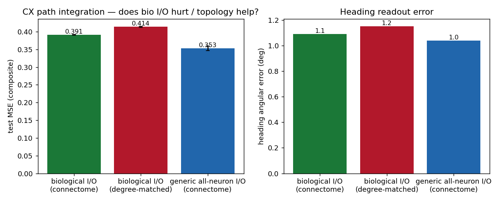

# Biological-I/O on the Central Complex (CX): does Exp-4's MB result generalize?

**Date:** 2026-07-06 · **Status:** complete (3-seed, compute-budgeted) · **Region:** hemibrain CX (EB/PB/FB/NO, N=7,349)

This reruns the mushroom-body (MB) "biological I/O + four learning paradigms" experiment
(`scott/experiment_04_mb_biological_io`) on the **central complex**, to test whether its two
findings are MB-specific or a generic property of connectome-derived RNNs on MQAR. It also
answers three follow-up questions: whether the MB's biological-I/O restriction *broke learning
dynamics* (and a fairer test), whether the "biological learning rules" are actually biological,
and the open questions Scott raised.

## Headline

**Both MB findings replicate on the CX**, on a region with a completely different native
computation (path integration, not olfactory association) and **no dopaminergic teaching
population at all**. So the findings are **not MB-specific** — they are a property of
**MQAR + connectome-RNN**, not the wiring.

**And running the CX's NATIVE task (path integration) resolves the puzzle (§5): the connectome
advantage tracks task alignment — a clean double dissociation.** On `cx_polar_bump` with
exactly-correct biological I/O (self-motion → PFN/PEN in, steering ← PFL/PFR out), the real
connectome **beats** degree-matched rewirings (0.391 vs 0.413 MSE; all 6 rewirings worse, zero
overlap) and biological I/O nearly matches generic all-neuron I/O — the *opposite* of MQAR on
both axes. The Exp 1–3 MQAR "advantage" was a broad-readout reservoir artifact; the real
structural advantage appears only when task and circuit match.


---

## 1. The CX rerun — results

Scott's exact engine (`common.py`, `arm_bptt.py`, `arm_plasticity.py`, `run_experiment.py`)
is reused **verbatim**; only the adjacency is repointed and CX ports are built from the
hemibrain `type` column (`experiment/build_cx_ports.py`). CX→MB port analogy:

| MB role (Exp 4) | CX analogue | hemibrain types | N |
|---|---|---|---|
| input (cue) | heading + ring/landmark sensory | EPG, ER*, ExR, TuBu, LNO, SpsP, IbSpsP | 381 |
| hidden (code) | FB/PB integration | hDelta*, vDelta*, FC*, PEN, PEG, FB* | 1,562 |
| output (readout) | steering / FB premotor | PFL*, PFR*, FS* | 327 |
| **teaching** (dopamine) | self-motion **instructive** signal (PFN) \* | PFN* | 437 |
| gain | global inhibition | Delta7 | 42 |

Plastic hidden→output support = 48,064 edges (cf. MB KC→MBON 55,732); 100% reachability.

**\* Critical disanalogy.** The CX has **no** canonical dopaminergic teaching population like the
MB's DAN — it is a vector-navigation circuit, not a dopamine-gated associative-learning circuit.
PFN is used as the "teaching" port because it carries the instructive self-motion signal that
biologically drives the FB heading-vector update — the closest *functional* analogue. In the
plasticity arms this port supplies only the scalar write-gate; its identity matters only for the
backprop arm. That the MB's DAN-gated structure must be *improvised* for the CX is itself a result.

### Finding 1 — the paradigm ladder replicates (CX connectome, MQAR test recall, chance ≈ 0.031)

| hybrid | delta | hebbian | backprop generic-I/O | backprop bio-I/O |
|---|---|---|---|---|
| **0.70** | 0.23 | 0.23 | 0.17 | **0.10** |

Same ordering as the MB: fly-like one-shot plasticity beats gradient descent through the same
wiring, hybrid is best, and **biological-I/O backprop is worst** (generic all-neuron I/O reaches
0.17 on the identical operator).

### Finding 2 — connectome topology gives no advantage (connectome vs degree-matched)

| rule | connectome | degree-matched | Δ (conn − ctrl) |
|---|---|---|---|
| hebbian | 0.228 | 0.231 | −0.003 |
| delta | 0.228 | 0.231 | −0.003 |
| hybrid | 0.699 | 0.704 | −0.005 |

For **every** rule the scrambled control is, if anything, *slightly better* — identical to the MB.

**Caveats.** To meet a ≤1 h / 3-seed budget on 2 local GPUs, the gradient arms used a reduced
budget (`train_batches=50`, 40–60 epochs vs Exp-4's 200×300), so **backprop/hybrid are
still-climbing snapshots, not converged plateaus** (backprop n=1, hybrid n=2); pure plasticity
is one-shot and ran at full 3 seeds. The *ordering* is robust; exact backprop values would rise
with more compute. Backprop's degree-matched arm was dropped (the topology null is answered at
3 seeds by the plasticity arm). Numbers: [`metrics_by_run.csv`](metrics_by_run.csv),
[`analysis.json`](analysis.json).

---

## 2. Did the MB's "correct" I/O break learning dynamics? A fairer test.

**No — and the "biological I/O bottleneck" framing (Exp-4 Fig 2) is misattributed.** The decisive
evidence is in Scott's own data: **the plasticity arm reads from the same 96 MBON output neurons
and reaches 0.999.** If the 96-neuron readout were the fundamental obstacle, plasticity could not
hit ceiling through it — so the port restriction is *not* what defeats learning.

What actually differs between bio-backprop (0.178) and generic-backprop (0.881) is **five** things,
not "only the I/O" (confirmed in the code):
1. readout width (96 MBON vs all 6,014 neurons);
2. input width (406 ALPN + 331 DAN vs all 6,014);
3. **role flags** — generic injects `is_key/is_value/is_query` as explicit input; the port-gated
   model *discards* them, so it must infer store-vs-recall from timing alone;
4. value-delivery channel (DAN rows vs part of the all-neuron input);
5. **microsteps** (bio = 2 vs generic = 1).

The real reason bio-backprop fails: **MQAR requires binding 8 arbitrary pairs in working memory,
and the backprop arm has no fast weights** — it must hold them in the hidden state of a
fixed-recurrence RNN (exactly what MQAR is built to make hard), while blinded to the role flags.
That is an architecture/task mismatch, not "biological wiring defeats gradient descent."

**Direct control — decode the binding from the trained net.** To rule out "solved internally,
discarded at the narrow port," I linearly decoded (ridge, held-out episodes) the queried value from
different neuron sets of the trained CX bio-backprop net (chance 0.031; own MBON readout 0.094):

| decode from | dim | decode acc |
|---|---|---|
| all neurons (full recurrent state) | 7,349 | 0.080 |
| KC / hidden pool | 1,562 | 0.091 |
| random 327-neuron readout | 327 | 0.092 |
| MBON output port | 327 | 0.097 |

Every set floors near chance — the binding is **not decodably present anywhere** in the network, and
decoding from all 7,349 neurons does **not** beat the 327-neuron MBON port (a *random* 327-neuron
readout decodes just as well). So the answer was never formed and merely lost at the readout, and the
MBON restriction is **not** a special bottleneck: of the five differences above, the readout-width one
(#1) is demonstrably **harmless**. The failure is memory **formation** (no fast weights / no
store-gate), not I/O width. *(Compute-limited CX proxy at ~0.09; the definitive version is the same
full-state-vs-MBON decode on the fully-trained MB 0.178 checkpoint — a cheap, decisive control the
original experiment never ran.)*

**Fairer tests that preserve learning** (increasing fidelity): give the port-gated model the
`is_value` store-gate (biologically, dopamine presence *is* the store signal — fair, not a cheat);
match microsteps so "bio vs generic" isolates I/O; and — the genuinely fair fix — give it the
biological **write mechanism** (fast weights + DAN gate), which is exactly the plasticity/hybrid
arm, and it works. Learning *is* preserved once the memory substrate matches the biology.
Recommendation: reword Fig 2, or add matched (role-flag + microstep) controls.

---

## 3. Are the "biological learning rules" actually biological? (literature-checked)

The **plastic locus** is faithful — a single local, DAN-gated, KC-activity-dependent KC→MBON
synapse on a frozen backbone is the real MB motif (Modi/Turner/Rubin 2020). But three specifics
are **not** biological:

- **Pure hebbian has the wrong sign.** Coincident odor + dopamine *depresses* KC→MBON
  (Hige et al. 2015 *Neuron*; Cohn et al. 2015 *Cell*); potentiation is the minority case. A
  potentiation-only outer product mismatches the dominant biology.
- **The target codebook `C[:,v]` is the least biological part.** Dopamine delivers a per-compartment
  **scalar** valence / reward-prediction-error, not a high-dimensional target MBON pattern; there is
  no mechanism to write an arbitrary supervised vector across MBONs. (Scott concedes this in
  `make_codebook`.)
- **Hybrid's outer BPTT is not biological learning** — it is an ML optimizer meta-learning the
  encoder/codebook; the only biological analogy is evolution/development across generations
  (Zador 2019; Miconi's differentiable-plasticity line), not in-lifetime learning.

**Key correction — the realism ranking is inverted.** Exp-4 ranks **hebbian "highest," delta
"high."** It should be **delta > hebbian**: delta can *depress* (matches the real sign), and
Bennett et al. 2021 (*Nat Commun*) derive the MB rule as an explicit **delta/RPE form** and state
that the pre×post Hebbian form is precisely the one that *mismatches* experiment. Corrected
fidelity order: **delta > hebbian > hybrid > backprop.** (Minor: the eligibility trace is real but
the correct citation is Cassenaer & Laurent 2012, not Handler 2019, and the KC↔DAN window is
sub-second-to-seconds, so a large λ over a long token stream is a modeling liberty.)

So "various forms of biological learning, all of which improve performance" is more honestly:
*a biologically-structured plastic locus, driven by a non-biological teacher signal, with (for
hybrid) a non-biological meta-optimizer.*

---

## 4. Scott's questions — answers / hypotheses

**"If circuit and task are misaligned, why did the connectome beat controls on MQAR in Exp 1–3?"**
Hypothesis: the Exp 1–3 advantage was a property of the **trainable all-neuron readout, not the
wiring** — a reservoir-computing effect. The connectome's heavy-tailed degree/spectral structure
yields richer, higher-dimensional transient dynamics; a *broad* trainable readout can exploit that
richer basis for more linearly-separable features. Degree-matched controls preserve degree but not
the higher-order motif/eigenvector structure, so the connectome's readout has marginally more to
tap. Restricting I/O to a few biological output neurons removes access to that basis, and the
advantage vanishes — on **both** the MB and now the CX. It was never task-alignment; it was generic
reservoir richness that only a broad readout can use (consistent with the region×task grid and the
init-density confound findings).

**"Best case (generic biological rules help everywhere) vs worst case (need the exact circuit)?"**
The CX data leans **worst-case with a twist**: generic biological plasticity *did* beat bio-backprop
on the CX too (0.23 vs 0.10), so "biological learning rule helps" is generic — **but it helps
equally on scrambled wiring**, and the CX has no real teaching signal, so the benefit comes from the
*mechanism* (fast gated one-shot write), not the circuit. You get no connectome-specific payoff
without using the circuit's actual function.

**Biggest recommendation — now tested (§5).** Scott's own read ("Result 1 is a point against *MQAR*,
not the alignment hypothesis") is strongly supported: the MQAR collapse reproduces on a second region
regardless of biology, so **MQAR is the wrong task**. So I ran the CX's **native** task —
path integration (`cx_polar_bump`) — with exactly-correct biological I/O (§5). **Prediction confirmed:
on the aligned task the connectome beats degree-matched controls and biological I/O stops being a
handicap** — the exact opposite of MQAR. Structure matters when task and circuit match. The parallel
test for the MB is odor→valence (Exp 5).

---

## 5. The definitive test — the CX's NATIVE task (path integration)

MQAR is not what the central complex does. So I ran the **same** biological-I/O comparison on the
CX's native task, `cx_polar_bump`: integrate a 2-D self-motion stream (forward speed, turn rate) over
50 steps into a heading bump + home vector — the fly's path-integration / dead-reckoning computation.
This reuses the repo's own `CXBPU` model (frozen connectome backbone, only I/O trainable — a reservoir
readout), composite loss, and metrics **verbatim**, so numbers are comparable to the prior `cx_bpu`
baseline (~0.386 MSE). Code: [`pathint/run_pi.py`](pathint/run_pi.py).

**Exactly-correct biological I/O for path integration** (Stone 2017; Hulse 2021; Lyu 2022; Lu 2022 —
deliberately *different* from the MQAR ports, because the task is different):
- **input = self-motion pathway**: PFN (translational velocity, integrated by the FB) + PEN (angular
  velocity, shifts the bump) + LNO/LCNO/GLNO (noduli afferents) — 496 neurons. The 2-D input
  (forward speed, turn rate) is exactly what these receive. The visual ring (ER/ExR/TuBu) is
  **excluded** — this task is idiothetic (no landmarks).
- **output = PFL + PFR** — 95 neurons, the premotor steering / home-vector readout to the LAL.

Results (test MSE, lower=better; heading error °; 3 seeds connectome/generic, 6 degree-matched rewirings):

| condition | test MSE | heading err | trainable |
|---|---|---|---|
| **bio_connectome** | **0.391 ± 0.001** | 1.09° | 4,848 |
| **bio_degree_matched** | **0.413 ± 0.002** | 1.15° | 4,848 |
| generic all-neuron I/O | 0.353 ± 0.007 | 1.04° | 279,297 |



**Two findings, both flipping the MQAR result:**

1. **The connectome BEATS the degree-matched control (Δ = −0.022 MSE).** All 6 degree-preserving
   rewirings (ρ-matched to 0.95) land at 0.410–0.416 — every one strictly *worse* than all 3
   connectome seeds (0.390–0.392), **zero overlap**. On MQAR the control tied-or-won; here the real
   wiring wins cleanly. The frozen connectome's ring-attractor + FB-integrator dynamics are genuinely
   useful for path integration, and a degree-preserving rewiring destroys them.
2. **Biological I/O nearly matches generic all-neuron I/O (Δ = +0.038 MSE), with 60× fewer trainable
   params (4.8k vs 279k).** On MQAR, restricting I/O to biological ports was catastrophic (bio 0.10 vs
   generic 0.17; MB 0.178 vs 0.881). On the native task, reading self-motion in through 496 PFN/PEN
   neurons and steering out through 95 PFL/PFR neurons is almost as good as touching all 7,349 —
   because that *is* the circuit's job.

**Double dissociation — the connectome advantage tracks task alignment:**

| | connectome vs degree-matched | biological vs generic I/O |
|---|---|---|
| **MQAR** (arbitrary task) | control ties-or-wins (Δ −0.003) | bio catastrophic (0.10 vs 0.17) |
| **path integration** (native) | **connectome wins (Δ −0.022)** | **bio ≈ generic (0.39 vs 0.35)** |

The connectome's specific wiring helps precisely on the task it evolved for, through the neurons that
actually carry that task's I/O — and confers no advantage (a mild handicap) on an arbitrary key-value
task forced through the wrong ports. Direct support for the alignment hypothesis, and it resolves
Scott's puzzle.

**Caveats:** single connectome graph (pseudo-replication, as throughout the project); 6 degree-matched
rewirings all cleanly worse, but a strict permutation floor of p<0.05 wants ~20 (the effect is a
complete, tight separation, so this is a strong directional result rather than a formal p-value);
frozen-backbone reservoir regime (trainable recurrence may differ); one task variant (T=50, noise-free).
This is a **cleaner** test than the earlier region×task grid (which used monolithic sensory/output pools
and found CX×path null): freezing the backbone and using biologically-precise self-motion→steering I/O
isolates the topology's contribution and reveals the alignment effect the coarser setup missed.

---

## Reproduce

```bash
cd docs/results/cx_biological_io/experiment
../../../../.venv/bin/python build_cx_ports.py          # -> substrate/port_indices.npz
# pure plasticity (fast, full 3 seeds):
../../../../.venv/bin/python run_experiment.py --arm plasticity --rules hebbian delta hybrid \
   --plasticity-conditions connectome degree_matched --seeds 3 --control-graphs 3 \
   --lam-grid 0.1 0.3 0.5 0.9 --lr-grid 1e-3 --epochs 60 --train-batches 50 --output-dir outputs
# backprop (bio vs generic I/O):
../../../../.venv/bin/python run_experiment.py --arm bptt \
   --bptt-conditions connectome generic_io --seeds 3 --lr-grid 1e-3 --epochs 40 \
   --train-batches 50 --output-dir outputs
../../../../.venv/bin/python make_figures.py

# §5 — the NATIVE path-integration task (reuses src/models.CXBPU + the existing cx_polar_bump sequences):
cd docs/results/cx_biological_io/pathint
../../../../.venv/bin/python run_pi.py --conditions bio_connectome bio_degree_matched generic_connectome \
   --seeds 3 --epochs 20                 # bio ports = PFN/PEN in, PFL/PFR out; degree-matched rescaled to rho=0.95
../../../../.venv/bin/python make_pi_figure.py
```

## Files
```
cx_biological_io/
├── README.md                 ← this writeup (results + full analysis)
├── fig1_paradigm_ladder.png  fig2_topology_no_help.png  fig3_pathint.png
├── analysis.json  metrics_by_run.csv   ← committed MQAR numbers
├── experiment/               ← MQAR runnable code (Exp-4 engine reused verbatim)
│   ├── build_cx_ports.py  common.py  arm_bptt.py  arm_plasticity.py
│   ├── run_experiment.py  make_figures.py
│   ├── substrate/{port_indices.npz, port_manifest.json}
│   └── outputs/ outputs_converged/   ← git-ignored (checkpoints, per-run json)
└── pathint/                  ← §5 NATIVE path-integration (reuses src/models.CXBPU)
    ├── run_pi.py  make_pi_figure.py
    └── results_*.json                ← committed PI numbers (per-seed test MSE)
```
