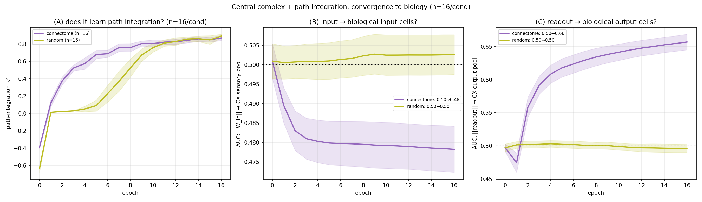

# Does a path-integration network *converge to biology*? (Central complex, free I/O) — n=16

## TL;DR
Build a recurrent network whose recurrent matrix **is** the central-complex (CX) connectome (trainable),
give it a **free** input projection *and* a **free** readout over all N neurons (no pool gating), and
train it on the CX-native **polar-bump path-integration** task. Over training the **readout
spontaneously converges onto the CX's biological OUTPUT cells** (the connectivity-defined output pool —
the steering / pre-motor PFL-type neurons): AUC(‖readout‖→output) rises from chance **0.50 → 0.66**,
in **every one of 16 seeds**, while a paired random-wired control stays flat at 0.50
(Δ=+0.161, paired t **p=3.6e-13**). The **input** layer, by contrast, does **not** converge onto the
sensory pool — it drifts slightly *below* chance (0.50 → 0.478). The connectome also **learns the task
faster** than random (panel A).

## Results (n=16/condition, paired connectome-vs-random on the same seeds)
| layer | connectome (init→final) | random | Δ | conn>rand | paired t | Wilcoxon |
|---|---|---|---|---|---|---|
| **readout → output pool** | 0.50 → **0.657** | 0.496 | **+0.161** | **16/16** | **3.6e-13** | 3.1e-5 |
| input → sensory pool | 0.50 → 0.478 | 0.503 | −0.024 | 1/16 | 1.7e-8 (below) | 6.1e-5 |

- **Output side:** robust in every seed, extremely significant — the readout migrates onto the
  biological output cells.
- **Input side:** does *not* find the sensory pool; the connectome even pushes input weight marginally
  *below* chance (a mild anti-alignment, not a convergence).
- **Learning (panel A):** both reach R²≈0.87–0.89; the connectome breaks from the zero-R² plateau
  ~epoch 2 vs ~epoch 5 for random.

## How this relates to the MB and OL — complementary emphases, not a mirror image
Measuring **both** interfaces across the three regions (input = ‖W_in‖→input-pool, output =
‖readout‖→output-pool), the picture is graded:

| region | task | input-cell match | output-cell match |
|---|---|---|---|
| **MB** | odor identity | **+0.10** (strong, 18/20, p=1e-5) | +0.06 (weak but real, 18/20, p=2e-4) |
| **CX** | path integration | −0.02 (none) | **+0.16** (strong, 16/16, p=4e-13) |
| **OL** | optic flow (synthetic) | ~0 (none) | ~0 (none) |

So it is **not** a clean MB-input / CX-output mirror: the **MB matches on both interfaces but is
input-dominant** (its odor-identity computation hinges on *which input channel*), while the **CX matches
on the output only** (its path-integration computation hinges on the *steering/heading command* it must
emit; the velocity input is low-dimensional and generic, so the input layer has no pressure to localize).
The OL flow task (as set up) engages neither biological interface → null. The through-line: **convergence
strength on an interface tracks how much the circuit's task actually depends on that interface.**

## Methodology
- **Model:** `FreeCXBPU` — the validated `src.models.SparseCXBPU` with **free I/O** (sensory_indices =
  output_indices = all N), made memory-light via **edge message-passing + gradient checkpointing**
  (verified numerically identical to stock `SparseCXBPU`: <1e-7 forward, <1e-9 gradient → 44GB→2GB).
  Recurrent = CX connectome (N=7,349, ~512k edges), **trainable**, ρ=0.95; **K=3 microsteps**; free
  `W_in`∈ℝ^{N×2} (forward + angular velocity), free readout ∈ℝ^{35×N} (32-bin heading bump + 3
  home-vector). Input pool = 741 sensory cells, output pool = 591 cells.
- **Task:** CX-native **`cx_polar_bump`** path integration (pre-generated `train_T50` = 10k trajectories,
  T=50), MSE loss, R² metric. Same data for every model/seed.
- **Control:** `random_control_matrix` — same edge count + weights, scattered positions (ER-style),
  rescaled to ρ=0.95 (degree-/weight-/spectral-radius-matched, scrambled wiring). Paired with the
  connectome on the same seed (same init + same data) → a per-seed difference is the *specific wiring*.
- **Convergence metric:** ROC-AUC with which per-neuron ‖W_in‖ (resp. ‖readout‖) predicts membership in
  the sensory (resp. output) pool, snapshotted init → final. 0.5 = chance.
- **Training:** Adam lr=1e-3, grad-clip 1.0, 16 epochs, batch 64, 16 seeds × {connectome, random}.

## Caveats
- "Biological output cells" = the connectivity-defined CX **output pool** (extra-CX projectors), the
  same pool the validated CX path results use — not a cell-type-curated steering set.
- Input-side is null/slightly-negative (consistent with the path task driving the *motor* interface, not
  the sensory one).

## Reproduce
Train+snapshot (one model×seed per call): `scripts/path/run_cx_biology_convergence.py
--connectome-dir connectomes/cx_polar_bump_seed0 --seq-dir <…/sequences/cx_polar_bump_bins32>`.
Local sweep: `scripts/path/launch_cx_convergence_local.py`. Analysis:
`scripts/figures/plot_cx_biology_convergence.py`.
