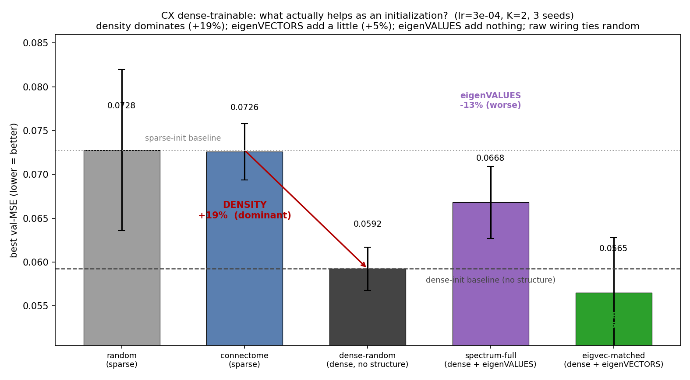
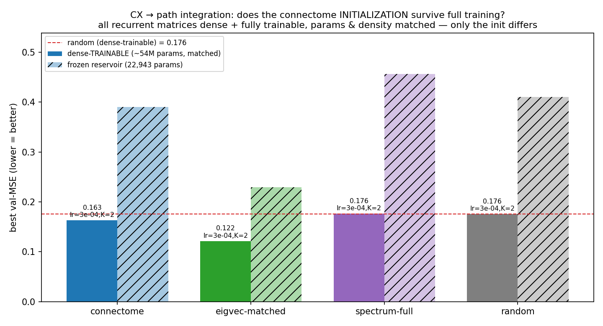
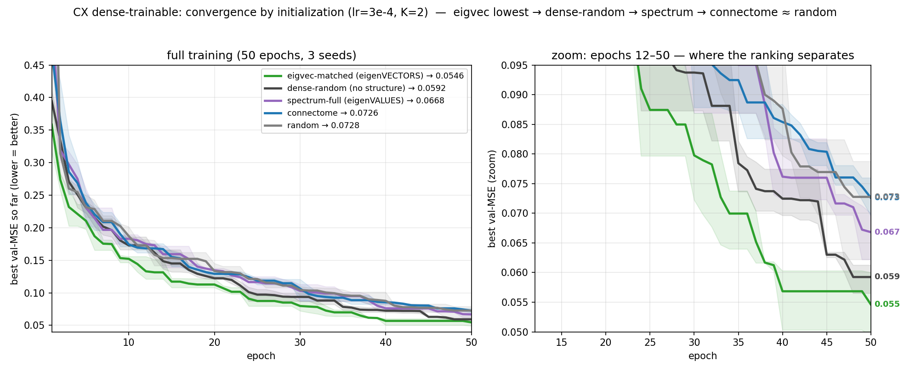

# CX → path integration: what actually helps when the connectome is a *trainable initialization*?

## TL;DR
We make **every** recurrent matrix dense **and fully trainable** (~54M params each), so models are
identical in density and trainable-parameter count and differ **only in initialization**. Trained to
depth (**50 epochs**, 3 seeds, full LR×K sweep) and decomposed with the right controls, the
connectome's apparent "init advantage" mostly **dissolves into a trivial cause — initialization
density — with only a small genuine contribution from its eigenvectors and none from its eigenvalues
or its literal wiring:**

| effect (stable cell lr=3e-4/K2, 3 seeds, val-MSE ↓) | size | robustness |
|---|---|---|
| **Init density** (dense_random 0.0592 vs sparse random 0.0728) | **+19%** | **3/3 seeds** — dominant |
| **eigenVECTORS** (eigvec 0.0565 vs dense_random 0.0592) | **+5%** | 2/3 seeds — small, real-ish |
| **eigenVALUES** (spectrum 0.0668 vs dense_random 0.0592) | **−13% (worse!)** | 3/3 seeds — *hurts* accuracy |
| **raw connectome** (0.0726 vs sparse random 0.0728) | **+0.2% (tie)** | p=0.98 — adds nothing |

The key control is **`dense_random`** — a dense matrix of *random* values (same 54M params, same
ρ): it isolates "dense-init effect" from "structure." It beats the real connectome by 19% and even
beats the eigenvalue-matched surrogate. So **most of the dense surrogates' advantage was never about
the connectome at all — it was about starting from a dense matrix.** What genuinely survives that
control is a **small eigenvector benefit (+5%)**; the eigenvalues are, if anything, mildly harmful
for accuracy. Separately, the connectome's eigenvalues **do** buy **dynamical stability** at
aggressive learning rates (below).

## The five inits (everything matched except initialization)
| model | init | trainable params | init nonzeros |
|---|---|---|---|
| random | degree-matched random | 54,030,744 | 511,930 (sparse) |
| connectome | real CX wiring (densified) | 54,030,744 | 511,930 (sparse) |
| **dense_random** | **random values, dense** | 54,030,744 | ~54M (dense) |
| spectrum-full | connectome **eigenVALUES**, random eigenvectors | 54,030,744 | ~54M (dense) |
| eigvec-matched | connectome **eigenVECTORS** (Schur basis), random λ | 54,030,744 | ~54M (dense) |

All five train the full N²=54,007,801 recurrent entries + the identical 22,943 I/O params (verified
by `requires_grad` count). `init nonzeros` is the *starting* sparsity, not the trainable count.
`dense_random` is what makes density a *controlled* variable instead of a confound.

## Accuracy result (lr=3e-4/K2, mean ± sd over 3 seeds; lower = better)
| init | val-MSE | what it isolates |
|---|---|---|
| **eigvec-matched** | **0.0565 ± 0.006** | dense + connectome eigenVECTORS |
| **dense_random** | **0.0592 ± 0.003** | dense, **no structure** (the honest baseline) |
| spectrum-full | 0.0668 ± 0.004 | dense + connectome eigenVALUES |
| connectome | 0.0726 ± 0.003 | sparse + real wiring |
| random | 0.0728 ± 0.009 | sparse, no structure |

Per-seed: density (dense_random < random) holds **3/3**; eigenvectors (eigvec < dense_random) **2/3**
(+4.6%); eigenvalues (dense_random < spectrum) **3/3** — spectrum is reliably *worse* than the
structure-free dense baseline. The same ordering holds at lr=1e-4/K2.

## Eigenvalues buy stability, not accuracy
At an aggressive LR (1e-3, K=2) the picture inverts on a **different** axis — stability:

| init | val-MSE @ lr=1e-3 | σ |
|---|---|---|
| **spectrum-full** (connectome eigenVALUES) | **0.066** | 0.006 — **stable** |
| connectome | 0.207 | 0.27 — collapses on some seeds |
| eigvec-matched (dense) | 0.352 | 0.26 — collapses |
| random | 0.376 | 0.26 — collapses |
| **dense_random** (dense, no structure) | **0.514** | 0.007 — **reliably collapses** |

`spectrum_full` is the **only** init that doesn't blow up. Crucially, both `eigvec_matched` **and**
`dense_random` are *dense* inits yet collapse here — `dense_random` (structure-free dense) is in fact
the *worst*, failing on all 3 seeds. So high-LR stability is **not** a density effect; it is specific
to the connectome's **eigenvalue distribution** (well-conditioned spectral radius/structure →
tolerates hard optimization). This is now directly confirmed by the `dense_random`@lr=1e-3 control.
So the two halves of the connectome's spectral
decomposition do different jobs: **eigenVECTORS → a little accuracy, eigenVALUES → stability** — but
neither is large, and the **raw sparse wiring delivers neither.**

## Why longer training + the dense control mattered
- The first pass (12 epochs, 2 seeds) reported connectome **+7%** over random and eigvec **+31%**.
  Training to 50 epochs **washed the connectome edge out to a tie** (same cell: +7.2% → +0.24%) — it
  had been catching a lucky early-stop epoch.
- Adding `dense_random` then showed that most of eigvec's remaining edge over random is **init
  density (+19%)**, not eigenvectors (+5%), and that the eigenvalue surrogate's apparent edge over
  *sparse* random was **entirely** density (it loses to the dense control).
- Net: the connectome, used as a trainable initialization for this task, is **mostly not special** —
  what little it adds beyond "a dense init" is a modest eigenvector/manifold benefit, consistent with
  the ring-attractor picture (heading lives on an eigenvector manifold) but far smaller than the
  density confound that hid it.

## Caveats (verified by adversarial re-analysis of the raw cells)
1. **Not fully converged.** Only `eigvec_matched` had plateaued at 50 epochs; `dense_random`,
   `spectrum_full`, `connectome`, `random` were still improving ~0.01–0.015/10ep. Gaps among the
   non-eigvec inits may narrow further — but eigvec **converges fastest**, which is itself the init
   advantage, and it leads at every fixed epoch budget.
2. **The eigenVECTOR effect is small and only 2/3 seeds** (+4.6%); n=3 is few relative to seed spread.
   The density (+19%, 3/3) and eigenvalue-hurts (3/3) effects are robust; the eigenvector benefit is
   the soft one and would want more seeds to firm up.
3. **Headline is at the stable operating point** (lr≤3e-4, K=2). At lr=1e-3 everything reshuffles
   around stability (spectrum wins by not diverging).
4. `state_clip=10` is required for the dense-trainable recurrent to be stable at all; identical for
   all models, so it advantages none.

## Reproduce
Main sweep: `scripts/path/run_hp_spectrum_sweep.py --train-recurrent dense --state-clip 10 --lr-only
--lrs 1e-4 3e-4 1e-3 --ks 2 3 --epochs 50 --seeds 0 1 2` (→ `cx_dense_trainable_v2/`). Density
control: same with `--models dense_random --lrs 1e-4 3e-4 --ks 2` (→ `cx_dense_random/`). Generator
`dense_random_control_matrix` in `src/connectome.py`. Figures: `plot_init_decomposition.py`
(headline), `plot_dense_trainable.py` (bars), `plot_training_curves.py` (curves). Summary
`summarize_dense_trainable.py`. Frozen-reservoir companion: [../cx_eigval_vs_eigvec](../cx_eigval_vs_eigvec).
