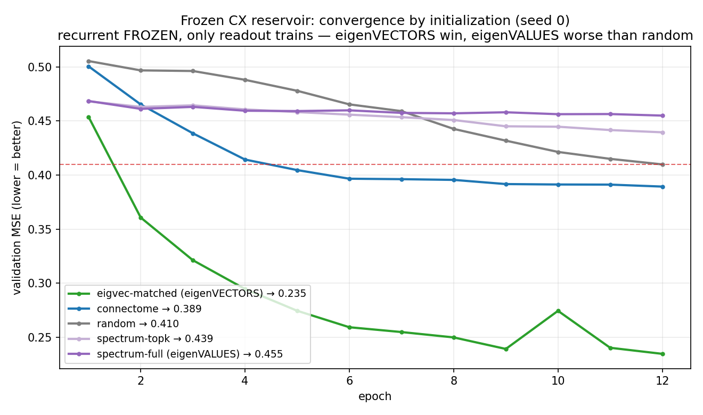

# CX → path integration: is the advantage in the eigenVALUES or the eigenVECTORS?

## TL;DR
**The central-complex connectome's path-integration advantage is in its eigenVECTORS (the specific
wiring directions / attractor manifold), not its eigenVALUES (the spectrum / dynamical rates).**
A dense surrogate that keeps the connectome's **eigenvectors** but **randomizes its eigenvalues**
(`eigvec_matched`) is the **best substrate in the entire control hierarchy** — val-MSE **0.229**,
**+44% better than random** and even better than the real (sparse) connectome. A dense surrogate
that does the opposite — keeps the **eigenvalues**, **randomizes the eigenvectors** (`spectrum_full`)
— is **worse than random** (0.456). Same density, opposite halves of the decomposition: the
eigenvectors win 2-to-1. So matching the connectome's *dynamics* buys you nothing; matching its
*directional structure* is the whole game.

## The question
The connectome beats its matched controls on path integration (see `../hp_spectrum_sweep_cx/`). But
*what* about the wiring carries that advantage? Any matrix factorizes into eigenvalues (how its modes
decay/oscillate) and eigenvectors (which directions in neural space those modes occupy). Two dense
surrogates isolate the two halves:

| control | eigenVALUES | eigenVECTORS | construction |
|---|---|---|---|
| `spectrum_full` | **connectome's (exact)** | random | `V_rand · T_conn · V_randᵀ` |
| `eigvec_matched` | random | **connectome's (Schur basis)** | `Z_conn · T_rand · Z_connᵀ` |

Both are dense N×N, so comparing *within* them removes the sparse-vs-dense confound: the only
difference is which half of the decomposition is the connectome's.

## Result (3 seeds, full HP grid — same rigor as the other CX results)
Each model at its **own** best hyperparameters (val-MSE, **lower = better**; frozen recurrent,
12 epochs, 8 000 trajectories, batch 256, LR/ρ/weight-decay/K swept, ρ-matched to 0.95):

| model | what's matched to the connectome | best val-MSE | vs random |
|---|---|---|---|
| **`eigvec_matched`** | **eigenVECTORS** (random eigenvalues) | **0.229** | **+44.2%** |
| connectome | both (sparse, the real thing) | 0.390 | +4.9% |
| weight-shuffle | topology (shuffled weights) | 0.394 | +4.0% |
| random | nothing | 0.410 | — |
| spectrum-topk | top-16 eigenvalues | 0.441 | −7.5% |
| degree-shuffle | degree sequence | 0.449 | −9.5% |
| **`spectrum_full`** | **eigenVALUES** (random eigenvectors) | **0.456** | **−11.0%** |

## Training curves (frozen reservoir: only the readout trains)

*Validation MSE vs epoch, each model at its best LR (**3 seeds; shaded band = seed min–max**). The
split is immediate and stark: **eigvec-matched (eigenVECTORS) drops fastest and far lowest** (→0.22),
the **connectome** settles just under random (→0.39), and the **eigenvalue controls
(spectrum-full/topk) barely move and stay *above* random** the whole way (→0.45) — matching the
connectome's spectrum buys nothing in a frozen reservoir.*

## Interpretation
- **Eigenvectors carry the advantage, decisively.** Density-controlled (both dense): eigenvectors
  0.229 vs eigenvalues 0.456 — a 2× gap. Keeping the connectome's directional structure with random
  eigenvalues is a *far* better path-integration substrate than keeping its eigenvalues with random
  directions.
- **Why this makes mechanistic sense.** Path integration in the central complex is a **ring
  attractor**: heading is a bump on a low-dimensional ring *manifold* — i.e. a set of specific
  eigenvector directions. The eigenvalues only set how fast modes decay; the *directions* are what
  hold and move the heading signal. So matching directions (any rates) works; matching rates (any
  directions) is useless.
- **Eigenvalues alone are worse than random.** `spectrum_full` and `spectrum_topk` both sit *below*
  the random control — a dense matrix that rings at the connectome's frequencies but in random
  directions is an actively poorer substrate than a sparse random one.
- **`eigvec_matched` even beats the sparse connectome (0.229 vs 0.390).** This part is a **density
  bonus** (a dense reservoir with the right directions has more for the linear readout to exploit),
  so it is *confounded* and should not be read as "better than the connectome" — but it underscores
  that the directional structure is what matters.

*`spectrum_full` lands exactly on the connectome's eigenvalues (random directions); `eigvec_matched`
keeps the directions but its eigenvalues are randomized (ρ=0.95 circle dashed).*

## Model architecture (and why every choice is what it is)
The model is deliberately **minimal**: a single recurrent layer whose recurrent weight matrix *is*
the connectome (or a control), wrapped by a small learned input projection and a linear readout.
The experiment isolates the recurrent substrate, so everything around it is kept as small and fixed
as possible. The class is **`CXBPU`** (`src/models.py`); one forward pass processes a trajectory of
`T` timesteps:

**1. Recurrent substrate `W_rec` (N×N), N = 7,349 CX neurons.**
`W_rec` is the connectome's adjacency (or a control matrix), rescaled to **spectral radius ρ = 0.95**.
In *this* experiment it is a **frozen buffer** (`requires_grad = False`) — a fixed reservoir; only the
I/O trains. (In the [dense-trainable follow-up](../cx_dense_trainable) it becomes an `nn.Parameter`.)
- *Why frozen* — this asks whether the connectome's wiring, used **as-is**, hands a *linear* readout
  better features than a random matrix. Freezing also makes every control identical in
  trainable-parameter count (only `W_in`/`W_out` train), so the result cannot be a capacity artifact.
- *Why ρ = 0.95* — the spectral radius sets whether recurrent activity decays (<1) or blows up (>1).
  Pinning every matrix to the same **near-critical 0.95** removes overall gain as a confound, so a
  difference reflects the matrix's *structure*, not how hot it runs. Every control is rescaled identically.

**2. Input injection — pool-gated.**
The 2-D self-motion input at each timestep (forward velocity + angular velocity, which the task
integrates into an x/y/heading trajectory) is projected by a learned `W_in` (`|sensory pool| × 2`)
and **added only to the sensory pool** of neurons (`index_add` over `sensory_indices`), not the whole
network.
- *Why pool-gated* — a connectome has biological *input* cells. Injecting only at the sensory pool
  keeps the model a faithful "stimulus → region → readout" pipeline instead of a free projection over
  all N neurons (see [../io_appropriateness](../io_appropriateness) for how biological the pool is).

**3. Recurrent dynamics — K micro-steps, ReLU.**
For each timestep the state is updated **K times** (K ≈ 3, swept): `h ← ReLU(h · W_recᵀ)`, with the
input added only on the **first** micro-step.
- *Why ReLU* — a positive firing-rate nonlinearity (rates can't go negative) that also keeps the
  recurrent map nonlinear, so the reservoir generates rich features for the readout.
- *Why micro-steps* — one matrix multiply mixes only 1-hop neighbours; **K hops** let a stimulus
  propagate several synapses across the network within a single input frame, as a real recurrent
  circuit does between sensory updates.
- *`state_clip`* — optional activation clamp, **off here** (it is only needed to stabilize the
  dense-trainable variant, where a 54M-param recurrent over many unrolled steps can diverge).

**4. Readout — pool-gated and linear.**
The output is read **only from the output pool** (`index_select` over `output_indices`) through a
learned linear layer `W_out` (`output_dim × |output pool|`).
- *Why pool-gated* — reads from the region's biological output cells, not all N.
- *Why linear* — deliberately weak. A linear probe forces the **recurrent substrate (the connectome)**
  to do the computation; any performance gap then reflects the *substrate*, not a clever decoder.
  This is exactly the reservoir-computing test.

**Target & loss.** The output target is the polar-bump path-integration code: a **32-bin von-Mises
heading "bump"** centred on the agent's current heading, plus a **3-D home vector** (home-bearing
cos/sin + normalized distance). Trained with **MSE**; the headline metric is the angular error of the
decoded heading bump.

**Trained parameters (frozen experiment): `W_in`, `b_in`, `W_out`, `b_out` = 22,943** — *identical*
across all seven models; the millions of recurrent entries are frozen and train nothing. **The whole
experiment is one controlled swap:** hold this architecture fixed and replace only `W_rec` with the
connectome vs. its eigenvalue/eigenvector/topology surrogates. Same pools, same `W_in`/`W_out` shapes,
same ρ, same K, same trainable count → any difference is attributable to the recurrent matrix alone.

## Methods & rigor
Frozen recurrent (only input/readout train), 12 epochs × 8 000 trajectories, batch 256, 3 seeds,
full learning-rate + ρ + weight-decay + K grid, every model rescaled to spectral radius 0.95 — the
identical protocol as `../hp_spectrum_sweep_cx/`. `eigvec_matched` = `Z_conn · T_rand · Z_connᵀ`,
where `Z_conn` is the connectome's real Schur basis and `T_rand` keeps its strictly-upper coupling
but has random eigenvalues on the diagonal blocks, rescaled to ρ=0.95 from the exact block
eigenvalues. Generators in `src/connectome.py` (`eigenvector_matched_control_matrix`,
`spectrum_matched_control_matrix`); figures from `scripts/figures/plot_eigval_vs_eigvec.py`.

## It is NOT a trainable-parameter effect
The recurrent matrix is **frozen** in every model, so all seven have the **identical trainable
surface: 22,943 parameters** (`W_in`/`b_in`/`W_out`/`b_out`, over the *same* sensory/output pools).
The dense surrogates' ~31M recurrent entries are all frozen (`requires_grad=False`) and contribute
**zero** trainable parameters — verified:

| model | trainable params | frozen recurrent entries |
|---|---|---|
| connectome (sparse) | **22,943** | 511,930 |
| `eigvec_matched` (dense) | **22,943** | 30,779,740 |

So `eigvec_matched`'s edge is **not** more capacity to fit. The eigenvalues-vs-eigenvectors result
(`eigvec_matched` vs `spectrum_full`) is fully clean: same density, same frozen-param count, only
the preserved half differs. And the part where `eigvec_matched` beats the *sparse* connectome is
**reservoir expressiveness**, not fitting capacity — a dense frozen reservoir mixes information
across the network more richly each timestep, so the same-size readout reading the same output pool
gets richer fixed features.

## Other caveats
- **Density** still differs between the dense surrogates and the sparse connectome (~512k vs N²
  *frozen* connections); the *eigenvalues-vs-eigenvectors* conclusion is density-controlled (both
  surrogates dense), the "eigvec beats the sparse connectome" line is not (it's the reservoir-
  expressiveness effect above). **This density confound is removed in the follow-up
  [../cx_dense_trainable](../cx_dense_trainable)**, which makes *every* model (connectome included) a
  dense, fully-trainable N×N matrix and adds a `dense_random` control (dense values, no structure).
  Trained to depth (50 epochs, 3 seeds) it **refines** this frozen picture rather than simply
  confirming it: the *dominant* factor turns out to be **init density** — a structure-free dense
  matrix beats the sparse connectome by ~19% — so most of what looks like a big structural effect
  here is the dense-reservoir advantage flagged just above. Net of density (eigvec vs the
  `dense_random` baseline) the **clean eigenVECTOR bonus is only ~+5%**; eigenVALUES add nothing for
  accuracy (only high-LR training stability); and the **raw sparse connectome ties random**. So the
  frozen "eigenvectors win" holds in *direction*, but its magnitude here is inflated by density.
- For a **non-normal** matrix the eigenvectors aren't fully separable from the rates; `eigvec_matched`
  preserves the connectome's orthogonal **Schur basis + coupling** (the numerically stable analog of
  "matched eigenvectors") and randomizes only the eigenvalues.
