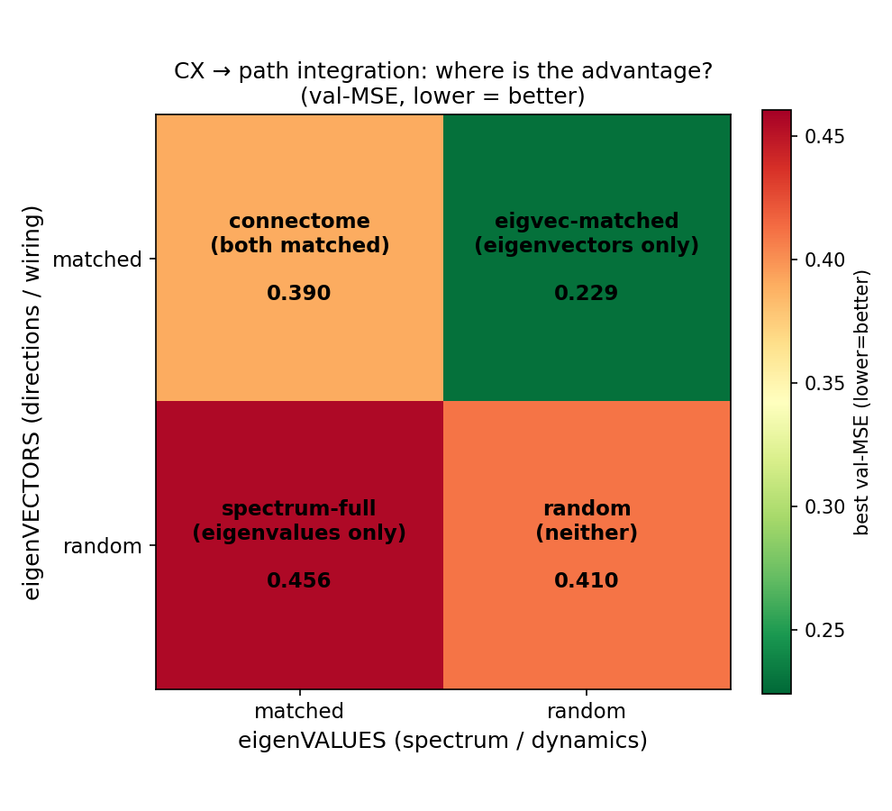
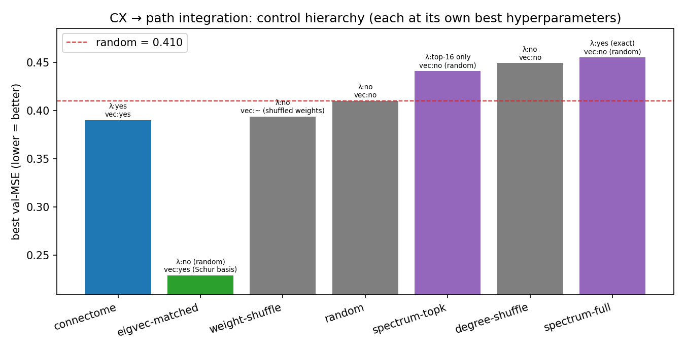
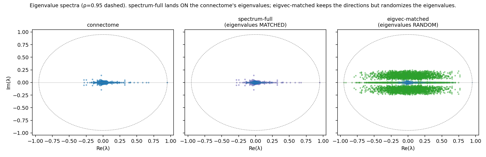

# CX → path integration: is the advantage in the eigenVALUES or the eigenVECTORS?

## TL;DR
**The central-complex connectome's path-integration advantage is in its eigenVECTORS (the specific
wiring directions / attractor manifold), not its eigenVALUES (the spectrum / dynamical rates).**
A dense surrogate that keeps the connectome's **eigenvectors** but **randomizes its eigenvalues**
(`eigvec_matched`) is the **best substrate in the entire control hierarchy** — val-MSE **0.229**,
**+44% better than random** and even better than the real (sparse) connectome. A dense surrogate
that does the opposite — keeps the **eigenvalues**, **randomizes the eigenvectors** (`spectrum_full`)
— is **worse than random** (0.456). Same density, opposite halves of the decomposition: the
eigenvectors win 2-to-1. So matching the connectome's *dynamics* buys you nothing; matching its
*directional structure* is the whole game.

## The question
The connectome beats its matched controls on path integration (see `../hp_spectrum_sweep_cx/`). But
*what* about the wiring carries that advantage? Any matrix factorizes into eigenvalues (how its modes
decay/oscillate) and eigenvectors (which directions in neural space those modes occupy). Two dense
surrogates isolate the two halves:

| control | eigenVALUES | eigenVECTORS | construction |
|---|---|---|---|
| `spectrum_full` | **connectome's (exact)** | random | `V_rand · T_conn · V_randᵀ` |
| `eigvec_matched` | random | **connectome's (Schur basis)** | `Z_conn · T_rand · Z_connᵀ` |

Both are dense N×N, so comparing *within* them removes the sparse-vs-dense confound: the only
difference is which half of the decomposition is the connectome's.

## Result (3 seeds, full HP grid — same rigor as the other CX results)
Each model at its **own** best hyperparameters (val-MSE, **lower = better**; frozen recurrent,
12 epochs, 8 000 trajectories, batch 256, LR/ρ/weight-decay/K swept, ρ-matched to 0.95):

| model | what's matched to the connectome | best val-MSE | vs random |
|---|---|---|---|
| **`eigvec_matched`** | **eigenVECTORS** (random eigenvalues) | **0.229** | **+44.2%** |
| connectome | both (sparse, the real thing) | 0.390 | +4.9% |
| weight-shuffle | topology (shuffled weights) | 0.394 | +4.0% |
| random | nothing | 0.410 | — |
| spectrum-topk | top-16 eigenvalues | 0.441 | −7.5% |
| degree-shuffle | degree sequence | 0.449 | −9.5% |
| **`spectrum_full`** | **eigenVALUES** (random eigenvectors) | **0.456** | **−11.0%** |

## Interpretation
- **Eigenvectors carry the advantage, decisively.** Density-controlled (both dense): eigenvectors
  0.229 vs eigenvalues 0.456 — a 2× gap. Keeping the connectome's directional structure with random
  eigenvalues is a *far* better path-integration substrate than keeping its eigenvalues with random
  directions.
- **Why this makes mechanistic sense.** Path integration in the central complex is a **ring
  attractor**: heading is a bump on a low-dimensional ring *manifold* — i.e. a set of specific
  eigenvector directions. The eigenvalues only set how fast modes decay; the *directions* are what
  hold and move the heading signal. So matching directions (any rates) works; matching rates (any
  directions) is useless.
- **Eigenvalues alone are worse than random.** `spectrum_full` and `spectrum_topk` both sit *below*
  the random control — a dense matrix that rings at the connectome's frequencies but in random
  directions is an actively poorer substrate than a sparse random one.
- **`eigvec_matched` even beats the sparse connectome (0.229 vs 0.390).** This part is a **density
  bonus** (a dense reservoir with the right directions has more for the linear readout to exploit),
  so it is *confounded* and should not be read as "better than the connectome" — but it underscores
  that the directional structure is what matters.

*`spectrum_full` lands exactly on the connectome's eigenvalues (random directions); `eigvec_matched`
keeps the directions but its eigenvalues are randomized (ρ=0.95 circle dashed).*

## Methods & rigor
Frozen recurrent (only input/readout train), 12 epochs × 8 000 trajectories, batch 256, 3 seeds,
full learning-rate + ρ + weight-decay + K grid, every model rescaled to spectral radius 0.95 — the
identical protocol as `../hp_spectrum_sweep_cx/`. `eigvec_matched` = `Z_conn · T_rand · Z_connᵀ`,
where `Z_conn` is the connectome's real Schur basis and `T_rand` keeps its strictly-upper coupling
but has random eigenvalues on the diagonal blocks, rescaled to ρ=0.95 from the exact block
eigenvalues. Generators in `src/connectome.py` (`eigenvector_matched_control_matrix`,
`spectrum_matched_control_matrix`); figures from `scripts/figures/plot_eigval_vs_eigvec.py`.

## Caveats
- **Density confound** for the connectome comparison only: the dense surrogates have N² connections
  vs the connectome's ~512k. The *eigenvalues-vs-eigenvectors* conclusion is density-controlled
  (both surrogates dense); the "eigvec beats the sparse connectome" line is not.
- For a **non-normal** matrix the eigenvectors aren't fully separable from the rates; `eigvec_matched`
  preserves the connectome's orthogonal **Schur basis + coupling** (the numerically stable analog of
  "matched eigenvectors") and randomizes only the eigenvalues.
