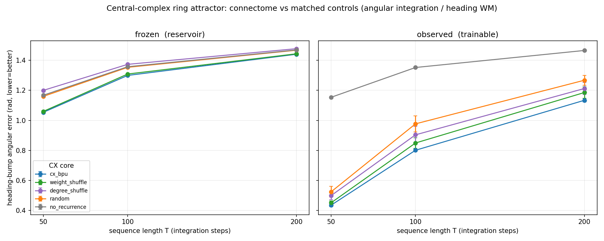

# Central-complex ring attractor: connectome vs matched controls (angular integration / heading working memory)

**The third leg of the thesis** — the region where the computation *is* the topology. The
central complex ellipsoid-body ring attractor maintains and updates a heading "bump" by
integrating angular velocity; a ring attractor's bump-maintenance emerges directly from
the connectivity (local excitation + global inhibition), so unlike the MB-on-CIFAR case
the connectome's wiring *should* matter. It does.

Repo core CX path-integration benchmark (`run_benchmark.py`), `--connectome hemibrain_cx`
(7,349 neurons / 512k edges), `--task cx_polar_bump`, `--comparison structure`
(`cx_bpu` vs degree/weight-matched `random`, `degree_shuffle`, `weight_shuffle`, and a
`no_recurrence` floor), `--train-recurrent frozen` and `observed` (trainable, support
preserved), 3 seeds. Metric: **heading-bump angular error** (rad, lower = better), the
ring attractor's decoded compass output, at sequence lengths T = 50/100/200 (more
integration steps = harder).

## Result — the connectome beats every matched control, frozen and trainable

Heading-bump angular error (rad), mean over 3 seeds; paired cx_bpu−random in σ:

**Frozen reservoir:**

| T | cx_bpu | weight_shuffle | degree_shuffle | random | no_recurrence | cx−random |
|---|---|---|---|---|---|---|
| 50  | **1.054** | 1.060 | 1.200 | 1.160 | 1.167 | −0.106 (27σ) |
| 100 | **1.299** | 1.309 | 1.373 | 1.353 | 1.357 | −0.054 (21σ) |
| 200 | **1.441** | 1.444 | 1.478 | 1.467 | 1.469 | −0.027 (23σ) |

**Trainable (observed — one weight per edge, ring support preserved):**

| T | cx_bpu | weight_shuffle | degree_shuffle | random | no_recurrence | cx−random |
|---|---|---|---|---|---|---|
| 50  | **0.435** | 0.451 | 0.499 | 0.524 | 1.154 | −0.089 (3.3σ) |
| 100 | **0.801** | 0.850 | 0.904 | 0.977 | 1.352 | −0.176 (3.7σ) |
| 200 | **1.134** | 1.186 | 1.212 | 1.268 | 1.466 | −0.134 (6.1σ) |

## Findings

1. **The connectome wins on its native attractor task — frozen and trainable.** `cx_bpu`
   has the lowest heading error at every T in both modes, significant at every point
   (frozen 21–27σ; trainable 3–6σ). This is exactly where the MB-on-CIFAR test showed
   nothing: the ring-attractor computation is implemented by the connectivity, so the
   wiring carries a real advantage.

2. **It's the topology.** `weight_shuffle` (keeps the connectome's exact wiring, permutes
   the weights) is the runner-up at every point and tracks `cx_bpu` closely; `random` and
   `degree_shuffle` (which break the wiring) are worse. The ring structure — not the
   specific weight values — is what the attractor needs. (Contrast the MB continual-
   learning result, where the specific *weights* carried the retention advantage.)

3. **Recurrence is essential.** `no_recurrence` collapses to ~1.15–1.47 at all T (it cannot
   maintain a bump), confirming the task genuinely requires attractor dynamics.

4. **Trainable helps here (opposite of MB continual learning).** Training the core nearly
   halves the error (cx_bpu 0.435 vs frozen 1.054 at T=50) and *keeps* the connectome
   advantage — because this is a single continuous task whose ring support is preserved
   under `observed` training, so tuning refines the attractor rather than overwriting
   memories. In MB continual learning (many sequential tasks) the reverse held: frozen
   wins, because there the challenge is protecting weights from cross-task overwriting.
   The frozen-vs-trainable verdict tracks task structure, not the region.

## The thesis, now three-for-three

The fly connectome beats matched-random controls exactly when the task matches the
computation its topology implements:

| region | native task | connectome vs random |
|---|---|---|
| optic lobe | optic flow | connectome wins (`outputs/flywire_optic_lobe_flow_*`) |
| mushroom body | odor→valence **continual** learning | connectome wins, ~10σ (`docs/results/cl_associative_mb/`) |
| **central complex** | **angular integration / heading WM** | **connectome wins, frozen & trainable (this dir)** |
| mushroom body | Split-CIFAR (non-native) | tie — the control case |

Run: `outputs/cx_structure_polar_{frozen,observed}/` · hemibrain CX · 3 seeds · both GPUs.
