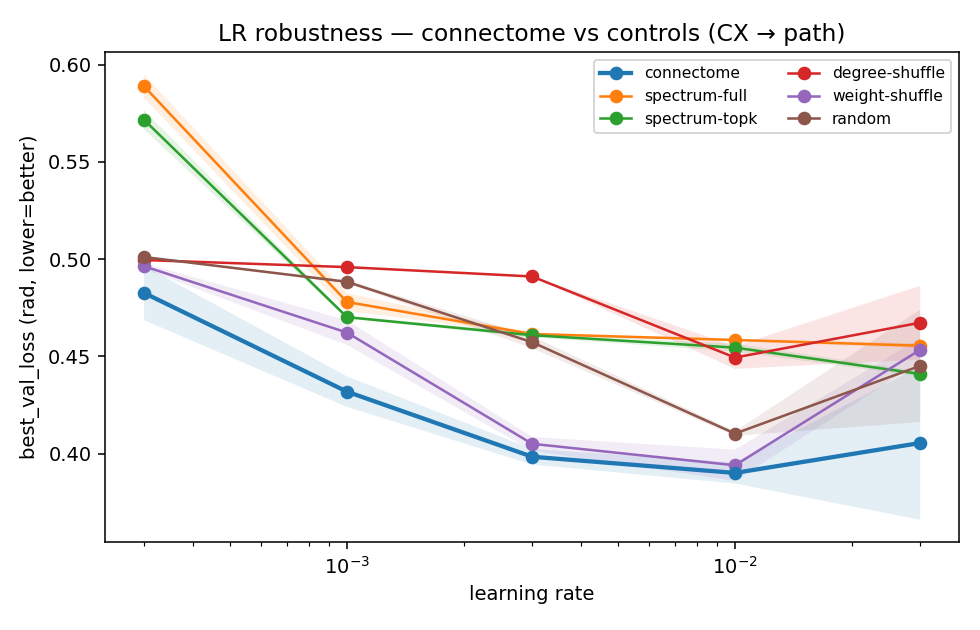
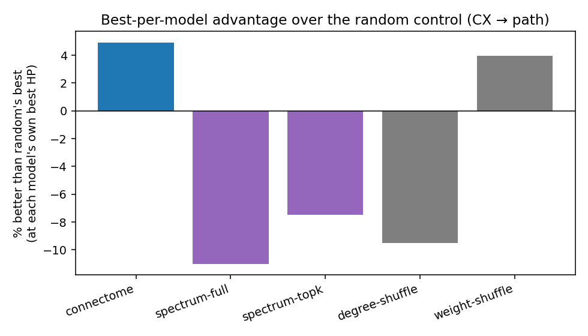

# HP + spectrum-matched-control sweep — CX → path integration

Primary metric: `best_val_loss` (radians, **lower = better**). 198 completed cells; seeds aggregated by mean.

## Best per model (each model at its OWN best hyperparameters)

| model | best metric | lr | rho | wd | K | % better than random |
|---|---|---|---|---|---|---|
| connectome | 0.3901 | 1e-02 | 0.95 | 0e+00 | 3 | +4.9% |
| spectrum-full | 0.4555 | 3e-02 | 0.95 | 0e+00 | 3 | -11.0% |
| spectrum-topk | 0.4410 | 3e-02 | 0.95 | 0e+00 | 3 | -7.5% |
| degree-shuffle | 0.4494 | 1e-02 | 0.95 | 0e+00 | 3 | -9.5% |
| weight-shuffle | 0.3940 | 1e-02 | 0.95 | 0e+00 | 3 | +4.0% |
| random | 0.4103 | 1e-02 | 0.95 | 0e+00 | 3 | +0.0% |

## How much of the connectome advantage is dynamical (spectral)?

- connectome best: **0.3901**, random best: **0.4103**, spectrum-full best: **0.4555** (rad).
- random→connectome gap = +0.0202; matching the FULL eigenvalue spectrum (random eigenvectors) closes **-224%** of it.
- Interpretation: a large fraction ⇒ the advantage is substantially the connectome's *dynamics* (spectrum), capturable by a dynamically-matched surrogate; a small fraction ⇒ the advantage lives in the eigenvectors (specific wiring), beyond the spectrum.

## Not a convenient LR regime

- Connectome beats random at **5/5** of the swept learning rates (matched LR, mean over seeds).
- At each model's OWN best LR, connectome=0.3901 vs random=0.4103 → **+4.9%**.

## Figures

