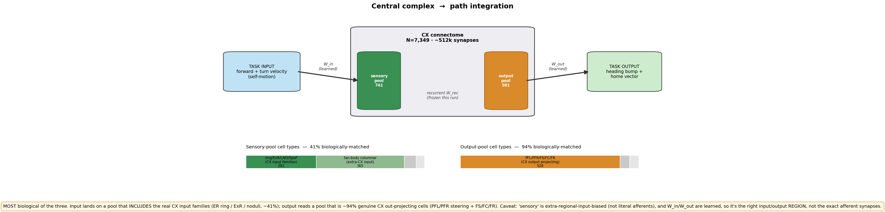
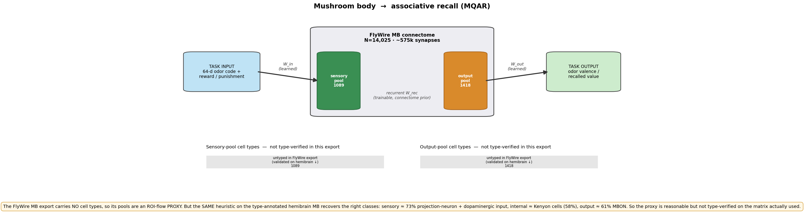
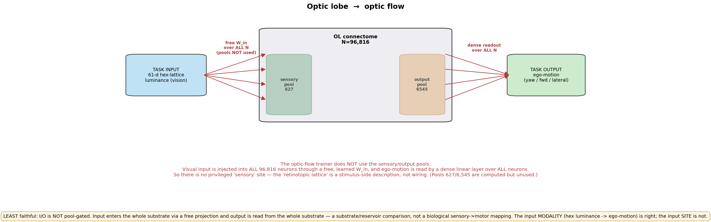

# Are the model's inputs/outputs appropriate? (per region)

**Question:** is the data flowing into the model "sensory" — i.e. does it enter at the region's
biological input neurons — and are the outputs read from reasonable output neurons?

**Mechanism.** The model injects the task input ONLY into a **sensory pool** of neurons and reads
the output ONLY from an **output pool** (`src/models.py`, `index_add`/`index_select`); the recurrent
substrate in between is the connectome. So the whole question reduces to: *how biological are those
two pools?* The pools are assigned by an **extra-regional synapse-flow heuristic** (`src/pools.py`):
a neuron is "sensory" if it receives most of its input from *outside* the region's ROIs, "output" if
it sends most of its output outside. That is a connectivity proxy, **not** a cell-type label. Figures
below show, per region, how well that proxy lands on the region's real input/output cell classes.
Numbers from [`pool_fidelity/`](../pool_fidelity/) (`scripts/figures/plot_io_appropriateness.py`).

> The connectome and ALL its controls use the *same* pools, so the connectome-vs-control result is
> invariant to this — these caveats bear on the *biological interpretation* of the I/O, not on the win.

## Central complex → path integration  (most faithful)

Input (self-motion velocity) lands on a pool that **includes the real CX input families** (ER ring /
ExR / noduli, ~41% of typed); output is read from a pool that is **~94% genuine CX out-projecting
cells** (PFL/PFR steering + FS/FC/FR). Right input/output *region* — though "sensory" is
extra-regional-input-biased, not the literal afferent synapses, and W_in/W_out are learned.

## Mushroom body → associative recall (MQAR)  (proxy, validated on a sibling)

The FlyWire MB export has **no cell types**, so its pools are an ROI-flow proxy. But the *same*
heuristic on the type-annotated **hemibrain** MB recovers the right classes: sensory ≈ 73%
projection-neuron + dopaminergic (odor + reinforcement) input, internal ≈ Kenyon cells (58%), output
≈ 61% MBON. Reasonable, but not type-verified on the matrix actually used.

## Optic lobe → optic flow  (least faithful: I/O not pool-gated)

The optic-flow trainer **does not use the pools at all** — visual input is injected into ALL 96,816
neurons via a free learned W_in, and ego-motion is read by a dense linear layer over ALL neurons. So
there is no privileged "sensory" site; the "retinotopic lattice" is a stimulus-side description, not
wiring. It's a substrate/reservoir comparison. The input *modality* is right; the input *site* is not.

**Bottom line.** Output modalities are biologically appropriate for all three regions, and the input
*site* is genuinely input-side for the CX, a validated proxy for the MB, and not pool-gated for the
OL. Across the board, "sensory" means "extra-regional-input-biased," not "sensory-organ afferent."
