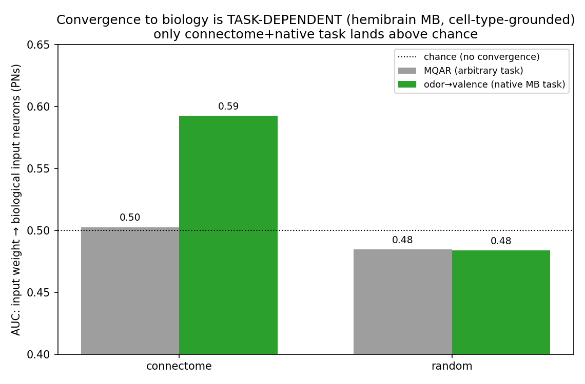
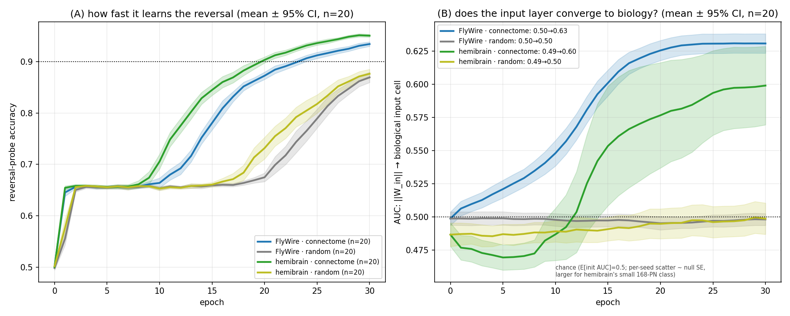
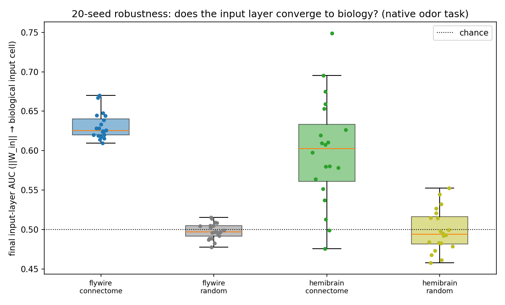
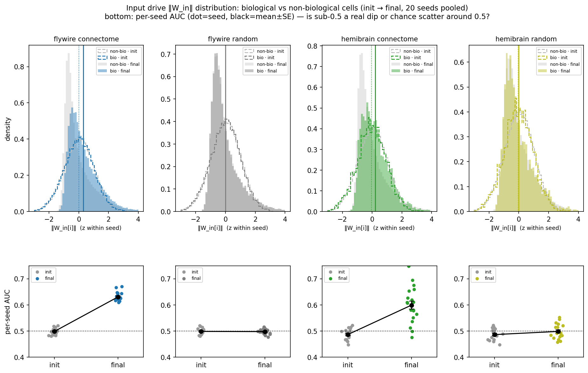

# Does an MQAR/associative network *converge to biology*? (MB connectome, input-layer + dynamics)

## TL;DR — the effect
Build a recurrent network whose recurrent matrix **is** the mushroom-body (MB) connectome (trainable),
give it a **free** input projection `W_in` (every neuron gets a *random* input weight, with **no**
built-in link to which neurons are the biological input cells), and train it. **On the MB's *native*
task (odor→reward with reversals), the network spontaneously rotates its initially-random input
projection onto the connectome's real biological input neurons — the projection neurons (PNs) — *as it
learns the task*.** The input layer's alignment to PNs rises from chance (AUC ≈0.49 at n=20; 0.50 in expectation) to **0.60**, the
connectome learns the task **~2× faster** than a random-wired control, and the alignment **tracks the
learning curve** (it rises exactly when the task is being mastered).

**It is task-dependent.** On an *arbitrary* task (MQAR, random key→value recall) the same network shows
**no** cell-type-grounded convergence (PN-AUC stays 0.50). And a **random-init** control never converges
on either task. So convergence to biology emerges **only when the connectome *and* the task line up** —
the connectome's wiring makes the biological input pathway the path of least resistance for gradient
descent, but only when the task actually needs that pathway.

*Native-task convergence, n=20 with 95% CI bands. Note the hemibrain (green) CI band is ~2.5× wider
than FlyWire (blue) at init: that is the small 168-PN positive class, not a bias — E[init AUC]=0.5
(FlyWire's larger class sits exactly there; hemibrain's 20-seed batch rolled to 0.487 and regresses to
0.4996 by 500 seeds). The early green dip to ~0.47 is a real transient (input transiently routes to
KC/MBON before reorganizing onto PNs). See the baseline diagnostic below.*

## Why this is interesting
- It's a clean, **controlled** instance of "an AI rediscovers biological structure": not "any trained
  net finds biology" (the arbitrary task rules that out), not "the connectome forces biology regardless
  of task" (MQAR rules that out) — it's the **interaction** of connectome structure × matched task.
- It tells you **when** to expect convergence-to-biology: when the task matches what the circuit is
  *for*. That reframes the connectome-as-prior question — the connectome isn't a universal inductive
  bias, it's a **task-specific** one.
- The input layer **starts off-target** (random, AUC≈0.5) and **moves onto** the biological cells — so
  it is genuine convergence during training, driven by the recurrent connectome acting as a "magnet"
  for the input projection.

## Methodology (precise)
**Model** (`AssociativeRNN` / `MatrixEpisodicRNN`, free I/O — *not* pool-gated):
- recurrent `W_rec` = the MB connectome (N=14,025), **trainable** (sparse: ~574k edge weights train),
  rescaled to spectral radius ρ=0.95;
- input projection `W_in` ∈ ℝ^{N×input_dim}, **randomly initialized over all N neurons** (the thing
  under test — does it find the biological input cells?);
- linear readout; ReLU; per-timestep `h ← ReLU(h·W_recᵀ + xₜ·W_inᵀ + b)`.

**Two tasks** (the key axis):
- **MQAR** — arbitrary key→value recall (vocab 32, 8 pairs / 8 queries, 200 epochs). The MB has no
  reason to be specialized for this.
- **odor→valence associative reversal** — the MB's *native* function (learn odor valences, relearn
  after a reversal; 30 epochs). Here the biological circuit *is* the right solution.

**Two connectomes** (proxy vs cell-type-grounded):
- **FlyWire MB** — no cell-type labels → "biological input cells" = the connectivity-defined **sensory
  pool** (a proxy).
- **hemibrain MB** — has cell types → "biological input cells" = the actual **projection neurons (PNs)**,
  the odor-input pathway. *This is the trustworthy biology test.*

**Control:** connectome-init vs **random-init** (`random_sparse`: same edge count + same weight values
as the connectome, scattered at uniformly random positions — Erdős–Rényi-style; **not** degree-matched).

**Measurements** (snapshot `W_in` over training; save the full trained model):
1. **Learning speed** — epochs to reach 0.9 reversal accuracy (connectome vs random).
2. **Input-layer convergence** — per neuron, ‖`W_in`[i]‖ = input weight received; scored as the
   **ROC-AUC** with which ‖`W_in`‖ predicts "is this a biological input cell" (0.5 = no relationship,
   1.0 = input goes exactly to the biological cells), measured **init → final**.
3. **Recurrent fingerprint** — (a) weight preservation `corr(|W_rec_final|, |W_rec_connectome|)`; (b)
   reconstruct the trained net, run task inputs, and correlate per-neuron **activation-RMS** (dynamical
   importance) with **biological hub-strength**.

Seeds: native task **20/condition** (FlyWire+hemibrain × connectome+random; main figure + Robustness
section); MQAR 1–2.

## Results
**Input-layer AUC (‖W_in‖ → biological input neurons), init → final:**
| condition | **MQAR** (arbitrary) | **native odor task** |
|---|---|---|
| hemibrain · connectome (**PNs, cell-type-grounded**) | **0.50 → 0.50** (null) | **0.49 → 0.60** ✅ (n=20) |
| hemibrain · random | 0.50 → 0.48 | 0.49 → 0.50 (n=20) |
| FlyWire · connectome (sensory *proxy*) | 0.50 → 0.60 | 0.50 → 0.63 |
| FlyWire · random | 0.50 → 0.51 | 0.50 → 0.50 |

**Learning speed (epochs to 0.9 reversal acc, native task):** connectome **19–21**; random **never**
reaches 0.9 in 30 epochs (final ~0.84–0.88). The connectome breaks from the plateau ~10 epochs earlier.

**Timing:** the input→PN alignment (hemibrain) stays flat until ~epoch 18, then **rises sharply exactly
as accuracy crosses 0.9** — convergence is *driven by* learning the task, not a static init artifact.

**Robustness (n=20 seeds).** Not seed-luck — 20 seeds per condition, paired (connectome vs random on
the *same* seeds), final input-layer AUC:

| condition | final AUC (mean ± std, n=20) | seeds > chance | connectome vs random (paired) |
|---|---|---|---|
| **hemibrain connectome** (PNs) | **0.599 ± 0.066** | **18/20** | Δ +0.100, conn>rand **18/20**, t **p=1.1e-5**, Wilcoxon p=3.6e-5 |
| hemibrain random | 0.499 ± 0.026 | 7/20 | — |
| **FlyWire connectome** | **0.631 ± 0.016** | **20/20** | Δ +0.133, conn>rand **20/20**, t **p=2.3e-18** |
| FlyWire random | 0.498 ± 0.010 | 8/20 | — |

The connectome converges above chance in essentially every seed (20/20 FlyWire, 18/20 hemibrain) and
beats its paired random control in 18–20 of 20 seeds — **highly significant even on the strict
cell-type-grounded hemibrain test (p≈3×10⁻⁵)**. Random sits at chance (0.498–0.499) throughout, and
the connectome reaches 0.9 reversal accuracy in a median ~20 epochs while random never does.

### Underlying distributions (what the AUC is summarizing)
The AUC just compresses a distribution shift. Below: per-neuron input drive `‖W_in[i]‖` (z-scored
within seed), split into **biological input cells** (colored) vs **all other neurons** (grey),
**init** (dashed) → **final** (filled), pooled over 20 seeds; bottom row = each seed's AUC init→final.
In the connectome conditions the **biological cells' distribution shifts right** after training (they
end up receiving more input drive); in the random controls init and final overlap — no shift.

**Why some AUC curves sit slightly below 0.5 (it's the baseline, and it's benign).** Per-seed AUC
tested against 0.5 (n=20):

| condition | init AUC (mean±SE) | final AUC | init vs 0.5 |
|---|---|---|---|
| flywire connectome | 0.4987 ± 0.0026 | **0.6308** | p=0.62 (= chance) |
| flywire random | 0.4987 ± 0.0026 | 0.4980 | p=0.62 (= chance) |
| hemibrain connectome | 0.4866 ± 0.0045 | **0.5990** | p=0.008 |
| hemibrain random | 0.4866 ± 0.0045 | 0.4986 | p=0.008 |

Sub-0.5 only ever appears at the **init baseline** and in the **random control** (which never leaves
it) — never in the connectome's trained value (0.60–0.63). The init `W_in` is drawn
`uniform(-1/√input_dim, +1/√input_dim)` **identically for every neuron**, with no dependence on cell
identity, so **E[init AUC] = 0.5 exactly** — there is no mechanism for a per-neuron bias (confirmed:
the across-neuron spread of the 20-seed-mean init norm, 0.00710, matches the iid prediction
`std/√20 = 0.00708`).

The hemibrain init lands at 0.4866 (p=0.008) only because that is a **finite-sample fluctuation of the
20 specific seeds**: the positive class is small (168 PNs) so per-seed AUC has a wide SE, and that batch
happened to fall ~3σ low. Re-instantiating the *identical* init over more seeds regresses it straight to
chance — 20→0.487, 50→0.497, 100→0.498, **500→0.4996 (95% CI 0.498–0.502)**. FlyWire's larger positive
set already sits at 0.4987 at n=20. Either way it is **identical in the connectome and random arms at
init, so it cancels in the paired test** (we report connectome − paired random, Δ≈+0.10) and is ≈8×
smaller than the +0.11 training signal. Not anti-biological — just an under-sampled baseline that is
exactly 0.5 in expectation.

## What did *not* converge (honest scope)
- **Recurrent weights**: scrambled on both tasks — `corr(|final|,|init|) ≈ 0`. The biological *wiring*
  is not preserved; only the **input layer** (plus weak functional activity: FlyWire act↔hub ρ=0.24 vs
  random 0.15) finds biology.
- **MQAR**: no cell-type-grounded convergence (the FlyWire proxy's spurious 0.60 is an artifact of the
  coarse sensory pool; the PN test is the real one → null).
- **random-init**: never converges, any task, any layer.

## Caveats
- The effect is **modest** (AUC ≈ 0.6, not 0.9) and at the **input layer only**; the recurrent wiring
  does not converge.
- **n=20 seeds** on the native task — the effect is robust (connectome beats its paired random control
  in 18–20 of 20 seeds; see *Robustness* above). The hemibrain distribution is wider (2 of 20 seeds sit
  near chance, hence std 0.066), but the paired test is highly significant (p≈3×10⁻⁵).
- The control is **ER-random, not degree-matched** — so "is the convergence driven by the connectome's
  *hub structure* or its *specific wiring*?" is **open**. The clean next control is a **degree-matched**
  random init: if it also converges, it's hubs; if only the full connectome does, it's the wiring.
- "Biology" for FlyWire is a connectivity proxy (coarse, gives false positives); trust the **hemibrain
  PN** (cell-type) result.

## Reproduce
Train+snapshot: `scripts/mqar/run_mb_biology_convergence.py` (MQAR) /
`scripts/associative/run_mb_biology_convergence_assoc.py` (native task) — one (matrix, model, seed) per
invocation, over `connectomes/{flywire,hemibrain}_mushroom_body*`. Analysis:
`scripts/figures/plot_mb_biology_assoc.py` (learning curves + input convergence),
`scripts/figures/plot_mb_recurrent_fingerprint.py` (#1 weight preservation + #2 functional fingerprint).
