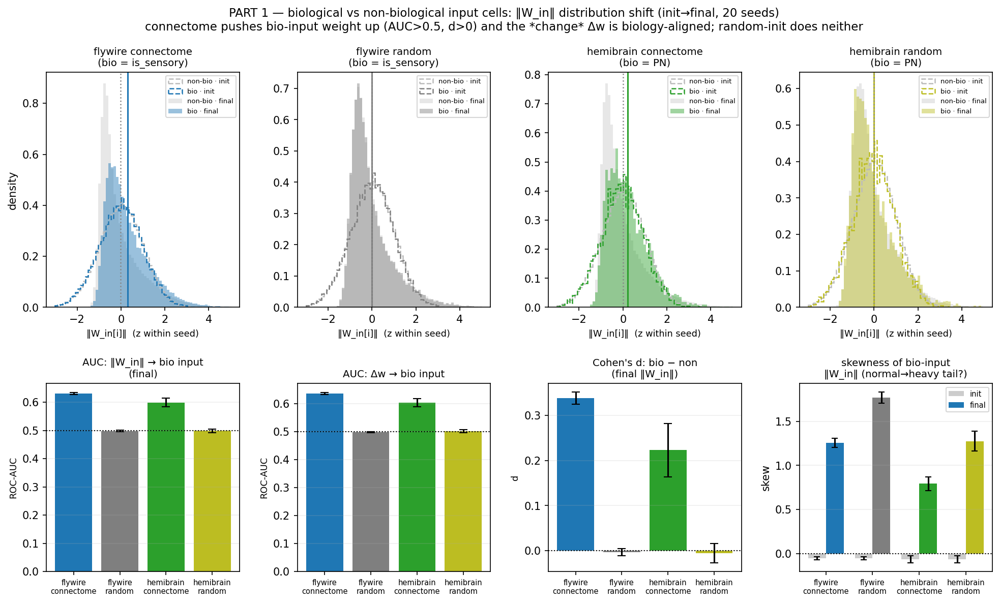
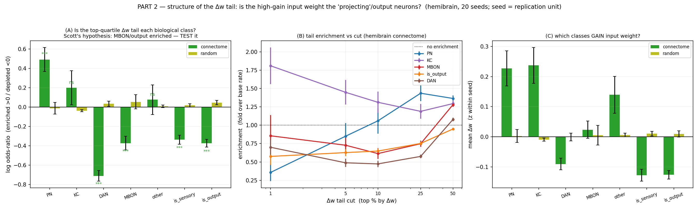
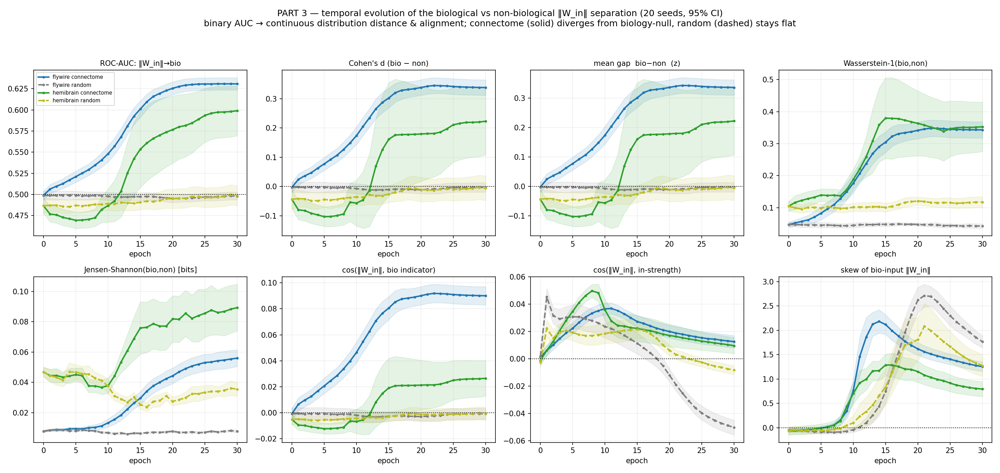

# Input-layer ‖W_in‖ weight *dynamics*: distribution shape, the Δw tail, and temporal evolution

Extends the binary "does ‖W_in‖ classify biological input cells? (ROC-AUC)" result into three
richer analyses. Per neuron `w[i] = ‖W_in[i]‖` (L2 of its input-projection row = how
much task input it receives); `Δw[i] = w_final[i] − w_init[i]`. All computed from the **saved
`win_snapshots`** (epochs 0→30, 20 seeds × {flywire, hemibrain} × {connectome, random}) — **no
retraining**. `bio_input = PN` (hemibrain, cell-typed) or the `is_sensory` pool (flywire).

Reproduce: `python scripts/figures/plot_mb_biology_weight_dynamics.py`
→ `weight_dynamics_part{1,2,3}.png` + `weight_dynamics_stats.json`.

## Part 1 — bio vs non-bio input cells as *distributions*, not just AUC

The connectome pushes biological-input cells' input weight **up** relative to non-inputs, and the
*change itself* (Δw) is biology-aligned; the degree-matched random control does neither (mean ± SE, n=20):

| condition | AUC(w_final) | AUC(Δw) | Cohen's d (final) | conn−rand (AUC), p |
|---|---|---|---|---|
| flywire connectome | **0.631** ± .004 | **0.637** | **+0.34** | +0.133, 7e-25 |
| flywire random | 0.498 | 0.499 | −0.00 | — |
| hemibrain connectome | **0.599** ± .015 | **0.604** | **+0.22** | +0.100, 2e-06 |
| hemibrain random | 0.499 | 0.502 | −0.01 | — |

- AUC(Δw) ≈ AUC(w_final): the biological signal is in *where the weight moves during training*, not a
  pre-existing init bias (init AUC ≈ 0.50; hemibrain's 0.487 is the small 168-PN class, not a real dip).
- **Caveat — the heavy tail is generic, not biological.** Both groups' ‖W_in‖ go from ~normal at init
  (skew ≈ 0) to right-skewed at final, and the *random* control is **more** skewed (bio-group skew:
  flywire 1.25 conn vs **1.77** rand; hemibrain 0.79 vs **1.28**). So "init-normal → final-heavy-tail"
  is a property of trained W_in in general. What is biology-specific is the **shift** of the bio group
  relative to non-bio (the AUC / Cohen's d / mean-gap), *not* the tail's existence.

## Part 2 — the high-Δw tail is the *input* pathway, **not** the projecting/output neurons

Scott's hypothesis was that the high-weight tail corresponds to projecting neurons (MBONs/PNs). Tested
directly on hemibrain cell types (top-quartile Δw; per-seed Haldane log-odds, one-sample t vs 0 — seed
is the replication unit, so the fixed labels aren't pseudoreplicated):

| class | role | fold-enrichment in tail | log-OR, p |
|---|---|---|---|
| **PN** | input pathway | **1.63×** | +0.49, 9e-04 ✓ enriched |
| KC | intrinsic | 1.22× | +0.20, 0.27 (ns) |
| other | — | 1.08× | ns |
| MBON | **output/projecting** | **0.69×** | −0.37, 5e-05 ✗ depleted |
| is_output pool | **output/projecting** | **0.69×** | −0.37, 2e-08 ✗ depleted |
| DAN | reinforcement input | 0.49× | −0.71, 6e-11 ✗ depleted |
| is_sensory pool | input pool (heuristic) | 0.71× | −0.34, 6e-07 ✗ depleted |

**The hypothesis is refuted.** The Δw tail is enriched for **PN (the odor-input projection neurons)**
and loses the **output/projecting side (MBON, is_output) and DAN**. This matches the "single input
magnet on the PN hub" picture — gradient descent routes free input weight onto the input pathway, not
the output neurons. Two nuances:
- **PN ≠ the flow-based `is_sensory` pool.** PN (cell type) is enriched; the broader `is_sensory` pool
  (582 cells, only 100 of them PN) is *depleted*. The tail is specifically the PN cell type, not the
  extra-regional input-pool heuristic.
- **The extreme tip is KCs, not PNs** (panel B). At the top **1%** by Δw, KC ≈ 1.8× while PN ≈ 0.35×;
  PN enrichment appears at moderate cuts (top 25%, 1.4×). So PNs shift up *as a group* (→ AUC 0.60);
  the handful of extreme-gain neurons are Kenyon cells. Mean Δw (panel C): PN & KC gain, is_output &
  DAN lose, MBON ≈ neutral. Random control is flat (~1.0×) for every class.

> flywire has no cell types, so only its flow pools can be scored — there *both* `is_sensory` (1.8×) and
> `is_output` (1.4×) look enriched, but without types they can't separate input from output. The
> cell-typed hemibrain result above is the biologically interpretable one.

## Part 3 — temporal: binary AUC → continuous distribution distance & alignment

Per-snapshot bio-vs-non separation over the 31 checkpoints (connectome solid, random dashed, 95% CI):

- **AUC, Cohen's d, mean-gap** all rise for the connectome (to 0.60–0.63 / +0.22–0.34) and stay flat
  at the null for random. The **hemibrain connectome shows an early transient *below* chance** (AUC dips
  to ~0.47, d to −0.10 around epoch 5) before climbing onto PNs — input is transiently misrouted, then
  reorganizes. The separation tracks training, converging by ~epoch 20.
- **Wasserstein-1 and Jensen-Shannon** (distribution *distance*, not just ordering) rise for the
  connectome. Note these have a **positive finite-sample floor** — visible as the random control sitting
  at ~0.11 Wass / ~0.035 JS (worse for the small 168-PN class) rather than 0 — so read the
  **connectome − random gap**, not the absolute value. AUC/Cohen's d have clean nulls (random ≈ 0.50 / 0).
- **Alignment is to PN *identity*, not to hub degree.** `cos(‖W_in‖, bio-indicator)` rises for the
  connectome; `cos(‖W_in‖, in-strength)` (connectome centrality) stays weak (~0.01) and even decays,
  confirming the input weight converges onto the biological input *cell type*, not merely onto
  high-in-degree hubs.

## Bottom line
The connectome-init network moves its free input projection onto the biological **input** pathway (PN)
as it learns — measurable as a distribution shift (AUC/Cohen's d), a genuine distributional divergence
(Wasserstein/JS) that grows over training, and a Δw tail that is PN+KC (input+intrinsic). It does **not**
route input weight onto the projecting/output neurons (MBON/DAN/output pool are depleted), so the
"tail = projecting neurons" hypothesis does not hold. The degree-matched random control does none of it.
