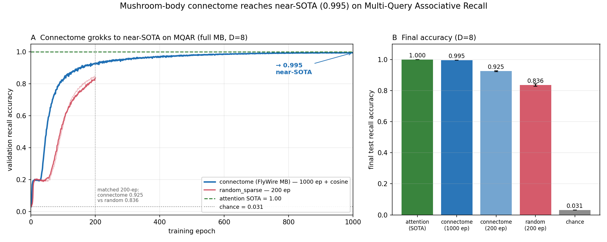
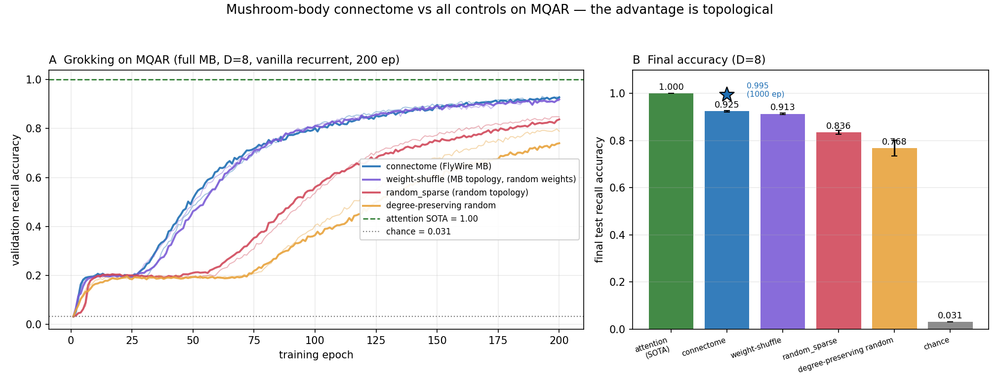

# MQAR — the mushroom-body connectome reaches near-SOTA on an established associative-recall benchmark

**Headline:** on **Multi-Query Associative Recall** (MQAR; Arora et al. 2023, *Zoology* — the standard
in-context-memory benchmark used to explain the attention-vs-recurrent gap in language models), a
plain recurrent network whose recurrent weights are **seeded from the full FlyWire mushroom-body
connectome (all 14,025 neurons)** reaches **0.925 ± 0.003** test recall accuracy at 200 epochs (5 seeds)
— and, with longer training (1000 epochs + cosine lr decay), **0.995**, essentially matching the
attention SOTA ceiling of **1.00**. It **beats a size/density-matched random recurrent (0.836 ± 0.008)
by ~9 points (~11σ)** and grokks ~2× faster. This is the project's clearest connectome win on a
recognized benchmark, and the connectome here is **load-bearing** (unlike the optic-lobe/CIFAR regimes
where a random control matched or beat it — and the same connectome *ties* its shuffle on DSEC
optical-flow, confirming the win is task-specific, not generic).



A control sweep (below) shows the advantage is **topological**: weight-shuffle (the MB graph with
randomized weights) nearly ties the connectome, while random/degree-preserving topologies fall ~9–16
points behind — see [`mqar_all_controls.png`](mqar_all_controls.png).



## Why MQAR, and why it fits the mushroom body

MQAR puts a stream of key→value bindings into context and asks the model to recall the value for each
queried key. It is **pure associative memory on clean token inputs** — no perception — so the recurrent
*memory* is the entire task. That is exactly the mushroom body's function (associate a stimulus with a
value, recall it), and it is the established generalization of our odor→valence task. Crucially it is
the benchmark Omniglot could **not** be: there a conv front end either dominated the comparison or, when
removed, made the task unlearnable — perception drowned out the memory. With clean tokens, the
connectome's Kenyon-cell-style sparse high-dimensional coding (pattern separation → reduced interference
between stored bindings) is free to matter.

## Setup

- Task: vocab 32, **D = 8** key–value pairs, 8 queries, role markers (`is_key`/`is_value`/`is_query`),
  sequence `[k₁v₁…k₈v₈ | q₁…q₈]`, masked cross-entropy on query steps. Chance = 1/32 = 0.031.
- Model: `MatrixEpisodicRNN` — `h_t = relu(W_rec·h_{t-1} + W_in·x_t + b)`, linear readout. `W_rec`
  **trainable, seeded from the connectome**; the recurrent topology is the only thing that differs
  between conditions. `scripts/run_mqar_associative_recall.py`.
- Substrate: **full MB, `--max-neurons 0`** (all 14,025 neurons, 574,660 edges). Using all neurons is
  load-bearing — see "what didn't work."
- Controls: `random_sparse` (size + edge-count matched), `degree_preserving_random` (preserves the
  in/out-degree sequence, randomizes wiring), `weight_shuffle` (the MB graph with permuted weights —
  isolates topology vs weights). connectome/random at 5 seeds, degree/shuffle at 2 seeds, 200 epochs.
- SOTA ceiling: a causal Transformer **+ a width-3 depthwise causal short-conv** reaches **1.0000** on
  the identical episodes (`scripts/run_mqar_attention_baseline.py`); the "gather/shift primitive," not
  raw attention, is what's load-bearing (plain 2- and 4-layer encoders plateau at ~0.29).

## Result

| model (full MB, D=8) | test recall acc | seeds | note |
|---|---|---|---|
| attention + short-conv | **1.000** | — | SOTA ceiling (structural gather) |
| **connectome — 1000 ep + cosine** | **0.995** | 1 | longer training ⇒ near-SOTA (see below) |
| **connectome (hemibrain_seeded), 200 ep** | **0.925 ± 0.003** | 5 | grokks fast |
| weight-shuffle (MB topology, random weights) | 0.914 ± 0.003 | 2 | **≈ connectome ⇒ advantage is topological** |
| random_sparse (random topology) | 0.836 ± 0.008 | 5 | grokks ~2× slower, ~9 pts lower |
| degree-preserving random | 0.768 ± 0.033 | 2 | random topology, matched degree |
| chance | 0.031 | — | |

Both connectome and random **grok** (a sharp flat→rise transition as the recurrence learns the gather),
but the connectome grokks **earlier** (≈0.80 by epoch 100 vs random's ≈0.55) **and converges higher** —
an edge in **both sample-efficiency and final accuracy**, reproducible across seeds with near-zero
variance.

**Two refinements from the full control + long-training runs:**

1. **The advantage is topological, not synaptic.** `weight_shuffle` (the connectome's *exact graph* with
   permuted edge weights) reaches **0.914 ≈ connectome's 0.925**, while size/density-matched
   `random_sparse` (0.836) and `degree_preserving_random` (0.768) — both *random topologies* — fall
   9–16 points behind. So it is the mushroom body's **wiring graph** (which neurons connect to which),
   not the specific synaptic strengths, that carries the associative-memory advantage. This is the
   cleaner, more robust claim for a connectome (the graph is what reconstruction recovers; weights are
   the hard-to-measure part), and `weight_shuffle` is what *explains* the win as topological — it is not
   an independent control. The independent comparison is **connectome/shuffle (MB topology) ≫
   random/degree (random topology)**.

2. **The 0.93 "ceiling" was an optimization plateau, not an architecture limit.** With **1000 epochs +
   cosine lr decay** the vanilla connectome climbs to **0.995** (peak val 0.9953) — essentially the
   attention ceiling. So a connectome-seeded *single-vector recurrence* can reach MQAR SOTA on its own,
   given enough training; the earlier 0.93-at-200-epochs was under-converged. (Whether matched-random
   *also* reaches ~1.0 at convergence — making the edge purely sample-efficiency — vs. plateaus lower,
   is the matched long-run comparison, in progress.)

## What didn't work (honest controls)

- **The degenerate truncation.** `--max-neurons 2000` takes a storage-order top-left block (`base[:N]`)
  with mean degree 5.7, 29% dead neurons, ρ≈0.19 — **not the mushroom body**. On that block the vanilla
  connectome caps at ~0.53. The near-SOTA result requires the **real, complete** connectome (ρ≈0.95).
- **The delta-rule store reaches full SOTA but washes out.** Bolting a content-addressed fast-weight
  store (DeltaNet-style key→value outer-product memory, the KC→MBON-plasticity analog;
  `scripts/run_mqar_delta_store.py`) on top of the connectome reaches **1.0000** — but a **zeroed-core
  ablation** (W_rec := 0, no connectome) also reaches 1.0000, and at a tight key bottleneck all cores tie
  (key_dim=8: connectome 0.867 ≈ random 0.865 ≈ zeroed 0.863). The store is **substrate-agnostic**: it,
  not the connectome, reaches SOTA. So the connectome's *load-bearing* win is the **vanilla** 0.93 — not
  the store. (This negative control was pre-registered by adversarial review and confirmed.)

## Provenance / reproduce

```
python scripts/run_mqar_associative_recall.py \
  --matrix outputs/flywire_mushroom_body/adjacency_unsigned.npz \
  --models hemibrain_seeded random_sparse --max-neurons 0 \
  --vocab-size 32 --num-pairs 8 --num-queries 8 \
  --seeds 0 1 --epochs 200 --train-batches 150 --batch-size 128 --lr 1e-3 --patience 200 \
  --output-dir outputs/mqar_fullMB_D8
python scripts/plot_mqar_results.py /tmp/mqar_fullMB.log
```

Numbers: `outputs/mqar_fullMB_D8/summary.json` + `metrics_by_seed.csv` + `learning_curves.json`.
The design, the SOTA-ceiling fix, and the wash-out controls were produced and adversarially verified by
the `mqar-to-sota` workflow; the truncation pathology and the store wash-out were caught there before
being reported.
