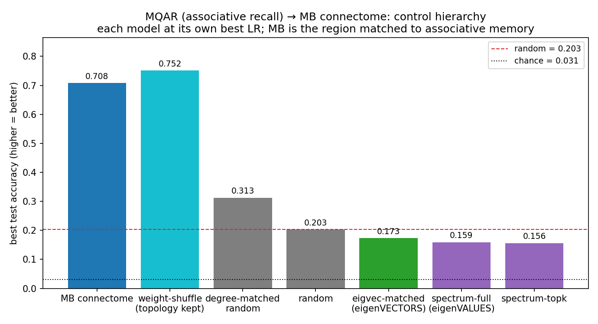

# MQAR (associative recall) → MB connectome: is it the topology, the weights, or the spectrum?

## Bottom line (read this first)
Same **three** things you could transfer from a connectome — **topology** (the wiring graph),
**eigenvalues** (the dynamics/rates), **eigenvectors** (the geometry). For associative recall, the
one that matters is **topology**. Higher accuracy = better (chance = 0.03):

| rank | starting matrix encodes… | accuracy | does it help? |
|---|---|---|---|
| 🥇 | the wiring **graph** (weights scrambled) | 0.75 | **yes — topology is the game** |
| 🥈 | the real connectome | 0.71 | yes |
| 🥉 | **degree** sequence only | 0.31 | partly |
| 4 | sparse random | 0.20 | baseline |
| 5 | **eigenVECTORS** (geometry) | 0.17 | **no — below random** (dense → graph gone) |
| 6 | **eigenVALUES** (dynamics) | 0.16 | **no — below random** |

**So:** **neither** half of a dense surrogate transfers here — eigenvectors (0.17) *and* eigenvalues
(0.16) both land *below* random. What associative recall needs is the **sparse wiring topology**:
keep the graph and scramble the weights → you still win (0.75); replace the graph with any **dense**
matrix → you fail. (This is the **mirror image of CX**, where the dense eigenvector surrogate *won*:
there the task is a low-dimensional manifold, so the eigenvectors are the computation; here the task
is a sparse graph lookup, so making it dense destroys it.) Full breakdown below.

## TL;DR
MQAR (multi-query associative recall) is the associative-memory task; the **mushroom body** is the
fly's associative-learning centre, so this is the MB's region-matched task. Running the same control
hierarchy as the CX sweep — recurrent **trainable**, each model at its own best LR, 2 seeds — the
MB connectome's large advantage is carried by its **topology (the connectivity graph), not its
synaptic weights and not its eigenvalue spectrum**:

- **Weights don't matter.** `weight_shuffle` (same graph, synaptic weights randomly permuted) scores
  **0.752**, *tying/slightly beating* the real connectome **0.708**. Shuffling the weights costs
  nothing — the advantage is in *which neurons connect*, not *how strongly*.
- **Topology beyond degree is decisive.** connectome **0.708** ≫ degree-matched random **0.313** ≫
  ER random **0.203**. The degree sequence alone buys only ~+0.11 over random; the *specific
  connectivity graph* adds **+0.40** more.
- **Neither dense surrogate helps — the spectrum *or* the eigenvectors.** Both sit **below** random:
  `eigvec_matched` (connectome eigenVECTORS, dense) **0.173**, `spectrum_full`/`topk` (eigenVALUES)
  **0.159/0.156**, vs random **0.203**. This is the **opposite of CX**: there the dense eigenvector
  surrogate was the *best* model; here it's near the *bottom*, because a dense matrix — eigenvectors
  or not — discards the sparse connectivity graph that associative recall actually runs on.

## Result (70 cells = 7 models × 5 LR × 2 seeds; test accuracy, higher = better; chance = 0.031)
| model | preserves | best test_acc | per-seed (best LR) | vs random |
|---|---|---|---|---|
| weight-shuffle | topology, weights shuffled | **0.752** | 0.761 / 0.742 | +270% |
| **MB connectome** | the real MB wiring + weights | **0.708** | 0.651 / 0.765 | +249% |
| degree-matched random | in/out degree sequence only | 0.313 | 0.434 / 0.192 | +54% |
| random (ER) | nothing | 0.203 | 0.200 / 0.206 | — |
| **eigvec-matched** | connectome eigenVECTORS, random λ (**dense**) | 0.173 | 0.173 / 0.174 | **−15%** |
| spectrum-full | connectome eigenVALUES, random vectors (**dense**) | 0.159 | 0.157 / 0.161 | −22% |
| spectrum-topk | connectome top-k eigenVALUES (**dense**) | 0.156 | 0.159 / 0.154 | −23% |

### Full LR sweep (mean over 2 seeds, test accuracy — higher = better; chance 0.031)
| model | lr=3e-4 | lr=1e-3 | lr=3e-3 | lr=1e-2 | lr=3e-2 |
|---|---|---|---|---|---|
| weight_shuffle | 0.195 | **0.752** | 0.457 | 0.169 | 0.029 |
| hemibrain (connectome) | 0.199 | **0.708** | 0.616 | 0.168 | 0.037 |
| degree_preserving_random | 0.194 | **0.313** | 0.188 | 0.125 | 0.029 |
| random_sparse | **0.203** | 0.202 | 0.196 | 0.031 | 0.029 |
| spectrum_full | **0.159** | 0.150 | 0.030 | 0.030 | 0.030 |
| spectrum_topk | **0.156** | 0.154 | 0.030 | 0.030 | 0.030 |

The topology models (connectome, weight-shuffle) peak at lr=1e-3; the connectome is the more
LR-robust of the two (it holds 0.616 at lr=3e-3 where weight-shuffle drops to 0.457). Full
per-(model,lr,seed) cells in `sweep_results.csv` (this directory).

## The clean comparisons are *within* the sparse models
The four topology models (connectome, weight-shuffle, degree, random) are all **sparse** (~574k
trainable recurrent params) — so comparing among them is density- and parameter-matched, and that is
where the headline findings live:

| comparison (all sparse, matched) | result | reading |
|---|---|---|
| connectome **vs** weight-shuffle | 0.708 vs 0.752 (tie) | **specific weights add nothing** |
| connectome **vs** degree-matched | 0.708 vs 0.313 | **topology beyond degree is most of it** |
| degree-matched **vs** random | 0.313 vs 0.203 | degree sequence alone buys a little |

### Did eigenvectors beat the connectome (fairly)? — No, on both counts
The **three dense surrogates** — `eigvec_matched` (eigenVECTORS), `spectrum_full`, `spectrum_topk`
(eigenVALUES) — are dense (~196M params, ~340× the sparse models), so comparing them to the sparse
connectome is **not** density-matched. On MQAR that confound cuts **against** them: *every* dense
surrogate lands **below** sparse random (0.173 / 0.159 / 0.156 vs 0.203) despite far more capacity —
i.e. **being dense is a *liability* here**, because it throws away the sparse graph the task runs on.

| comparison | result | reading |
|---|---|---|
| eigvec **vs** connectome | 0.173 vs 0.708 | eigenvectors **lose 4×** — but *unfairly*: connectome wins partly because it's **sparse** (keeps the graph) |
| eigvec **vs** spectrum (both **dense**, density-matched) | 0.173 vs 0.159 | the **fair** test: eigenvectors edge eigenvalues by a hair, **but both are below random** |

So unlike CX (eigvec **beat** the connectome, helped by density), here eigvec **loses** to the
connectome — and even the density-matched comparison shows the eigenvectors give only a sliver over
the eigenvalues, with neither dense surrogate clearing random. A `dense_random` MQAR control (as in
[../cx_dense_trainable](../cx_dense_trainable)) would pin "dense hurts here" exactly; the existing
dense surrogates already show its direction. **In CX density helped; in MQAR it hurts — the tasks
genuinely differ.**

## Interpretation
- **Associative recall lives in the connectivity graph.** The MB's advantage on its region-matched
  task is the *topology* — which cells wire to which — and is fully preserved when the synaptic
  weights are scrambled. This is a strong, clean version of the "associative learning is generic"
  finding: not generic-to-the-point-of-nothing (the topology beats degree-matched random 2.3×), but
  generic in the sense that the *biological weight values* are not what matters.
- **Degree is not enough.** Preserving only the in/out degree sequence recovers a minority of the
  advantage (0.313 vs the full 0.708) — the higher-order graph structure (motifs/community
  structure beyond degree) carries the rest.
- **Same spectrum verdict as CX.** Eigenvalues-with-random-eigenvectors are below random on both the
  CX path-integration task and MB associative recall — the connectome's *dynamics* are not the
  transferable part.

## Caveats
- **2 seeds.** The big gaps (topology ≫ degree ≫ random ≫ spectrum) are robust, and weight-shuffle's
  tie with the connectome holds per-seed. But the connectome (0.651/0.765) and degree-matched
  (0.434/0.192) have **high seed variance**; their exact values are soft (more seeds would tighten).
- **LR-robustness aside.** At each model's *best* LR, weight-shuffle ties the connectome, but the
  connectome holds up better at the *next* LR (lr=3e-3: connectome 0.616 vs weight-shuffle 0.457) —
  a hint that the real weights buy some LR-robustness even though they don't raise peak accuracy
  (cf. the eigenvalues→stability result in CX). Not over-claimed on 2 seeds.
- **Spectrum models are dense / not param-matched** (see above) — their sub-random score is suggestive,
  not a clean density-controlled result.

## Reproduce
`scripts/mqar/run_hp_spectrum_sweep_mqar.py --matrix connectomes/flywire_mushroom_body/adjacency_unsigned.npz
--lr-only --seeds 0 1 --epochs 200 --patience 40` (sharded 3-way; results
`outputs/runs/hp_sweep/mb_mqar/`). Summary `scripts/mqar/summarize_mqar_sweep.py`; figure
`scripts/figures/plot_mqar_spectrum_sweep.py`. Companion CX results:
[../cx_eigval_vs_eigvec](../cx_eigval_vs_eigvec), [../cx_dense_trainable](../cx_dense_trainable).
