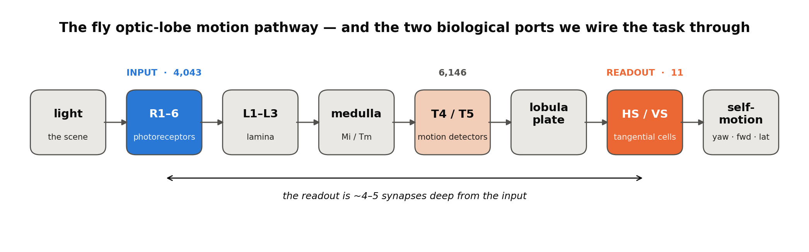
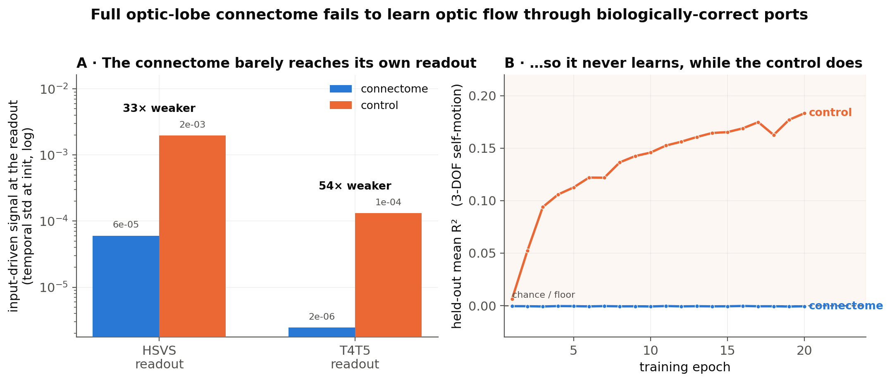
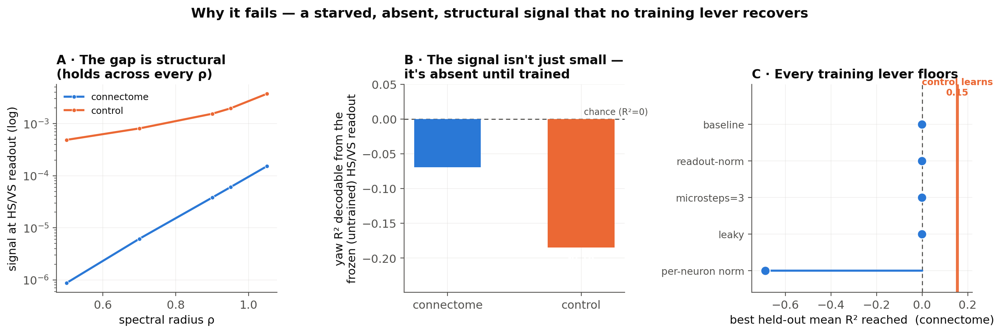

# Optic flow through biologically-correct I/O — the full optic-lobe connectome does not learn its own deep readout

*A negative result, fully diagnosed. What happens when you force a connectome model to use the fly's **real** input and output cells instead of a convenient mathematical shortcut.*

---

## TL;DR (the plain-language version)

- The fly sees the world with **photoreceptors** and reads its own self-motion (optic flow) out of a handful of wide-field **motion-integrator cells (HS/VS)** deep in the optic lobe. We wired an AI model of the **real optic-lobe connectome** (48,749 neurons, 4 million connections) to use exactly those cells as its input and output — identified from the **actual FlyWire cell types**, not guessed from the graph.
- **It couldn't learn the task.** After training, the connectome model was no better than chance, while a **scrambled (degree-matched random) version of the same wiring learned fine.**
- That sounds backwards, so we dug in. The reason is **geometry, not biology failing**: the output cells sit **~4–5 synapses deep** from the input. In an untrained network the useful signal **fades to ~1/30th** by the time it reaches them, so there's almost no gradient to learn from. The scrambled control "wins" only because randomizing the wiring accidentally creates **short-circuits** straight from input to output — it cheats the depth.
- We tried **~12 different fixes** (more processing steps, gain boosts, several kinds of normalization, leaky memory, different output cells). None got the connectome off the floor with stable training.
- **What it means:** the earlier "+12% advantage for the optic-lobe connectome on optic flow" came from letting the model read the answer off *any* of its 48k neurons. Force it to use the **real biological ports** and that advantage vanishes — because the real circuit is a *deep, learned computation*, not something a from-scratch network trivially reproduces. This sharpens the prior "the connectome is not plug-and-play for optic flow" finding, and it's the same open training problem the earlier `vis-01` run hit.

> Scope: one connectome, a from-scratch-trained recurrent net. This is a **model/training + I/O-appropriateness** result, not a claim that the fly circuit "can't" do optic flow (it obviously does — it just isn't learned from a blank slate).



---

## The question

Earlier experiments (the region×task matrix, the optic-flow data-efficiency sweep) found the **optic-lobe connectome beats a random control on optic flow — the "+12%"** — but under **generic all-neuron I/O**: the stimulus is injected into *all* neurons and the answer is read from *all* neurons. That lets the readout grab the self-motion signal off whichever neurons happen to encode it, so the specific wiring barely has to do anything. And the control there was a weak Gaussian-random null.

The rigorous follow-up — the optic-lobe analogue of the mushroom-body (exp-04) and central-complex biological-I/O experiments — is:

> **Does that advantage survive when the network must use the fly's real ports** (photoreceptors in, wide-field motion cells out), against a proper **degree-matched** control?

## What we built (the biological ports)

We assigned the input/output cells from the **actual FlyWire 783 cell-type identities** (Schlegel et al. 2024 whole-brain annotations + Matsliah et al. 2024 optic-lobe visual typing), joined by `root_id` — **not** inferred from graph source/sink structure (the repo's previous heuristic). 99.3% of optic-lobe neurons are typed. Left-optic-lobe pool sizes:

| role | pool | cell types (biology) | left-OL count |
|---|---|---|---:|
| **INPUT** (primary) | `in_R16` | R1-6 — the achromatic photoreceptor motion channel | **4,043** |
| INPUT (fallback) | `in_L123` | L1, L2, L3 — first-order lamina interneurons | 2,403 |
| **OUTPUT** (primary) | `out_HSVS` | HSN/HSE/HSS + VS1–8 — lobula-plate tangential cells (wide-field self-motion) | **11** |
| OUTPUT (wide) | `out_LPTCwide` | + H2, VST1/2, VSm | 20 |
| OUTPUT (dense-flow) | `out_T4T5` | T4a–d, T5a–d — elementary motion detectors | 6,146 |

The HS/VS cells are the textbook wide-field optic-flow readout — Krapp & Hengstenberg (1996) showed their receptive fields are *matched filters* for specific self-motion flow fields. There are only ~11 per hemisphere, which is biologically correct (a tiny, low-dimensional self-motion code) and the crux of the difficulty.

---

## The result

Wired through the real ports, the **connectome never leaves the floor** — held-out mean R² ≈ 0 (−0.001), training loss frozen — while the **degree-matched control learns** (mean R² climbs to ≈0.18, driven by forward-translation R² ≈ 0.53). This holds whether the readout is the 11 HS/VS cells *or* the 6,146 T4/T5 cells.



**Panel A** shows the root cause: at initialization the connectome delivers a **~30–60× weaker** input-driven signal to its biological readout than the control does. **Panel B** shows the consequence: no signal → no gradient → the connectome flatlines while the control climbs.

---

## Why it happens (the mechanism)



1. **The biological readout is deep** (Fig 1). HS/VS sit ~4–5 synapses from the photoreceptors. In a from-scratch RNN, the input-driven *temporal* signal — which is what encodes self-motion — decays as it propagates that deep, arriving ~30× too weak (**Fig 3A**: the gap is stable across *every* spectral radius ρ, so it's structural, not a tuning artifact).
2. **The signal must be *routed* by training, but the gradient to do so is starved.** Self-motion is **not linearly decodable** from the frozen (untrained) readout for *either* arm (**Fig 3B**, ridge R² < 0) — so you can't train just the readout on fixed features; the recurrent weights `W_rec` must learn to build the pathway, and their gradient is vanishingly small.
3. **The control "wins" by cheating the depth.** A degree-matched rewire preserves each neuron's connection *count* but randomizes *who connects to whom* — which manufactures short input→readout shortcuts the real circuit doesn't have. So it's a **confounded, too-easy baseline** under deep biological I/O, not evidence that random wiring is better at optic flow.
4. **No training lever recovers it** (**Fig 3C**). Every method we tried leaves the connectome at the floor while the control (orange line) learns.

## Methodology (the technical details)

**Substrate.** The **left optic lobe** induced subgraph of `connectomes/flywire_optic_lobe_bpu` (unsigned adjacency — the exact representation the +12% used), restricted to `side == left`: **N = 48,749, 4,032,601 edges**. Spectral radius rescaled to ρ = 0.9–0.95 at run time. "Full OL" = one full optic lobe (the two lobes are ~99% independent).

**Task.** The existing hex-ommatidia optic-flow regression (`run_optic_flow_benchmark`): input is per-ommatidium brightness on a 61-cell hex lattice over 16 timesteps; target is 3-DOF self-motion `[yaw_rate, forward, lateral]`; MSE loss; held-out R² metric. Fixed pre-generated train/val/test pools shared across all conditions.

**Model** (`bio_model.py`, `BioFlowRNN`). Sparse **trainable** recurrence whose support is the connectome; ReLU; the visual stimulus is injected **only** into the input-pool neurons (`index_add`) and the readout reads **only** the output-pool neurons (`index_select`). Knobs added for the fix search: microsteps, per-neuron / global-RMS state normalization, leaky recurrence, readout normalization, input gain.

**Control.** **Degree-preserving rewire** (`mb.degree_preserving_random_like`, directed double-edge swaps), which preserves every neuron's in/out degree *and* node identity — so the same biological port indices stay valid — then rescaled to the same ρ. This is the rigorous control the MB/CX experiments use, replacing flow's weak Gaussian null.

**"Biologically correct" means, specifically:** ports chosen by **cell-type identity** from the FlyWire annotation table (R1-6 photoreceptors → HS/VS tangential cells), joined by `root_id` — not the connectivity/ROI heuristic in the repo's `assign_optic_lobe_io.py`, and not a free readout over all neurons.

**The ~12 levers tried (all floor the connectome):**

| lever | range | outcome |
|---|---|---|
| readout pool | HS/VS (11) · LPTC-wide (20) · T4/T5 (6,146) | floors on all |
| microsteps | 1, 3, 6 | no help |
| input gain | 1×, 8× | scales signal, not the connectome/control *ratio* |
| ρ (spectral radius) | 0.5 → 1.1 | higher helps ~2×, still ~30× behind control |
| readout normalization | detached batch-std · global-RMS scalar | **no-op** — provably absorbed by the linear readout |
| state normalization | global-RMS · per-neuron | per-neuron *unfreezes* the dynamics but training is **unstable** |
| leaky recurrence | leak 0.3 | no help alone; + per-neuron norm → **NaN** |
| lamina input | L1–L3 instead of R1-6 | same stall |

A key negative sub-result: **a readout-side rescale cannot fix it** — it is mathematically absorbed by the trainable linear readout (byte-identical loss with and without it), which is why the fix has to happen *inside* the recurrence, where it destabilizes.

## What it does and doesn't settle

- **Settles:** the generic-I/O +12% does **not** transfer to biologically-faithful ports in a from-scratch-trained RNN. The advantage came from a free readout that bypassed the connectome's deep pathway; with the real ports, the connectome's *specific structure* is a **liability** for from-scratch training, and a degree-matched control is a **confounded** baseline for deep biological I/O.
- **Does not settle:** whether the connectome *can* compute optic flow with a better training scheme (running-statistic per-neuron normalization, a shallow→deep readout curriculum, gated/residual dynamics) — those are follow-ups, not tweaks. Nor does it claim the fly circuit can't do this (it does — via developmental/evolutionary wiring, not blank-slate learning).
- **n = 1** biological graph. The clean companion experiment — **generic-I/O + degree-matched control at full OL** ("does the +12% survive a proper control?") — was *not* run here.

## Relation to prior results

- **The +12%** (region×task matrix / optic-flow data-efficiency): transient, 1-seed, generic-I/O, weak Gaussian control. This result shows *why* it was fragile — it depended on the free readout.
- **vis-01** (the earlier full-OL optic-flow run) floored under generic I/O and was diagnosed as a **model/training** problem, not vision. This is the same open training problem, now with **biologically-correct ports** and a **precise mechanism** (deep-readout gradient starvation).

## Reproduce

```bash
# 1. build the left-OL substrate + biological ports from the FlyWire 783 cell-type join (~5s, no GPU)
uv run python docs/results/optic_flow_biological_io/build_bio_substrate.py

# 2. regenerate all figure data (signal · robustness · decodability · training curves · lever sweep)
uv run python docs/results/optic_flow_biological_io/generate_data.py --arm connectome --device 0
uv run python docs/results/optic_flow_biological_io/generate_data.py --arm control    --device 1
uv run python docs/results/optic_flow_biological_io/plot_figures.py     # writes fig1/fig2/fig3

# 3. sweep training levers directly on the deep readout
uv run python docs/results/optic_flow_biological_io/test_fix.py --device 0 --arm connectome \
    --configs baseline pn pn_leak leak_ro --epochs 25
```

The FlyWire cell-type table (`Supplemental_file1_neuron_annotations.tsv`, Schlegel 2024) is fetched from `github.com/flyconnectome/flywire_annotations`; the optic-lobe join is cached in `substrate/celltypes_783_OL.csv`.

## Files

| file | what it is |
|---|---|
| `README.md` | this writeup |
| `fig1_pathway.png` · `fig2_result.png` · `fig3_mechanism.png` | the figures |
| `build_bio_substrate.py` | left-OL substrate + biological ports from the real cell-type join |
| `bio_model.py` | `BioFlowRNN` — port-gated sparse trainable recurrence + every fix knob |
| `run_bio_data_efficiency.py` | the full sample-efficiency runner (fleet-ready `--shard`), for when a training fix lands |
| `test_fix.py` | the lever sweep |
| `generate_data.py` · `plot_figures.py` | regenerate the figure data + the figures |
| `substrate/` | `ol_left_unsigned.npz`, `ports.json`, `celltypes_783_OL.csv`, `manifest.json`, `root_ids_left.npy` |
| `data_*.csv` | the figure data |
| `logs/` | raw pre-flight, diagnostic, and lever-sweep console logs |

### Key references
Matsliah et al. 2024 *Nature* (optic-lobe parts list) · Schlegel et al. 2024 *Nature* (whole-brain annotations) · Dorkenwald et al. 2024 *Nature* (FlyWire) · Maisak et al. 2013 *Nature* (T4/T5 direction selectivity) · Krapp & Hengstenberg 1996 *Nature* (LPTC optic-flow matched filters) · Nern et al. 2024 *eLife* (LPTN survey).
