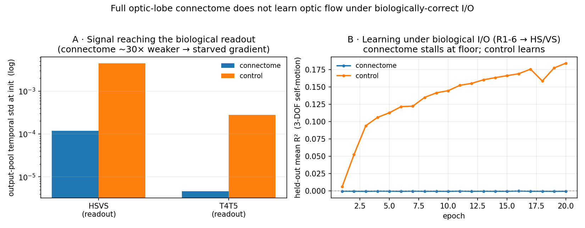

# Optic-flow under biologically-correct I/O — the full optic-lobe connectome does not learn its own deep readout

**One-line result (negative, well-diagnosed):** When the optic-flow task is wired through the **biologically-correct input/output cells of the fly optic lobe** — inject the visual stimulus only into the **R1–6 photoreceptors** and read self-motion only from the **HS/VS lobula-plate tangential cells (LPTCs)** — the **full left optic-lobe connectome (48,749 neurons, 4.03M edges) fails to learn the task**, across **~12 training methods**, while a degree-matched random control learns. The cause is structural and precisely identified: the biological readout sits ~4–5 synapses deep, so a from-scratch-trained RNN cannot route signal to it. This **sharpens the vis-01 finding** ("the optic-lobe connectome is not a plug-and-play optic-flow substrate") and shows the earlier generic-I/O **+12%** advantage does *not* transfer to biologically-faithful ports.

> Scope: this is a **model/training + I/O-appropriateness** result on **one** connectome, not a claim about topology in general. It is an internal investigation kept out of `/scott` and out of the polished `docs/results/` (which feeds the demo site).



## The question

Experiments mb-01…06 and the region×task matrix found the fly connectome beats degree-matched controls on *its own* tasks — but under **generic all-neuron I/O** (dense trainable input into all N, readout from all N). The optic-lobe→optic-flow cell of that matrix showed **+12%** (transient sample-efficiency; 1 seed; a weak Gaussian control). The natural, more rigorous follow-up:

> Does that advantage survive when the network is forced to use the **real biological ports** — photoreceptors in, LPTCs out — instead of reading the answer off whichever of 48k neurons happens to encode it? And with a proper **degree-matched** control instead of a Gaussian one?

This is the optic-lobe analogue of the MB (exp-04) and CX biological-I/O experiments.

## What we built (the reusable asset)

Biological I/O ports assigned from the **actual FlyWire 783 cell-type identities** (Schlegel et al. 2024 whole-brain annotations + Matsliah et al. 2024 optic-lobe visual typing), joined by `root_id` to the left-OL substrate — **not** inferred from graph connectivity (the repo's previous `assign_optic_lobe_io.py` heuristic). 99.3% of OL neurons are typed. Left-OL pool sizes:

| role | pool | cell types | left-OL count |
|---|---|---|---:|
| **INPUT** (primary) | `in_R16` | R1-6 (achromatic motion channel) | **4,043** |
| INPUT (fallback) | `in_L123` | L1, L2, L3 lamina monopolar | 2,403 |
| **OUTPUT** (primary) | `out_HSVS` | HSN/HSE/HSS + VS1–8 (wide-field self-motion) | **11** |
| OUTPUT (wide) | `out_LPTCwide` | + H2, VST1/2, VSm | 20 |
| OUTPUT (dense-flow) | `out_T4T5` | T4a–d, T5a–d (elementary motion detectors) | 6,146 |

Substrate: the **left optic lobe** induced subgraph of `connectomes/flywire_optic_lobe_bpu` (unsigned adjacency — the exact representation the +12% used), **N = 48,749, 4,032,601 edges**, ρ rescaled to 0.9–0.95 at run time. Task: the existing hex-ommatidia optic-flow regression (`run_optic_flow_benchmark`) — per-ommatidium brightness in, 3-DOF self-motion `[yaw_rate, forward, lateral]` out, MSE loss. Control: **degree-preserving rewire** (`mb.degree_preserving_random_like`, node identity preserved so the same port indices stay valid) — the rigorous control MB/CX use, replacing flow's weak Gaussian null.

## The finding

Under biological I/O the **connectome never leaves the floor** — its held-out mean R² sits at **≈0** (−0.001 at epoch 20) and its training loss is frozen at 0.054 — while the **degree-matched control learns**, its held-out mean R² climbing to **≈0.18** (driven by forward-translation R² ≈ 0.53) over the same 20 epochs. This holds whether the readout is the 11 HS/VS cells **or** the 6,146 T4/T5 cells. See `fig_bio_io_stall.png` and `data_curve_*.csv`.

### Why — the mechanism (diagnosed, not guessed)

1. **The biological readout is deep.** HS/VS are ~4–5 synapses from the photoreceptors. At initialization the connectome delivers ~**30× weaker** temporally-varying signal to the readout than the control does (`out_tstd` ≈ 1×10⁻⁴ vs 3×10⁻³) — robust across ρ (0.9–0.97), microsteps (1–6), and input gain (1–8×). The control learns only because rewiring **manufactures short R1-6→readout shortcuts** it doesn't have to compute.
2. **The signal must be routed by training, but the gradient to do so is starved.** Yaw is **not linearly decodable** from the frozen (untrained) HS/VS activations for *either* arm (ridge R² < 0), so the readout can't be trained on fixed features — `W_rec` must learn to route the pathway, but its gradient is vanishingly small.
3. **You cannot fix it at the readout.** A readout-side rescale is provably a **no-op** — it is absorbed by the linear readout (byte-identical loss trajectory with and without it). The starvation is intrinsic to the deep recurrence.
4. **Un-starving the gradient destabilizes training.** The one lever that moves the loss — **per-neuron state normalization inside the recurrence** — unfreezes the dynamics (train loss finally drops) but training is unstable (R² oscillates negative; adding a leak term → NaN). Robustly stabilizing this is an open research problem (the unresolved vis-01 "model/training fix" track).

### Levers tried (all fail to give the connectome stable learning)

| lever | range | outcome |
|---|---|---|
| readout pool | HS/VS (11) · LPTC-wide (20) · T4/T5 (6,146) | connectome floors on all |
| microsteps | 1, 3, 6 | no help |
| input gain | 1×, 8× | scales signal, not the ratio |
| ρ (spectral radius) | 0.5, 0.7, 0.9, 0.95, 1.1 | higher helps ~2×, still ~30× behind control |
| readout normalization | detached batch-std · global-RMS scalar | **no-op** (absorbed by linear readout) |
| state normalization | global-RMS · per-neuron | per-neuron unfreezes but **unstable** |
| leaky recurrence | leak 0.3 | no help alone; + per-neuron norm → **NaN** |
| lamina input | L1–L3 instead of R1-6 | same stall |

## What it does and doesn't settle

- **Settles:** the generic-I/O optic-lobe→flow advantage (+12%) does **not** carry over to biologically-correct ports in this from-scratch-trained RNN — because the wiring that made the advantage look real (a free readout over all neurons) was exactly what let the model bypass the connectome's deep pathway. With the real ports, the connectome's *specific structure* (a deep, learned computation) becomes a **liability** for from-scratch training, and a degree-matched control that shortcuts the depth is a **confounded, too-easy baseline**.
- **Does not settle:** whether the connectome *can* compute optic flow with the right training (developmental/evolutionary wiring is not learned from scratch), or whether a fundamentally different training scheme (running-statistic per-neuron normalization, a shallow→deep readout curriculum, or gated/residual dynamics) would clear the floor. Those are follow-ups, not tweaks.
- **n = 1** biological graph; **generic-I/O + degree-matched control at full OL** (the clean "does +12% survive a proper control" test) was *not* run — it is the natural companion experiment.

## Reproduce

```bash
# 1. build the left-OL substrate + biological ports from the FlyWire 783 cell-type join (~5s, no GPU)
uv run python docs/results/optic_flow_biological_io/build_bio_substrate.py

# 2. reproduce the stall vs the control + the signal diagnostic (writes the CSVs behind the figure)
uv run python docs/results/optic_flow_biological_io/make_writeup_data.py --arm connectome --device 0
uv run python docs/results/optic_flow_biological_io/make_writeup_data.py --arm control    --device 1
uv run python docs/results/optic_flow_biological_io/plot_writeup.py

# 3. sweep training levers on the deep readout (per-neuron norm, leak, microsteps, ...)
uv run python docs/results/optic_flow_biological_io/test_fix.py --device 0 --arm connectome \
    --configs baseline pn pn_leak leak_ro --epochs 25
```

The cell-type annotation table (`Supplemental_file1_neuron_annotations.tsv`, Schlegel 2024) is fetched from `github.com/flyconnectome/flywire_annotations`; the OL join is cached in `substrate/celltypes_783_OL.csv`.

## Files

- `build_bio_substrate.py` — left-OL substrate + biological ports from the real cell-type join → `substrate/`.
- `bio_model.py` — `BioFlowRNN`: port-gated sparse trainable recurrence with the knobs tested (microsteps, readout/state normalization, leak, input gain).
- `run_bio_data_efficiency.py` — the full sample-efficiency runner (I/O condition × {connectome, degree-matched} × data-fraction × seed; multi-GPU + fleet `--shard` entry). Ready to run once a training fix lands.
- `test_fix.py` — the model-fix lever sweep.
- `make_writeup_data.py` / `plot_writeup.py` — regenerate the figure's data + the figure.
- `substrate/` — `ol_left_unsigned.npz`, `root_ids_left.npy`, `ports.json`, `manifest.json`, `celltypes_783_OL.csv`.
- `logs/` — the raw pre-flight, diagnostic, and lever-sweep console logs.
- `data_signal_*.csv`, `data_curve_*.csv` — figure data.
