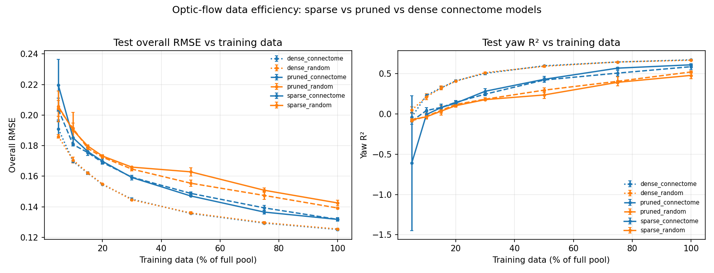

# Optic-Flow Data Efficiency — Results

Sparse vs pruned vs dense connectome-derived recurrent models (each with a
matched random control) on the fly-native optic-lobe optic-flow task, swept over
training-data fraction. FlyWire optic-lobe substrate capped to 5000
neurons, seeds [0, 1, 2], sparse lr 0.001 / dense lr 0.0001.
Full run: 144 jobs across 2 GPUs in ~19 min.



## Full-data test overall RMSE (mean ± std over 3 seeds, lower = better)

| family | overall RMSE |
|---|---|
| dense_connectome | 0.1251 ± 0.0008 |
| dense_random | 0.1254 ± 0.0003 |
| sparse_connectome | 0.1317 ± 0.0008 |
| pruned_connectome | 0.1317 ± 0.0011 |
| pruned_random | 0.1392 ± 0.0005 |
| sparse_random | 0.1425 ± 0.0018 |

## Positive result: connectome structure helps on the fly-native task

Among biologically-plausible **sparse** models, the connectome beats its random
control (`sparse_connectome` < `sparse_random`), and the **pruned connectome beats
pruned-random at every data fraction**. This is the intended counterpoint to the
BPU image-classification result: the fly connectome *is* good for "fly things".
A trainable **dense** matrix is the overall ceiling and erases the structural
distinction (`dense_connectome` ≈ `dense_random`).

## Overall RMSE by family × training-data fraction

```
fraction              5       10      20      50      100
family                                                   
dense_connectome   0.1909  0.1697  0.1546  0.1356  0.1251
dense_random       0.1861  0.1705  0.1549  0.1359  0.1254
pruned_connectome  0.2036  0.1807  0.1690  0.1488  0.1317
pruned_random      0.2044  0.1913  0.1724  0.1554  0.1392
sparse_connectome  0.2196  0.1851  0.1697  0.1471  0.1317
sparse_random      0.2057  0.1901  0.1732  0.1629  0.1425
```
