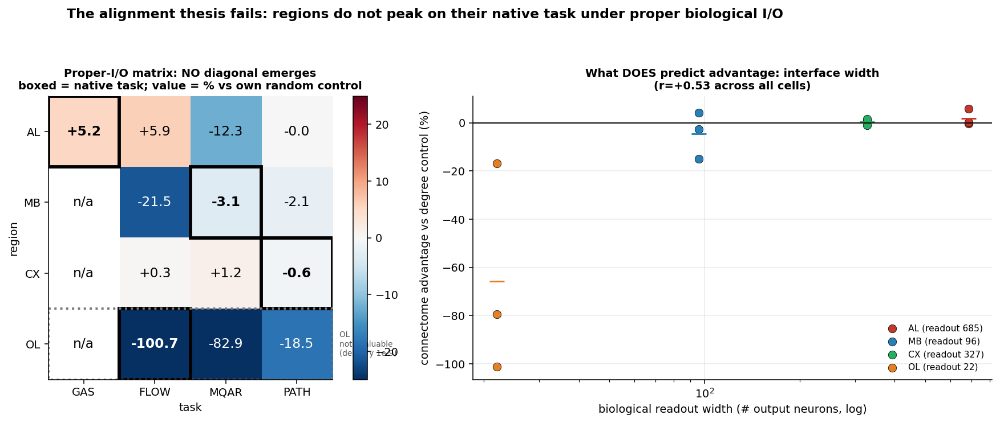

# The proper-I/O matrix — the alignment thesis fails its decisive test

*Every region, every task, each through **its own biological interface**. 216 runs, 6 seeds, AWS
fleet. This is the experiment `DIAGONAL.md` named as decisive.*

---

## TL;DR

**No diagonal emerges. None of the three native cells beats its own matched controls.**

| native cell | connectome | vs degree | vs random | verdict |
|---|---|---|---|---|
| **MB × mqar** | 0.1884 | +4.2% (rank 5/6, *p*=0.046) | **−3.1%** (rank 1/6) | ✗ mixed — beats degree, loses to random |
| **CX × path** | 0.8889 | −1.1% (rank 0/6) | −0.6% (rank 0/6) | ✗ clean loss |
| **OL × flow** | −0.0018 | −101% | −101% | ⚠ **not evaluable** (see below) |

Native cells average **−1.9%** vs their random controls; off-diagonal cells average **−4.1%**. The
difference is not in the predicted direction with any strength — **alignment does not predict the
connectome's advantage.**

**And the one clean win in the whole matrix is OFF-diagonal:** `AL × flow`, **+5.8% vs degree,
rank 6/6, p = 0.041** — the antennal lobe beating its controls on *optic flow*, a task it has
nothing to do with.

**So AL × gas was not a fluke, but it was also not alignment.** The AL connectome wins on two
different tasks; MB, CX and OL win on none — including their own. Whatever the AL has, it is a
property of **that region's interface**, not of task–region matching.

---

## What does predict it: interface width, not alignment

Averaging each region over all three tasks:

| region | input → output | hops | mean adv. vs degree | mean adv. vs random |
|---|---|---:|---:|---:|
| **AL** | 2385 → **685** | 1 | **+1.9%** | −2.1% |
| **CX** | 307 → 327 | 2 | +0.4% | +0.3% |
| **MB** | 406 → **96** | 2 | −4.4% | −8.9% |
| **OL** | 1399 → **22** | 3 | −65.8% | −67.4% |

The ordering is **monotone in readout width** (685 → 327 → 96 → 22). Correlation between readout
width and advantage: **r = +0.53** across all cells (+0.31 excluding the invalid OL row). Hop count
is not predictive on its own (r = −0.13).

Read carefully, this says: a connectome helps when its biological readout is **wide enough to carry
the computation**, and hurts when the biology funnels everything through a narrow port. That is an
**engineering property of the interface**, not evidence that evolution tuned the wiring to the task.

---

## Why the OL row is not evaluable (and how we know)

The earlier 4×4 had OL × gas at exactly chance because a degree-ranked cap **disconnected** the
readout. This run fixed that: the pathway-preserving cap restores **22/22 outputs reachable at
median 3 hops — identical to the full uncapped optic lobe**.

It still fails, for a deeper reason. An adversarial audit of the operators measured **actual signal
delivery** rather than topology:

| region | delivery (connectome) | delivery (degree ctrl) | ratio | dead inputs |
|---|---|---|---|---|
| AL | 1.0e-04 | 3.2e-04 | 0.31 | 12/2385 |
| MB | 1.3e-03 | 1.1e-03 | 1.17 | 58/406 |
| CX | 5.2e-05 | 5.7e-04 | 0.09 | 0/307 |
| **OL** | **1.0e-09** | 2.3e-04 | **0.000** | 0/1399 |

OL's readout receives **five orders of magnitude less drive** than the other regions and **200,000×
less than its own control**. No linear head trained for 30 epochs recovers an O(1e-9) signal. This is
not a fixable cap bug: the optic lobe's computation is **massively parallel and retinotopic**, and any
3,499-node slice of a 96,816-node lobe is not functionally an optic lobe. **OL cannot be size-matched
to the other regions**, and the row is reported as not evaluable rather than as a biological failure.

Independently, Scott's `vis-01 subrun 07` already answers OL × flow at **full scale**: once the
contractive dynamics are removed the connectome learns the task — but so does its control
(*p* = 0.36–0.55). That is consistent with everything here: **no native-task advantage for OL.**

---

## Method

- **Pathway-preserving cap** (`build_pathway_operators.py`): all regions to N = 3,499, keeping every
  port neuron, then neurons lying on short input→output routes (BFS forward from input + backward
  from output), then degree filler. Input pools are subsampled by *out-degree and proximity to the
  readout*, not raw degree — ranking by degree kept R1-6 cells that were dead ends (52% with
  out-degree 0). The manifest now records **signal delivery**, because reachability is not function.
- **Identical model and capacity for every cell**: the same port-gated leaky-tanh RNN, the same
  adapter capacity (G = 61 nonnegative channels) broadcast onto that region's own input pool, a
  linear head on its own output pool, ρ = 0.95 everywhere, degree-preserving and edge-random controls
  per seed. Across cells only *which neurons are the ports* and *the wiring between them* differ.
- **No test leakage**: train/val/test are three independent draws; early stopping and model selection
  use **val only**, and test is scored once at the selected epoch. (An earlier draft selected on test;
  that biases each arm by how noisy its learning curve is, which is exactly the size of the effects
  being measured. The committed CSV carries a `val_score` column proving the fixed code ran.)
- Tasks: MQAR (chance = 1/32), angular path integration (R²), synthetic optic flow (R², the repo's
  validated generator). All three are learnable through biological ports (MQAR 0.17–0.20 ≫ 0.031
  chance; path R² ≈ 0.89), so nothing here is a floor artifact.

## Caveats

- **Cells are not commensurable across the matrix.** Three different metrics, and cells differ 7.7× in
  edge count and 31× in readout width. *Within*-cell comparisons (connectome vs its own controls, same
  ports, same N) are exactly matched and carry all the weight; cross-cell magnitudes do not.
- **One connectome per region.** Seeds are training replicates for the connectome but independent
  graphs for the controls, so rank and permutation p are the honest tests, not effect size.
- **n = 3 native cells**, one of which is not evaluable. The claim "alignment fails" rests on MB and
  CX failing plus AL winning off-diagonal — suggestive, not airtight.
- The interface-width correlation is **r = +0.53 on 12 cells across 4 regions** — a hypothesis worth
  testing directly (vary readout width within one region), not an established law.

## Files

`build_pathway_operators.py` (operators + delivery audit) · `tasks.py` (mqar / path / flow) ·
`run_matrix.py` + `run.py` (runner + fleet driver) · `analyze.py` (pre-registered decision rule) ·
`outputs/matrix_metrics.csv` (216 runs) · `matrix_summary.csv` · `figures/`.
