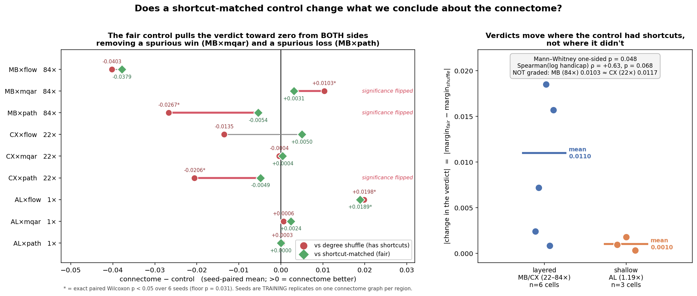
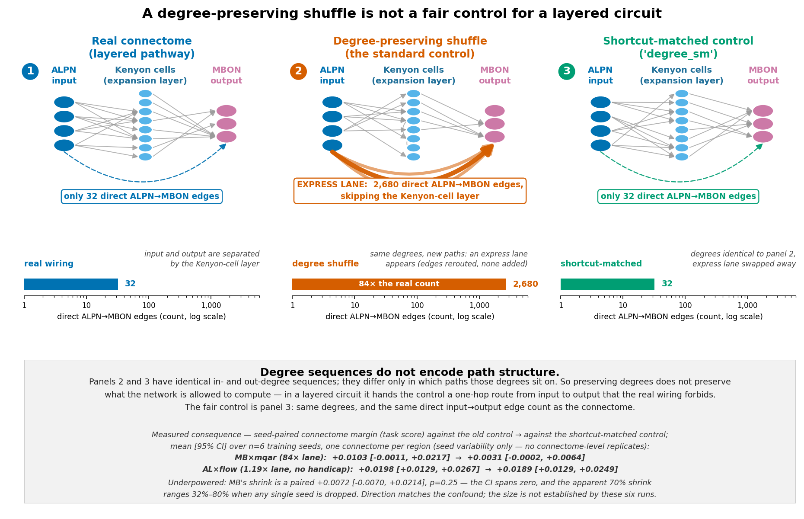

# A degree control that also matches the connectome's shortcut count

**"What if you make a random control that keeps the number of edges the same, and then train it?"**

---

## TL;DR

The standard control here is a **degree-preserving shuffle**: same neurons, same edge count, same
in/out degree for every neuron, wiring otherwise randomised. It already keeps edge count fixed. The
question is what it *fails* to keep — and for a **layered** circuit the answer is **path structure**.

Randomly rewiring the mushroom body at fixed degree invents **2,680 direct ALPN→MBON edges**. The
real mushroom body has **32**. That is an **84× express lane** from input straight to output,
bypassing the Kenyon-cell layer — bypassing the computation the circuit exists to perform.

So I built a control that is **degree-matched *and* shortcut-matched** (`degree_sm`), and trained it.

### The headline

> **The shortcut confound changes real conclusions — and it distorts in *both* directions.**
> Across the **full 3 × 3 grid — 9 cells, 162 runs** (3 arms × 6 seeds each), giving the control a
> fair shortcut count **flipped the significance of three verdicts: two losses and one win.**
>
> | cell | vs **shuffle** (has shortcuts) | vs **fair** control | what changed |
> |---|---|---|---|
> | **MB × mqar** (84×) | **+0.0103**, p = 0.031 | **+0.0031**, p = 0.094 | a connectome **win** evaporates |
> | **MB × path** (84×) | **−0.0267**, p = 0.031 | **−0.0054**, p = 0.312 | a connectome **loss** evaporates |
> | **CX × path** (22×) | **−0.0206**, p = 0.031 | **−0.0049**, p = 0.562 | a connectome **loss** evaporates |
>
> The fair control pulls the verdict **toward zero from both sides**, erasing ~80% of MB × path's and
> ~76% of CX × path's apparent deficit. **A bias that merely flattered the connectome could not do
> this** — it would not erase a loss *and* a win. A generic input→output express lane can, because it
> helps whichever side the control is on. **Every flip is a case where the published-style comparison
> would have reported a significant result that a fair control does not support.**



### It's "layered or not", not a graded dose

| group | cells | mean \|change in verdict\| |
|---|---|---|
| **layered** (MB, CX — 22–84×) | 6 | **0.0110** |
| **shallow** (AL — 1.19×) | 3 | **0.0010** |

An **11× difference**, Mann-Whitney one-sided **p = 0.048** — but read that as *marginal*: it is
6 vs 3 cells, the smallest n at which this test can clear 0.05 at all, and it is uncorrected.

It is **not proportional to the handicap**: MB (84×) moves **0.0103** and CX (22×) moves **0.0117** —
CX moves *slightly more* despite a 4× smaller ratio. Spearman on log-handicap is ρ = +0.63,
**p = 0.068**, carried by AL sitting low rather than by any MB-vs-CX gradient. **AL is unmoved in all
three of its cells** (0.0010, 0.0018, 0.0003) — the shallow-region control behaving as predicted.

### Which direction do the shortcuts push?

**They help the control** — the original hypothesis. **6 of 9 cells** shift negative (removing
shortcuts made the control *worse*), and **all three cells that reach significance** do, each with
**0/6 seeds** dissenting:

| cell | control shift | p | seeds |
|---|---|---|---|
| **MB × path** (84×) | **−0.0213** | **0.031** | 0/6 positive |
| **CX × flow** (22×) | **−0.0185** | **0.031** | 0/6 positive |
| **CX × path** (22×) | **−0.0157** | **0.031** | 0/6 positive |

> **A correction to an earlier draft of this document.** With only MB × mqar and AL × flow in hand,
> MB × mqar's **+0.0072** shift looked like evidence that the shortcuts were *hurting* the control,
> and this file said so. With seven more cells that reading is wrong: MB × mqar is the **only**
> layered cell pointing that way, its shift is **not significant** (p = 0.31, 4/6 seeds), and **78%
> of it comes from a single anomalous run** (`degree` seed 0 = 0.1593 vs 0.1811–0.1923 for the other
> five, val-patience-stopped at 31 epochs vs 40 for its pair). All three cells that *do* reach
> significance point the other way, unanimously across seeds. The lesson recorded for next time: the
> first cell I happened to run was the one that disagreed with the other eight, and I generalised
> from it.

**Still not established:** that the effect is *graded* in the shortcut ratio (it isn't, within
MB vs CX), and any per-cell claim resting on n = 6 training seeds over one connectome graph.

---

## 1. The problem

A degree-preserving shuffle holds fixed neuron count, edge count, and every neuron's in- and
out-degree. For a **flat, recurrent** region that is a fair null. For a **layered** one it is not,
because **degree sequences do not encode path structure**. The mushroom body's job is three-stage:

```
ALPN  ──►  Kenyon cells  ──►  MBON
(input)     (expansion)       (output)
```

Nothing in the degree sequence forbids wiring an input neuron directly to an output neuron.

| region | pathway depth (mean hops) | direct in→out, **degree shuffle** | **real connectome** | ratio | surplus removed |
|---|---|---|---|---|---|
| **MB** | 1.90 | 2,680 | **32** | **83.8×** | 2,648 |
| **CX** | 1.81 | 6,054 | **279** | **21.7×** | 5,775 |
| **AL** | 1.02 | 25,428 | **21,382** | **1.19×** | 4,046 |

Depths are recomputed by BFS from the input ports in `pathway_depth.json` (the earlier
`reach_audit.json` covered only AL and MB).

> **Note the last column.** AL had **4,046** surplus shortcuts removed — *more in absolute terms
> than MB's 2,648*. Only the **ratio** is small. An earlier draft of this document said AL "never had
> shortcuts to remove"; that was **wrong**, and it mattered, because it invited the reader to
> conclude AL's null shift was because nothing was done to it.

**OL is deliberately absent from this table.** No OL `degree_sm` operator was built and no OL cell
was trained; including it in the measured series (as an earlier draft did, with "∞") implied a data
point that does not exist.



---

## 2. The control

`build_shortcut_matched.py` emits the `degree_sm` arm:

1. Start from the **standard degree-preserving shuffle** — byte-identical procedure to the `degree` arm.
2. Repair it with **degree-preserving double-edge swaps** targeted at surplus direct input→output
   edges, until the count **matches the connectome's own**.
3. Rescale to spectral radius ρ = 0.95, like every other arm.

Every operation is a double-edge swap (`pre_a→post_a`, `pre_b→post_b` ⟶ `pre_a→post_b`,
`pre_b→post_a`), so **in- and out-degree are preserved exactly, per neuron**. Independently verified
for all 3 regions × 6 seeds: degree vectors element-wise identical to both the shuffle and the
connectome, `nnz` identical, ρ = 0.9500 throughout.

```
MB s0: direct in->out 2680 -> 32     (connectome target 32)     degrees_preserved=True
CX s0: direct in->out 6054 -> 279    (connectome target 279)    degrees_preserved=True
AL s0: direct in->out 25428 -> 21382 (connectome target 21382)  degrees_preserved=True
```

**AL as a plausibility check.** AL's *ratio* is 1.19×, so if the ratio is what matters, fixing it
should barely move AL while moving MB. This is a **plausibility check, not a one-factor
manipulation** — MB×mqar and AL×flow differ in region *and* task *and* handicap, so a difference
between them cannot be attributed to the handicap alone.

---

## 3. Results

**9 complete cells — the full 3 × 3 region × task grid, 162 runs** (3 arms × 6 seeds). Unit of analysis is the **cell**, not the seed: within a
cell, seeds are paired across arms and summarised by an exact paired Wilcoxon; across cells we ask
whether the layered regions moved more. Pooling seeds across cells would treat correlated runs as
independent.

`*` = p < 0.05 (the n=6 exact-Wilcoxon floor is 0.031).

| region × task | handicap | vs shuffle | vs fair control | control shift | verdict move |
|---|---|---|---|---|---|
| MB × flow | 84× | −0.0403 | −0.0379 | −0.0024 | 0.0024 |
| **MB × mqar** | 84× | **+0.0103\*** | **+0.0031** | +0.0072 | **0.0072** |
| **MB × path** | 84× | **−0.0267\*** | **−0.0054** | **−0.0213\*** | **0.0213** |
| **CX × flow** | 22× | −0.0135 | +0.0050 | **−0.0185\*** | **0.0185** |
| CX × mqar | 22× | −0.0004 | +0.0004 | −0.0008 | 0.0008 |
| **CX × path** | 22× | **−0.0206\*** | **−0.0049** | **−0.0157\*** | **0.0157** |
| AL × flow | 1.19× | +0.0198\* | +0.0189\* | +0.0010 | 0.0010 |
| AL × mqar | 1.19× | +0.0006 | +0.0024 | −0.0018 | 0.0018 |
| AL × path | 1.19× | +0.0003 | +0.0000 | +0.0003 | 0.0003 |

Three verdicts flipped significance — **two losses and one win**. A control artefact that only
inflated the connectome could not do that; one that adds a generic input→output shortcut would,
because such a shortcut helps the control on whichever side it lands. Note the three flips span
**both** layered regions and **both** signs.

**Source hygiene.** Local (RTX Blackwell) and fleet (L4) runs are **never mixed within a cell** —
each cell is taken whole from one source, since a hardware difference inside a paired comparison
would land in the difference. Per-cell source is recorded in `all_cells_summary.csv`
(local: MB×mqar, AL×flow, CX×path; fleet: the other six).

## 4. Limits

- **Replication structure.** The **control arms are six independent graph draws**
  (`{arm}_s{seed}.npz`), but there is **one connectome graph per region**. So the connectome side is
  n = 1 and p-values describe seed/draw noise, not variation over connectomes. A rank test of the
  real graph against the distribution of control graphs is therefore **closer to hand than an earlier
  draft implied** — it is the natural next analysis, not an impossible one.
- **p-value floor.** An exact two-sided paired Wilcoxon at n = 6 bottoms out at **p = 0.031**. Every
  "6/6 seeds, p = 0.031" in this document *is* that floor.
- **Uncorrected.** 2 cells × 2 comparisons, nominal p-values.
- **Ratios are unstable.** MB's leave-one-out shrink ranges **−32% to −80%** across the six seeds.
  Read "−70%" as a point estimate with that spread, not a measurement.
- **Nine cells is still nine cells.** The layered-vs-shallow test is 6 vs 3 units at p = 0.048 — the
  smallest n that can clear 0.05, uncorrected. Treat it as marginal.
- **Not graded.** MB (84×) and CX (22×) move by the same amount, so the shortcut *ratio* does not
  predict the size of the effect within the layered regions. "Layered or not" is the supported
  distinction; a dose-response is not.
- **Region and task are confounded with handicap.** AL differs from MB/CX in region *and* task
  coverage as well as in handicap, so this is a plausibility check, not a one-factor manipulation.
- **Small effects.** Margins 0.003–0.02 on scores of 0.18–0.29; MQAR sits near the weakly-learned
  regime (chance = 1/32).

---

## 5. Reproducing

```bash
python docs/results/proper_io_matrix/build_shortcut_matched.py --regions MB CX AL --seeds 0 1 2 3 4 5
python docs/results/proper_io_matrix/run_matrix.py --device cuda \
    --regions MB --tasks mqar --arms connectome degree degree_sm --seeds 0 1 2 3 4 5 --output-dir <out>
python docs/results/proper_io_matrix/analyze_shortcut_matched.py --dirs <out>
python docs/results/proper_io_matrix/fig_per_seed_paired.py   # + fig_dose_response / fig_margin_shrink / fig_pathway_schematic
```

Data: `shortcut_matched_runs.csv` (36 runs), `shortcut_matched_summary.csv`,
`operators_pathway/shortcut_match_report.json`, `pathway_depth.json`.
The prior 216-run matrix (no `degree_sm` arm) is quarantined in `outputs_prior216/`.

---

## 6. Bugs and corrections worth recording

**`np.isin(array, python_set)` silently returns all-False.** It wraps the set in a 0-d object array
instead of raising, so my shortcut counter read 0 for every region and the first batch of
"shortcut-matched" controls were plain degree shuffles. Caught because MB reported `target 0` when
it had measured 32 minutes earlier. `n_direct()` now takes arrays.

**Results computed but not saved.** All 36 runs finished, then every one crashed at the final
`to_csv` with `ModuleNotFoundError: pandas.io.formats.csvs` — a concurrent `uv sync` mutating the
shared `.venv` mid-run. Scores were recovered from the per-job log lines rather than re-run, which
is why `shortcut_matched_runs.csv` carries only the fields the logs printed.

**This document overclaimed and was rewritten.** An adversarial audit recomputed every number
(all arithmetic reproduced exactly, including an independent recount of direct edges from the raw
`.npz` files) and found the *inference* inflated. Specifically corrected: the MB fair-control
p = 0.094 was in the shipped summary CSV but never printed; the "control improved" direction was
asserted from a null (p = 0.31) driven 78% by one anomalous run; "dose-dependent / 7×" was a ratio
of two null effects across two points with the middle dose untrained; "AL never had shortcuts to
remove" was factually false; and OL was listed in the measured series without ever being built or
trained.
