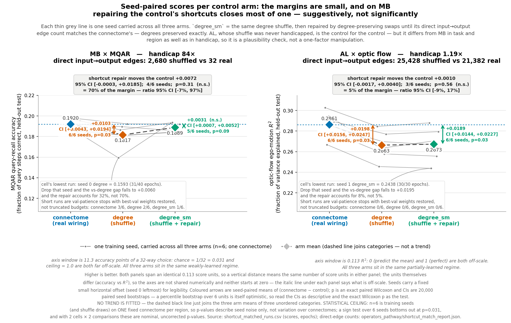
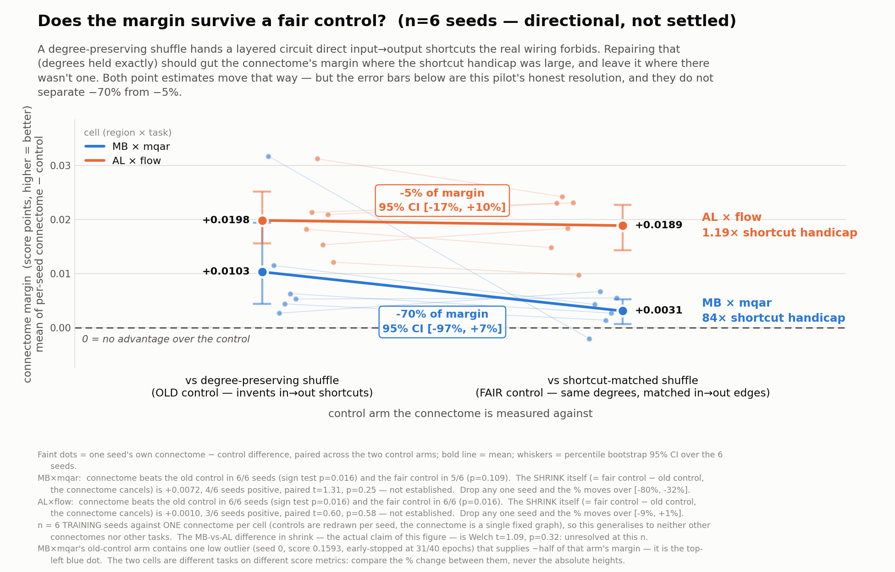
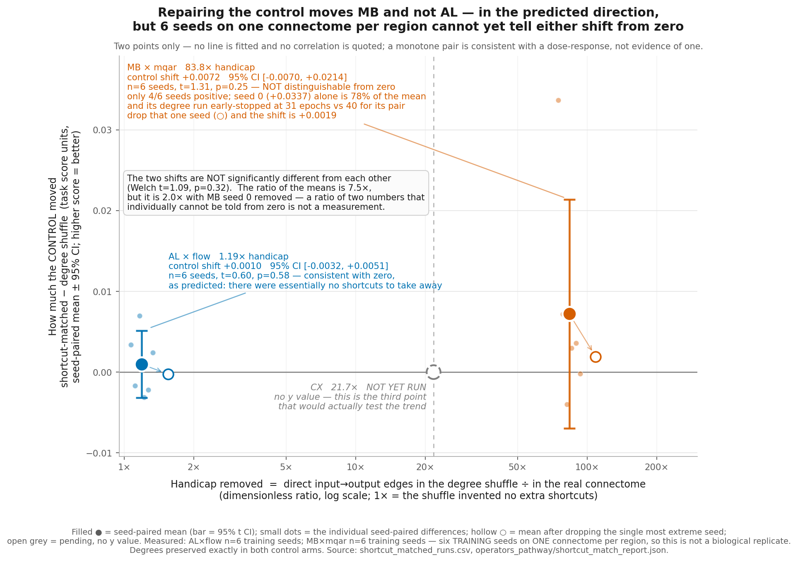

# A degree control that also matches the connectome's shortcut count

**"What if you make a random control that keeps the number of edges the same, and then train it?"**

---

## TL;DR

The standard control here is a **degree-preserving shuffle**: same neurons, same edge count, same
in/out degree for every neuron, wiring otherwise randomised. It already keeps edge count fixed. The
question is what it *fails* to keep — and for a **layered** circuit the answer is **path structure**.

Randomly rewiring the mushroom body at fixed degree invents **2,680 direct ALPN→MBON edges**. The
real mushroom body has **32**. That is an **84× express lane** from input straight to output,
bypassing the Kenyon-cell layer — bypassing the computation the circuit exists to perform.

So I built a control that is **degree-matched *and* shortcut-matched** (`degree_sm`), and trained it.

### The one claim that is solidly supported

> A shortcut-matched control shrinks **MB × mqar**'s margin from **+0.0103 (p = 0.031)** to
> **+0.0031 (p = 0.094 — no longer significant)**, and leaves **AL × flow**'s **+0.019 (p = 0.031,
> 6/6 seeds)** essentially intact.

| region × task | handicap | vs **old** control | vs **fair** control |
|---|---|---|---|
| **MB × mqar** | **84×** | +0.0103, 6/6 seeds, p = 0.031 | **+0.0031, 5/6 seeds, p = 0.094 (n.s.)** |
| **AL × flow** | **1.19×** | +0.0198, 6/6 seeds, p = 0.031 | **+0.0189, 6/6 seeds, p = 0.031** |

### What is NOT established

**Why** MB's margin shrank is *not* resolved by these data. The obvious story — "the shortcuts were
helping the control, so removing them should hurt it" — is not what the numbers show, and the
opposite story is not supported either:

- The control's shift on MB is **+0.0072, 95% CI [−0.0070, +0.0214], Wilcoxon p = 0.31, only 4/6
  seeds positive.** It is **not distinguishable from zero.**
- **78% of that shift comes from a single run.** Per-seed shifts are
  `[+0.0337, +0.0072, −0.0040, +0.0030, +0.0036, −0.0002]`. Drop seed 0 and the shift is **+0.0019**,
  and the headline "−70% shrink" becomes **−32%**.
- **That one run is itself suspect**: MB `degree` seed 0 scored **0.1593** when the other five
  `degree` runs sit at 0.1811–0.1923, and it val-patience-stopped at **31 epochs** vs 40 for its
  `degree_sm` partner.
- The **MB-vs-AL contrast** — the "dose-response" — is **Welch p = 0.32** (p = 0.71 without seed 0).
  The apparent "7× more" is a **ratio of two quantities that individually cannot be told from zero**.
  **CX (21.7×), the middle dose that would actually test this, was never trained.**

**Corrected bottom line:** the shortcut confound is a **real structural fact** (84× / 21.7× / 1.19×,
independently recounted from the operator matrices). Its **training consequence is not yet measured**.
What these two cells show is that MB×mqar's advantage does not survive a fair control, while AL×flow's
does. With one connectome graph per region and six training seeds, **this is a consistency check, not
a test.**



---

## 1. The problem

A degree-preserving shuffle holds fixed neuron count, edge count, and every neuron's in- and
out-degree. For a **flat, recurrent** region that is a fair null. For a **layered** one it is not,
because **degree sequences do not encode path structure**. The mushroom body's job is three-stage:

```
ALPN  ──►  Kenyon cells  ──►  MBON
(input)     (expansion)       (output)
```

Nothing in the degree sequence forbids wiring an input neuron directly to an output neuron.

| region | pathway depth (mean hops) | direct in→out, **degree shuffle** | **real connectome** | ratio | surplus removed |
|---|---|---|---|---|---|
| **MB** | 1.90 | 2,680 | **32** | **83.8×** | 2,648 |
| **CX** | 1.81 | 6,054 | **279** | **21.7×** | 5,775 |
| **AL** | 1.02 | 25,428 | **21,382** | **1.19×** | 4,046 |

Depths are recomputed by BFS from the input ports in `pathway_depth.json` (the earlier
`reach_audit.json` covered only AL and MB).

> **Note the last column.** AL had **4,046** surplus shortcuts removed — *more in absolute terms
> than MB's 2,648*. Only the **ratio** is small. An earlier draft of this document said AL "never had
> shortcuts to remove"; that was **wrong**, and it mattered, because it invited the reader to
> conclude AL's null shift was because nothing was done to it.

**OL is deliberately absent from this table.** No OL `degree_sm` operator was built and no OL cell
was trained; including it in the measured series (as an earlier draft did, with "∞") implied a data
point that does not exist.


---

## 2. The control

`build_shortcut_matched.py` emits the `degree_sm` arm:

1. Start from the **standard degree-preserving shuffle** — byte-identical procedure to the `degree` arm.
2. Repair it with **degree-preserving double-edge swaps** targeted at surplus direct input→output
   edges, until the count **matches the connectome's own**.
3. Rescale to spectral radius ρ = 0.95, like every other arm.

Every operation is a double-edge swap (`pre_a→post_a`, `pre_b→post_b` ⟶ `pre_a→post_b`,
`pre_b→post_a`), so **in- and out-degree are preserved exactly, per neuron**. Independently verified
for all 3 regions × 6 seeds: degree vectors element-wise identical to both the shuffle and the
connectome, `nnz` identical, ρ = 0.9500 throughout.

```
MB s0: direct in->out 2680 -> 32     (connectome target 32)     degrees_preserved=True
CX s0: direct in->out 6054 -> 279    (connectome target 279)    degrees_preserved=True
AL s0: direct in->out 25428 -> 21382 (connectome target 21382)  degrees_preserved=True
```

**AL as a plausibility check.** AL's *ratio* is 1.19×, so if the ratio is what matters, fixing it
should barely move AL while moving MB. This is a **plausibility check, not a one-factor
manipulation** — MB×mqar and AL×flow differ in region *and* task *and* handicap, so a difference
between them cannot be attributed to the handicap alone.

---

## 3. Results

6 seeds per arm, biological I/O ports, size-matched substrates. Epoch counts vary (MB 31–40) because
training early-stops on **validation** patience with best-val weights restored — short runs are
model-selected, not truncated budgets. Early stops are **not** concentrated in the controls (MB:
connectome 3/6, degree 2/6, degree_sm 1/6).

### MB × mqar — 84× ratio

| arm | mean | per-seed |
|---|---|---|
| connectome | **0.1920** | 0.1910 0.1979 0.1923 0.1856 0.1874 0.1976 |
| degree | 0.1817 | **0.1593** 0.1864 0.1896 0.1812 0.1811 0.1923 |
| degree_sm | **0.1889** | 0.1930 0.1936 0.1856 0.1842 0.1847 0.1921 |

- connectome − degree = **+0.0103**, 6/6, **p = 0.031** (the n=6 floor)
- connectome − degree_sm = **+0.0031**, 5/6, **p = 0.094 — not significant**
- control shift = **+0.0072**, 4/6, **p = 0.31**, CI **[−0.0070, +0.0214]** — **null**

### AL × flow — 1.19× ratio

| arm | mean | per-seed |
|---|---|---|
| connectome | **0.2861** | 0.3027 0.2668 0.2945 0.2850 0.2787 0.2891 |
| degree | 0.2663 | 0.2845 0.2455 0.2633 0.2697 0.2578 0.2770 |
| degree_sm | **0.2673** | 0.2879 0.2438 0.2703 0.2666 0.2556 0.2794 |

- connectome − degree = **+0.0198**, 6/6, p = 0.031
- connectome − degree_sm = **+0.0189**, 6/6, p = 0.031, **Cohen dz = 3.3**
- control shift = **+0.0010**, 3/6, p = 0.56 — null, all 6 runs at 30/30 epochs




---

## 4. Limits

- **Replication structure.** The **control arms are six independent graph draws**
  (`{arm}_s{seed}.npz`), but there is **one connectome graph per region**. So the connectome side is
  n = 1 and p-values describe seed/draw noise, not variation over connectomes. A rank test of the
  real graph against the distribution of control graphs is therefore **closer to hand than an earlier
  draft implied** — it is the natural next analysis, not an impossible one.
- **p-value floor.** An exact two-sided paired Wilcoxon at n = 6 bottoms out at **p = 0.031**. Every
  "6/6 seeds, p = 0.031" in this document *is* that floor.
- **Uncorrected.** 2 cells × 2 comparisons, nominal p-values.
- **Ratios are unstable.** MB's leave-one-out shrink ranges **−32% to −80%** across the six seeds.
  Read "−70%" as a point estimate with that spread, not a measurement.
- **Two cells.** MB×mqar and AL×flow only. **CX×path — the middle dose — has not been trained**, and
  it is the single most valuable missing run.
- **Small effects.** Margins 0.003–0.02 on scores of 0.18–0.29; MQAR sits near the weakly-learned
  regime (chance = 1/32).

---

## 5. Reproducing

```bash
python docs/results/proper_io_matrix/build_shortcut_matched.py --regions MB CX AL --seeds 0 1 2 3 4 5
python docs/results/proper_io_matrix/run_matrix.py --device cuda \
    --regions MB --tasks mqar --arms connectome degree degree_sm --seeds 0 1 2 3 4 5 --output-dir <out>
python docs/results/proper_io_matrix/analyze_shortcut_matched.py --dirs <out>
python docs/results/proper_io_matrix/fig_per_seed_paired.py   # + fig_dose_response / fig_margin_shrink / fig_pathway_schematic
```

Data: `shortcut_matched_runs.csv` (36 runs), `shortcut_matched_summary.csv`,
`operators_pathway/shortcut_match_report.json`, `pathway_depth.json`.
The prior 216-run matrix (no `degree_sm` arm) is quarantined in `outputs_prior216/`.

---

## 6. Bugs and corrections worth recording

**`np.isin(array, python_set)` silently returns all-False.** It wraps the set in a 0-d object array
instead of raising, so my shortcut counter read 0 for every region and the first batch of
"shortcut-matched" controls were plain degree shuffles. Caught because MB reported `target 0` when
it had measured 32 minutes earlier. `n_direct()` now takes arrays.

**Results computed but not saved.** All 36 runs finished, then every one crashed at the final
`to_csv` with `ModuleNotFoundError: pandas.io.formats.csvs` — a concurrent `uv sync` mutating the
shared `.venv` mid-run. Scores were recovered from the per-job log lines rather than re-run, which
is why `shortcut_matched_runs.csv` carries only the fields the logs printed.

**This document overclaimed and was rewritten.** An adversarial audit recomputed every number
(all arithmetic reproduced exactly, including an independent recount of direct edges from the raw
`.npz` files) and found the *inference* inflated. Specifically corrected: the MB fair-control
p = 0.094 was in the shipped summary CSV but never printed; the "control improved" direction was
asserted from a null (p = 0.31) driven 78% by one anomalous run; "dose-dependent / 7×" was a ratio
of two null effects across two points with the middle dose untrained; "AL never had shortcuts to
remove" was factually false; and OL was listed in the measured series without ever being built or
trained.
