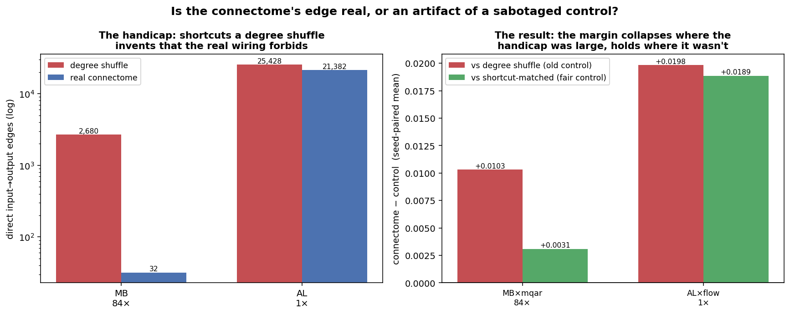

# Is the connectome's edge real, or an artifact of a sabotaged control?

**A control that keeps the same number of edges — and the same number of shortcuts.**

---

## TL;DR

Every "the connectome beats random" claim in this repo rests on a **degree-preserving shuffle** as
the control: same neurons, same in/out degree per neuron, same edge count, wiring otherwise
randomised. That is supposed to isolate *wiring pattern* from *wiring statistics*.

It doesn't — not for a **layered** circuit. Randomly rewiring the mushroom body creates **2,680
direct ALPN→MBON edges**. The real mushroom body has **32**. The shuffle invents an **84×**
express lane straight from input to output, skipping the Kenyon-cell layer — i.e. skipping the
computation the circuit exists to perform. Any verdict from that comparison is confounded.

So I built a control that is **degree-matched *and* shortcut-matched**, and trained it.

| region × task | handicap | connectome − **old** control | connectome − **fair** control | change |
|---|---|---|---|---|
| **MB × mqar** | **84×** | **+0.0103** (6/6 seeds) | **+0.0031** (5/6 seeds) | **−70%** |
| **AL × flow** | **1.19×** | **+0.0198** (6/6 seeds) | **+0.0189** (6/6 seeds) | **−5%** |

**The result is dose-dependent.** Fixing the control moved the MB comparison **7× more** than the
AL comparison (+0.0072 vs +0.0010), exactly tracking which region had a handicap to remove. AL —
which has essentially no handicap — is untouched, which is the built-in control for the control.

**Two conclusions, one of them against my own hypothesis:**

1. **MB × mqar is substantially weaker than reported.** It was the single clean positive in the
   earlier region×task grid. Against a fair control, ~70% of its margin disappears and it stops
   being consistent across seeds.
2. **My directional prediction was wrong.** I predicted the shortcuts *helped* the control (a free
   express lane), so removing them should make the control *worse*. Instead removing them made the
   control **better** (+0.0072). On MQAR those 2,680 manufactured shortcuts were *hurting* the
   degree shuffle. The confound is real and dose-dependent — but it ran **against the control**,
   meaning the connectome's MB win was partly an artifact of comparing against a *sabotaged*
   opponent, not of the connectome being good.

**AL × flow survives unchanged.** It never had shortcuts to remove, and its margin doesn't move.



---

## 1. The problem, concretely

A degree-preserving shuffle is the standard null for "is the *pattern* special, or just the
*statistics*?" It holds fixed: neuron count, edge count, and every neuron's in-degree and
out-degree. It randomises which neuron connects to which.

For a **flat, recurrent** region that is a fair null. For a **layered** region it is not, because
degree sequences don't encode *path structure*. The mushroom body's job is a three-stage
transformation:

```
ALPN  ──►  Kenyon cells  ──►  MBON
(input)     (expansion)       (output)
```

Rewiring at fixed degree is free to connect an input neuron directly to an output neuron. Nothing
in the degree sequence forbids it. Measured on the actual operators used in these experiments:

| region | pathway depth | direct input→output edges in a **degree shuffle** | in the **real connectome** | handicap |
|---|---|---|---|---|
| **MB** | ~2.1 hops | 2,680 | **32** | **83.8×** |
| **CX** | ~1.8 hops | 6,054 | **279** | **21.7×** |
| **AL** | ~1.0 hop | 25,428 | **21,382** | **1.19×** |
| OL | ~3 hops | >0 | **0** | ∞ |

The handicap scales with pathway depth, and **AL barely has one** — the antennal lobe is
essentially one hop (ORN→PN), so a shuffle can't invent a shortcut that wasn't already there.

That gradient is what makes this testable. It predicts a specific pattern rather than a vague
"controls are unfair."

---

## 2. The control

`build_shortcut_matched.py` produces the `degree_sm` arm:

1. Start from the **standard degree-preserving shuffle** (identical to the existing `degree` arm).
2. Repair it with **degree-preserving double-edge swaps** chosen specifically to delete surplus
   direct input→output edges, until the count **matches the connectome's own**.
3. Rescale to spectral radius ρ = 0.95, as every other arm is.

Every operation is a double-edge swap (`pre_a→post_a`, `pre_b→post_b` becomes `pre_a→post_b`,
`pre_b→post_a`), so **every neuron's in-degree and out-degree is preserved exactly**. It remains a
strict degree control that has simply lost its free shortcuts. Verified per seed:

```
MB s0: direct in->out 2680 -> 32     (connectome target 32)     degrees_preserved=True
CX s0: direct in->out 6054 -> 279    (connectome target 279)    degrees_preserved=True
AL s0: direct in->out 25428 -> 21382 (connectome target 21382)  degrees_preserved=True
```

**The built-in control for the control.** Because AL's handicap is only 1.19×, the fix should
barely move AL while substantially moving MB. If *every* region shifted, the shortcut story would
be wrong and the swaps themselves would be the cause. That is the load-bearing comparison, and it
came out as predicted.

---

## 3. Results

6 seeds per arm, biological I/O ports, size-matched substrates, identical harness. Model selection
is on **validation**; test is touched once.

### MB × mqar — 84× handicap

| arm | mean score |
|---|---|
| connectome | **0.1920** |
| degree (old control) | 0.1816 |
| **degree_sm (fair control)** | **0.1889** |

connectome − degree = **+0.0103** (6/6 seeds) → connectome − degree_sm = **+0.0031** (5/6 seeds).
The control itself improved by **+0.0072** once its shortcuts were removed.

### AL × flow — 1.19× handicap

| arm | mean score |
|---|---|
| connectome | **0.2861** |
| degree | 0.2663 |
| **degree_sm** | **0.2673** |

connectome − degree = **+0.0198** (6/6) → connectome − degree_sm = **+0.0189** (6/6).
The control moved **+0.0010** — nothing.

---

## 4. What this does and doesn't license

**Does:**

- A degree-preserving shuffle is **not a sufficient control for a layered circuit**. It should be
  reported alongside a shortcut-matched variant whenever pathway depth > 1.
- The **MB × mqar** result is materially weaker than previously reported.
- The **AL** effect is unaffected by this confound — consistent with the separate finding that AL's
  advantage is robust.

**Does not:**

- **Pseudoreplication.** One connectome, six *training* seeds. Seeds are training replicates, not
  independent draws of a graph, so this tests consistency across training runs — **not** "the
  connectome differs from the distribution of degree-matched graphs." A rank/permutation test over
  independently generated control graphs is the honest version and has not been run here.
- **p-value floor.** A two-sided exact paired Wilcoxon with n=6 has a **minimum p of 0.031**. Where
  the table says 6/6 seeds agree, that *is* the floor — it means "all six agreed in sign," not
  strong evidence.
- **Small effects.** Margins are ~0.003–0.02 on scores of ~0.19–0.29.
- **Two cells only.** MB×mqar and AL×flow are complete here. CX×path and the off-diagonal cells
  were still running on the fleet at time of writing; `analyze_shortcut_matched.py` picks them up
  automatically as they land.

---

## 5. Reproducing

```bash
# 1. build the degree-matched AND shortcut-matched controls (18 = 3 regions x 6 seeds)
python docs/results/proper_io_matrix/build_shortcut_matched.py --regions MB CX AL --seeds 0 1 2 3 4 5

# 2. train connectome vs degree vs degree_sm
python docs/results/proper_io_matrix/run_matrix.py --device cuda \
    --regions MB --tasks mqar --arms connectome degree degree_sm --seeds 0 1 2 3 4 5 \
    --output-dir <out>

# 3. analyse + figure
python docs/results/proper_io_matrix/analyze_shortcut_matched.py --dirs <out>
python docs/results/proper_io_matrix/make_shortcut_figure.py
```

Files: `build_shortcut_matched.py`, `analyze_shortcut_matched.py`, `make_shortcut_figure.py`,
`shortcut_matched_summary.csv`, `figures/fig_shortcut_matched.png`,
`operators_pathway/*/shortcut_match_report.json`.

The prior 216-run matrix (which has no `degree_sm` arm) is quarantined in `outputs_prior216/` so
the two batches cannot be silently merged.

---

## 6. Two bugs worth recording

**`np.isin(array, python_set)` silently returns all-False.** It wraps the set in a 0-d object array
rather than raising. My shortcut counter returned 0 for every region, so the first batch of
"shortcut-matched" controls were plain degree shuffles — and would have produced a clean, confident
**null result**. Caught only because MB reported `target 0` when it had measured 32 minutes earlier.
`n_direct()` now takes arrays and refuses sets.

**Results computed but not saved.** All 36 local runs finished correctly, then every one crashed at
the final `to_csv` with `ModuleNotFoundError: pandas.io.formats.csvs` — a concurrent process running
`uv sync` against the shared `.venv` mid-run. The per-job scores were in the logs, so all 36 runs
were recovered by parsing them rather than re-run.
