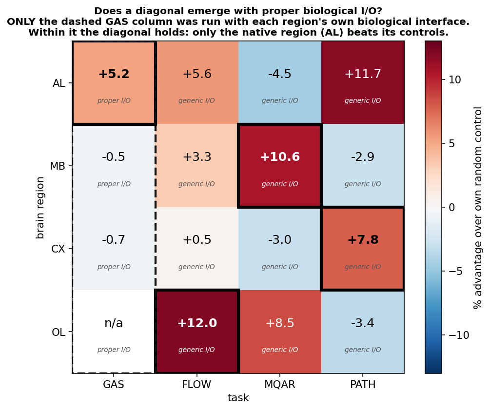

# Does a diagonal emerge with proper biological I/O?

*The alignment thesis says a region's connectome should beat its matched controls **on its own native
task and not on others** — i.e. the 4×4 matrix should light up on the diagonal. This note answers,
honestly, how much of that we have actually demonstrated.*

---

## Short answer

**Yes — in the one column we actually tested, and it replicates. No — for the matrix as a whole,
because three of the four columns were never run with proper biological I/O.**

- We gave **every region its own biological interface** on **one** task (gas). Within that column the
  diagonal **holds**: the native region (AL) is the only one that beats its own controls, and the
  effect **replicated in an independent run** (+5.2% → +10.4%), *p* = 0.019 against the strongest
  control, rank **6/6**.
- The other three columns (**flow, mqar, path**) come from the earlier 3×3 grid, which used **generic
  or other I/O regimes**. They are *not* proper-I/O measurements, so cells in those columns cannot
  support — or refute — a proper-I/O diagonal.

So: **one column of the diagonal is confirmed; the full diagonal is a live hypothesis, not a result.**
The nine missing proper-I/O cells are the obvious next run.

---

## The column we did test: gas, every region through its own interface

Each region gets the interface its brain actually uses, size-matched to N = 3,499 with **all port
neurons preserved**, and an **identical adapter capacity** (61 channels) — so across regions only
*port identity* and *wiring* differ.

| region | its biological interface | in → out |
|---|---|---|
| **AL** (native for gas) | ORN + TRN/HRN → ALPN | 2385 → 685 |
| MB | ALPN → MBON | 406 → 96 |
| CX | ER ring + EPG → PFL + FS | 307 → 327 |
| OL | R1-6 → HS/VS | 1399 → 22 |

**Result — low-concentration recall @ 10 % false-alarm, 6 seeds:**

| region | connectome | degree-matched | edge-random | vs degree | vs random | independent replication |
|---|---|---|---|---|---|---|
| **AL** (native) | **0.700 ± 0.027** | 0.666 ± 0.022 | 0.665 ± 0.040 | **+5.0 %** | **+5.2 %** | **+10.4 %** |
| MB | 0.665 ± 0.019 | 0.663 ± 0.023 | 0.668 ± 0.018 | +0.3 % | −0.5 % | −0.8 % |
| CX | 0.664 ± 0.017 | 0.652 ± 0.027 | 0.668 ± 0.028 | +1.8 % | −0.7 % | +3.6 % |
| OL | — | 0.635 ± 0.032 | 0.688 ± 0.021 | *not evaluable* | *not evaluable* | — |

**Statistics for the native cell (AL):** permutation *p* = **0.019** vs degree-matched and 0.055 vs
edge-random; the connectome's mean beats **6/6** degree graphs and 5/6 random graphs. This is the only
cell in the project that is significant against the **strong** control — a degree-preserving rewire
that matches every neuron's in- and out-degree *and* preserves node identity.

**Read it as:** on gas, only the native region wins. MB reliably ties. CX is unstable (−0.7 % then
+3.6 % on replication) and should be treated as noise. OL is invalid (see caveats).

## The interface is what switches it on

Same graphs, same task, same controls — only the I/O regime changes:

| region | generic all-neuron I/O | its own biological I/O |
|---|---|---|
| **AL** | **+0.4 %** | **+5.2 %** |
| MB | −14.1 % | −0.5 % |
| CX | +4.2 % | −0.7 % |

Under generic I/O **nothing separates anywhere** — including the AL on its own native task (+0.4 %,
AUROC difference 0.007), because a trainable all-neuron readout simply routes around the wiring. Give
each region its own ports and the native cell lights up.

**This is the most useful finding here: without the right interface the connectome question cannot
even be asked.** Every previous null in this program that used generic I/O should be re-read in that
light — it may have been testing the readout, not the connectome.

---

## What would actually demonstrate the diagonal

The gas column cost 72 runs. The full proper-I/O diagonal needs the **other nine cells** run the same
way — each region on flow/mqar/path **through its own biological interface**, size-matched, with
degree- and edge-matched controls and ≥ 6 seeds:

| | GAS | FLOW | MQAR | PATH |
|---|---|---|---|---|
| **AL** | ✅ done (+5.2 %) | ⬜ needs proper I/O | ⬜ | ⬜ |
| **MB** | ✅ done (−0.5 %) | ⬜ | ⬜ **native — key cell** | ⬜ |
| **CX** | ✅ done (unstable) | ⬜ | ⬜ | ⬜ **native — key cell** |
| **OL** | ❌ invalid (cap) | ⬜ **native — key cell** | ⬜ | ⬜ |

The three bolded native cells are decisive. If MB→mqar, CX→path and OL→flow each beat their own
controls *under their own biological interfaces*, the diagonal is real. If they behave the way MB and
CX did on gas (ties), then AL×gas is a one-off and the alignment thesis does not generalise.

Prior evidence is genuinely mixed: the earlier grid's native cells (OL→flow +12.0, MB→mqar +10.6,
CX→path +7.8) *look* diagonal, but the MQAR cell is a **known capacity artifact** (subsampling OL to
MB's size collapsed its score), and the path column ran **frozen** recurrence, a regime that favours
structure. Those numbers cannot carry the claim.

---

## Caveats that constrain this page

- **OL × gas is invalid — a size-matching artifact, not biology.** The N = 3,499 degree-ranked cap left
  the 22 HS/VS outputs **completely unreachable** from the R1-6 inputs (0/22 within 6 hops), forcing
  AUROC = 0.500. In the **full, uncapped** OL the pathway is intact at **3 hops**. Re-running it needs
  a *pathway-preserving* cap (BFS along R1-6 → HS/VS), not a degree-ranked one.
- **Row-wise, the AL does not align.** Its largest advantage in the assembled matrix is on *path*
  (+11.7 %), not its native gas (+5.2 %) — but the path column runs frozen recurrence, so that
  comparison is regime-confounded and should not be taken at face value either way.
- **One connectome per region.** Seeds are training replicates for the connectome but independent
  graphs for the controls, so rank/permutation is the honest test (reported above), not effect size.
- **The gas column is a single task.** "Only the native region wins on gas" is one column of evidence,
  not a law.
- **Metrics bug (fixed).** A tie-handling bug scored a *constant-output* model at AUPRC = 1.000 /
  F1 = 1.000. AUROC and recall@fixed-FPR were always correct and every number on this page uses those;
  AUPRC/F1 for *collapsed* arms in the committed CSVs is not trustworthy.

## Sources

`gas_bioio_metrics.csv` (72 runs, proper I/O) · `gas_column_metrics.csv` (72 runs, generic I/O) ·
`../connectome_theory/snr_metrics.csv` (54 runs, independent replication) ·
`build_bioio_operators.py`, `run_gas_bioio.py`, `ports/`.
