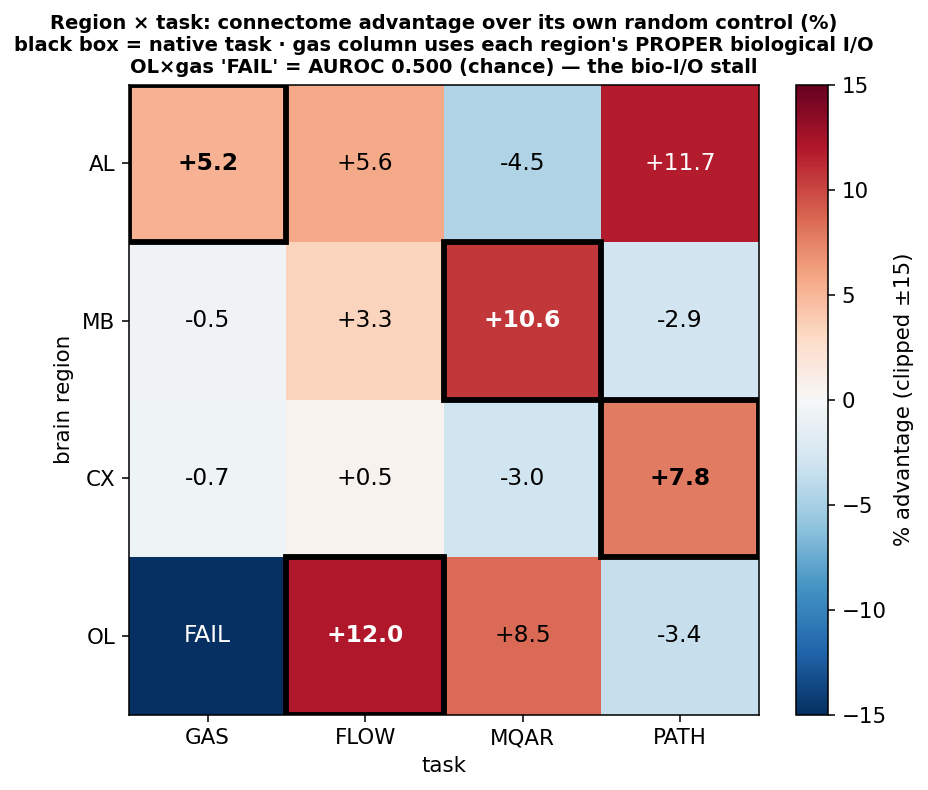
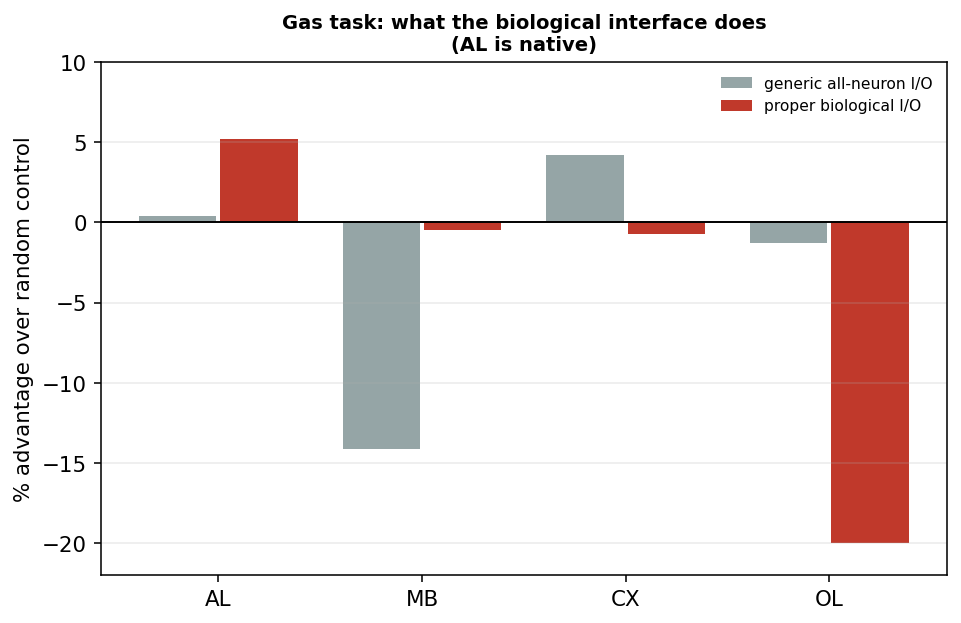

# Region × task matrix — the 4×4, and what "proper I/O" changes

Extends the earlier 3×3 grid (`docs/results/region_task_matrix`) to a **4×4** by adding the
**antennal lobe (AL)** as a fourth region and **turbulent gas detection** as a fourth task, and adds
the comparison that turns out to matter most: **every region running the gas task through its own
biological interface**, not a generic one.

**Alignment**, as tested here, means *a region's connectome beats its own matched random control
specifically on the task its region evolved for* — i.e. each row should peak on its native cell.

---

## TL;DR

- **The interface, not the wiring, is what decides whether a connectome helps.** On the gas task the
  AL connectome goes from **+0.4% (generic all-neuron I/O) → +5.2% (its own biological I/O)**. Same
  graph, same task, same controls — only the interface changed.
- **Column-wise, gas aligns** among the three *evaluable* regions: given each its own proper
  interface, **only the native region (AL) beats its controls** — AL +5.2%, MB −0.5%, CX −0.7%
  (OL not evaluable, see above). Caveat: CX later flipped sign (+2.3%) in a replication, so it sits
  at noise level.
- **Row-wise, AL does *not* align.** Its biggest advantage is on **path integration (+11.7%)**, not
  its native gas (+5.2%). MB, CX and OL *do* peak on their native task. (Caveat below: the path
  column runs frozen-recurrence, a regime that favours structure, so this row comparison is not
  apples-to-apples.)
- **The OL × gas cell is INVALID — a size-matching artifact** (corrected after follow-up). Its readout
  is left *disconnected* from its input by the N=3,499 cap (0/22 reachable; 3 hops in the full OL), so
  AUROC = 0.500 is forced. Treat that cell as "not evaluable", not as a biological failure.

---

## The matrix

Cell = connectome's advantage over its own **edge-random** control, in percent, sign-corrected so
positive = connectome better. Gas column uses each region's **proper biological I/O**.

| | GAS | FLOW | MQAR | PATH |
|---|---|---|---|---|
| **AL** | **+5.2** | +5.6 | −4.5 | +11.7 |
| **MB** | −0.5 | +3.3 | **+10.6** | −2.9 |
| **CX** | −0.7 | +0.5 | −3.0 | **+7.8** |
| **OL** | *n/a* (cap artifact) | **+12.0** | +8.5 | −3.4 |

Bold + boxed = the region's native task. The 9 flow/mqar/path cells for MB/CX/OL come from the prior
3×3 grid; the 7 new cells (whole gas column + the AL row) were run here.

### Row-wise alignment (does each region peak on its own task?)

| region | native | best cell | verdict |
|---|---|---|---|
| AL | gas (+5.2) | **path (+11.7)** | ✗ does not align |
| MB | mqar (+10.6) | mqar | ✓ aligns |
| CX | path (+7.8) | path | ✓ aligns |
| OL | flow (+12.0) | flow | ✓ aligns |

### Column-wise alignment on gas (proper I/O) — only the native region wins

| region | advantage |
|---|---|
| **AL (native)** | **+5.2%** |
| MB | −0.5% |
| CX | −0.7% |
| OL | *not evaluable* (readout disconnected by the cap) |

---

## The interface effect (the main new finding)

Same task, same graphs, same controls — only the I/O changes.

| region | generic all-neuron I/O | its own biological I/O |
|---|---|---|
| **AL** | +0.4% | **+5.2%** |
| MB | −14.1% | −0.5% |
| CX | +4.2% | −0.7% |
| OL | −1.3% | *not evaluable* |

Under **generic** I/O nothing separates — including the AL on its own native task (+0.4%, AUROC
difference 0.007). Give each region **its own** interface and the picture resolves: the native
region gains, the non-native regions flatten out, and the optic lobe collapses.

**Raw numbers, proper I/O, low-conc recall @10% false-alarm (6 seeds):**

| region | interface | connectome | degree-matched | edge-random |
|---|---|---|---|---|
| AL | ORN+TRN → ALPN | **0.700±0.027** | 0.666±0.022 | 0.665±0.040 |
| MB | ALPN → MBON | 0.665±0.019 | 0.663±0.023 | 0.668±0.018 |
| CX | ER+EPG → PFL+FS | 0.664±0.017 | 0.652±0.027 | 0.668±0.028 |
| OL | R1-6 → HS/VS | **0.000±0.000** | 0.635±0.032 | 0.688±0.021 |

### Why OL fails — CORRECTED: this cell is a size-matching artifact, not biology

**Do not cite this cell as a biological result.** Follow-up analysis (`docs/results/connectome_theory/`)
found that in the **size-matched** OL the 22 HS/VS output neurons are **completely unreachable** from
the R1-6 input pool (0/22 within 6 hops), which forces AUROC = 0.500 — the model literally cannot
compute anything. In the **full, uncapped** OL the pathway is intact and short: R1-6 → HS/VS in
exactly **3 hops**. The N=3,499 degree-based cap deleted the pathway, because the R1-6 → HS/VS route
runs through numerous *low-degree* retinotopic relay cells (R1-6 average only ~3.4 partners each) that
a degree-ranked cap systematically discards. The degree/random controls score 0.635/0.688 precisely
because rewiring **reconnects** the readout.

It was also wrong to call this a replication of the optic-lobe biological-I/O stall in
`docs/results/optic_flow_biological_io/`: that failure was *gradient starvation at depth* in the full
48k left OL, a different mechanism from outright disconnection here. Re-running OL × gas requires a
**pathway-preserving cap** (BFS along the R1-6 → HS/VS route) instead of a degree-ranked one.

---

## Method

**Size-matching + port preservation (`build_bioio_operators.py`).** Regions span 3.5k–97k neurons,
and the prior grid showed raw **capacity** — not biology — drove its MQAR "alignment" (subsampling OL
to MB's size collapsed OL's score). So every region is capped to a common **N = 3,499**. A plain
top-degree cap would delete the very neurons that make an interface biological, so we keep **all port
neurons first**, then fill with the highest-degree non-port neurons, and remap the port indices.
Where the input pool alone would blow the budget (OL: 7,931 R1-6) it is subsampled by degree to 40%
of N; outputs are never subsampled (OL has only 22).

| region | native N | capped N | input pool | output pool |
|---|---:|---:|---|---|
| AL | 3,499 | 3,499 | ORN+TRN/HRN (2,385) | ALPN (685) |
| MB | 14,025 | 3,499 | ALPN (406) | MBON (96) |
| CX | 7,349 | 3,499 | ER ring + EPG (307) | PFL + FS (327) |
| OL | 96,816 | 3,499 | R1-6 (1,399 of 7,931) | HS/VS (22) |

Ports were derived from FlyWire-783 cell types and independently checked — MB's ALPN/MBON assignment
was corroborated by ROI compartment profiles (ALPN presynaptic in calyx, MBON postsynaptic in lobes)
*and* by edge directionality, without relying on the annotation join alone.

**Capacity is matched by construction.** Every region gets the identical adapter (61 nonnegative
channels from the 10 input lines) and a fixed broadcast into its own input pool — the AL's real
glomeruli, a fixed seeded partition elsewhere — plus a linear head on its own output pool. So across
regions only *which neurons are the ports* and *the wiring between them* differ.

All 7 new cells ran on the AWS spot-GPU fleet (16 + 18 + 16 instances), 6 seeds for the gas cells,
5 for MQAR, 3 for flow/path.

**Metrics caveat:** a tie-handling bug meant a *constant-output* model scored AUPRC = 1.000 / F1 = 1.000
(fixed in `antennal_lobe_gas/common.py`). AUROC and recall@fixed-FPR were always correct, and all
figures/rankings here use those. Any AUPRC/F1 value for a **collapsed** arm in the committed CSVs is
not trustworthy.

---

## Caveats (load-bearing)

- **The row-wise comparison is regime-confounded.** The path column runs **frozen** recurrence
  (`--train-recurrent frozen`, the structure-only regime where wiring matters most); gas, mqar and
  flow train the recurrence. So AL's +11.7% on path is not directly comparable to its +5.2% on gas,
  and "AL peaks on path" should not be read as a clean alignment failure. The path *column* is
  internally consistent (all four regions frozen), so column-wise comparisons there are valid.
- **Mixed harnesses and metrics.** Each task uses its own established harness and metric (detection
  recall, recall accuracy, RMSE, loss). Cells are comparable in **sign and rough magnitude**, not as
  identical units. The prior grid's flow column also used *real DSEC* flow while the AL flow cell
  here uses the *synthetic* harness.
- **One connectome per region.** Seeds are training replicates for the connectome arm but independent
  graphs for the controls, so effect sizes overstate confidence; treat rank and sign as the evidence.
- **The AL flow cell is not clean.** AL beats `random_sparse` (+5.6%) but ties `random_weight_topology`
  (0.1160 vs 0.1157) — i.e. AL's *support* helps, its *weights* do not.

## Files

`build_region_operators.py` / `build_bioio_operators.py` (operators) · `ports/` (biological port
definitions) · `run_gas_column.py` (generic I/O) · `run_gas_bioio.py` (proper I/O) · `run_al_row.py`
(AL on foreign tasks) · `run.py` / `run_bioio_fleet.py` / `run_alrow_fleet.py` (fleet drivers) ·
`assemble_matrix.py` · `matrix_4x4.csv`, `gas_column_metrics.csv`, `gas_bioio_metrics.csv`,
`figures/`.
