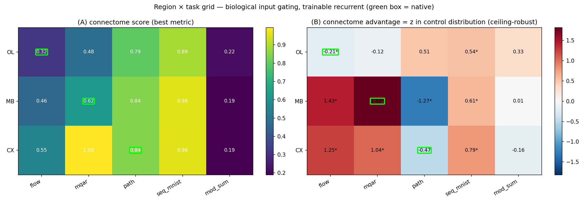

# Region × Task grid — does a region's connectome beat matched controls on *its own* task?

**Design.** 3 brain regions (OL, MB, CX) × 5 tasks × 4 wirings × 10 seeds = **600 runs**
(596 landed; the 4 missing are off-diagonal CX controls). Every run uses **biological input
gating** — external input is injected *only* into that region's real afferent cell types
(OL: 9,319 lamina/photoreceptor; MB: 168 odour projection neurons; CX: 741 sensory-pool
cells) — with a **trainable recurrent** matrix and a **free readout**. The four wirings share
the *identical* biological input pool and differ only in the recurrent graph:

| wiring | what it holds fixed |
|---|---|
| `connectome` | the real FlyWire/hemibrain graph |
| `degree_preserving` | in/out-degree + weight multiset preserved, topology randomized |
| `weight_shuffle` | topology fixed, weights permuted |
| `random_sparse` | edges scattered, density matched |

All controls are ρ≈0.95 spectral-radius matched. **Native diagonal** (region's biological
function): OL×flow, MB×mqar, CX×path.

**Metric — ceiling-robust effect size.** We report `z = (connectome_mean − control_mean) /
control_std` — where the connectome falls in its own control distribution — *not* raw
Δaccuracy. Raw Δ is confounded by each task's ceiling: a near-ceiling cell shows a smaller raw
gap for the same underlying effect. (Concretely: raw Δ ranks CX×mqar +0.233 above MB×mqar
+0.123, but CX×mqar sits at 0.995 — near the 1.0 ceiling — so its raw gap is inflated. The
z-score correctly ranks **MB×mqar 1.82 > CX×mqar 1.04**.) Stars = paired-t p<0.05 across seeds.



## Headline: the clean diagonal did **not** emerge

**Native-diagonal mean z = +0.38 ≈ off-diagonal mean z = +0.41.** The connectome's
advantage, where it exists, is **not aligned to each region's biological function**. The "each
region is best at its own task" hypothesis is not supported by the grid.

## Connectome advantage (z in control distribution)

|        | flow | mqar | path | seq_mnist | mod_sum |
|--------|------|------|------|-----------|---------|
| **OL** | −0.21* `[native]` | −0.12 | +0.51 | +0.54* | +0.33 |
| **MB** | +1.43* | **+1.82*** `[native]` | −1.27* | +0.61* | +0.01 |
| **CX** | +1.25* | +1.04* | −0.47 `[native]` | +0.79* | −0.16 |

What actually shows up:

1. **MB×mqar is the single strongest cell (z = +1.82).** The mushroom-body connectome — the
   insect associative-memory centre — genuinely helps **multi-query associative recall**. This
   is the one place structure↔function holds, and it survives the 168-PN input bottleneck.
2. **Two of three native hypotheses fail.** OL×flow (z = −0.21) and CX×path (z = −0.47) show
   **no** native advantage — matched-random controls do as well or slightly better. Notably
   **CX, the actual path-integration circuit, does not beat its controls on path integration.**
3. **MB & CX connectomes give a *general* boost, not a native one.** Both light up broadly on
   the fast-learning tasks (flow, mqar, seq-MNIST); OL contributes ~nothing anywhere (MB row
   mean z +0.52, CX positive, OL ≈ 0). MB×mqar (1.82) is only modestly above MB×flow (1.43),
   so the native-specificity is weak — most of the MB/CX signal is a general easy-task
   optimization advantage of the real topology as an *initialization*, unrelated to function.
4. **Path integration resists every connectome** (MB −1.27, CX −0.47, OL +0.51 n.s.). Path
   reaches R²≈0.85 for *all* wirings — biological pools + a trainable recurrent are sufficient,
   and the specific ring-attractor topology adds nothing trainable on top.
5. **mod_sum is uninformative** — every wiring sits at ~0.19 ≈ chance (1/7); the task is not
   learnable through these constraints, so its row carries no signal.

## Interpretation

Consistent with the project's central finding: once you hold the **biological input pool** and
the **degree/weight profile** fixed, a region's *specific* connectome topology is largely
**fungible with matched-random wiring**. The connectome behaves like a mildly-better-conditioned
initialization for MB and CX on easy tasks — not a task-specialized circuit. The one genuine
exception is **MB associative recall**.

## Caveats (read before citing)

- **Path may be ceiling-compressed** (~0.85 for all wirings) — its negative z is partly range
  compression, not necessarily a true anti-advantage. A harder path variant is needed to
  separate these.
- **Free readout, not output-gated.** Full biological *output* gating was unlearnable for these
  generic tasks (readout collapses), so output is free over all neurons; only input is
  biologically gated. This is the honest limit of the "biological I/O" constraint here.
- **Connectome-as-init, not reservoir.** The recurrent matrix is trainable, so this tests the
  connectome as an *initialization*. A frozen-recurrent (reservoir) version could differ.
- **MB×mqar native-specificity is weak** — biggest cell, but MB×flow is close behind; the
  effect is better described as "MB/CX connectomes help easy tasks generally" than "each region
  excels at its native task."

## Reproduce

```
# per cell (region × task × wiring × seed):
python scripts/grid/run_pool_gated_grid.py --region MB --task mqar --model connectome \
    --seed 0 --io-mode input_gated --weight-decay 0.05 --out out.npz
# fleet (600 cells over 40 g6.xlarge):
scott/aws_fleet/launch_fleet.sh   # experiment_region_task_grid
# analysis + figure:
python scripts/figures/plot_region_task_grid.py outputs/runs/region_task_grid
```
