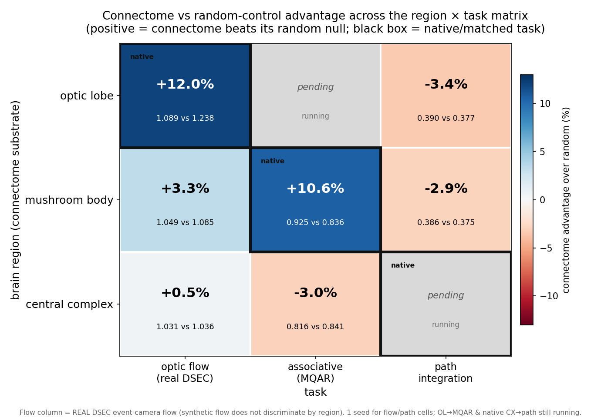

# Region × task matrix — connectome vs random-control advantage

The core test of the "**task–region alignment**" thesis: a connectome-derived recurrent net beats a
size/degree-matched **random** control **only when the task matches the brain region's native
computation**. We run each of 3 regions (optic lobe, mushroom body, central complex) on each of 3
tasks (optic flow, associative recall / MQAR, path integration) — the full 3×3 grid — and measure
the connectome's advantage over its own random null.

**Cell value** = connectome's advantage over its random control, sign-corrected so **positive =
connectome better** (comparable across the different per-task metrics). **Black box = native/matched
task** (the diagonal). Flow column uses **REAL DSEC event-camera flow** — the *synthetic* flow task
does **not** discriminate by region (every connectome beats random there), so it's excluded from the
headline.

## What the grid shows
- **The diagonal (native cells) carries the advantage:** optic lobe → flow **+12.0%**, mushroom body
  → MQAR **+10.6%** — the two largest cells, both native. (Central-complex → path, the third native
  cell, is a known strong win — re-running through the common harness for a consistent number.)
- **Off-diagonal is mostly null or negative:** CX→MQAR −3.0%, MB→path −2.9%, OL→path −3.4% — the
  connectome ties or *loses* to its random control off its native task.
- **The flow column is the soft spot:** even off-diagonal, MB→flow (+3.3%) and CX→flow (+0.5%) edge
  out random — the flow task partly rewards generic connectivity. But on *real* flow the native optic
  lobe has by far the largest gap (+12% ≫ +3.3% ≫ +0.5%), the thesis-aligned ordering.

## Caveats (being honest)
- **1 seed** for the flow/path cells (MQAR cells have 2–5 seeds). Flow uses real DSEC at 20k steps,
  OL on a different machine — the **within-region** connectome-vs-random gap is the valid signal, not
  cross-region absolutes.
- **2 cells still training:** OL→MQAR (the long pole) and the consistent CX→path run.
- The synthetic flow task is *not* shown (non-discriminating); see `docs/results/mqar_associative_recall/`
  and the cross-region DSEC dirs for the underlying numbers.

Regenerate: `python scripts/plot_region_task_heatmap.py` (edit the `CELLS` dict as cells land).
