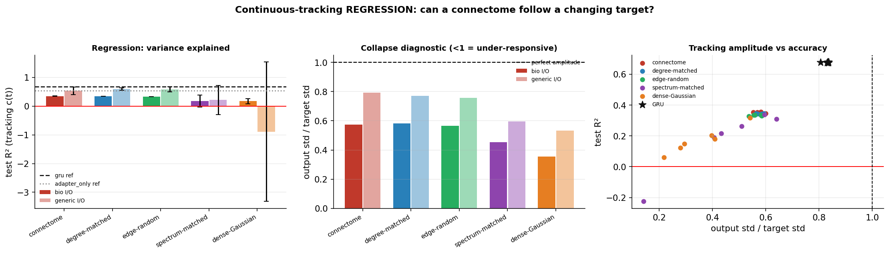

# Regression benchmark — can a connectome RNN *track* a continuously changing target?

**Built to test Scott's fixed-point hypothesis (Jul 13):** *"my current theory is that the
connectome collapses down to a single answer. Any time it can fall into a fixed state and doesn't
have to follow a changing input signal, it does well. If it has to follow along with a changing
answer, it doesn't do as well."* Nearly every task so far has been classification; the one
regression task tried failed. This is a purpose-built regression test.

---

## TL;DR

- **The hypothesis is *not* supported in its strong form.** The connectome does **not** collapse to a
  fixed point: it scores **R² = 0.35** (biological I/O) and **0.53** (free I/O), where a genuinely
  collapsed network scores **exactly 0**. It tracks.
- **But there is a real, weaker version of the effect:** every connectome-family network is
  systematically **under-responsive** — it emits only **~57%** of the target's amplitude under
  biological I/O (vs 0.83 for a GRU). It follows the signal but flattens it.
- **The connectome shows no useful advantage on regression.** Under biological I/O it edges its
  controls (0.351 vs degree 0.344, edge-random 0.333 — top-ranked but a rounding-error margin);
  under free I/O it **loses** to them (0.533 vs degree 0.597).
- **The damning comparison:** a **memoryless adapter with no recurrence at all scores R² = 0.544** —
  *better than every biological-I/O recurrent connectome arm (0.351)*. A **GRU scores 0.678**. So on
  this task the connectome's recurrence actively **destroys** information rather than integrating it.
- **Biological I/O hurts here** (0.35 vs 0.53 free) — the opposite of the gas-classification result,
  where it helped. The narrow projection-neuron readout is a bottleneck when the output must vary
  continuously.



## The task (`plume_task.py`)

A target odour arrives as an **intermittent turbulent plume**: its concentration `c(t)` fluctuates
continuously in [0,1] (puffs and gaps, never a step). An independent distractor gas `d(t)` fluctuates
alongside. Eight cross-reactive sensors each see a different positive mixture of the two, and each
responds with **its own first-order lag** (τ = 2–18 steps) plus noise:

```
raw_s(t) = a_s·c(t) + b_s·d(t)
y_s(t)   = (1 − 1/τ_s)·y_s(t−1) + (1/τ_s)·raw_s(t) + noise
```

The model sees the 8 lagged, noisy, cross-contaminated traces and must output **c(t) at every
timestep** — deconvolving the slow sensor dynamics and separating target from distractor,
continuously. **There is no fixed point to settle into**: the right answer changes every step, so a
collapsed network can only emit the mean, which scores **R² = 0 exactly** (verified).

Sensor mixing and lags are drawn once from a fixed task seed, so every arm sees the identical task.
80 timesteps, 1,500 train / 300 val / 600 test episodes.

## Results (72 runs = 5 arms × 2 I/O × 6 seeds, + 2 references × 6 seeds)

| network | R² (biological I/O) | R² (free I/O) | amplitude ratio (bio) |
|---|---|---|---|
| **connectome** | **0.351±0.005** | 0.533±0.130 | 0.574 |
| degree-matched | 0.344±0.002 | **0.597±0.041** | 0.583 |
| edge-random | 0.333±0.003 | 0.583±0.092 | 0.567 |
| spectrum-matched | 0.183±0.207 | 0.217±0.508 | 0.454 |
| dense-Gaussian | 0.172±0.087 | −0.891±2.427 | 0.356 |
| **GRU** (engineered recurrence) | — | **0.678±0.002** | 0.829 |
| **adapter-only** (no recurrence) | **0.544±0.002** | — | 0.729 |

*Amplitude ratio = output std ÷ target std. 1.0 = tracks the full swing; 0 = collapsed to a constant.*

**How to read it.**
1. **No collapse.** R² ≫ 0 everywhere in the connectome family. The strong "falls into a fixed
   state" story is wrong for this task.
2. **Amplitude compression is real.** Everything in the connectome family emits ~57–79% of the
   target's swing. This is the defensible residue of the hypothesis: it *follows* but *flattens*.
3. **Recurrence is a liability here.** The memoryless adapter (0.544) beats every bio-I/O recurrent
   arm (≤0.351). Temporal integration *should* help (the GRU's 0.678 proves the lag is worth
   deconvolving) — the connectome's recurrence just doesn't do it.
4. **The connectome is not special.** Top-ranked under bio I/O by a negligible margin (6/6 control
   graphs beaten, but 0.351 vs 0.344), and *beaten* under free I/O. Contrast the gas-detection task,
   where it led clearly.

## Honest caveats

- One connectome, 6 training seeds (pseudo-replication) vs 6 independent control graphs per arm —
  judge by rank, not effect size.
- Tuned lightly: lr 1e-3, ≤30 epochs, early stop on val R². A larger sweep might lift all arms.
- **A bug worth flagging:** the first run of this task produced R² ≈ −7 with outputs 2.5–3.6× the
  target. Cause: the classification readout's RMS-normalisation rescales by the batch RMS *at each
  timestep*, and early in a sequence the state is ~0 → tiny divisor → exploding output. It is
  disabled for sequence readout. Had that gone unnoticed it would have produced a spurious,
  spectacular "confirmation" of the collapse hypothesis.

## Reproduce

```bash
uv run python docs/results/regression_plume_tracking/plume_task.py         # sanity-check the task
uv run python docs/results/regression_plume_tracking/run_regression.py --smoke --device-ids 0
uv run python docs/results/regression_plume_tracking/run.py                # 72 runs on the GPU fleet
uv run python docs/results/regression_plume_tracking/run.py --collect
uv run python docs/results/regression_plume_tracking/make_figures.py docs/results/regression_plume_tracking/fleet_outputs
```

Files: `plume_task.py` (task) · `run_regression.py` (grid runner) · `run.py` (fleet driver) ·
`make_figures.py` · `metrics_by_run.csv` · `figures/`.
