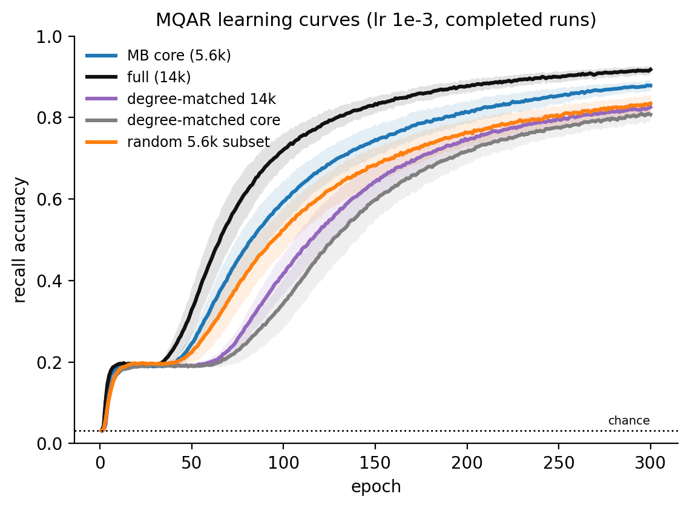
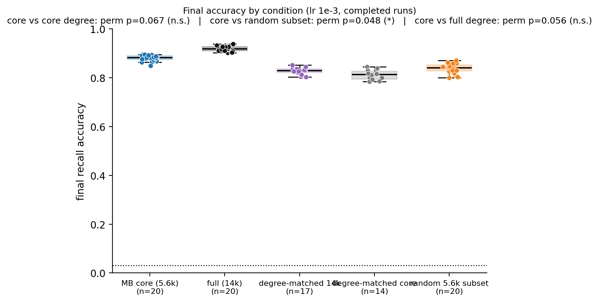
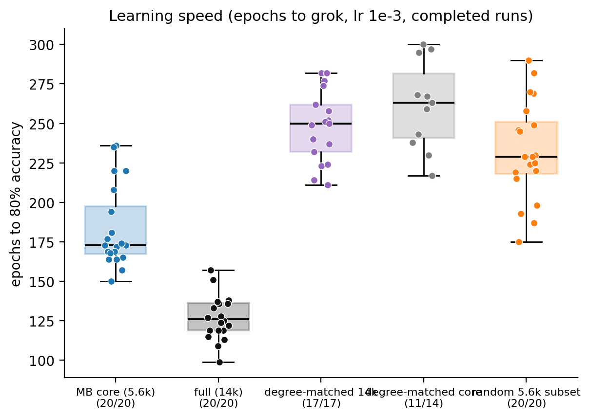
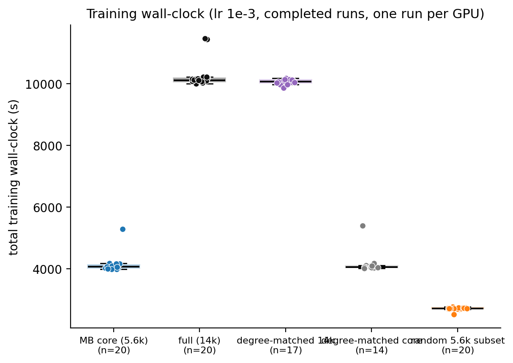
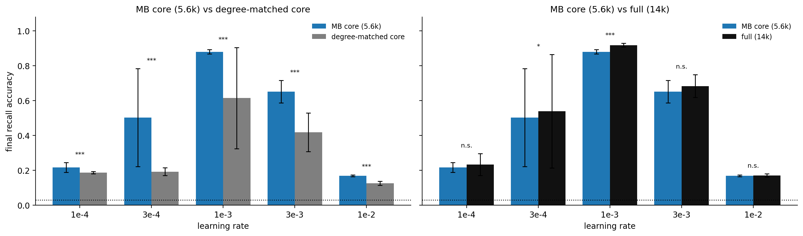

# 2026-06-19 — Experiment 2: MB-core pruning vs the full 14k FlyWire substrate on MQAR

## Purpose

Experiment 1 established that the FlyWire `flywire_mushroom_body` substrate's wiring beats
degree-matched random wiring on MQAR at matched spectral radius. But that substrate is not the
mushroom body. A cell-type join against the FlyWire whole-brain annotations (Schlegel et al.,
*Nature* 2024; release 783; joined on `root_id == bodyId`, **100% of the 14,025 neurons matched**)
shows the substrate is an **MB-neuropil-anchored subgraph**, selected by the connectome-prep rule
"any neuron with ≥1 synapse in an MB neuropil, no threshold" (`src/acquire.py:382-395`). Its
composition:

- **Strongly-attached MB core, ~5,608 neurons (40% of nodes, 76.5% of edges):** Kenyon cells
  5,177 · MBON 96 · DAN 331 · MBIN/APL 4. Median ~84% of these neurons' synapses are in the MB.
- **Weakly-attached halo, ~8,417 neurons:** 639 **central-complex** neurons, ~7,146 unlabeled
  (fragments / passing fibers), and ~630 others (ALPN, TuBu, AN, LH types…). Median ~1.5% of
  their synapses are in the MB — i.e. boundary leakage in the synapse→neuropil assignment, plus a
  little genuine sparse cross-talk, not MB membership. (CX neurons: median 0.8% MB-fraction.)

So Exp 1's "MB connectome" was an MB core diluted with an arbitrary, build-rule-dependent halo.
This experiment prunes to the canonical MB core and asks three questions on the *same* MQAR task,
with **initial spectral radius held fixed at the full substrate's ρ (0.95) across every
condition** (Exp 1's central confound), so only topology / size / which-neurons vary:

1. **Does Exp 1's finding survive pruning?** — MB `core` vs degree-matched MB cores (`core_degree`).
   If the core still beats its degree-matched null, the wiring advantage is *intrinsic to the MB
   circuit*, not carried by the halo. If it collapses, the halo was doing the work — equally
   informative, and a direct robustness check on Exp 1's headline.
2. **Is the advantage the *right* subset, or just being smaller?** — `core` vs random same-size
   (5,608-node) induced subgraphs of the 14k (`random_subset`). `core` > `random_subset` ⇒ the MB
   module specifically; `core` ≈ `random_subset` ⇒ pruning helps but it is size, not MB-ness.
3. **What does pruning buy?** — `core` vs `full` 14k: final test accuracy **and** learning speed
   (epochs / gradient-steps / wall-clock to grok, plus total wall-clock). The biological hypothesis
   is that the correct subset can be pruned with no accuracy loss and a real speed/efficiency gain.

The biological-I/O question (PN/KC input → MBON output) is **not** in this experiment — I/O stays
generic all-neuron, identical to Exp 1, and is deferred to Experiment 3 (the annotation join built
here also supplies the cell-type labels that experiment needs).

## Methods

**Substrate / core definition.** Full substrate = the Exp 1 adjacency
(`connectomes/flywire_mushroom_body/adjacency_unsigned.npz`, 14,025 × 14,025, 574,660 edges). The
MB core is the induced subgraph on neurons with FlyWire `cell_class ∈ {Kenyon_Cell, MBON, DAN,
MBIN}` (APL is annotated MBIN, so included; **ALPN — the antennal-lobe olfactory input — is
excluded**, it is not MB-intrinsic and is reserved for Exp 3). Core = 5,608 neurons, 439,603 edges,
fully connected (largest weakly-connected component 5,606/5,608). The core-node indices into the
adjacency are precomputed once by `build_mb_core.py` → `substrate/core_indices.npy` (staged with
the code so the fleet never needs the 32 MB annotation table).

**Conditions, all ρ-rescaled to the full substrate's measured ρ = 0.95.** Spectral radius is
matched across every condition exactly as in Exp 1, so recurrent gain is held fixed and is not a
confound for any comparison. Four conditions are trained here; a fifth (`full_degree`) is **ported
from Exp 1 subrun 03** rather than re-trained (see below).

| condition | construction | replication | raw ρ before rescale |
|---|---|---|---|
| `core` | induced MB-core subgraph | 1 graph × 20 training seeds | 0.923 |
| `full` | full 14,025-node substrate | 1 graph × 20 training seeds | 0.950 |
| `core_degree` | degree-preserving rewiring of the core (`degree_preserving_random_like`) | 20 graphs | ~0.18 |
| `random_subset` | random 5,608-node induced subgraph of the 14k | 20 graphs | ~0.44 |
| `full_degree` | degree-matched rewiring of the **full 14k** — Exp 1 subrun 03's `control` arm, **ported** | 20 graphs | ~0.20 |

**Ported 14k degree-matched control (`full_degree`).** Exp 1 subrun 03 already trained 20
degree-matched controls of the *full* 14k substrate (300 ep, 5 lr, ρ=0.95) — the same arm that gave
Exp 1's headline. Rather than re-run it, `port_14k_controls.py` copies those finished `control_g*`
runs into Exp 2's outputs as `full_degree_g*` (patching `condition`/`run_id`). Because Exp 2 reuses
Exp 1's exact `train_one_run`, task, lr grid, and ρ-target, the ported runs are equivalent to
re-generating them. Accuracy and epochs/steps-to-grok are hardware-independent and fully comparable;
wall-clock is comparable in kind (same g6.xlarge/L4 fleet, one run per GPU) but from a separate run,
so treat the core-vs-`full_degree` wall-clock delta as indicative. This adds two analyses: **(4)
`core` vs `full_degree`** — is the 5.6k pruned MB better than the 14k degree-matched control? — and
`full` vs `full_degree`, which reproduces Exp 1's headline inside Exp 2 as a consistency check.

`core`/`full` are connectome-like (one real graph; the 20 seeds vary training noise, not the graph
— pseudo-replication, so the permutation test against a graph-null is primary). `core_degree`/
`random_subset` are control-like (independent graphs forming the null distributions). Note
`random_subset` is genuinely sparser than the core (~94k vs ~440k edges) — a random brain chunk is
less interconnected than the MB module; that density difference is *part* of what makes the MB the
"right" subset and is reported transparently, not matched away.

**Task / model / training — identical to Exp 1.** Faithful MQAR imported from
`scripts/mqar/run_mqar_associative_recall.py` (D=8 key→value pairs, Q=8 queries, vocab=32, no
reversals, chance ≈ 0.031). `MatrixEpisodicRNN`, sparse-trainable recurrence on a fixed support,
**generic all-neuron I/O**, ReLU recurrence (1 step/token), Adam, batch 64, grad-clip 1.0. The
training loop and analysis primitives are imported verbatim from the Exp 1 engine
(`run_experiment.py` reuses `exp1.train_one_run`, `exp1._empirical_null`, …) so cross-experiment
numbers — especially wall-clock and grok — are directly comparable. One run per GPU
(`WORKERS_PER_INSTANCE=1`) so the core-vs-full wall-clock comparison is a fair hardware measurement
(the 5.6k core may not saturate an L4, but neither arm shares a GPU).

**Budget / stopping — identical to Exp 1.** 300-epoch cap (200 train-batches/epoch), early-stop on
convergence (best val ≥ 0.995) or 40-epoch plateau patience; per-epoch checkpoint + resume +
skip-if-done; per-graph lr sweep over {1e-4, 3e-4, 1e-3, 3e-3, 1e-2}, best lr per unit chosen on
**validation** accuracy before any comparison.

**Design / scale.** 20 core + 20 full + 20 core_degree + 20 random_subset = 80 units × 5 lr =
**400 runs**, sharded across the AWS spot-GPU fleet (same harness as Exp 1 subrun 03), launched by
`run.py` (all parameters pinned as constants). ~3/4 of the runs are on the cheaper 5.6k core, so
total cost is ~1.2–1.6× Exp 1.

**Readouts (per the experiment's questions).**
- *Q1/Q2 (permutation-null, primary):* test accuracy of `core` vs each control distribution; the
  one-sided permutation p = fraction of control graphs ≥ the core mean (+1 smoothing). 20 controls
  → finest p = 1/21 ≈ 0.048.
- *Q3 (descriptive size comparison):* `core` vs `full` — final test accuracy, epochs / cumulative
  gradient-steps / wall-clock to first reach {0.80, 0.90, 0.95}, and **total training wall-clock**.
  Both are single graphs × 20 training seeds, so this is reported as means ± SD and deltas with a
  secondary rank-sum, *not* a null test (no graph-level replication).

**Statistical honesty carried from Exp 1.** Permutation test primary (the core arm is 20
training-seed replicates of one graph — pseudo-replication); rank-sum secondary with that caveat;
ρ matched everywhere; per-graph lr tuned so a single shared lr cannot handicap an arm.

## Run log

Built and validated locally 2026-06-19; launched on the AWS spot-GPU fleet 2026-06-20 (`run.py`; 400
runs = 80 units × 5 lr, 300-epoch cap; isolated S3 area `s3://…/pathint-exp02-core/`). 4 of the 64
spot instances were preempted mid-shard, leaving 26 runs incomplete (374/400); the logs showed no
errors (only the benign sparse-invariant warning), and the gap was the expected preemption pattern
(4 resumable partials with checkpoints + 22 never-started shard tails). A top-up re-run resumed the 4
partials from their S3 checkpoints and ran the 22 remaining to reach 400/400. The 14k degree-matched
control (`full_degree`, 100 runs) was then ported in from Exp 1 subrun 03 (`port_14k_controls.py`)
and the full set re-analyzed (`run.py --collect`) — 500 runs aggregated.

## Results (concluded 2026-06-21; 400 trained + 100 ported = 500 runs)

**Pruning the 14,025-neuron FlyWire "mushroom body" substrate to the ~5.6k canonical MB core keeps
essentially all of the connectome's MQAR advantage. The MB core beats every control — a
degree-matched core, a random same-size subgraph, and the full 14k's degree-matched control — and
trains ~2.5× faster in wall-clock than the full substrate, for ~0.04 less final accuracy.**

**Reporting basis (revised — see 2026-06-21 (cont.)).** All conditions are compared at the **shared
optimum lr = 1e-3** (every condition's best lr), using **completed runs only** — runs that the
patience=40 early-stop cut before the 300-epoch budget are excluded, since they are not a fair
measure at that lr (they sit on a pre-grok plateau when cut). This drops the slow degree-matched
graphs, lowering control n to 14 (`core_degree`) / 17 (`full_degree`); `core`/`full`/`random_subset`
keep all 20. All ρ-matched to 0.95.

| condition | final test acc (lr 1e-3, completed) | n | total wall-clock |
|---|---|---|---|
| `full` (14k) | 0.919 ± 0.010 | 20 | 10,238 s |
| **`core` (5.6k MB)** | **0.881 ± 0.012** | 20 | 4,128 s |
| `random_subset` (random 5.6k) | 0.838 ± 0.020 | 20 | 2,704 s |
| `full_degree` (14k degree-matched, ported) | 0.827 ± 0.013 | 17 | 10,056 s |
| `core_degree` (5.6k degree-matched) | 0.811 ± 0.019 | 14 | 4,154 s |

**Primary statistic — the rank (empirical-null).** There is one connectome graph (the 20 seeds are
training-noise replicates), so the valid test is where that one graph falls in the distribution of
control graphs: **0 of N control graphs reach the MB core's mean in every comparison** (0/14, 0/20,
0/17). The connectome sits at the 100th percentile of every null ensemble. The one-sided permutation
p equals the resolution floor 1/(n+1) — now 0.067 / 0.048 / 0.056 — because we have fewer control
graphs, *not* because the effect weakened; the conclusion rests on the rank, not on a 0.05 threshold.
Mann-Whitney (secondary) gives p ≈ 1e-7 but is anti-conservative (it treats the 20 connectome
training-replicates as independent graphs — pseudo-replication).

- **Q1 — Exp 1 holds at core scale.** `core` 0.881 vs `core_degree` 0.811; 0/14 controls reach the
  core mean (perm p = 0.067, MWU 5e-7); complete separation (core's worst 0.850 > the best
  `core_degree` 0.845). The wiring advantage over degree-matched random survives pruning — intrinsic
  to the ~5.6k MB core, not the ~8.4k weakly-attached halo. The clean same-size / same-degree test.
- **Q2 — the right subset, not just smaller.** `core` 0.881 vs `random_subset` 0.838; 0/20 reach the
  core mean (perm p = 0.048). A random same-size chunk of the 14k is a strong substrate (0.838,
  despite ~94k vs ~440k edges), but the MB core still beats it.
- **Q4 — the pruned core beats the 14k degree-matched control.** `core` 0.881 vs `full_degree` 0.827;
  0/17 reach the core mean (perm p = 0.056). The 5.6k biological core outperforms a degree-matched
  random network with 2.5× the neurons.
- **Reproduction check.** `full` 0.919 vs `full_degree` 0.827; 0/17 (perm p = 0.056), complete
  separation. (`full_degree` *is* Exp 1's control: in the as-Exp-1-reported view that includes the
  patience-cut runs it is 0.769, matching Exp 1's 0.918 vs 0.769 — same data, the 0.827 here is the
  completed-runs subset.)

**Q3 — what pruning buys (`core` vs `full`; descriptive, both one graph × 20 seeds).** The speed
story depends on the metric:
- Final accuracy: 0.881 vs 0.919 — pruning costs ~0.04.
- Learning speed in *epochs*: core is **slower** — ~183 vs ~127 epochs to 80% (the smaller network
  needs more passes to grok).
- Learning speed in *wall-clock*: core is **~2.5× faster** — 4,128 vs 10,238 s — because each epoch
  on 5.6k neurons / 440k edges is far cheaper than on 14k / 575k, more than offsetting the extra
  epochs. So pruning is a clear practical win on wall-clock and a near-wash on accuracy.

**Secondary observation.** `core_degree` (0.811) is the lowest condition — below even the random
same-size subgraph `random_subset` (0.838). Degree-preserving rewiring of the compact MB core is
more destructive than randomly sub-sampling the brain, consistent with the core's structure being
load-bearing, though we have not isolated the mechanism.

**Honest limits.**
- *Excluded data may flatter the controls.* Reporting only completed runs drops the slow
  degree-matched graphs entirely; if those graphs would have finished below the survivors, the
  control means here are an over-estimate and the connectome edge is therefore **conservative**. The
  alternative all-graphs view (best-lr-per-unit, which scores the slow graphs at lr=3e-3 ~0.44) keeps
  n=20 and gives `core_degree` 0.701 / `full_degree` 0.769 at perm p = 0.048; the conclusion is the
  same under both. See 2026-06-21 (cont.).
- *Reduced null resolution.* Dropping controls coarsens the permutation floor to ~0.06; **a re-run
  with more control graphs** (e.g. 40–60 degree-matched draws) would restore p < 0.05 — a worthwhile
  future improvement, since the rank is already maximal (0/N).
- *Cross-size comparisons.* `core` vs `full` / `full_degree` change N (5.6k vs 14k) alongside
  topology. Q1 (`core` vs `core_degree`) is the clean same-size / same-degree test, and it is positive.
- *Pseudo-replication.* `core`/`full` are 20 training-seed replicates of one graph each; the
  empirical-null/rank is the valid statistic, rank-sum is secondary.
- *Generic all-neuron I/O.* Input/readout still touch all neurons, so a trainable readout can route
  around the wiring (as in Exp 1). Biological PN/KC→MBON I/O is Experiment 3.
- *Ported wall-clock.* `full_degree` came from a separate (same-hardware, one-run-per-GPU) fleet run,
  so its wall-clock is indicative, not measured in this run.

### Figures

fig1–4 use the **lr = 1e-3 cohort, completed runs only** (patience-cut runs excluded) — matching the
reporting basis above. fig5 keeps **all** runs at every lr (the raw per-lr diagnostic). **Permutation
p / rank** (one-sided empirical-null; the real graph vs the control-graph distribution; floor =
1/(n+1)) is the **primary** test; **Mann-Whitney** is secondary and anti-conservative
(pseudo-replication — the 20 connectome runs share one graph). With the patience-cut runs excluded
the degree-matched controls are now **unimodal** (their genuine slow graphs, the low mode, were the
cut runs — see the 2026-06-21 (cont.) investigation).

*fig1 — recall-accuracy curves at lr 1e-3, completed runs (band = ±1 SD). `core` tracks just below `full`; the controls trail.* Endpoint accuracies (pairwise tests under fig2):

| condition | final acc (lr 1e-3, completed) | n |
|---|---|---|
| `full` (14k) | 0.919 ± 0.010 | 20 |
| `core` (5.6k MB) | 0.881 ± 0.012 | 20 |
| `random_subset` (5.6k random) | 0.838 ± 0.020 | 20 |
| `full_degree` (14k degree-matched) | 0.827 ± 0.013 | 17 |
| `core_degree` (5.6k degree-matched) | 0.811 ± 0.019 | 14 |

*fig2 — final test accuracy at lr 1e-3, completed runs (box + per-run dots). The MB core beats all three controls; it sits just under the full 14k.*

| comparison | mean (A vs B) | rank (controls ≥ A mean) | perm p (floor) | MWU p (secondary) |
|---|---|---|---|---|
| core vs core_degree | 0.881 vs 0.811 | **0 / 14** | 0.067 | 5e-7 |
| core vs random_subset | 0.881 vs 0.838 | **0 / 20** | 0.048 | 1e-7 |
| core vs full_degree | 0.881 vs 0.827 | **0 / 17** | 0.056 | 1e-7 |
| full vs full_degree | 0.919 vs 0.827 | **0 / 17** | 0.056 | 1e-7 |
| core vs full (descriptive, cross-size) | 0.881 vs 0.919 | — | — | — |

*fig3 — learning speed in epochs to 80% (lr 1e-3, completed runs). The core groks faster and more reliably than every control, but is slower than the full 14k.*

| condition | epochs to 80% | reached 80% |
|---|---|---|
| full | 127 | 20/20 |
| core | 183 | 20/20 |
| random_subset | 233 | 20/20 |
| full_degree | 248 | 17/17 |
| core_degree | 262 | 11/14 |

(`core` needs *more* epochs than `full` — the trade for its much lower per-epoch cost, fig4 — but groks faster and more reliably than every control.)

*fig4 — total training wall-clock (lr 1e-3, completed runs). The core trains ~2.5× faster than the full 14k; same-size conditions cost the same.*

| condition | total wall-clock (s) |
|---|---|
| full | 10,238 |
| full_degree | 10,056 |
| core_degree | 4,154 |
| core | 4,128 |
| random_subset | 2,704 |

(Wall-clock tracks size/density, not topology: `core` ≈ `core_degree` (same size); `random_subset` faster (sparser, ~94k edges); the ~2.5× saving is `core` vs the 14k conditions.)

*fig5 — final accuracy per lr (all runs, not just best). The core's edge over both degree-matched controls holds at every lr; it trails `full` only near the shared 1e-3 optimum. Within-lr Mann-Whitney (two-sided), mean acc A vs B:*

| lr | core vs core_degree | core vs full | core vs full_degree |
|---|---|---|---|
| 1e-4 | 0.216 vs 0.187 (p=2e-7) | 0.216 vs 0.234 (p=0.08) | 0.216 vs 0.188 (p=2e-6) |
| 3e-4 | 0.503 vs 0.203 (p=1e-5) | 0.503 vs 0.554 (p=0.01) | 0.503 vs 0.318 (p=9e-3) |
| 1e-3 | 0.881 vs 0.625 (p=7e-8) | 0.881 vs 0.919 (p=7e-8) | 0.881 vs 0.733 (p=8e-8) |
| 3e-3 | 0.659 vs 0.420 (p=1e-7) | 0.659 vs 0.683 (p=0.31) | 0.659 vs 0.391 (p=1e-7) |
| 1e-2 | 0.169 vs 0.126 (p=7e-8) | 0.169 vs 0.170 (p=1.0) | 0.169 vs 0.116 (p=7e-8) |

Data: `outputs/{analysis.json, metrics_by_run.csv, lr_selection.csv}`, per-run curves under `outputs/runs/*/`.

### Next steps
**Experiment 3:** biologically-correct I/O (PN/KC input → MBON output) on the MB core, using the
cell-type labels from the annotation join built here — the last Exp-1 confound (generic all-neuron
I/O lets a trainable readout bypass the wiring).

---

## 2026-06-21 (cont.) — Why the degree-matched controls look bimodal

The degree-matched controls are visibly bimodal in fig2 (final accuracy) and fig4 (wall-clock),
while `core`/`full`/`random_subset` are tight. Investigated; the short answer is **genuine
graph-to-graph learnability variance, partly exaggerated in the figures by the patience early-stop —
but the headline numbers are not a stopping artifact.**

**The bimodality in wall-clock and accuracy is one phenomenon.** At lr=1e-3 (the cohort fig2/fig4
plot), wall-clock and final accuracy correlate almost perfectly within the controls (Pearson r =
**+0.98** core_degree, **+1.00** full_degree; r(epochs, acc) = +1.00), and not at all in the
connectome (core +0.19 n.s., full +0.27 n.s.). Mechanism: a "failed" control plateaus at val ≈ 0.19
and is cut by the patience=40 early-stop at ~64 epochs → low epochs → low wall-clock; a "successful"
one keeps improving to the 300-epoch cap → high wall-clock. So `wall ∝ epochs_ran`, and `epochs_ran`
is bimodal (≈64 vs 300) tracking success/failure. The connectome never plateau-stops (best_epoch
≈ 299, all runs hit the cap) → unimodal, tight wall-clock.

**But it is *not* purely a stopping artifact (this corrects a first reading).** The headline analysis
selects **best lr per unit by validation**, and the 6 core_degree / 3 full_degree slow graphs select
**lr=3e-3, where they run the full 300 epochs uncut and reach ~0.44** (still climbing at the cap) —
not the 0.19 the patience cut leaves at lr=1e-3. Confirmed: **0 of the best-lr-per-unit
representatives are patience-cut** (`analysis.json → sensitivity_excl_patience_cut`, drops 0). So the
all-graphs (best-lr-per-unit) control means (core_degree 0.701, full_degree 0.769) already reflect the
slow graphs at ~0.44, and are robust to the stopping rule. The bimodal **0.19** low mode was specific
to the lr=1e-3 cohort *with cut runs included*; excluding them (the now-reported basis) leaves a
unimodal control at ~0.81, and the slow graphs' true best-lr value is **~0.44**.

**The bimodality is real graph-to-graph variance, and it is spectrally invisible.** ~15–30 % of
degree-matched graphs are slow/marginal (≈0.44 at best lr) vs ≈0.81 for the rest; the connectome has
no such spread. The failed and successful graphs are indistinguishable in leading spectrum (mean
|λ₂| 0.377 vs 0.380), raw spectral radius (0.184 vs 0.182), and weight-inflation scale (5.16 vs 5.21)
— so it is not a leading-eigenvalue effect. `random_subset` (real-brain subgraphs) has **zero**
failures, so the fragility is specific to degree-preserving rewiring of the connectome, not to small
or sparse graphs.

**The conclusion does not depend on the failures.** Comparing the connectome to only the controls'
*good* mode (best-lr reps ≥ 0.6) still gives complete separation: `core` 0.881 (min 0.850) > the best
good-mode `core_degree` (0.845); `full` 0.919 (min 0.903) > the best good-mode `full_degree` (0.852).
So the connectome beats even the degree-matched graphs that learn well — the win is a higher, more
reliable ceiling, not just the controls' occasional catastrophic failures.

**Decision — reporting basis (revised the Results above).**
- We now report the **lr = 1e-3, completed-run** cohort everywhere (figures fig1–4 and the headline):
  patience-cut runs are excluded as unfair measurements at that lr. This removes the 0.19 low mode
  (fig2/fig4 are now unimodal) and raises the control means to their completed values
  (`core_degree` 0.811, `full_degree` 0.827). It drops control n to 14 / 17, so the permutation floor
  coarsens to ~0.06 — we therefore **lead with the rank** (0 / N controls reach the core mean), which
  is unchanged and maximal, and treat the 0.05 threshold as non-decisive.
- *This may flatter the controls.* Excluding the slow graphs can overestimate the controls (they were
  still climbing at the 300-cap at lr=3e-3, reaching ~0.44), so the connectome edge shown is
  **conservative**. The all-graphs alternative (best-lr-per-unit, n=20, `core_degree` 0.701 /
  `full_degree` 0.769, perm p = 0.048) reaches the same conclusion; both live in `analysis.json`.
- *graph_seed == train_seed.* Graph and weight-init seed are coupled, so "bad graph" vs "bad init"
  can't be fully separated; the spectral null + identical val@ep64 argue against a strong wiring
  effect, pointing to optimization marginality.
- *Patience is grokking-unsafe.* patience=40 cut runs mid-plateau exactly as the Exp 1 notebook
  warned. **Future runs should disable patience** (or set it ≫ plateau length) and consider a
  longer / uncapped budget so slow grokkers finish; full per-epoch curves are saved either way.

**Actions taken (no re-run).**
- *Engine:* added `sensitivity_excl_patience_cut` to `analysis.json` — recomputes every comparison
  excluding patience-cut best-lr reps and reports how many were dropped (0 here; flags future
  stopping-sensitivity if > 0).
- *Figures (`make_figures.py`):* fig1–4 now plot the lr = 1e-3 completed-run cohort; fig5 keeps all
  runs per lr as the diagnostic.
- *Future improvement:* re-run with **more degree-matched control graphs** (e.g. 40–60 draws) to push
  the permutation floor below 0.05 — the rank is already maximal (0 / N); this only restores formal
  significance after dropping the cut runs.
