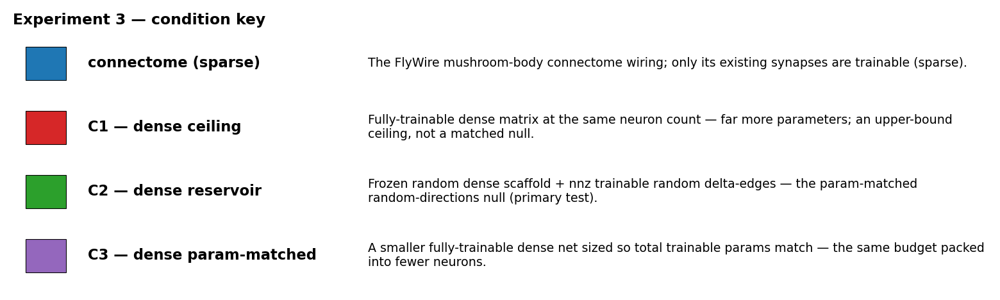
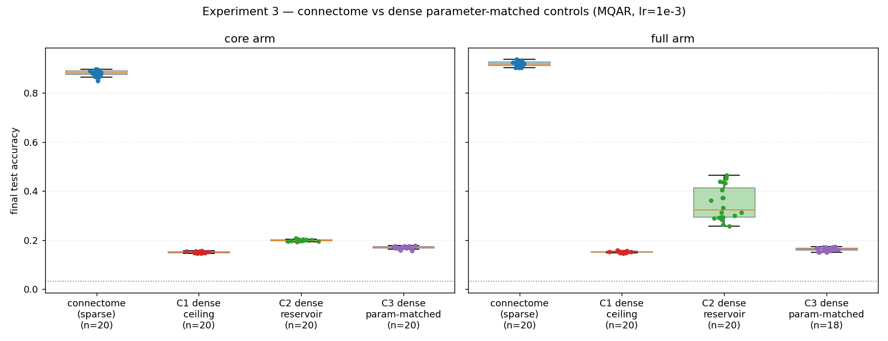
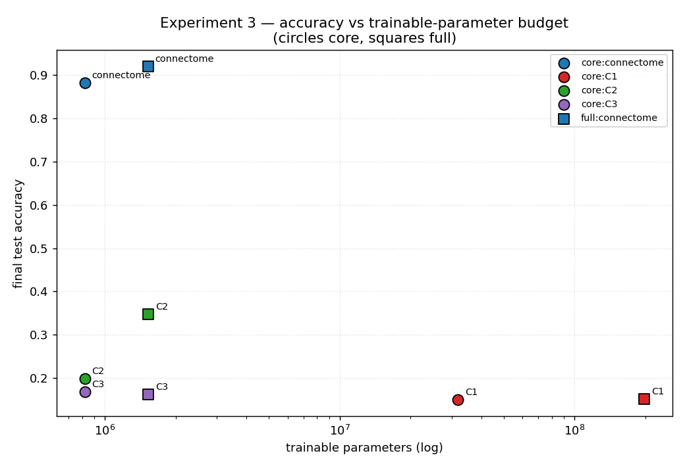
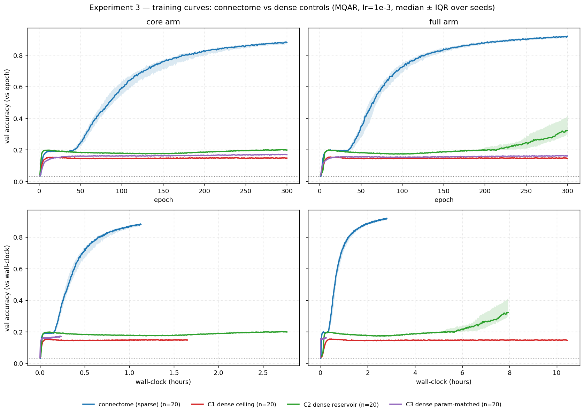
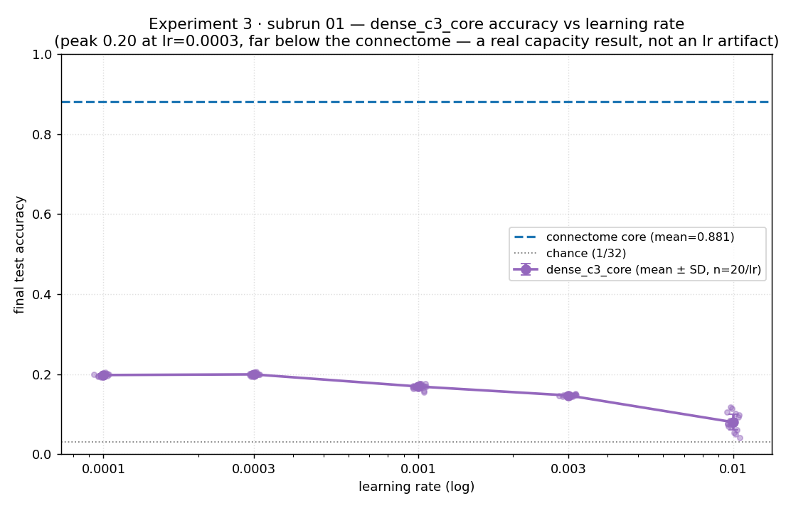
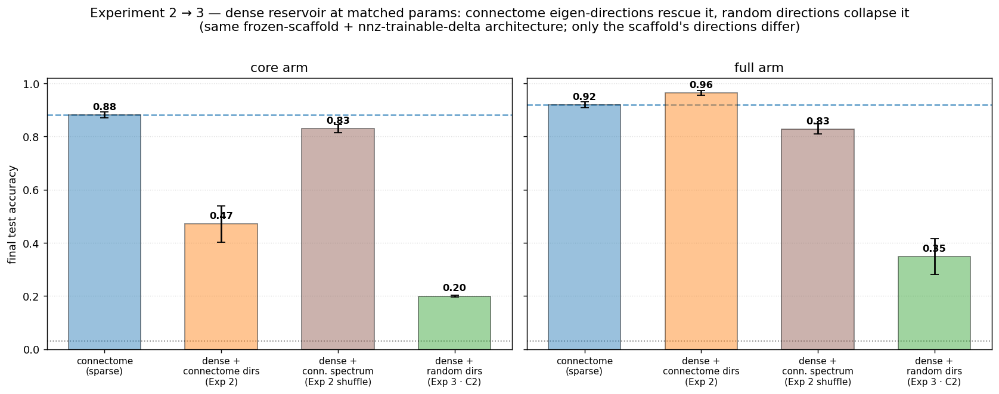
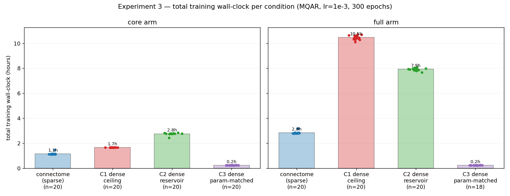

# 2026-06-24 — Experiment 3: Dense parameter-matched controls vs the connectome on MQAR

## Purpose

Experiments 1–2 showed the FlyWire MB connectome (and its 5.6k core) beats **sparse** nulls
(degree-matched, random-subset) on MQAR at matched spectral radius. Exp 2's dense *eigvec* arm then
asked whether the win is the sparse wiring or the connectome's **eigen-directions** — but it had no
dense reservoir with *random* directions, so "the connectome's specific directions" and "generic
dense-reservoir capacity" stayed confounded. That gap matters: on the **14k full** substrate a dense
param-matched eigvec surrogate actually *beat* the connectome (0.964 vs 0.919), and without a
random-directions baseline we can't tell whether that reflects the connectome's directions or just a
dense frozen reservoir at a matched trainable-parameter budget.

Experiment 3 reframes the question as **parameter budget**: against dense controls at a matched
*trainable-parameter* budget, does the connectome's specific sparse wiring still pay off? It supplies
the random-directions dense-reservoir baseline Exp 2 lacked, and asks the same question with two
other dense references — an unconstrained dense ceiling and a smaller dense net at the same total
budget.

## Methods

**Connectome arms — reused, not retrained.** `core` (5.6k; 439,603 recurrent params, 820,979 total
trainable) and `full` (14k; 574,660 recurrent, 1,528,392 total) are pulled in from Experiment 2's
lr=1e-3 runs by `port_connectome_refs.py` (identical task, training loop, and ρ-target). They reproduce
Exp 2's `core` **0.881 ± 0.012** and `full` **0.919 ± 0.010**. At lr=1e-3 they completed (epoch_cap,
never patience-cut), so they are trained-to-convergence references for the patience-off dense controls.

**Three dense controls, trained per substrate** (`run_experiment.py`, controls in `dense_controls.py`),
all **gain-matched by activation-RMS** to their connectome substrate — ρ is the wrong invariant for
these dense non-normal matrices (ρ and σ_max decouple; the Exp-2 eigvec lesson):

| control | construction | params vs connectome | role |
|---|---|---|---|
| **C1** | dense, **same N**, **100 % trainable** | far **more** (N²: ~31.8M core / ~197.7M full) — *not* matched | size-matched **ceiling** |
| **C2** | dense **frozen** random scaffold (same N) + **E = nnz(connectome)** random **trainable** delta edges | **matched** (total trainable, exact) | random-directions dense **reservoir** — the matched-param **topology test** |
| **C3** | **smaller** dense net (N′ ≈ 873 core / 1203 full), **100 % trainable**, sized so **total** trainable params match | **matched** (total trainable) | budget in **fewer neurons** |

C2's frozen scaffold *is* C1's init matrix, frozen except E entries — so C1 and C2 differ only in
trainable fraction.

**Statistical roles.**
- **C2 is the primary matched test.** Each frozen scaffold is an independent random graph → a
  permutation null vs the connectome (mirrors Exp 2's `core_vs_core_degree`): fraction of C2 graphs
  reaching the connectome mean, +1-smoothed floor 1/(n+1).
- **C1 and C3 are fully-trainable architectures** — the random init is washed out by training, so they
  are not graph nulls. Reported descriptively (mean ± SD, Δ, rank-sum) vs the connectome. **C1 is a
  ceiling, not a matched null** — with far more parameters it is *expected* to win; the informative
  quantity is the gap (how close the connectome gets with ~40–130× fewer params).

**Task / model / budget — identical to Exp 1–2.** Faithful MQAR (D=8 pairs, Q=8 queries, vocab=32,
chance ≈ 0.031), **generic all-neuron I/O** (biological PN/KC→MBON I/O deferred to a future
experiment), `MatrixEpisodicRNN` dense runtime for C1/C3 + `DenseScaffoldDeltaRNN` (dense frozen
scaffold + E sparse trainable deltas) for C2, Adam, **lr = 1e-3 fixed (no sweep)** — Exp 1/2's shared
optimum — 300-epoch cap, **plateau-patience off** (dense controls may grok late; the converged-at-0.995
stop is kept so fast-grokkers still stop early and wall-clock stays fair). The Exp 1 `train_one_run`
and `_empirical_null` are reused verbatim so cross-experiment numbers are directly comparable. One run
per GPU (`WORKERS_PER_INSTANCE=1`).

**Why these three.** Exp 2's eigvec controls were a *connectome-directions* dense reservoir; Exp 3's
**C2** is the *random-directions* dense reservoir. Together they bracket whether the connectome's
specific directions matter at a matched trainable-parameter budget, or whether any dense reservoir
suffices. **C3** asks the orthogonal budget question — params concentrated in fewer dense neurons vs
spread sparsely over many (the connectome's way). **C1** bounds the ceiling.

**Design / scale (launched config).** 20 C1 seeds + 20 C2 graphs + 20 C3 seeds × 2 substrates = **120
control runs × 1 lr** (connectome refs ported, not trained), on a **64-GPU** spot/on-demand fleet, one
run per GPU. Budget: 300-epoch cap, **plateau-patience off** (`--patience 300` = epoch cap, so the
plateau-stop can never fire), **converged-stop at val ≥ 0.995 kept**. **C1-full (~197.7M trainable
params, dense 14k) is the cost/memory driver and the long pole** (~12–15 h/run estimated; the one arm
with no Exp-2 wall-clock anchor). `run.py` pins every parameter and is the frozen record of this run.

## Run log

Scaffolded and smoke-tested **2026-06-24** (CPU, synthetic substrate rescaled to ρ=0.95 so the smoke
exercises the production gain regime). Pipeline green end-to-end (build → train → analyze). Checks:
parameter-matching exact — **C2 total trainable = connectome total** (e.g. smoke core 18,746),
**C3 matched within integer rounding** (18,757), **C1 the larger ceiling** (82,976); init activation-RMS
sane (~0.19–0.21), training numerically stable (no NaN/inf; train-loss at chance ≈ ln 32).

Connectome references ported in from Exp 2 (`port_connectome_refs.py`): 20 `core` + 20 `full` lr=1e-3
runs, reproducing `core` 0.881 ± 0.012 and `full` 0.919 ± 0.010.

Launched on the AWS spot-GPU fleet **2026-06-24** (`run.py`; 120 control runs = 20 C1 + 20 C2 + 20 C3 ×
{core, full}, 64 GPUs, isolated S3 area `s3://…/pathint-exp03-dense/`, patience off).

**Stopped early 2026-06-24 — a fairness flaw surfaced.** Only `dense_c3_core` (the cheapest arm, ~14
min/run) finished before the stop: all 20 seeds reached just **test_acc 0.169 ± 0.005** (`epoch_cap`,
300 epochs, no crash/early-stop), far below the connectome's 0.881 and below every Exp-2 control. A
*fully-trainable* 873-dense net scoring below even Exp 2's *frozen*-reservoir dense surrogate (0.471)
is the signature of **under-tuning, not a capacity limit** — and lr=1e-3 was the *sparse connectome's*
optimum, whereas Exp 2's dense `eigvec_matched_core` had preferred 3e-3. Fixing a single lr tuned for
the connectome plausibly handicaps the dense controls — the exact confound this experiment exists to
avoid. The other arms had not finished, so the main-run accuracies are not interpretable as-is.

**→ Subrun 01 (`subruns/01_dense_c3_lr_sweep/`).** Validate the lr-artifact hypothesis on the cheap
arm before re-sweeping everything: sweep `dense_c3_core` over `{1e-4, 3e-4, 1e-3, 3e-3, 1e-2}`
(best-lr-per-unit), reusing the main run's 1e-3 (20 seeds) and training the four new lrs × 20 = 80
runs. The engine gained `--lr-grid` + `--kinds` (backward-compatible) for this. If a different lr lifts
`dense_c3_core` well above 0.17 → the single-lr design is unfair to the dense controls and we re-sweep
all of them (subrun 02); if 0.17 holds across lrs → it is a genuine result.

**Subrun 01 verdict — 0.17 held; not an lr artifact.** Across `{1e-4, 3e-4, 1e-3, 3e-3, 1e-2}` the best
lr for `dense_c3_core` (3e-4) reached only **0.199** vs 0.169 at 1e-3 — a +0.03 gain that closes ~4 % of
the 0.71 gap to the connectome. The single-lr design is therefore not the cause of the dense failure, so
the main run was resumed and completed at lr=1e-3 rather than re-sweeping every arm (subrun 02 not run).

**Main run completed 2026-06-27.** All 120 control runs finished (`--collect`: connectome refs ported,
analysis + figures regenerated). Two `dense_c3_full` seeds (s12, s13) were lost to the disk-fill
checkpoint-corruption crash and excluded → n=18 for that one arm; all other arms n=20.

## Results

**Every dense control trains far worse than the sparse connectome — including the dense *ceiling* with
39–129× more parameters.** (final test accuracy, mean ± SD, n=20 unless noted; chance ≈ 0.031; data in
`outputs/{analysis.json, metrics_by_run.csv}`, `outputs/runs/*/`)

| arm | core (5.6k) | full (14k) | trainable params (core / full) |
|---|---|---|---|
| **connectome** (sparse, ported from Exp 2) | **0.881 ± 0.012** | **0.919 ± 0.010** | 820,979 / 1,528,392 |
| C1 — dense ceiling (far more params) | 0.151 ± 0.003 | 0.152 ± 0.003 | 31.8M / 197.7M |
| C2 — dense reservoir (matched, primary) | 0.199 ± 0.003 | 0.348 ± 0.067 | 820,979 / 1,528,392 |
| C3 — smaller dense (matched) | 0.169 ± 0.005 | 0.162 ± 0.007 (n=18) | 821,525 / 1,529,045 |

- **C2 (primary matched-param test, permutation null):** 0/20 random-directions dense reservoirs reach
  the connectome mean on either substrate → permutation p = 0.048 (the +1-smoothed floor, 1/21). The
  connectome beats every matched-budget dense reservoir outright.
- **C1 is a ceiling that fails.** A fully-trainable dense net of the same neuron count, with 39× (core) /
  129× (full) more parameters, reaches only ~0.15 — *below* the constrained sparse connectome. The extra
  capacity is unusable here; since a dense matrix is a strict superset of the sparse connectome's
  solution, this is an optimization failure, not a capacity limit.

Learning curves show the dense controls plateau early and never approach the connectome (the connectome
groks within ~100–250 epochs; the dense arms flatten near ~0.15–0.35 and stay there):

**Not a learning-rate artifact (verified for `dense_c3_core`).** Sweeping `{1e-4, 3e-4, 1e-3, 3e-3, 1e-2}`,
best-lr-per-unit by validation (subrun 01):

| lr | 1e-4 | 3e-4 | 1e-3 | 3e-3 | 1e-2 |
|---|---|---|---|---|---|
| `dense_c3_core` test_acc | 0.198 | **0.199** | 0.169 | 0.147 | 0.080 |

The validation-selected lr is 3e-4 (14/20 units) or 1e-4 (6/20) — never the production 1e-3 — but the
best lr buys only **+0.03** (0.169 → 0.199), ~4 % of the 0.71 gap to the connectome. The dense failure
survives lr tuning. **Caveat:** only `dense_c3_core` was swept; C1, C2, and *all* full-substrate dense
controls ran at the single lr=1e-3 (the sparse connectome's optimum, and a known-suboptimal lr for
dense), so their numbers above modestly understate those arms — the qualitative conclusion is robust, the
exact values are not optimized.

**This resolves Exp 2's confound — in the connectome's favour.** Exp 2's alarm was that a dense
param-matched surrogate *beat* the full connectome (`eigvec_matched_full` 0.964 vs 0.919). C2 is the
*same architecture* (frozen dense scaffold + E=nnz trainable deltas, gain-matched, patience off); the
only difference is the scaffold's directions — the connectome's eigen-directions (Exp 2) vs random (C2):

| dense reservoir, matched params | core | full |
|---|---|---|
| with **connectome** directions (Exp 2 `eigvec_matched`) | 0.471 | **0.964** |
| with **random** directions (Exp 3 **C2**) | 0.199 | 0.348 |
| connectome itself (sparse) | 0.881 | 0.919 |

Strip the connectome's directions out of the dense reservoir and it collapses (0.964 → 0.348 on full;
0.471 → 0.199 on core). The Exp-2 surrogate's win was the connectome's *structure*, not generic
dense-reservoir capacity at a matched budget. (`eigvec_shuffle`, carrying the connectome's spectrum with
permuted eigenvector pairing, scored ~0.83 on both substrates — also far above random C2, so *any*
connectome-derived structure helps a dense net; on the core the matched-vs-shuffle ordering inverts,
the open puzzle Exp 2 flagged.)

**Caveat — the dense arms also carried an init-conditioning handicap, so the causal reading is
"structure-as-conditioner", not "sparse beats dense" in the abstract.** Gain-matching equalizes the mean
hidden-state activation-RMS at init but *not* the operator norm: the connectome sits at σ_max ≈ 1.08
(near-normal, ρ ≈ 0.95) while the random dense inits sit at σ_max ≈ 2.0–2.5. Through 16 ReLU-BPTT steps
that is a backward-gain blow-up — C1-core's epoch-1 train_loss ≈ 358 vs the frozen scaffold's 3.5 on the
same matrix family — which grad-clip = 1.0 then throttles into a shallow ~0.15–0.20 basin (C1 peaks by
epoch ~11–25, then flat for ~280 epochs; no late grok). A dense-RNN practitioner would init orthogonally
(σ_max ≈ 1); that regime is untested. Two consequences for interpretation:
- The connectome's *structure* trains well whether deployed as sparse wiring (0.88/0.92) or as
  eigen-directions in a dense net (Exp 2, 0.96); *random* connectivity at matched budget does not —
  sparse-random nulls reached 0.70–0.84 in Exp 1–2, random dense reaches 0.15–0.35 here.
- The dominant axis separating 0.88 from 0.15 is therefore **structured/sparse-vs-random-dense (a
  trainability/conditioning effect)**, not connectome-vs-random specificity — that latter, smaller margin
  is the separately-established Exp 1–2 result. Exp 3 cleanly kills "any dense param-matched net explains
  the connectome's score," but does not by itself prove sparse wiring is computationally superior to a
  well-conditioned dense net.

**Wall-clock (cost view, total training seconds; the practical/commercial metric).** The sparse connectome
is also the cheapest of the matched/ceiling arms: core 4,128 s vs C2 9,915 s (2.4×) and C1 5,945 s (1.4×);
full 10,238 s vs C2 28,537 s (2.8×) and C1 37,664 s (3.7×). C3 is fastest (~850 s, a tiny net) but fails.

**Cheapest follow-up to close the remaining gap.** Re-run `dense_c3_core` (~850 s/run, ~5–10 seeds) from a
**well-conditioned init** (orthogonal / σ_max ≈ 1, i.e. operator-norm-matched rather than
activation-RMS-matched) at the validation-selected lr (3e-4). If it still tops out ~0.20, "random dense
can't learn MQAR at this budget" becomes robust to conditioning and the headline strengthens; if it jumps
toward 0.7–0.9, the reported gap was substantially an init artifact and the sparse-vs-dense framing must be
downgraded to an optimization story. (Exp 2's `eigvec_matched_full` = 0.96 already shows the
scaffold-delta *architecture* is not the bottleneck — so the one open question is fully-trainable dense
from a sane init.)

### Bottom line
At a matched trainable-parameter budget *and the connectome's training regime*, the connectome's sparse
wiring trains dramatically better than every dense alternative — random-directions reservoir (C2), smaller
dense net (C3), and even a dense ceiling with 39–129× more parameters (C1) — and this is not a
learning-rate artifact. Combined with Exp 2, the picture is **connectome ≳ sparse-random (0.70–0.84) ≫
random-dense (0.15–0.35)**, with the connectome's *structure* (as sparse wiring or as dense
eigen-directions) the thing that trains, and generic dense capacity at matched budget the thing that does
not. The open caveat is that the dense arms were also worse-conditioned at init (σ_max ≈ 2.5 vs 1.08), so
"sparse-vs-dense" here is best read as a structure/trainability effect pending the one cheap init-matched
re-run above.

Code: [`scott/experiment_03_dense_param_matched/`](../experiment_03_dense_param_matched/).
