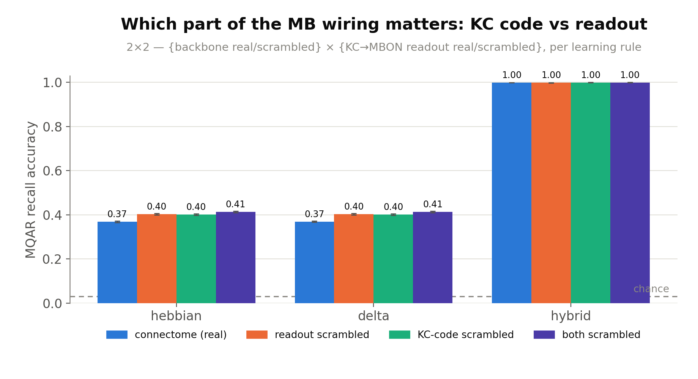
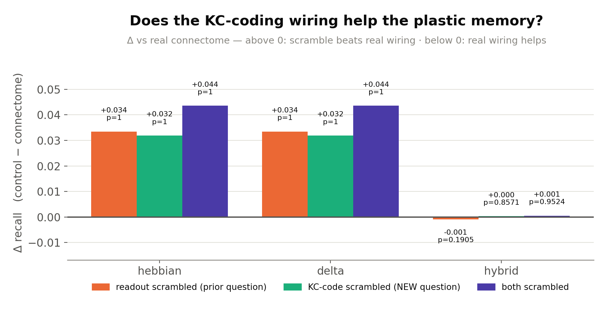
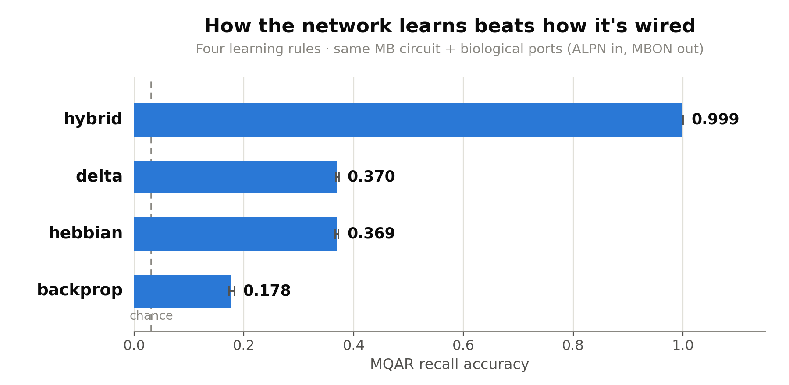
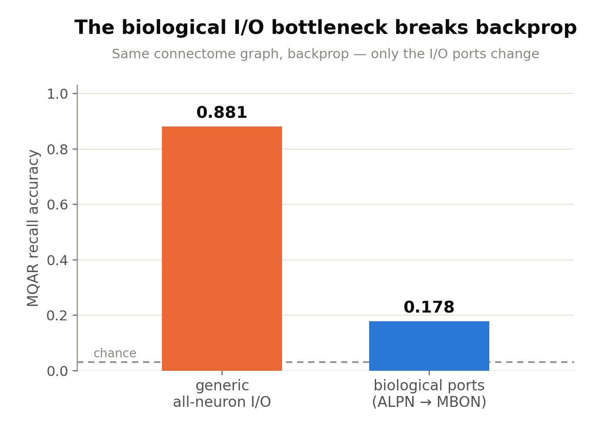
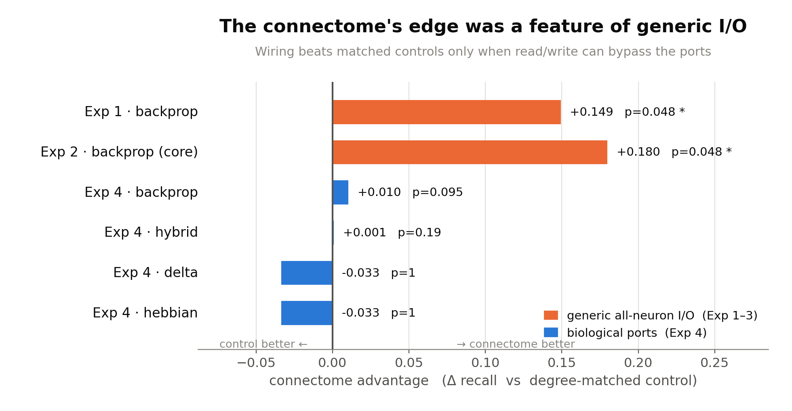
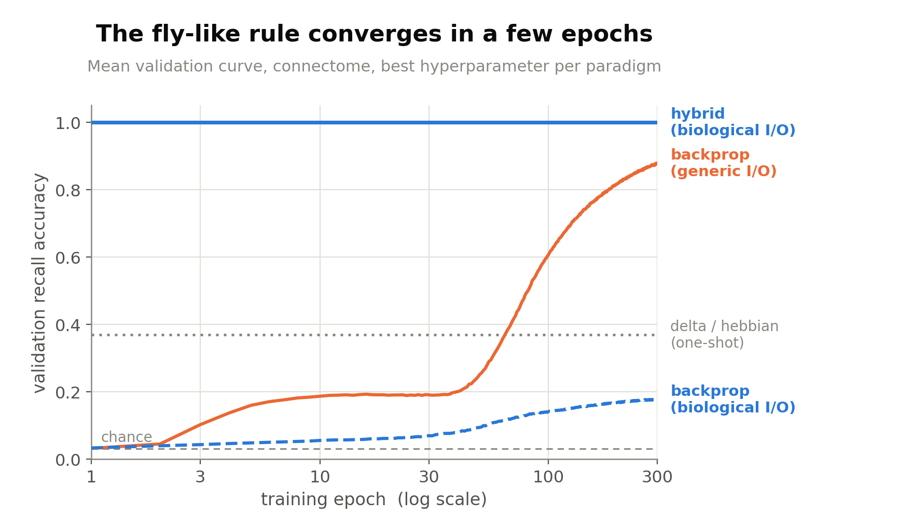
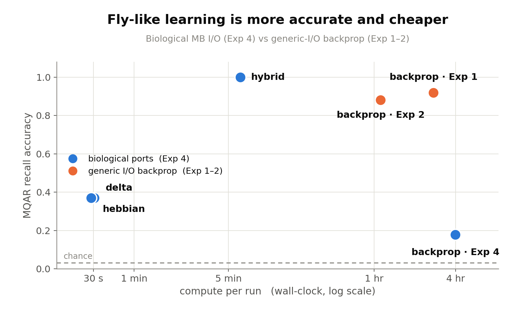

# 2026-07-01 — Experiment 4: Biological MB I/O on MQAR — four learning paradigms through the real input/output/learning neurons

## Purpose

Experiments 1–3 left one confound standing on every result: **generic all-neuron I/O.**
Task input was injected into, and the readout taken from, *all* neurons, so a trainable
readout could route around the wiring and the MB's real signal funnel (PN→KC→MBON, with
dopaminergic teaching) was bypassed. Experiment 4 removes that confound by restricting I/O
to the biologically-correct mushroom-body cell types, and — because the MB is defined as
much by *how* it learns (local, dopamine-gated plasticity) as by its wiring — asks a second
question the earlier experiments could not:

1. **Does the connectome's advantage survive biological I/O?** Connectome vs degree-matched
   controls, with input/output/teaching forced through the real ports.
2. **How much does the learning *rule* matter?** Compare **four learning paradigms** on the
   *identical* substrate and ports — a ladder from pure machine learning to pure fly:
   backprop → hybrid (fast plastic write + meta-learned encoders) → delta-rule (local,
   error/prediction-error driven) → Hebbian (local, correlational). The novel comparison is
   both connectome-vs-control *within* each paradigm and **biological-I/O vs generic-I/O** on
   the same substrate (does routing through the real ports help or hurt?).

This is **Phase 1 (MQAR)**, chosen for continuity/comparability with Exp 1–3. Phase 2 (the
biologically natural odor→valence task) is deferred; MQAR's "value" is a 32-way symbol
delivered through the low-dimensional dopamine port, the one awkward part of the mapping,
which Phase 2 resolves.

## Methods

**Identifying the biological neurons (`build_mb_ports.py`).** Ports are assigned by the
FlyWire/Schlegel-2024 cell-type annotation join (the same table Exp 2 uses; join key
annotation `root_id` == substrate `bodyId`, **100% matched**), by `cell_class`:

| Role | `cell_class` | N |
|---|---|---|
| **input** (odor / CS) | `ALPN` | 406 |
| hidden (sparse code) | `Kenyon_Cell` | 5,177 |
| **output** (readout) | `MBON` | 96 |
| **learning** (teaching) | `DAN` (dopaminergic) | 331 |
| gain control | `MBIN`/APL | 4 |

The two rejected alternatives, with evidence: `predictedNt` (neurons.csv) has **zero**
dopamine labels (cannot identify DANs); the native ROI-flow pools (`src/pools.py`) put ALPN
and DAN both in "sensory" (cannot separate odor input from the teaching signal) and
contaminate the "output" pool with ~1,112 Kenyon cells. `cell_class` is the only signal that
cleanly resolves all five roles. A compartment cross-check (from `roi_counts.csv`) confirms
the biology: ALPN are presynaptic-dominant in the calyx (axons onto KC), MBON postsynaptic-
dominant in the lobes (dendrites reading KC) — validated as a build gate.

**Substrate.** Primary = **`core_alpn`** (6,014 neurons): the Exp-2 MB core (KC/MBON/DAN/MBIN)
**plus the ALPN input layer it was missing** (all 406 ALPN are in the Exp-1/2 halo, 0 in the
core). 99.2% weakly-connected. Robustness = **`full`** (14,025). Every condition rescaled to
**ρ = 0.95** (Exp 1–3 convention), so recurrent gain is not a confound.

**Orientation.** The adjacency is stored **post × pre**: `M[i,j]` = weight of synapse **j→i**
(verified against `connections.csv`, 100% of edges at `M[post,pre]`). `MatrixEpisodicRNN`
computes `rec[i] = Σⱼ W[i,j]·h[j]`, so the biologically-forward operator — driving each neuron
from its *presynaptic* partners — is **`M` itself** (not `Mᵀ`); input injected at ALPN flows
ALPN→KC→MBON along real synapses. This matches what Exp 1–3 passed. (An early Exp-4 draft
wrongly transposed to `Mᵀ`, which would flow backward; caught and corrected in the 2026-07-02
review.) The `generic_io` reference uses the same operator, so the bio-vs-generic contrast
isolates the I/O restriction.

**Task / routing.** Faithful MQAR imported verbatim (D=8 pairs, Q=8 queries, vocab=32, no
reversals, chance ≈ 0.031). Port routing, identical across all four paradigms (only the
learning rule differs): **key & query symbols → ALPN**, **value symbol → DAN** (the teaching
signal), **read ← MBON**. ≥2 recurrence microsteps per token (ALPN→KC covers 35% of KC in 1
hop, 100% in 2).

**The four paradigms.**
- **backprop** (Arm A, `arm_bptt.py`): port-gated `MatrixEpisodicRNN` — trainable `W_in`
  restricted to ALPN (cue) + DAN (teaching), MBON-only readout, recurrent trainable on the
  fixed support; BPTT with masked cross-entropy on query steps. Plus a **`generic_io`**
  reference (all-neuron I/O on the same connectome) — the bio-vs-generic contrast.
- **plasticity** (Arm B, `arm_plasticity.py`), backbone frozen at the connectome, only
  **KC→MBON** plastic (masked to the real 55,732-edge support), DAN-gated, value↔MBON via a
  fixed random codebook; eligibility trace bridges the key→value delay:
  - **hebbian** — `ΔW ∝ C[:,v] ⊗ e` (correlational).
  - **delta** — `ΔW ∝ (C[:,v] − ŷ) ⊗ e` (error/prediction-error driven).
  - **hybrid** — inner delta write + **outer BPTT** meta-learning the encoders/decoder.

**Controls (fairness).** Every control keeps the exact ALPN/KC/MBON/DAN/MBIN index sets
(same ports by index); only the wiring differs, then rescaled to ρ=0.95. The two arms scope
the degree-matched control **differently** — a distinction that matters for reading finding 2:
- **Backprop (Arm A):** `degree_matched` rewires the **whole** recurrent operator (ALPN→KC and
  every other edge; `common.build_condition_operator(sub, "degree_matched")`) — it perturbs the
  full topology.
- **Plasticity (Arm B):** `degree_matched` rewires **only the KC→MBON plastic readout mask**
  (`arm_plasticity._build_model`); the frozen ALPN→KC backbone that generates the KC "odor code" is
  held **= connectome in both conditions**. So Arm B isolates the **readout** topology and says
  nothing about the **KC-coding** backbone (identical in both arms). The complementary control —
  scramble the frozen backbone, keep the real readout — is the follow-up subrun `01_kc_code_control`
  (see run log 2026-07-04 cont.).

**Statistics (inherit Exp 1–3).** Connectome = one graph × K training-seed replicates
(pseudo-replication) → **permutation-rank primary** (fraction of control graphs ≥ connectome
mean, +1-smoothed; floor 1/(K+1)); Mann-Whitney secondary, flagged anti-conservative. Pilot
K=10, full run K=20 (floor 0.048). lr grid {1e-4…1e-2} best-by-validation for backprop/hybrid;
plasticity η tuned on its **own** grid (the Exp-3 lesson — do not assume the backprop optimum
transfers). 300-epoch cap, plateau-patience off, converged-stop at val≥0.995, per-epoch
checkpoint/resume/skip — same as Exp 2–3. Readouts: final recall accuracy, learning speed
(epochs/trials + wall-clock to criterion), total wall-clock (a reported value metric).

**Engine / reproducibility.** `run_experiment.py` builds the plan, dispatches each unit to its
arm module, and aggregates (`--analyze-only` → `analysis.json`). It reuses the Exp-1 engine
verbatim (`train_one_run`, `_empirical_null`, MQAR, ρ/rescale, `MatrixEpisodicRNN`) via
`common.py`, so cross-experiment numbers stay comparable. Idempotent + shardable for the AWS
fleet; `run.py` pins every parameter and is the frozen record.

## Run log

- **2026-07-01 — kickoff.** Connectome data explored; biological ports settled on the
  `cell_class` join (`neuroresearch` review of the alternatives). Design pinned with the user:
  four paradigms, MQAR-now/valence-later, routing key/query→ALPN + value→DAN + read←MBON,
  substrate `core_alpn`. Scaffolded `experiment_04_mb_biological_io/`; `build_mb_ports.py`
  built + validated the port artifacts (`substrate/port_indices.npz`); `common.py` shared
  scaffolding validated (substrate load, ρ=0.95 forward operators, MQAR→port routing,
  codebook); `SPEC.md` frozen as the implementors' contract. Arm A / Arm B model
  implementations built by subagents against the SPEC.

- **2026-07-02 — implementation + review round; caught a fatal orientation bug.** Both arms
  built and validated end-to-end on a CPU smoke (synthetic substrate): backprop (connectome /
  degree_matched / generic_io) and all three plasticity rules (hebbian/delta/hybrid) run through
  `run_experiment.py`, populate `analysis.json`, and generate figures. A fresh adversarial
  `neuroresearch` reviewer caught a **fatal adjacency-orientation bug**: the substrate is stored
  **post × pre** (`M[i,j]` = weight of synapse *j→i*, verified against `connections.csv` — 100%
  of edges at `M[post,pre]`), so the biologically-forward operator is **`M` itself**, but an
  early draft transposed to `Mᵀ` (which flows activity *backward* — input at ALPN would not reach
  KC/MBON). Fixed centrally in `common.forward_operator`. The same wrong orientation had
  propagated into Arm B's plastic mask (`M[kc,mbon]` = the backward MBON→KC block, 8,592 edges);
  corrected to `M[mbon,kc]` = the true forward KC→MBON support (**55,732 edges**). Forward
  pathway (correct orientation): ALPN→KC 27,591, KC→MBON 55,732, DAN→KC 38,330, KC→DAN 68,520;
  ALPN→KC covers 94% of KC in 1 hop, 100% in 2 (microsteps≥2 justified). Also fixed: engine
  passed `device` as a string (needs `torch.device`); Arm B `run_id`/output-dir didn't match the
  engine's convention (broke idempotency + analysis); hybrid's inner plastic rate (`eta`) default.
  Pure hebbian/delta clear chance on the smoke; hybrid's outer BPTT gradient flows through the
  frozen backbone to the encoders. Two fresh adversarial reviewers (Arm B correctness; cross-
  cutting orientation/fairness/stats/integration) re-launched on the corrected code — the gate
  before the run. **The experiment is not launched here — the user runs `run.py`.**

- **2026-07-03 — reviews passed; fixes applied; ready to run.** Both adversarial reviewers
  independently confirmed the core science is sound: orientation correct (1393/1393 unidirectional
  edges at `M[post,pre]`; forward flow ALPN→KC→MBON verified), no I/O leakage (drive only in
  ALPN∪DAN, readout only from MBON), KC→MBON mask correct (55,732 forward edges), plasticity
  beats chance on the **real** substrate (hebbian/delta 7–12× chance), no-backprop invariant holds,
  hybrid's gradient reaches the encoders, primary connectome-vs-control fairness + permutation
  stats + the run plan all check out, and the harness is not rigged (connectome ≈ control on a
  topology-free substrate). Fixes applied from their findings:
  - **Eligibility λ is now swept (matched tuning).** λ was pinned at 0.9 — empirically its *worst*
    value (λ≈0.3 roughly *doubles* pure-arm recall). The pure rules now sweep λ∈{0.1,0.3,0.5,0.9}
    best-by-validation (replacing the redundant η sweep — hebbian is η-invariant); delta at η=0.3;
    hybrid pins λ=0.3 and sweeps its outer lr. Plan is now **820 runs**.
  - **microsteps pinned at 2** (not swept): 1 hop gives Arm B an all-zero KC code, 2 hops reach
    100% of KC + all MBON.
  - **Fleet spot-resume fixed:** added `--print-shard-run-ids`; de-specialized the shared
    `aws_fleet/bootstrap.sh` checkpoint filter (was hardcoded `dense_*`, never matched exp04).
  - Purged stale synthetic smoke results from `outputs/`; doc-drift corrected.

  **Caveats carried into interpretation (per the reviews):**
  - *bio-vs-generic is a descriptive contrast, not a clean isolation.* `generic_io` differs from the
    biological model on **two** axes — all-neuron I/O **and** 1 microstep vs 2 — so a gap can't be
    attributed to the I/O restriction alone. **Decision (user):** keep it as-is and use the
    biologically-required 2 microsteps for the bio model; a matched-microstep all-neuron reference is
    noted as a useful **future control**. The primary connectome-vs-degree-matched test is unaffected.
  - *The paradigm ladder also varies trainable capacity* (backprop trains ~471k recurrent weights;
    hebbian/delta only KC→MBON; hybrid meta-learns the encoders) — "paradigm X vs Y" reflects rule
    *and* capacity, by design; the writeup will state it.
  - *The pure arms use `reset_state` + 2 microsteps,* so their KC "odor code" is the ALPN→KC
    feedforward projection, not the full recurrence backprop exploits — a way the paradigms differ
    beyond the rule (does not affect the within-paradigm connectome-vs-control contrast).
  - *Store-vs-recall is inferred* from DAN activity (keys and queries both enter ALPN identically) —
    a harder mapping than Exp 1–3, shown learnable.
  - *Value delivery differs by arm:* backprop drives the value into DAN rows (into the recurrence);
    the plastic arms use it as the codebook write-target with `is_value` as the DAN gate.

- **2026-07-04 — full fleet run complete (820/820); results audited by two independent reviewers.**
  The user launched `run.py` on the 64-GPU spot fleet; all 820 runs finished and were collected
  (`outputs/analysis.json`, `outputs/metrics_by_run.csv`, `figures/`). Two fresh adversarial
  `neuroresearch` reviewers — independent of the build thread — audited the *results*: one on
  implementation/leakage/fairness, one on controls/statistics. Both **reproduced every headline
  number exactly** and found **no leakage, no orientation bug, and an identical accuracy metric
  across all four arms**: train/val/test draw from independent RNG streams over a ~10¹⁹-episode
  space, the per-episode binding lives only in `W_plast` which is reset to zero each `forward()`
  (so hybrid's 0.999 cannot be memorization), the forward operator `= M` and KC→MBON support
  (55,732 edges) verified numerically, and every arm scores through the same `common.accuracy`.
  Both reviewers' substantive caveats are folded into the Results below.

- **2026-07-04 (cont.) — control scope clarified; KC-code control scaffolded as a follow-up.**
  A design review of finding 2 surfaced an **asymmetry** between the two arms' degree-matched
  controls (now documented in Methods). Arm A (backprop) scrambles the *whole* operator — ALPN→KC
  included. Arm B (plasticity) scrambles *only* the KC→MBON readout mask; the frozen ALPN→KC
  backbone that generates the KC "odor code" is held = connectome in both conditions. So finding 2's
  "control ≥ connectome" for hebbian/delta is strictly about the **readout** topology — it never
  perturbs, and so cannot test, the connectome's **KC-coding** topology. Two distinct questions were
  being conflated:
  - *prior* (`readout_matched`, = the run's `degree_matched`): **does the biological KC→MBON readout
    wiring help the plastic memory?** — answered: no, a same-degree random readout is slightly better.
  - *new* (`backbone_matched`): **does the biological KC-coding wiring (the fixed ALPN→KC expansion
    that produces the sparse odor code) help the plastic memory?** — open.

  Scaffolded as subrun **`01_kc_code_control`**: a clean **2×2 factorial** on the plasticity arm
  (hebbian/delta/hybrid) — {backbone real vs degree-matched} × {readout real vs degree-matched} →
  conditions `connectome`, `readout_matched`, `backbone_matched`, `both_matched` (the last = the
  "full" degree-matched control, the joint null). Separates KC-code topology from readout topology,
  with `both` giving their combination. The frozen Exp-4 code is **untouched** — the subrun reuses
  the engine (`common.py`, `arm_plasticity.ThreeFactorMB`, `_eval_pure`) by import, since
  `ThreeFactorMB` already accepts an arbitrary backbone operator + readout mask. Built,
  CPU-smoke-validated, and **independently reviewed**: the reviewer confirmed the 2×2
  wiring / orientation / no-leakage / engine-reuse are all correct, and caught one HIGH-severity
  confound — scrambling the *whole* operator (the backprop arm's null) let edges migrate across
  blocks, dropping per-KC ALPN **fan-in** ~25% (5.33 → 3.97), which would conflate KC-coding
  *topology* with input *density* and break symmetry with the readout control. **Fixed**: the
  backbone scramble now rewires **only the ALPN→KC block**, with the same degree-preserving swap as
  the readout control (each KC's ALPN fan-in + each ALPN's fan-out + the weight multiset preserved
  exactly). Verified on the real substrate — fan-in 5.33 preserved per-node, ρ=0.95 matched,
  off-block edges untouched, ~96% of ALPN→KC edges rewired. **Ready for the user to run** (design +
  reproduction in `subruns/01_kc_code_control/README.md`).

- **2026-07-05 — subrun 01 (KC-code control) complete (1040/1040); the KC-coding backbone confers no
  advantage either.** The 2×2 factorial finished: the 640 pure runs and most hybrid runs came off the
  32-GPU spot fleet, and the final 13 hybrid runs — all long (~6 min) BPTT runs, the ones spot
  preemption disproportionately reclaims — were topped up locally on an RTX 5060 Ti. Resume is
  idempotent (finished runs skip on existing `result.json`; each gap regenerates its exact graph from
  `seed=unit`), so the local top-up is identical to what the fleet would have produced. Results (test
  recall, best-hp-per-unit by validation, chance ≈ 0.031; permutation-rank primary):

  | rule | connectome | readout_matched | backbone_matched *(NEW)* | both_matched | connectome vs backbone |
  |---|---|---|---|---|---|
  | **hebbian** | 0.369 | 0.403 | 0.401 | 0.413 | perm p = 1.0 (20/20 beat it) |
  | **delta** | 0.370 | 0.403 | 0.402 | 0.414 | perm p = 1.0 (20/20 beat it) |
  | **hybrid** | 0.9993 | 0.9984 | 0.9996 | 0.9998 | ceiling tie (perm p = 0.86) |

  **The KC-coding (ALPN→KC) topology behaves exactly like the readout topology: scrambling it is, if
  anything, slightly *better* — never worse.** For pure local plasticity every one of 20
  degree-preserving backbone rewirings beats the real wiring (perm p = 1.0), mirroring the
  `readout_matched` result; scrambling *both* is best (0.413). Hybrid sits at ceiling in all four cells
  (no headroom, uninformative). So the complementary control the main run left open resolves the same
  way: **neither half of the biological MB wiring — the fixed odor-code backbone nor the KC→MBON
  readout — helps arbitrary 32-way MQAR binding under a random codebook, and the connectome is a mild,
  perfectly consistent handicap on both.** This still says nothing about a valence-aligned codebook —
  the Phase-2 prediction (Exp 5).

  

  *Subrun Fig. 1 — the 2×2 control, recall per learning rule with four wiring conditions each: real
  connectome (blue), KC→MBON **readout** scrambled (orange), ALPN→KC **KC-code backbone** scrambled
  (green, the new control), and **both** scrambled (purple). For hebbian and delta the real connectome
  (blue, 0.37) is the **lowest** bar in every group — scrambling either half of the wiring, or both,
  nudges recall slightly up (0.40–0.41). For hybrid all four bars are pinned at 1.00 (ceiling, no
  headroom). Neither the odor-code backbone nor the readout is doing useful work on this task.*

  

  *Subrun Fig. 2 — the same result as a difference from the real connectome (control − connectome): bars
  **above** zero mean the scramble *beat* the real wiring. Every pure-plasticity bar is a solid
  +0.03–0.04 above zero with permutation p = 1.0 (all 20 rewired graphs beat the connectome mean), so
  the answer to the new question — "does the biological KC-coding wiring help the plastic memory?" — is
  a clear **no** (it is if anything a mild handicap). The hybrid bars hug zero and are not significant.*

  Data: `subruns/01_kc_code_control/outputs/` (1040 runs, `analysis.json`).

## Results

Two clean findings, both cutting **against** the project's Exp 1–3 thesis. On biologically-correct
MB I/O, **the learning paradigm dominates and the wiring topology does not**: a fly-like
dopamine-gated plasticity architecture solves MQAR near-perfectly where end-to-end backprop through
the same circuit barely clears the floor, and the connectome's specific topology gives **no**
advantage over degree-matched controls in any paradigm.

### The four learning rules, in plain terms

All four train the **same** wiring on the **same** task. They differ only in *how* a synapse changes
its strength — from pure machine learning to pure fly. (The "teaching signal" — which output a value
should map to — always arrives through the **DAN** dopamine neurons, the circuit's real reward/error
channel.)

- **backprop (BPTT)** — the standard deep-learning method. Run the whole input sequence, measure the
  error at the end, and use calculus (gradients) to nudge *every* weight in the network a little to
  reduce that error; repeat for hundreds of passes over the data. **Global** (each weight's update
  depends on the whole network), slow, and biologically implausible — a real synapse cannot know the
  entire network's output error.
- **Hebbian** — the simplest biological rule: *"cells that fire together, wire together."* When a
  Kenyon cell and an output neuron happen to be active at the same moment the value is presented,
  strengthen the synapse between them. **Local** (each synapse uses only its own two neurons'
  activity), **one-shot** (no repeated passes), no error term — it only ever *accumulates*
  associations.
- **delta (prediction-error)** — Hebbian *plus a correction*: push the synapse toward the **right**
  answer and away from the network's current **wrong** guess (Δw ∝ target − prediction). Still local
  and one-shot, but unlike Hebbian it can *overwrite* a stale association instead of only piling on.
  This is close to how the fly's dopamine-gated plasticity is thought to work.
- **hybrid** — the fly's fast one-shot write (the delta rule above, applied only at the KC→MBON
  synapse) **wrapped inside a slow outer backprop loop** that meta-learns just the small input encoder
  and output codebook while the wiring stays frozen. "Learn-to-learn": gradient descent tunes *how the
  one-shot memory is written and read*, not the memory contents themselves.

A useful way to read the rows below: **backprop** changes ~500k weights over hours; **hebbian/delta**
change nothing by gradient descent (0 trained params, a single online pass); **hybrid** trains only
~16k encoder/codebook params on top of the fly's one-shot write.

**1. Learning paradigm is the whole story (connectome substrate, MQAR test recall, chance ≈ 0.031):**

| Paradigm | What learns | Test recall (connectome) | Wall-clock / run |
|---|---|---|---|
| **hybrid** (inner three-factor plasticity + outer meta-learned encoder) | 16,064 params (encoder+codebook); backbone frozen | **0.999 ± 0.0003** | ~6 min (~9 epochs) |
| **delta** (local, prediction-error) | 0 (pure online plasticity) | 0.370 | ~30 s |
| **hebbian** (local, correlational) | 0 | 0.369 | ~30 s |
| **backprop / BPTT** (end-to-end) | 503,994 params (incl. full recurrent core) | **0.178 ± 0.005** | ~4 hr |
| *backprop, generic all-neuron I/O (reference)* | 880,276 | *0.881* | ~4 hr |

*Figure 1 — final MQAR recall by paradigm on the connectome (bars = mean over seeds). Read it
top-to-bottom as a ladder from fly to machine: **hybrid** is at ceiling, pure **hebbian/delta** clear
~12× chance with zero gradient descent, and end-to-end **backprop** through the biological ports barely
lifts off the floor — even though the very same graph with generic all-neuron I/O (bottom, greyed)
reaches 0.88. How the network learns matters far more than the ~500k weights backprop is free to tune.*

The fly's own mechanism — a one-shot, dopamine-gated write onto KC→MBON synapses — solves the task
that end-to-end gradient descent through the identical wiring cannot, at ~40× lower compute. Pure
local plasticity (zero backprop) already doubles backprop's recall (0.37 vs 0.18, ~12× chance).
Backprop's 0.178 is a **genuine plateau, not under-training**: at the best lr the val curve is flat
over the last 100 epochs (slope ~3×10⁻⁵/epoch) and the lr grid brackets the optimum. The gap to
generic all-neuron I/O (0.881 on the *same* operator) localizes the difficulty to the biological
I/O bottleneck — restricting read/write to the real 96-MBON / 406-ALPN ports is what defeats
gradient descent.

*Figure 2 — the same connectome and the same backprop optimizer, changing **only** the I/O. Routing
read/write through the real 96 MBON + 406 ALPN ports (left, 0.178) vs letting the readout touch all
6,014 neurons (right, 0.881). Since nothing but the port restriction differs, what defeats gradient
descent is the biological **I/O bottleneck**, not the optimizer or the wiring — a trainable all-neuron
readout can route around the circuit; the real ports cannot.*

**2. Connectome topology confers no advantage under biological I/O** (connectome vs degree-matched
control, ports fixed, ρ=0.95; permutation-rank is primary, MWU demoted as pseudo-replicated):

| Paradigm | connectome | control | perm p | verdict |
|---|---|---|---|---|
| backprop | 0.178 | 0.167 | 0.095 | n.s. — and under-powered (both ~6× chance) |
| hybrid | 0.9993 | 0.9984 | 0.19 | ceiling tie (no headroom) |
| delta | 0.370 | **0.403** | 1.0 | control *better* (20/20; mirror p=0.048) |
| hebbian | 0.369 | **0.403** | 1.0 | control *better* (20/20; mirror p=0.048) |

*Figure 3 — connectome recall **minus** degree-matched-control recall, across the project's
experiments. Bars right of zero = the biological wiring wins; left of zero = a random rewiring wins.
The connectome's edge is clearly positive under generic all-neuron I/O (Exp 1–3) but collapses to
zero-or-negative the moment I/O is restricted to the real ports (Exp 4). The "topology advantage"
travelled with the generic readout — it was never a property the biological ports could use.*

Nowhere does the biological wiring beat a matched random control. For pure local plasticity it is
reliably, if slightly, **worse**: every one of 20 degree-preserving rewirings of KC→MBON beats the
real wiring, at every eligibility-λ above collapse. This flips the Exp 1–3 result and pins its
apparent "topology advantage" on the generic all-neuron readout that could route around the wiring
(0.881 with generic I/O vs 0.178 through the ports on the same graph).

**Caveats — what the data can and cannot support (from the two independent audits):**

- **Hybrid's win is an architecture+routing advantage, not a pure learning-rule swap.** The plastic
  arms differ from backprop on three axes that all favor MQAR: the value is delivered *directly* to
  the MBON output via the codebook (`arm_plasticity.py:266`) with DAN used only as a scalar gate,
  never through the recurrence; a per-episode fast weight `W_plast` (an associative-memory substrate
  backprop has no analogue of); and per-token state reset. The honest reading is "fly-like plasticity
  **architecture** + meta-learned encoder beats end-to-end BPTT," not "the biological rule beats
  backprop on identical I/O." Already flagged in Methods; restated here as the primary caveat.
- **Backprop's topology null is under-powered, not a clean null.** Both connectome and control sit at
  ~0.17–0.18 (≈6× chance) in a floor-compressed regime, so "no difference detected" there is weaker
  than "no advantage exists."
- **The pure-plasticity disadvantage is task-specific.** It tests only KC→MBON *readout* topology
  against a *random* codebook on *arbitrary* 32-way binding. The biological readout is lower-rank /
  more redundant than a same-degree random one (effective rank ≈ 52 vs 69; MBONs are co-targeted by
  overlapping KC sets — compartmentalization), which can only hurt arbitrary-symbol recall. It is
  **not** evidence the connectome is "bad," and it says nothing about the KC-coding backbone (frozen
  = connectome in both arms). Predicted to shrink/reverse on a valence-style task or a
  compartment-aligned codebook — the Phase-2 test. The complementary **KC-code control** (scramble
  the frozen ALPN→KC backbone, keep the real KC→MBON readout) tests the KC-coding topology directly:
  **subrun `01_kc_code_control` (concluded 2026-07-05) finds the KC-coding backbone confers no advantage
  either** — scrambling the ALPN→KC odor-code block is, like the readout, slightly *better* for
  hebbian/delta (0.401 vs connectome 0.369, perm p = 1.0, 20/20) and a ceiling tie for hybrid, with
  both-scrambled best of all (0.413). So neither half of the biological wiring helps this
  arbitrary-symbol task (see run log 2026-07-05).
- **hebbian ≈ delta are near-duplicate tests**, not two independent confirmations (under reset_state
  + λ=0.1, delta's first write has ŷ=0 and collapses toward hebbian; aggregate means are identical).
  Treat the four comparison families as ~3 effectively independent.
- Minor: the pure-rule λ grid bottoms out at its lower edge (0.1 selected for all units → true
  optimum likely λ<0.1); generic_io was still climbing at the 300-epoch cap (so the bio-vs-generic
  gap is, if anything, understated). Neither changes any ordering.

**How fast each rule learns.**

*Figure 4 — validation recall vs training epoch (log x-axis), best hyperparameter per paradigm on the
connectome. The story is in the shape: **hybrid** (solid blue) is already at 1.0 within a few epochs —
its one-shot plastic write solves each episode immediately, and the outer loop only has to tune the
tiny encoder. **backprop through generic I/O** (orange) "groks" late, staying near 0.19 until ~epoch 40
then climbing to 0.88. **backprop through the biological ports** (dashed blue) never groks — it crawls
to 0.18 over all 300 epochs. **hebbian/delta** are one-shot with no training loop, so they appear as a
flat reference line at ~0.37 (dotted). The pure fly rules beat 300 epochs of end-to-end backprop with
a single pass.*

**Accuracy for the compute it costs.**

*Figure 5 — final recall vs wall-clock per run (log x-axis). The fly-like rules sit in the desirable
top-left: **hybrid** matches generic-I/O backprop's accuracy (~1.0 vs 0.88) at ~40× less compute
(~6 min vs ~4 hr), and **hebbian/delta** are cheapest of all (~30 s) at a modest 0.37. Generic-I/O
backprop (top-right) buys its accuracy only with hours of training; biological-I/O backprop
(bottom-right) pays the same hours and still fails. Wall-clock is reported as a practical value metric,
not a confound.*

Full per-run numbers: `outputs/metrics_by_run.csv` (820 runs); stats: `outputs/analysis.json`.

Code: [`scott/experiment_04_mb_biological_io/`](../experiment_04_mb_biological_io/)
(design: [`SPEC.md`](../experiment_04_mb_biological_io/SPEC.md)).
