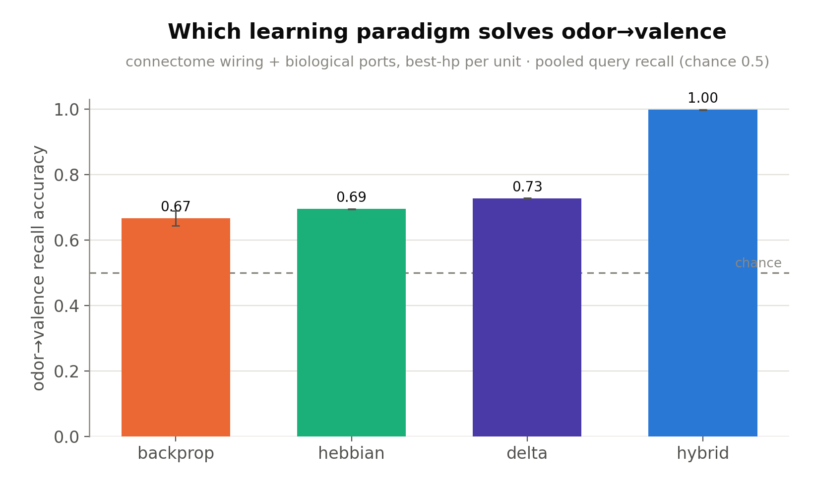
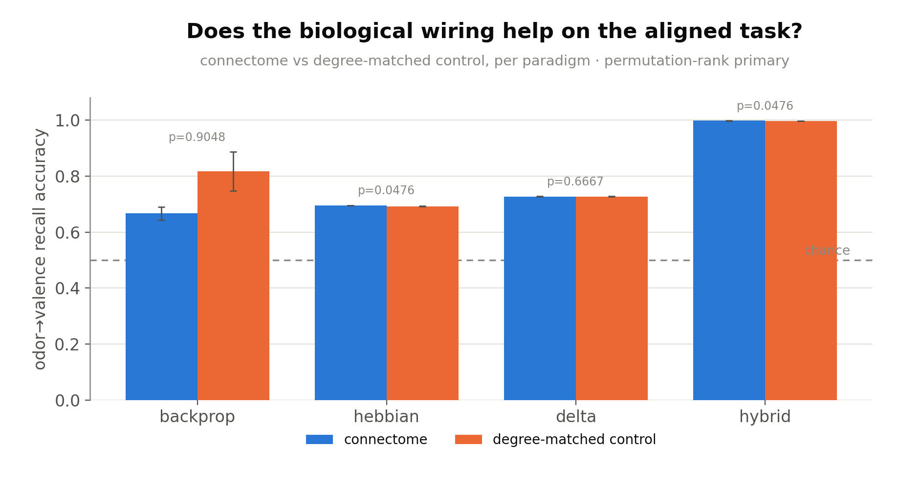
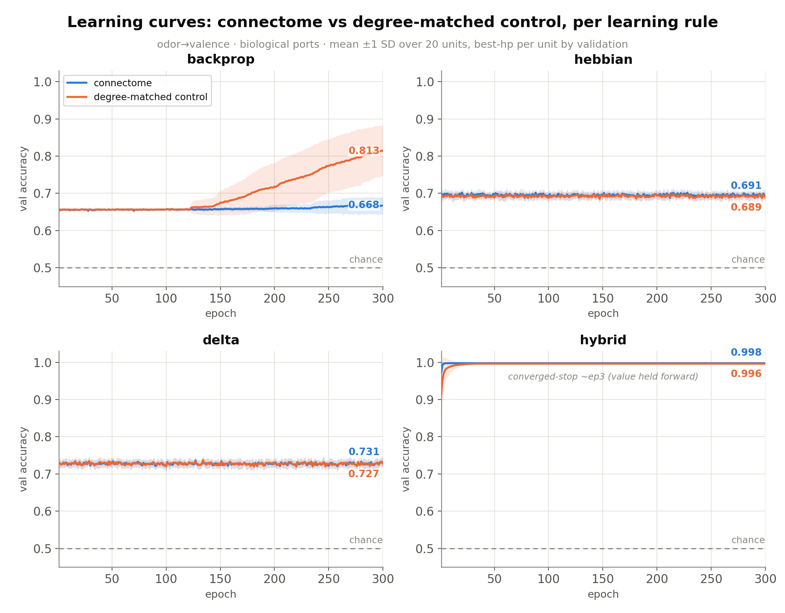
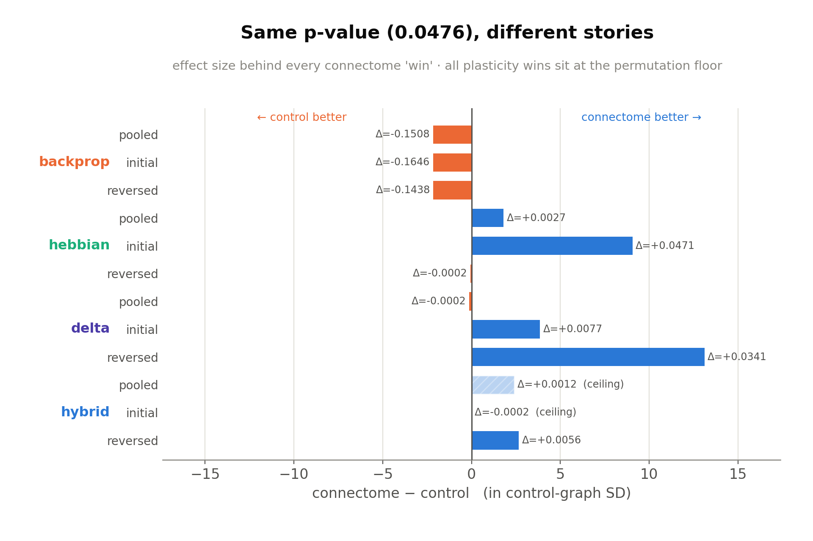
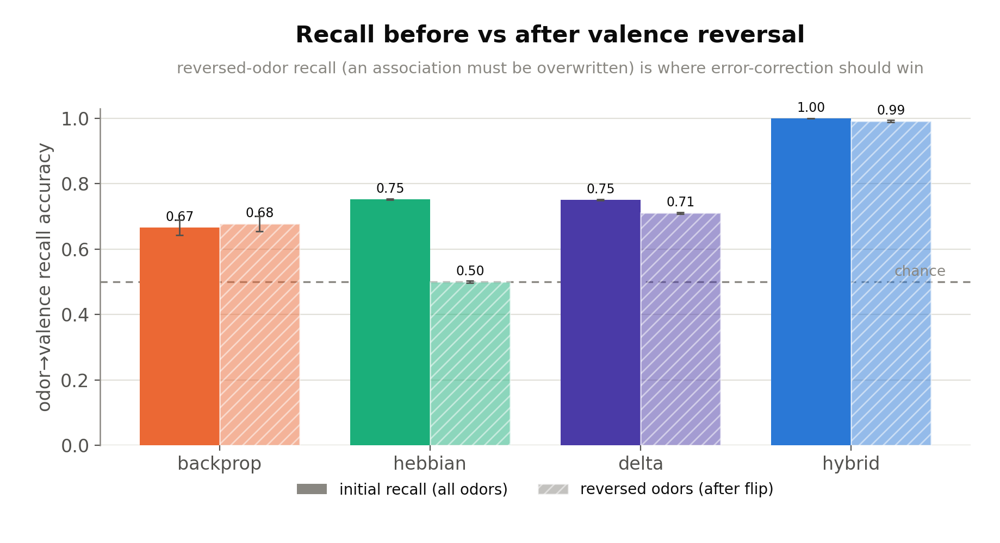
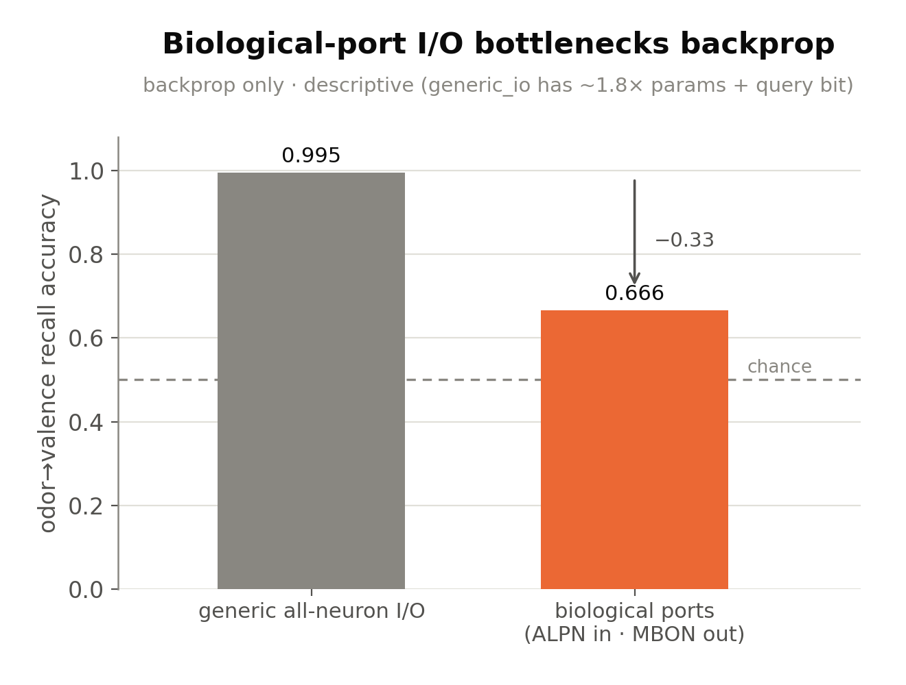
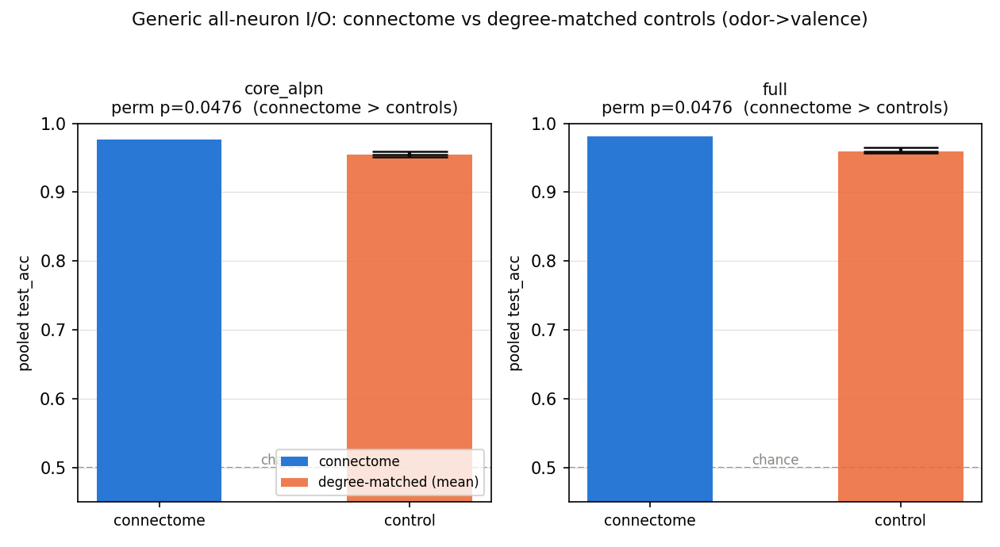
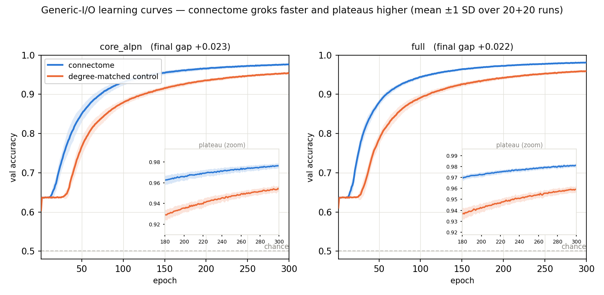
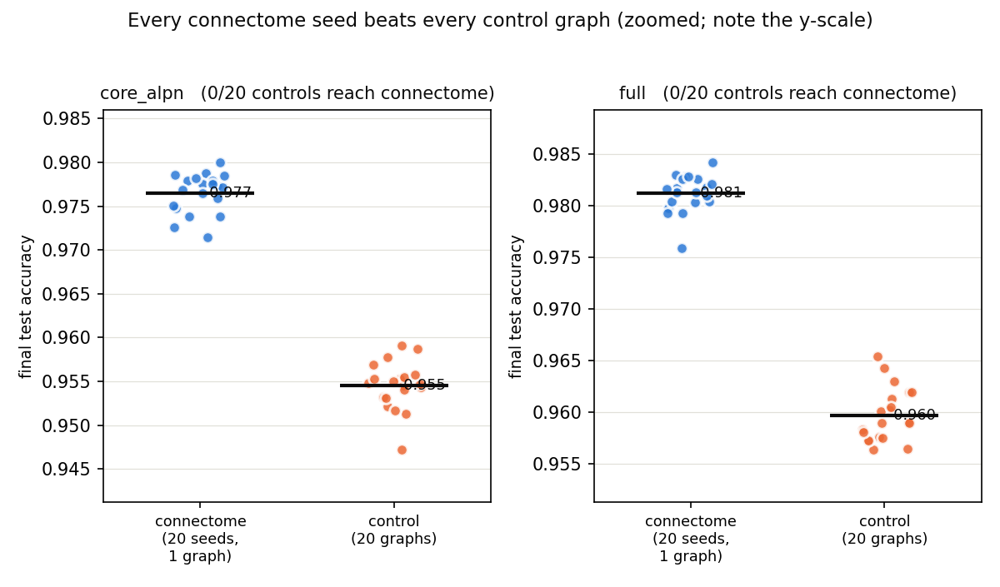
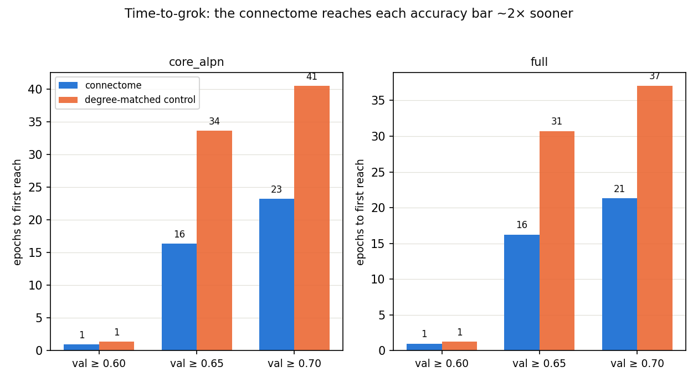

# Experiment 5 — Biological MB I/O on odor→valence (Phase 2)

**Date started:** 2026-07-04
**Status:** **Concluded 2026-07-07.** 700-run fleet complete; two independent adversarial audits.
Headline: **Exp 4's null does not cleanly flip.** The strong results are *paradigm* effects (only
hybrid solves; delta beats Hebbian on reversal), not *topology* effects — the connectome's readout
wiring is a consistent but readout-only, mostly-small positive outlier (clearest on delta reversal),
gives *no* advantage under backprop (it hurts), and can't be assessed under hybrid (ceiling).
**Code:** [`../experiment_05_mb_odor_valence/`](../experiment_05_mb_odor_valence/) ·
spec [`SPEC.md`](../experiment_05_mb_odor_valence/SPEC.md) ·
launcher [`run.py`](../experiment_05_mb_odor_valence/run.py)

## Purpose

The Phase-2 companion to Experiment 4. Exp 4 restricted mushroom-body I/O to the
biologically-correct cell types and found, **on MQAR**, two results against the Exp 1–3 thesis:
the learning *paradigm* dominated (a fly-like dopamine-gated plasticity architecture solved the
task where backprop through the same circuit plateaued near floor), and the connectome's topology
gave **no advantage** over degree-matched controls. But Exp 4 flagged its own central caveat:
**MQAR is a poor match for the mushroom body.** It demands arbitrary high-dimensional key→value
binding and forces a 32-way symbol through the dopamine (DAN) teaching port, whereas the MB
evolved to map a complex odor to a low-dimensional **valence** (approach/avoid) under a scalar
reinforcement.

Experiment 5 asks the question on the **aligned** task — odor→valence associative learning with
reversal — where every port carries its real signal (odor→ALPN, reward/punishment→DAN, valence
←MBON). The central hypothesis, stated by Exp 4: **this is the regime where biological structure
should pay off, so Exp 4's "no wiring advantage" null should flip.**

Four questions:
- **Q1 (paradigm).** Which of the four paradigms solves odor→valence, and at what compute cost?
- **Q2 (wiring — the Phase-2 question).** Does the connectome's wiring beat degree-matched
  controls now that the task fits the circuit — does Exp 4's null flip?
- **Q3 (bio vs generic I/O).** Does biological I/O still bottleneck backprop, or was that
  MQAR-specific?
- **Q4 (reversal).** Does the error-correcting delta rule beat plain Hebbian on the reversal
  probe (where an association must be overwritten, not just added)?

## Methods

**Task (Phase 2).** Odor→valence associative reversal, copied self-contained into
`odor_valence_task.py` from `scripts/associative/run_mb_associative_learning.py` (its
task-generation half only; the original's generic recurrent model is *not* used). Each episode:
LEARN (each sparse odor prototype shown once with reward XOR punishment — odor and reinforcement
**co-occur**), INITIAL QUERY (odor + query gate → recall valence), REVERSAL (a subset re-paired
with the flipped valence), FINAL QUERY (recall the updated valence). Scored as **2-class valence
recall** (chance **0.5**): `test_acc` pools all query steps, `test_initial_acc` is the
pre-reversal query, and `test_reversed_acc` is the final query **restricted to the odors actually
reversed** (the clean overwrite test for Q4, not diluted by retained odors). Geometry mirrors the
original benchmark: 64 odors, odor_dim 64, 6 odors/episode, 3 reversed, sparsity 0.20, noise 0.03.

**Substrate + ports (inherited from Exp 4, copied for self-containment).** `core_alpn`
(6014 = MB core + ALPN input layer); ports from the FlyWire/Schlegel-2024 `cell_class` join
(ALPN 406 / KC 5177 / MBON 96 / DAN 331 / MBIN 4), copied into `substrate/port_indices.npz`.
Forward operator = **M** (adjacency post×pre; activity flows ALPN→KC→MBON); every condition
rescaled to ρ=0.95. The reward/punishment 2-bit **is** the valence-class one-hot, so no arbitrary
symbol is forced through the DAN port — the mismatch Exp 4 flagged is removed.

**Four paradigms, identical wiring + ports** (all emit `logits[B,T,2]`, scored by one shared
masked-CE loss + argmax accuracy, so recall is comparable across arms):
- **backprop** (`bptt`): port-gated `MatrixEpisodicRNN` (odor→ALPN, reward/punish→DAN,
  readout←MBON), trainable recurrence on the fixed support, BPTT; no fast weight / no state reset.
  Conditions: connectome / degree_matched / **generic_io** (all-neuron I/O reference).
- **hebbian / delta** (`plasticity`, pure): frozen backbone → KC odor code; only KC→MBON learns,
  written online by a DAN-gated three-factor rule (correlational vs prediction-error); zero
  backprop. Conditions: connectome / degree_matched (KC→MBON support rewired, degree-preserving).
- **hybrid**: delta inner loop (functional) + OUTER BPTT meta-learning the ALPN encoder + codebook
  (frozen backbone).

**Design forks the aligned task forces** (see SPEC §5): 2-class valence codebook (not 32-way);
eligibility trace **pinned λ=0** because odor and reinforcement co-occur (no delay to bridge) — so
the pure rules **sweep the plastic write-rate `eta`** rather than λ (and `eta` is exactly the
overwrite strength — eta≈0.5 lands on the argmax-ambiguous midpoint, eta→1.0 is full overwrite —
so reversed accuracy must be read at the reversal-selected eta); the reversal probe is kept, scored
on the reversed odors only, as the delta-vs-Hebbian discriminator MQAR could not provide; KC code
dense (`kc_topk=0`) by default for parity with Exp 4, with a sparse-code subrun noted as the
natural follow-up.

**Design (pinned in `run.py`).** 20 connectome training-seed replicates + 20 degree-matched
control graphs per (arm, rule); pure rules sweep `eta ∈ {0.1,0.3,0.5,1.0}`, hybrid + backprop
sweep `lr ∈ {1e-4…1e-2}`; 300-epoch cap, patience off (converged-stop kept), microsteps 2.
**Total 700 runs** (bptt 300, hybrid 200, delta 160, hebbian 40 — hebbian at a single eta since
its recall is argmax-invariant to the eta scale); 64-GPU fleet, S3 prefix `pathint-exp05-odorvalence`.

**Statistics (inherited from Exp 1–4).** Permutation-rank primary (fraction of the 20 control
graphs whose mean ≥ the connectome mean, +1-smoothed; floor 1/21 = 0.048), Mann-Whitney secondary
(anti-conservative under pseudo-replication); best-hp-per-unit by validation (never test),
**selected per metric by the matching validation metric** (so reversed accuracy is read at the
reversal-best eta, not the pooled-best eta — otherwise pooled-val selection undersells reversal).
Pre-registered primary comparison: `connectome vs degree_matched` per paradigm on each metric,
reported beside the initial/reversal split.

**What distinguishes this from Exp 4.** Same engine and ports; the *task* changes from MQAR
(misaligned) to odor→valence (aligned), and with it the I/O semantics (scalar reinforcement
through DAN instead of an arbitrary symbol; low-D valence readout instead of 32-way). Exp 5 reuses
the Exp-1 numerical engine directly (as Exp 2/3/4 do) and does **not** import Exp 4; it copies
Exp 4's substrate data so its record is self-contained. The engine could not reuse Exp-1's
`train_one_run` (hard-wired to MQAR), so `common.train_one_run_ov` re-implements the identical
training loop (checkpoint/resume, per-epoch curve, wall-clock, best-by-val, converged/plateau
stop) with the odor→valence batch/loss/accuracy swapped in.

## Results

All 700 runs completed (data `outputs/analysis.json`, per-run `outputs/runs/*/result.json`). Two
fresh independent adversarial reviewers — one on implementation + fairness, one on statistics +
conclusions — reproduced every number from the raw run files and agreed on the reading below.

**Headline: the Phase-2 prediction fails. Exp 4's "no wiring advantage" null does not cleanly flip
on the aligned task.** The experiment's strong, robust results are about the *learning paradigm*,
not the connectome's *topology*: only the hybrid paradigm actually solves odor→valence, and the
error-correcting delta rule cleanly beats plain Hebbian on reversal. The connectome's specific
wiring, by contrast, is a consistent but small and *readout-only* positive outlier for the local
plasticity rules, gives **no** advantage under trainable-recurrence backprop (it is significantly
*worse* there), and cannot be assessed under hybrid because both arms sit at the accuracy ceiling.

### Q1 — which paradigm solves odor→valence

Only **hybrid** solves the task: pooled recall **0.998** (chance 0.5). The other three land far
below — **delta 0.727, hebbian 0.695, and pure backprop *worst* at 0.666**, barely above the local
rules despite full end-to-end BPTT through the same circuit. This is a clean within-connectome
comparison (tiny spreads, no topology inference needed) and is fully supported. But the "solution"
is **encoder learning, not wiring**: hybrid's only added ingredient over pure delta is an OUTER
BPTT loop that meta-learns the ALPN→KC encoder and the codebook. Pure delta with a *frozen random*
encoder plateaus at 0.73; once that encoder is learned, recall jumps to ceiling. The random input
encoder — not the topology — is what caps the pure local rules at ~0.70.

### Q2 (headline) — does the connectome beat degree-matched controls?

The same comparison as a **learning trajectory** (val accuracy vs epoch, connectome vs degree-matched
control, mean ±1 SD over the 20 units, best-hp per unit by validation) makes the paradigm-dependence
plain: under **backprop** the connectome (blue) tracks *below* the control (orange) for the entire run —
the control groks toward ~0.81 while the connectome stalls at ~0.67 — so the "connectome worse" result
is a persistent trajectory, not a final-epoch fluke. **Hebbian** and **delta** are ties at every epoch,
and **hybrid** sends both arms to the ceiling within ~3 epochs (converged-stop), leaving no headroom for
a topology difference.

**No clean flip, and the result is paradigm-dependent.** Per paradigm on pooled `test_acc`:

| paradigm | connectome | control | permutation p | reading |
|---|---|---|---|---|
| backprop | 0.666 ± 0.023 | **0.817** ± 0.070 | 0.905 | connectome **loses** (18/20 controls beat it) |
| hebbian  | 0.695 | 0.692 | 0.048 | win, but +0.003 — trivial |
| delta    | 0.727 | 0.727 | 0.667 | tie |
| hybrid   | 0.998 | 0.996 | 0.048 | win, but at ceiling |

The reported wins all show the **same** `p = 0.0476` — which is exactly the permutation **floor**,
`1/(N+1)` for N=20 controls. That p is a *rank flag* ("0 of 20 control graphs beat the connectome
mean" — the best rank the design can return), **not** an effect size, and with N=20 no single test
can survive multiple-comparison correction (12 primary tests, none corrected; a Bonferroni-clearing
result would need ~240 control graphs). The real story is in the effect sizes, which the identical
p-values hide:

Reading the connectome−control gap in units of the control-graph SD (the null spread the
permutation test actually ranks against):

- **backprop loses on all three metrics** (≈ −2.2 SD; −0.15 in raw accuracy). Both arms are
  ρ=0.95-matched and trained, so this is a genuine, consistent signal that the specific wiring is a
  *worse trainable recurrent substrate* than random degree-matched graphs — plausibly worse
  gradient conditioning of that support (only spectral radius is matched, not the full spectrum),
  and confined to the crippled bio-port backprop regime (see Q3). Either way it is the **opposite**
  of "topology helps."
- **hybrid's wins are at the ceiling** (both arms 0.996–1.000; on `test_initial_acc` the connectome
  actually loses, 0.9998 vs 1.0000, p=1.0). No headroom for topology to express — uninterpretable
  as a topology claim.
- **pure plasticity is where the connectome does win**, but the wins are readout-only (the frozen
  ALPN→KC KC-coding backbone is identical in both conditions — SPEC §9) and range from trivial
  (hebbian/delta pooled +0.003 / −0.0002) to genuinely large only on **delta reversal**
  (+0.034, +13 control-SD). Every plasticity "connectome" number is a *single deterministic model*
  (n_eff = 1; the 20 "seeds" differ only by eval-episode RNG, std ≈ 0.001–0.003), so the permutation
  rank is valid (it ranks one connectome mean against 20 genuinely distinct control graphs) but the
  Mann-Whitney secondary and the connectome error bars are eval noise — ignore the ranksum
  `p = 0.0 / 1.0` values entirely.

The honest Q2 statement: *on the aligned task the connectome's KC→MBON readout wiring is a
consistent positive outlier vs degree-matched controls for the local plasticity rules — clearly so
only on reversal (delta +0.034, +13 SD) — while it confers no advantage under backprop (it hurts)
and cannot be assessed under hybrid (ceiling).* "Exp 4's null flips" is **overstated**: it partly
flips in one of three arms, for the readout only, and reverses sign in another.

### Q4 — delta vs Hebbian on the reversal probe

**The cleanest, strongest result in the experiment — and it is a paradigm effect, not a topology
one.** After a subset of odors have their valence flipped, recall on *those* odors:
**Hebbian collapses to 0.500 — dead chance** — while **delta holds 0.711**, a ~0.21 dissociation
with sub-0.003 spreads. This is exactly the predicted mechanism: plain Hebbian can only
*superimpose* associations (the old and new targets sum, argmax becomes ambiguous → chance),
whereas delta's prediction-error write *overwrites* the stale association. It needs no permutation
machinery and does not depend on N=20. (It does require reading reversed accuracy at the
reversal-selected eta=1.0 — full overwrite — which the per-metric hp selection handles.) A valid,
robust *demonstration* of a mathematical prediction rather than an empirical surprise. Backprop and
hybrid both retain their (respectively floor-level and ceiling-level) accuracy across the flip.

### Q3 — does biological I/O still bottleneck backprop?

**Descriptive only, and more confounded than the SPEC flagged.** Restricting backprop's I/O to the
biological ports (odor→ALPN 406, read←MBON 96) drops recall from **0.995** (generic all-neuron I/O)
to **0.666** — a large bottleneck, mirroring the MQAR finding. But `generic_io` is not a clean
control: it carries ~1.8× the trainable parameters (892k vs 504k — mostly dense input projection
into all 6014 neurons + full-neuron readout) *plus* the query bit the bio model drops. A real
bottleneck almost certainly exists, but its 0.33 magnitude conflates the biological-port restriction
with an I/O-capacity difference and cannot be attributed to the restriction per se. No formal test.

### What the evidence supports, and what it does not

- **Sound and robust:** Q1 (only hybrid solves; backprop is worst) and Q4 (delta beats Hebbian on
  reversal, 0.71 vs 0.50). Both are *learning-paradigm* findings. The task construction, the
  degree-matched null model (identical port sets, degree-preserving rewire, ρ-matched, same lr grid
  and seeds), the validation-only per-metric hp selection, and the permutation-rank primary are all
  clean; the run set is complete (all cells n=20); no NaN/divergence across 700 runs. The SPEC
  pre-registered its two worst caveats (query-bit asymmetry, pseudo-replication) honestly.
- **Not supported:** the Phase-2 headline that "biological wiring helps once the task fits." It does
  not, as a general claim. The one substantial topology signal (delta reversal, +13 SD) is real but
  narrow — readout-only, single-instance, one paradigm, one metric — and it vanishes at ceiling once
  the encoder is learned. Backprop shows the connectome actively *worse*.
- **The designated next test is unchanged and now more clearly motivated (SPEC §9):** Q2 never
  perturbed the frozen **ALPN→KC KC-coding backbone** — the divergent expansion that decides *which*
  Kenyon cells fire for an odor, the most likely locus of a valence-aligned advantage. A
  degree-preserving backbone-scramble control (the odor→valence analogue of Exp-4 subrun 01) is the
  clean follow-up. The SPEC §5.4 sparse-KC-code (`kc_topk>0`, APL-like k-WTA) subrun is the other
  natural follow-up: a biological sparse code would *reduce* KC overlap and is where the KC-coding
  topology could start to matter — the current dense code (~89% active) may be washing it out.

## Run log

**2026-07-04 — kickoff.** Scaffolded `experiment_05_mb_odor_valence/` (run.py, run_experiment.py,
common.py, arm_bptt.py, arm_plasticity.py, odor_valence_task.py, make_figures.py, SPEC.md,
README.md); copied the Exp-4 substrate (`port_indices.npz`, manifest, `build_mb_ports.py`) for
self-containment. Smoke test (`--smoke`, CPU synthetic substrate) passes all four paradigms ×
conditions: every arm produces above-chance recall (chance 0.5) with the initial/reversal split
populating and reversal harder than initial recall, as designed. Figures render clean (palette
validated; layout screenshot-checked). Two rigor improvements were baked in during build: a
**reversed-odors-only** metric (`test_reversed_acc`) so Q4 isn't diluted by retained odors, and
**per-metric hp selection** (each test metric read at the hp that's best on the *matching* val
metric) so pooled-val selection can't undersell reversal.

**2026-07-05 — independent review + fixes.** A fresh independent reviewer (adversarial, pre-spend)
audited all seven files, ran the smoke, and ran three probes **on the real `core_alpn` substrate**.
Verdict: **no launch-blocking correctness bug** — forward pass, KC→MBON orientation (no `Mᵀ`
regression), routing, `λ=0`-using-current-code, microsteps-2 requirement, per-metric hp selection,
and the 700-run plan all verified correct. Crucially the central risk was **empirically refuted**:
despite dense KC codes (89.7% active, mean pairwise cosine 0.69), delta cleanly reverses —
reversed-odor recall 0.536→0.605→0.659→**0.718** across eta {0.1,0.3,0.5,1.0} while hebbian is
pinned at **0.505** (chance) at every eta — and eta=1.0 is the correct grid ceiling (reversed
*peaks* there, declines above). Gates: FAIR / RIGOROUS / THOROUGH all pass (with the disclosed
confounds below). Fixes applied before spend: (1) **grok thresholds retuned to task scale**
(0.60/0.65/0.70 — the MQAR 0.80/0.90/0.95 bars sit above this task's ~0.75 ceiling, so every
learning-speed number was `None`); (2) **hebbian collapsed to a single eta** (its recall is
argmax-invariant to eta scale — reviewer confirmed identical across the grid), saving ~120 runs
(**820 → 700**). Documented as writeup caveats (not bugs): Q3's generic-vs-bio contrast includes a
query-bit asymmetry (generic_io sees the full input incl. the query bit; the bio model doesn't);
pure-rule connectome "seeds" are eval replicates, not training-seed replicates. **Open scope
decision surfaced to the user (reviewer F1):** the plasticity Q2 tests the KC→MBON *readout*
topology only — the frozen ALPN→KC *KC-coding* backbone is identical in both conditions — so a
backbone-degree-matched control (odor→valence analogue of Exp-4 subrun 01) is needed to test the
KC-coding topology; whether to fold it into the primary run or run it as a subrun is the user's
call (SPEC §9). **Awaiting that decision + the full fleet run.**

**2026-07-07 — full run + conclusion.** Launched the 700-run plan on the 64-GPU fleet (primary
run only; the KC-coding-backbone control deferred to a follow-up, keeping the primary parallel to
Exp 4's). Spot preemption left one worker's shard (7 runs) unfinished at 693/700; topped up by
relaunching a 7-instance fleet (`FLEET_SIZE` chosen so `64 mod 7 = 1` spreads the 7 stranded runs
one-per-server), reverted `run.py` to its 64-fleet record afterward. `--collect` → all 700 runs,
`analysis.json`, figures. Two fresh independent adversarial reviewers (implementation+fairness;
statistics+conclusions) reproduced every number and converged on the reading above: **the Phase-2
prediction fails** — the robust findings are paradigm effects (Q1 only hybrid solves, Q4 delta >
Hebbian on reversal), not topology effects; the connectome's readout wiring is a consistent but
readout-only, mostly-small outlier (clearest on delta reversal, +13 control-SD), hurts under
backprop, and is uninterpretable at hybrid's ceiling. Added two figures beyond the seeded three:
`fig4_effect_size` (the effect size behind every identical-`p=0.0476` win — the honest Q2 read)
and `fig5_io_bottleneck` (Q3, labelled descriptive). Next: the SPEC §9 backbone-scramble control
and/or the SPEC §5.4 sparse-KC-code (`kc_topk>0`) subrun, either of which could still surface a
KC-coding-topology advantage the dense readout-only primary run cannot.

**2026-07-08 — added learning-curve figure.** Added `fig6_learning_curves` to the primary writeup: per-rule
connectome-vs-degree-matched-control val-accuracy trajectories (mean ±1 SD over the 20 units, best-hp per
unit by validation), read from the per-run `curve`s in `outputs/runs/*/result.json` rather than
`analysis.json`. It re-tells Q1/Q2 as trajectories — backprop's connectome tracks below control the whole
run, hebbian/delta tie throughout, hybrid hits the ceiling in ~3 epochs — no new data. `make_figures.py`
regenerates it under `--collect`.

## Subrun 01 — generic all-neuron I/O vs degree-matched controls (the missing Exp-1/2 cell)

Code: [`../experiment_05_mb_odor_valence/subruns/01_generic_io_controls/`](../experiment_05_mb_odor_valence/subruns/01_generic_io_controls/)
· README there · **Concluded 2026-07-08. 80-run fleet complete.** Headline: under generic all-neuron I/O the
connectome **beats** degree-matched controls on odor→valence on **both** substrates (core 0.976 vs 0.954,
full 0.981 vs 0.960; 0/20 controls reach it, perm p=0.048; ~2× faster grok) — so Exp-5's backprop null
(connectome *worse* through the biological ports) was the **biological-port bottleneck, not the task**.
Two caveats: the task landed near-ceiling (0.95–0.98, not the intended 0.75–0.90 band), and matching is
ρ-only (topology not separated from activation-gain conditioning → mb-06).

### Purpose

The primary run tested odor→valence exclusively through the **biological ports** and found backprop's
connectome *worse* than degree-matched controls (0.666 vs 0.817). Crucially, the one regime that made
**Experiments 1 & 2** find the connectome *beat* controls — **generic all-neuron I/O + degree-matched
controls** — was never run on the aligned task. The primary's only all-neuron point, `generic_io`
(0.995), sat at ceiling and was **never compared against control graphs**. Every "no wiring advantage"
result since Exp 4 has used biological ports, so the biological-port restriction and the task are
confounded. This subrun runs the missing cell to break that confound:

- generic-I/O connectome **beats** controls → Exp-5's backprop null was the **biological-port bottleneck**;
- generic-I/O connectome **ties** controls → topology genuinely doesn't help on this task, I/O aside.

### Methods

Identical to the primary run except: (1) **generic all-neuron I/O** (Exp-1/2 `MatrixEpisodicRNN` — dense
trainable `W_in` into all N neurons, readout from all N, trainable recurrence on the fixed support) for
**both** the connectome and the degree-matched control conditions, with **identical model construction**
and only the recurrence operator differing (connectome vs a degree-preserving random graph); (2) **backprop
only**; (3) **both substrates** `core_alpn` (6014) and `full` (14k); (4) conditions `generic_connectome`
(20 training-seed replicates of the one real graph) vs `generic_degree` (20 independent degree-matched
graphs) per substrate; (5) **lr fixed 1e-3**. **Total 2 × (20 + 20) = 80 runs.** Everything else — the
ρ=0.95 forward operator, the degree-preserving control, the training loop, the permutation-rank stats — is
the concluded Exp-5 engine reused by import; the primary's files are untouched. Isolated S3 prefix
`pathint-exp05sub-genericio` and its own `outputs/`.

**Task hardening.** The primary geometry sat generic-I/O backprop at 0.995 (an uninterpretable ceiling —
the saturation that killed the primary's hybrid arm). Hardened to pull it into a discriminating mid-band
(~0.75–0.90, the Exp-1/2 MQAR-separable regime). **Pinned geometry: 256 odors / dim 64 / 8 per episode /
3 reversed / sparsity 0.20 / noise 0.10** (primary was 64/64/6/3/0.20/0.03). Reduced local calibration
(RTX 5060 Ti, real `core_alpn`, lr 1e-3) found the difficulty is a **cliff in `odors_per_episode`**: at
10 items a plain trainable-recurrence ReLU RNN *stalls* at ~0.62 (uninterpretable optimization floor); at
8 items it learns smoothly and **noise is the clean cap knob**. The pinned config is **off-ceiling and
off-floor** on both substrates (a pre-flight on both was run before spending — see run log). The two arms
land in *different* bands: **core_alpn** in the comfortable mid-band (~0.73 by ep60, projecting ~0.78–0.85
at 300 epochs), but **full 14k runs hotter** — after a ~35-epoch flat latency it groks hard to ~0.84 by
ep60 still climbing steeply, projecting **~0.90–0.95** at the full budget (a ceiling *risk* on the 14k arm
to watch, not a confirmed washout; the bigger graph reaching higher accuracy mirrors Exp 1/2). Calibration
guardrails: 8 items/noise 0.06 → ~0.91@70ep (too easy); 10 items → ~0.62 stall (too hard, an item-count
cliff). The pre-flight is advisory (a printed reminder, not a code gate); to move a band down, raise
`ODOR_NOISE_STD` (0.12–0.14) — do not raise `ODORS_PER_EPISODE` (10+ stalls).

**Planned analysis.** Primary: pooled `test_acc`, `generic_connectome` vs `generic_degree`, permutation-rank
(fraction of the 20 control-graph means ≥ the connectome mean, +1-smoothed; floor 1/21), reported **per
substrate**. Secondary: the initial/reversed split (the task retains its reversal phase). Read as the
direct Exp-1/2-regime replication on the aligned task.

### Results

All 80 runs completed the full 300-epoch cap (`stopped_reason=epoch_cap`; **none** hit the 0.995
converge-stop). Data in `outputs/analysis.json`, per-run `outputs/runs/*/result.json`.

**Headline: under generic all-neuron I/O the connectome cleanly beats degree-matched controls on
odor→valence, on both substrates. The direction is unambiguous — so Exp-5's primary backprop null
(connectome *worse* through the biological ports, 0.666 vs 0.817) was the biological-port I/O
bottleneck, not the odor→valence task.** Swap the biological ports for generic all-neuron I/O and the
Exp-1/2 connectome advantage reappears on the aligned task.

| substrate | connectome | control (mean of 20) | separation | permutation p |
|---|---|---|---|---|
| core_alpn (6014) | 0.976 ± 0.002 | 0.954 ± 0.003 | 0/20 controls reach it; zero overlap | 0.048 (floor) |
| full (14k) | 0.981 ± 0.002 | 0.960 ± 0.003 | 0/20 controls reach it; zero overlap | 0.048 (floor) |

- The win is **consistent across both substrates and all three metrics** (pooled / initial / reversed;
  every one of the 20 connectome seeds sits above every one of the 20 control graphs). Effect ≈ +0.022
  raw ≈ 8–10 pooled-SD. Identical trainable-param counts (892k core / 1.56M full), identical edge counts,
  both ρ-matched to 0.95 — the **only** thing that differs between conditions is the recurrence support.
- **Corroborated by a ~2× learning-speed advantage:** averaged over the 20 units, the connectome reaches
  val 0.65 by ~ep16 vs ~ep34 for controls, and 0.70 by ~ep23 vs ~ep41 — the same grok-faster signature as
  Exp 1. The connectome both **plateaus higher and learns faster** on matched support size, degree sequence,
  weight multiset, and ρ.
- By the 300-epoch cap both arms are **near-plateau** — still creeping upward very slowly but at the *same*
  rate, so the ~0.022 gap is **stable (slightly widening), not closing.** The difference is an asymptotic
  plateau gap, **not a transient speed artifact** — controls do not catch up with more training.

The per-graph view on a zoomed axis is the honest effect-size picture the full-scale bars above compress
away: **every one of the 20 connectome seeds sits above every one of the 20 control graphs**, on both
substrates (0/20 controls reach the connectome mean).

**Two honest caveats:**

1. **The task landed near-ceiling, not in the intended mid-band.** Hardening targeted 0.75–0.90; it
   delivered **0.95–0.98**. The 60-epoch pre-flight (core 0.735) passed the off-ceiling check, but the full
   300-epoch run climbed to 0.976 — a ~24-point climb the short pre-flight structurally could not see (a
   very long slow grok). *Unlike* the primary's hybrid arm (dismissed as a saturated ceiling tie at
   0.996–1.000, where the connectome even lost on initial recall), this is near-ceiling but **not
   saturated**: plateaus 2–4 points below the converge-stop, cleanly separated, zero overlap — so the
   contrast is interpretable. But the elevated band **compresses the achievable gap**, so read the +0.022
   magnitude as a band-limited number, not an estimate comparable to Exp-1/2's mid-band gaps. The
   direction, not the size, is the result.
2. **Matching is ρ-only — topology is not cleanly separated from activation-gain conditioning.** Controls
   are rescaled to ρ=0.95 but **not** activation-RMS-matched, and for these non-normal matrices ρ and
   σ_max decouple ~8× (Exp-2 follow-up). So part of the advantage here could be the better-conditioned
   activation gain of the real support — the *structure-as-conditioner* effect of Exp 3 — rather than
   wiring per se. This is exactly the confound **mb-06 adds a required activation-RMS match to close**;
   read this subrun together with it.

**Net:** the subrun's binary question — beats vs ties — is answered: **beats**, on both substrates, with a
corroborating ~2× speed advantage and a flat-plateau (not speed-artifact) gap. Exp-5's backprop null is
explained by the biological-port I/O restriction. The residual open questions are the *magnitude* (compressed
by the ceiling) and *gain-vs-topology attribution* (the clean test is mb-06's RMS-matched control).

### Run log

**2026-07-07 — seeded.** Scaffolded `subruns/01_generic_io_controls/` (run.py frozen record,
run_experiment.py engine reusing the concluded Exp-5 `common`/`odor_valence_task`/`MatrixEpisodicRNN` by
import, make_figures.py, README). Smoke test (`--smoke`, CPU synthetic substrate) passes: both
`generic_connectome` and `generic_degree` run and the per-substrate permutation analysis writes. Ran four
reduced local calibrations on the real `core_alpn` substrate (RTX 5060 Ti, lr 1e-3) to set the hardened
task band: (14 items/dim 96/noise 0.14) pinned at ~0.60 [too hard — noise energy exceeds signal + item
stall]; (10 items/dim 80/noise 0.08) stalled at 0.62 for 40 flat epochs [item-count cliff]; (8 items/dim
64/noise 0.06) reached ~0.91@70ep [too easy]; **(8 items/dim 64/noise 0.10) → pinned** — off-ceiling and
off-floor with a ~15-epoch flat latency (~0.64) then a slow grok (~0.68@ep31, still rising); projected
~0.75–0.88 at 300 epochs (uncertain, extrapolated), squarely the Exp-1/2 separable regime. An independent
review reproduced the config and confirmed off-ceiling but a slower climb than a first read suggested,
hence the softened range. See run.py for the pinned geometry and the README for the full reasoning.

**2026-07-08 — pre-flight + launch.** Ran the required pre-flight on **both** substrates locally
(RTX 5060 Ti, 1 generic-connectome run each, 60 epochs, 120 train-batches). **Core_alpn: clean** —
test_acc 0.735 (val climbing 0.68→0.73 at the cap, loss 0.60→0.51), comfortably off-ceiling/off-floor.
**Full 14k: off-floor but hot** — flat at ~0.64 for ~35 epochs (a long latency, *not* the stall I first
suspected), then grokked hard (loss 0.63→0.37) to test_acc 0.836 (init 0.858, rev 0.849), **still climbing
steeply at ep60** → projects ~0.90–0.95 at the 300-epoch budget. Verdict: both off-floor; core off-ceiling
clean, 14k a ceiling *risk* to monitor. Chose to keep the 300-epoch cap rather than trim (14k's long,
graph-dependent latency means an early cap would catch some control graphs mid-grok — the Exp-2
patience/early-stop bimodality artifact; full convergence per graph is the fairer comparison). **Launched
the 80-run fleet** (S3 `pathint-exp05sub-genericio`, FLEET_SIZE 40, ~$50–160). Plan for `--collect` at the
halfway mark: check the 14k arm — if connectome *and* controls both saturate near ~1.0, report that arm as
ceiling (as with the primary's hybrid) and lean on the core arm; if ~0.90–0.95 with separation, it's clean.
**Awaiting results.**

**2026-07-08 (cont.) — collected + concluded.** The fleet finished all 80 runs; `--collect` pulled results,
wrote `analysis.json`, and regenerated `fig1_generic_io_wiring.png`. An independent neuroresearch audit
reproduced every number from the raw run files and cleared the record: `run.py` ↔ `result.json` ↔
`analysis.json` cohere; connectome and control conditions have identical trainable-param and edge counts and
share the ρ=0.95 rescale, so the recurrence *support* is the only difference (clean topology isolation).
**Result: on both substrates the connectome beats all 20 control graphs** (core 0.976 vs 0.954, full 0.981
vs 0.960; perm p=0.048 floor, zero overlap), with a ~2× faster grok and near-flat, stable-gap plateaus. The ceiling risk
flagged at launch **materialized on both arms** — even core_alpn, projected ~0.78–0.85, landed at 0.976
(the pre-flight's 60-epoch window could not see the long slow grok to ~0.98) — but the arms are *not*
saturated (no converge-stops; 2–4 points below ceiling with clean separation), so the contrast is
interpretable. Two caveats recorded in Results: the near-ceiling band compresses the effect magnitude, and
ρ-only matching does not isolate topology from activation-gain conditioning (the clean test is mb-06's
required RMS match). **Verdict: Exp-5's backprop null was the biological-port I/O bottleneck, not the
odor→valence task** — the Exp-1/2 generic-I/O connectome advantage reappears on the aligned task.
