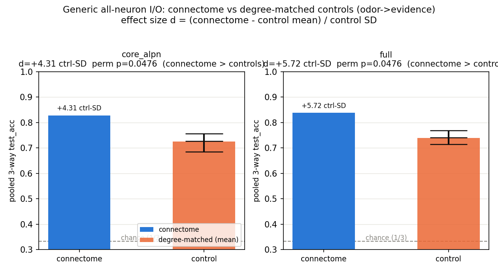
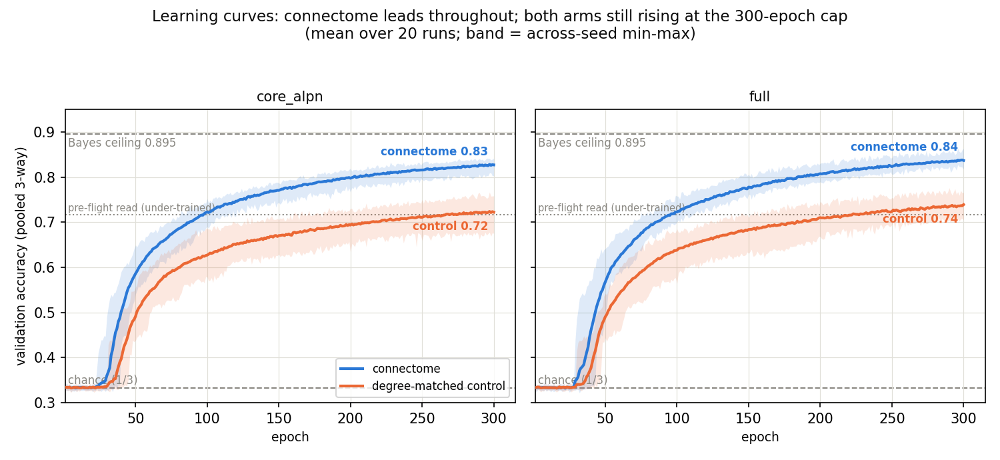
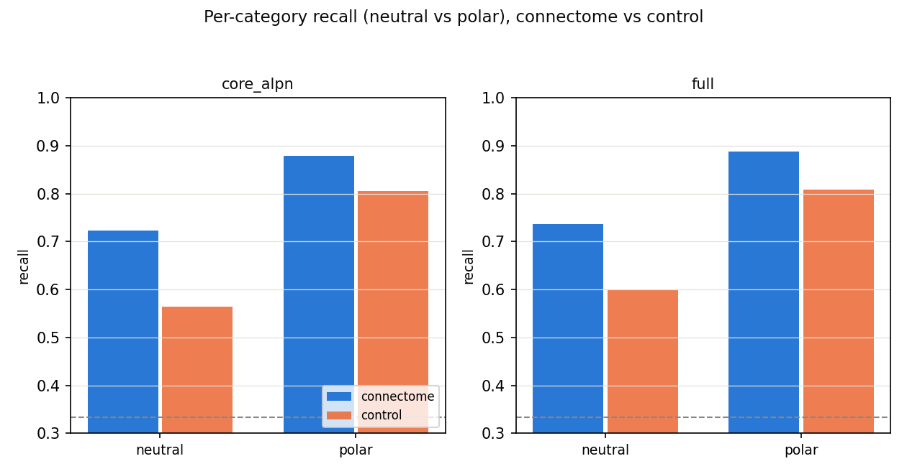

# Experiment 6 — MB evidence integration (the temporal-integration task)

**Date started:** 2026-07-08
**Status:** **Concluded 2026-07-09.** The connectome beats degree-matched controls on the
temporal-integration task on **both** substrates, with the connectome's worst seed above every control
graph (complete separation, effect **4.3–5.7 control-SD**). **The Exp-1/2 connectome advantage
generalizes beyond MQAR** to a structurally different task class. Scope: this is *generality of the
advantage across tasks*, **not** a claim that the connectome is better *at integration specifically*
(the same regime already wins on non-integration MQAR — see Results); and it is **n=1 biological
graph** ("this connectome," not "topology as a class"). Verified by two independent adversarial
reviews. Numbers in Results.
**Code:** [`../experiment_06_mb_evidence_integration/`](../experiment_06_mb_evidence_integration/) ·
launcher [`run.py`](../experiment_06_mb_evidence_integration/run.py) ·
README [`README.md`](../experiment_06_mb_evidence_integration/README.md).

## Purpose

Every connectome-vs-control result to date (Exp 1–5) used tasks whose answer is available at a
**single moment**: MQAR key→value lookup (Exp 1–4), Exp-5 single-shot odor→valence binding (each
odor shown once with its reinforcement). None of them require the recurrence to **accumulate
evidence over time**. Experiment 6 asks the question on a task that does: read each odor's latent
category out of the **running mean** of several noisy scalar evidence samples spread across an
interleaved stream. If real recurrent wiring ever helps a trainable substrate, temporal integration
— where the recurrence must carry and combine information across many steps — is a natural place to
look, and it is a regime none of the earlier tasks probed.

This keeps the clean, well-powered comparison of Exp-5 subrun-01 (generic all-neuron I/O +
degree-matched controls + genuine training-seed replicates, the Exp-1/2 regime where the connectome
*beat* controls on MQAR) and swaps **only the task** from single-shot binding to temporal
integration.

## Hypothesis + falsification

**Hypothesis:** if connectome topology helps a trainable recurrent substrate anywhere, it should
help most on a task that requires temporal integration, because the structured recurrence provides
an accumulation prior that random degree-matched wiring lacks. Under generic all-neuron I/O with all
operator confounds matched (params, degree/weight multiset, ρ=0.95, **and** activation-RMS), the
`generic_connectome` pooled 3-way `test_acc` should exceed the `generic_degree` control distribution
(permutation-rank at or near the 1/21 floor, with a positive effect size in control-SD units), on at
least one substrate.

**Falsification (the honest null this design is built to expose):** if `generic_connectome` **ties**
the degree-matched controls (connectome mean inside the control p05–p95 band) once the operator gain
is matched, then topology does not help temporal integration either — extending the Exp-4/5 "no
wiring advantage" story to a third task family and further localizing the Exp-1/2 MQAR advantage to
something task-specific rather than a general property of the wiring. A connectome **loss** (as in
Exp-5's biological-port backprop) would be the strongest anti-topology result yet, and the
activation-RMS match is included precisely so a loss cannot be dismissed as an unmatched-gain
artifact.

## Methods

**Task (new — `odor_evidence_task.py`).** Per episode, draw O odors from a bank of 256. Each odor i
gets a latent category `c_i` drawn **balanced** from 3 classes {attract:+m, neutral:0, repulse:−m}
(chance 1/3). Each **presentation** of odor i emits a fresh scalar `e_{i,t} = μ(c_i) + η`,
`η~N(0,σ²)`; odor i is presented K times, and the N_pres = O·K presentation steps are a **random
interleave** of the multiset {odor_i × K}. **Stream step** = `[ odor_i(+odor noise) | e+ | e- |
query=0 ]` with `e+ = relu(+e)`, `e- = relu(−e)` (two rectified evidence channels, parallel to
Exp-5's reward/punish one-hot); odor & evidence **co-occur** at every presentation step. **Query
phase** = O steps, one per odor in random order, `[ odor_i(+odor noise) | 0 | 0 | query=1 ]` →
target `c_i`, **scored**. Supervision is **end-of-stream only** (loss + accuracy at the O query
steps; every presentation step masked). Reversal is **dropped** (pure stationary integration).
`ROLE_DIMS = 3`, `input_dim = odor_dim + 3 = 67`, `output_dim = 3`. Bayes-optimal decoder = the
thresholded sample mean with boundaries at ±m/2 ("valence = category of the average signal");
finite K + noise ⇒ an irreducible mid-band error = the difficulty knob.

**Two decoupled noise sources (the confound defusal).** (1) `odor_noise_std = 0.03` (LOW) — odor
identity stays reliably recognizable, so routing is **not** the bottleneck. (2) `evidence_noise_std
= σ` — the **primary** difficulty / cap knob (per-presentation SNR = m/σ; integrated SNR =
(m/σ)·√K). Lowering m/σ lowers the plateau **without** an optimization stall, unlike raising O
(which stalls — subrun-01's item-count cliff).

**Starting operating point (SPEC 2.2, pinned in `run.py`).** 256 odors / dim 64 / **O=6** (below the
8-smooth/10-stall cliff) / **K=8** / **m=1.0** / **σ=1.0** (m/σ≈1.0) / odor_noise 0.03. Sequence
**T = O·K + O = 54** (~2× subrun-01 BPTT depth). Target mid-band pooled 3-way accuracy **~0.70–0.80**
(chance 0.333; analytic **Bayes ceiling 0.895** at m=1/σ=1/K=8, verified; single-shot first-presentation
oracle **0.589** as the lower reference) — the band is set below the 0.895 ceiling so calibration does
not aim into it. GROK thresholds retuned to the 3-way scale **0.45 / 0.55 / 0.65**.

**Conditions / substrates / controls.** Generic all-neuron I/O (`MatrixEpisodicRNN`: dense
trainable `W_in` into all N, readout from all N, trainable recurrence on the fixed sparse support,
`freeze_recurrent=False`) — **identical model construction** for connectome and control, only the
recurrence operator differs. Backprop only (plasticity paradigms **deferred to a future Exp-6
subrun** — readout-only topology + n_eff=1 + the 3-way neutral class are awkward for a matched-filter
rule). Substrates `core_alpn` (6014) and `full` (14k). Per substrate: `generic_connectome` ×20
**genuine training-seed replicates** (real graph, real model uncertainty — a strict improvement over
the plasticity n_eff=1) vs `generic_degree` ×20 independent degree-preserving control graphs. lr
fixed 1e-3. **Total = 2 × (20 + 20) = 80 runs.** An optional bracketing null `generic_randomZ`
(unstructured random graph, +40 runs) is implemented but **left out of the pinned plan**.

**Operator matching (what makes the comparison fair).** Connectome vs control are matched on:
param count (identical model class), degree sequence + weight multiset (`degree_preserving_random_like`),
spectral radius **ρ=0.95 held for BOTH arms**, **and** an **activation-RMS match applied through a
non-recurrent lever** — an **input gain on `W_in`** (baked into the trained model's input pathway)
chosen so each control's mean **pre-nonlinearity activation RMS** equals the connectome's on a fixed
task-shaped probe batch (W_in/b_rec seeded identically). Because the gain scales only the input
pathway, it **never touches the recurrence operator's spectrum**, so the integration timescale
(init memory ≈ 1/(1−ρ) ≈ 20 steps at ρ=0.95) is identical across arms — the exact dimension this task
measures. *(Fix logged after an independent review: the original mechanism multiplied the whole
recurrence operator by the gain, which on the real substrates dropped the control's ρ from 0.95 to
~0.76 — init memory ~4 steps vs ~20 — confounding the integration comparison in the connectome's
favor. The input-gain lever leaves ρ=0.95 for both. The earlier "gain≈1.006, ρ→0.956" note was from
the 400-node synthetic smoke only and did not hold on real data.)* The pre-match gap, the applied
input gain, the **post-match residual gap** (a recurrent-driven component the input lever cannot
cancel — recorded, never closed by distorting ρ), and `rho_after` (≈0.95 for both arms) are stored
per run (`meta.act_rms_match`) and aggregated in `analysis.json`.

**Metric + statistic.** Primary = pooled end-of-stream 3-way query accuracy (`test_acc`), per
substrate. Primary statistic = permutation-rank exactly as Exp-5/subrun-01: p = (#{control means ≥
connectome mean} + 1)/(N+1), floor 1/21 ≈ 0.048, via the same `empirical_null` helper; **lead with
effect sizes in control-SD units** — `(connectome_mean − control_mean)/control_SD`, computed per
substrate+metric and stored in `analysis.json` — not the floor-p. **Multiple-comparisons labeling
(honest, no correction math, matching prior experiments):** `test_acc` per substrate is the
**pre-registered primary (2 tests)**; the neutral/polar recall comparisons are **secondary (4 tests)**.
Family = 2 substrates × 3 metrics = 6 empirical-null tests at floor p=1/21; family-wise exposure is
reported (`analysis.multiple_comparisons`) rather than corrected. Secondaries: per-category accuracy (the
overloaded neutral-class vs polar-class recall split, reported per run at zero extra cost; the full
{attract,neutral,repulse} breakdown from the verifier), the integration curve, and the two
ablations. Pseudo-replication note: the connectome is **one** graph, but this arm's 20 seeds are
**genuine training-seed replicates** (real model uncertainty), a strict improvement over the Exp-5
plasticity arm's n_eff=1.

**Verifier baselines (prove the task requires integration; run at pre-flight as eval-modes).**
(1) **first-presentation-only** — zero the evidence channels on all but each odor's first
presentation; a real integrator should drop toward the single-shot (K=1) level. (2) **shuffled
evidence** — permute the evidence samples across odors, breaking the odor↔evidence link; accuracy
must collapse toward chance 1/3. (3) **integration curve** — sweep K∈{1,2,4,8} at eval; accuracy
must rise monotonically. (4) **analytic Bayes bound** — the thresholded-sample-mean oracle ceiling,
reported alongside. Implemented as `--eval-first-only / --eval-shuffle-evidence / --eval-K-curve` in
`run_experiment.py`.

**Run scale / budget / pre-flight.** 80 runs, 300-epoch cap, patience OFF (converged-stop val≥0.995
kept, won't fire mid-band); **not trimmed** (avoids the Exp-2 patience-bimodality artifact).
`microsteps=2` (parity; inert for generic I/O), `train_batches` 200→150 to offset the deeper BPTT,
lr 1e-3. 40-GPU fleet, S3 prefix `pathint-exp06-evidence-integ`, isolated `outputs/`. **Pre-flight
required before spend** (local RTX 5060 Ti, BOTH substrates, advisory not gated): band check
(off-ceiling <~0.90, off-floor >0.45, let each run reach ≥ep40 before judging), verifier ablations,
lr micro-sweep {3e-4,1e-3,3e-3} connectome-only; if full heads to ceiling **raise σ** (lower m/σ
toward 0.7–0.8), do **not** raise O past 8; pin the confirmed constants.

**What distinguishes this from Exp 5 / subrun-01.** Same engine, same generic-I/O + degree-matched
regime, same permutation-rank stat; the **task** changes from single-shot binding to **temporal
integration**, adds a **third (neutral) class** and a **balanced 3-way** target, and adds the
**required activation-RMS match** to the operator construction. It reuses the Exp-1 numerical engine
by import (as Exp 2–5 do) and copies the Exp-4/5 substrate for a self-contained frozen record.

## Run log

**2026-07-08 — seeded.** Scaffolded `experiment_06_mb_evidence_integration/` (`odor_evidence_task.py`
— the new generative task behind the Exp-5 public surface; `common.py` — reuses the Exp-1/5 engine by
import, retunes GROK to the 3-way scale 0.45/0.55/0.65, and adds the required activation-RMS match
into `build_condition_operator`; `run_experiment.py` — the subrun-01 engine with the new task params,
3-way output, the verifier eval-modes, and the optional `generic_randomZ` condition;
`run.py` — the frozen 80-run launcher pinning the SPEC 2.2 operating point, S3 prefix
`pathint-exp06-evidence-integ`, FLEET_SIZE 40; `make_figures.py`; `README.md`); copied the Exp-4/5
substrate (`port_indices.npz`, manifest) for self-containment. Smoke test (`--smoke`, CPU synthetic
substrate) passes: trains a tiny connectome **and** a tiny degree-matched control end-to-end, computes
the end-of-stream 3-way masked-CE loss (train_loss ≈ ln 3 ≈ 1.099 at init, as expected), emits 3
logits, and reports ~chance (0.333) recall on the 4-epoch check; the activation-RMS match runs on the
control (gain ≈ 1.006 on the synthetic substrate, ρ shifting 0.95→0.956) and the diagnostic writes to
`analysis.json`; the verifier eval-modes (`--eval-first-only/-shuffle-evidence/-K-curve`) run and write
`verifier_<substrate>.json`; all three figures render. **Pre-flight NOT yet run** — the SPEC 2.2 band
(0.65–0.85) is a reasoned starting point, not calibrated; the required next step is the band check on
both substrates + the verifier ablations + the lr micro-sweep before any spend (see `run.py` docstring
/ README).

**2026-07-08 — independent review + ρ/RMS confound fix.** A fresh review agent (adversarial, no
allegiance to the builder) audited the build and caught one spend-blocking confound: the
activation-RMS match, as first built, scaled the whole recurrence operator, which on the REAL
substrates dragged each control's spectral radius from 0.95 to **~0.76** (core) / **~0.75** (full) —
a confound in the exact dimension the experiment measures (ρ ≈ integration timescale, init memory ~
1/(1−ρ): ~20 steps at 0.95 vs ~4 at 0.76). The "gain ≈ 1.006, ρ→0.956" figure in the seeded entry
above was only from the 400-node synthetic smoke; on real data the operator gain was ~0.78–0.83.
**Fix (chosen by S.H.): hold ρ=0.95 for both arms and match activation-RMS via a NON-RECURRENT
input-gain lever on the control's `W_in`** (`common._solve_input_gain` / `build_condition_operator`),
so the recurrence spectrum is never touched. Verified on the real substrates: **ρ = 0.9500 exactly
for every control on both core_alpn and full**, residual RMS gap <0.5%. Also corrected: Bayes ceiling
is **0.895** (not 0.92) at m=1/σ=1/K=8, single-shot oracle 0.589; effect-size-in-control-SD now
computed in `analyze()`; primary/secondary comparisons labelled; `run_experiment.py` docstring
brought into line with the fix.

**2026-07-08 — pre-flight (COMPLETE, all pass) + launch.** Ran locally on the RTX 5060 Ti; the
epoch-cap lesson from Exp-5 subrun-01 (a 60-epoch check undershoots a slow grok) was honoured — band
checks run to ≥140 epochs.
- **Band check, core_alpn** (generic_connectome, lr 1e-3): ~45-epoch flat latency (train_loss pinned
  at ln 3), then grok → plateau **val 0.716 @ ep131**. Off-floor, **off the 0.895 ceiling**, in the
  0.70–0.80 target band.
- **Band check, full 14k** (the "runs hotter" / ceiling-risk arm): tracked core almost point-for-point
  (ep60 0.54, ep80 0.63, ep120 0.69) → plateau **val 0.716 @ ep136**. **No ceiling behaviour; σ=1.0
  needed no adjustment** on either substrate.
- **Verifier ablations** (both substrates, proving the task requires temporal integration; reused the
  band-check checkpoints):
  | ablation | core | full 14k | expected |
  |---|---|---|---|
  | baseline pooled | 0.712 | 0.709 | ≈ band plateau ✓ |
  | first-presentation-only | 0.442 | 0.414 | drop toward single-shot ✓ |
  | shuffled-evidence | 0.334 | 0.332 | collapse to chance 0.333 ✓ |
  | K-curve (K=1,2,4,8) | 0.39→0.45→0.60→0.71 | 0.39→0.46→0.59→0.71 | monotone rise ✓ |
  Neutral is the hardest class (core 0.55 / full 0.57), as designed (it requires confirming *small*
  accumulated magnitude). Task validity confirmed on both substrates — not a disguised single-shot task.
- **lr micro-sweep** (core, connectome-only, 180 ep): **3e-4 → 0.657** (slowest grok, lowest),
  **1e-3 → 0.716** (pinned), **3e-3 → 0.762** (fastest grok, ~+0.05). 3e-3 marginally beats 1e-3 but
  sits closer to the 0.895 ceiling (less discriminating headroom); **1e-3 kept** as the pinned lr — a
  fair, in-band operating point with better separation room, applied identically to both arms. A
  **3e-3 replication is noted as a future robustness-check subrun** (does the connectome-vs-control
  verdict hold at higher lr?), not a change to this frozen run.

**Launched** the 80-run fleet at lr 1e-3 (S3 `pathint-exp06-evidence-integ`, FLEET_SIZE 40). Monitor
with `run.py --status` / `--log`; `run.py --collect` on completion. Interpretation is
**pre-registered**: because the integration task class was chosen as the regime most *favourable* to a
topology effect, **a connectome win must survive robustness checks (σ variation, the random-Z bracket,
seed spread) before it supports "topology helps"; a tie is the strong, clean result** (a null under
the most favourable conditions). This guards against reading a favourably-selected task as vindication.

**2026-07-09 — collected + two independent reviews.** All 80 runs completed the full 300-epoch
schedule (none NaN'd, none early-stopped). `run.py --collect` wrote `outputs/analysis.json` and both
figures. Two fresh adversarial review agents (no shared history with the build) audited the result from
separate angles — (1) statistics / matching / confounds, (2) task / implementation / record-coherence.
Neither could break the effect; both independently converged on the same two points: the result is
sound and well-powered, and its interpretation must stay scoped to *generality of the advantage across
task classes* rather than *integration-specific* computation (this experiment has no within-experiment
non-integration control, and the same regime already wins on non-integration MQAR). See Results.

## Results

**Headline — the connectome advantage generalizes beyond MQAR.** On the temporal-integration task
(read a 3-way category out of the running mean of noisy evidence spread across an interleaved stream),
the real MB connectome beats degree-matched control graphs on **both** substrates by a wide margin. The
connectome's *worst* seed is above *every* control graph — complete distributional separation. This is
the same generic-all-neuron-I/O + degree-matched regime that won on single-moment MQAR (Exp 1/2); it
now reproduces on a structurally different computation. So the connectome advantage is not a quirk of
one task family.

| substrate | connectome | degree control | gap | effect (control-SD) | perm-p |
|---|---|---|---|---|---|
| core_alpn (6014) | **0.827** ± 0.009 | 0.725 ± 0.024 | +0.102 | **4.31** | 0.048 (floor) |
| full (14025) | **0.838** ± 0.008 | 0.739 ± 0.017 | +0.099 | **5.72** | 0.048 (floor) |

Chance 0.333; analytic Bayes ceiling 0.895. **Lead with the separation, not the p.** The permutation-p
sits at its 1/21 floor only because there are 20 control graphs — it is resolution-limited, not a
measure of the effect's strength (2 primaries uncorrected → Bonferroni 0.095, so the floor-p alone
would not clear a family-wise 0.05). The load-bearing fact is instead the **complete separation**: core
connectome min 0.805 > control max 0.764; full 0.819 > 0.770. That is correction-proof and does not
depend on the number of controls.

**Learning curves (per-epoch validation accuracy, 20 runs/arm, band = across-seed min-max).** The
connectome leads the degree-matched control from the moment both groks (~epoch 25–45) all the way to
the cap, on both substrates. Two things the curves make visible that the bars cannot: (1) **both arms
are still rising at the 300-epoch cap** — neither is stopped mid-climb, and the late-epoch slopes are
near-identical between arms, so the gap is a stable lead, not a stopping artifact; (2) the pre-flight's
"0.716 plateau" was an **under-trained read** — the real connectome runs pass it around epoch 100 and
climb to 0.83–0.84, while the *control* is what actually settles near 0.716.

**Per-category recall (secondary).** The connectome leads on both the polar (attract/repulse) classes
and the harder neutral class (μ=0, straddles both decision boundaries) on both substrates. Neutral is
the lower bar for both arms, exactly as the Bayes structure predicts.

| | neutral recall | polar recall |
|---|---|---|
| core connectome | 0.723 | 0.879 |
| core control | 0.564 | 0.805 |
| full connectome | 0.737 | 0.888 |
| full control | 0.599 | 0.809 |

**Matching held — the comparison is fair.** Verified per-run (not just on means): ρ = **0.9500 for all
80 runs**; edge and trainable-recurrent-parameter counts identical within substrate (core 471,292; full
574,660 — no capacity/sparsity confound); post-match activation-RMS residual ≤0.0007, in the intended
direction. Identical inits and identical batch/noise streams across arms — only the recurrence operator
differs. The ρ→0.76 confound caught in the pre-launch review did **not** reappear (`analysis.act_rms_match`).

**Scope — what the data does and does not license.**
- **Supported:** *this* MB connectome's advantage over degree-matched controls is not specific to MQAR;
  it holds on temporal integration too. The advantage **generalizes across task classes** — which is
  the question this experiment was built to answer.
- **Not claimed:** that the connectome is better *at integrating.* The same generic-I/O regime already
  wins on non-integration MQAR, and this run has no within-experiment non-integration control to isolate
  an integration channel. The verifier ablations validate that the *task* requires integration, not that
  the *connectome-vs-control gap* is caused by it. Both reviews converged here. The pre-registered
  "accumulation-prior" mechanism is therefore **not distinguished** from a task-agnostic
  wiring/trainability advantage — and does not need to be for the generality claim.
- **n = 1 biological graph.** The connectome arm is one real graph re-seeded 20× (genuine training-seed
  replicates — real model uncertainty — but graph-level uncertainty is n=1). Licensed statement: "this
  *Drosophila* MB connectome beats controls," not "connectome topology as a class helps." The latter
  needs the random-Z bracket + σ-variation robustness (future subruns).

**Correction to the pre-flight band framing (above).** The pre-flight's "0.716 plateau" was an
**under-trained read** — the epoch-cap lesson biting the calibration step itself. The real 300-epoch
connectome runs climb to **0.83–0.84**, only ~0.06 below the 0.895 Bayes ceiling — hotter than the
intended 0.70–0.80 band. This can only *compress* the top of the connectome distribution and thus
*shrink* the measured gap (the control at 0.74 is nowhere near ceiling), so it works **for** the result,
not against it — but the "in-band, off-ceiling" wording in the 2026-07-08 pre-flight log is inaccurate
for the connectome arm and is corrected here.

**Independent review — task validity confirmed, no flaw found.** Neither adversarial reviewer could
break the effect. Task validity was re-confirmed from the code and the real-substrate ablation outputs:
single-shot Bayes caps at 0.589 while models reach 0.83 (so they *must* be averaging samples);
shuffled-evidence collapses to exactly 0.333 (the odor↔evidence binding, not identity/position/global
statistics, carries the answer); K-curve rises monotonically; labels re-drawn per episode (no memorizable
table); classes exactly balanced (zero prior); the answer is absent from the query-step input; supervision
is end-of-stream only. One record gap to close: the verifier-ablation JSONs currently live only in the
pre-flight temp dir — re-run `--eval-first-only/-shuffle-evidence/-K-curve` into `outputs/` so the frozen
record is self-contained.

**Next.** To move from "the advantage generalizes" toward "*why* it transfers," the clean follow-up
(a new experiment, not a subrun of this frozen `run.py`) runs the verifier ablations on the **control**
arm too and adds a matched **non-integration (K=1)** control trained end-to-end for both arms — testing
whether the connectome's edge is *larger* with integration than without. Plus the pre-registered
robustness subruns (σ variation, random-Z bracket, 3e-3 lr replication).

**Data:** `outputs/analysis.json`, `outputs/runs/*/result.json` (80 runs; each carries the 300-epoch
per-epoch `curve`); figures `figures/fig1_integration_wiring.png`, `figures/fig2_per_category.png`,
`figures/fig4_learning_curves.png` — all regenerated from `outputs/` by `make_figures.py`
(`run.py --collect`).
