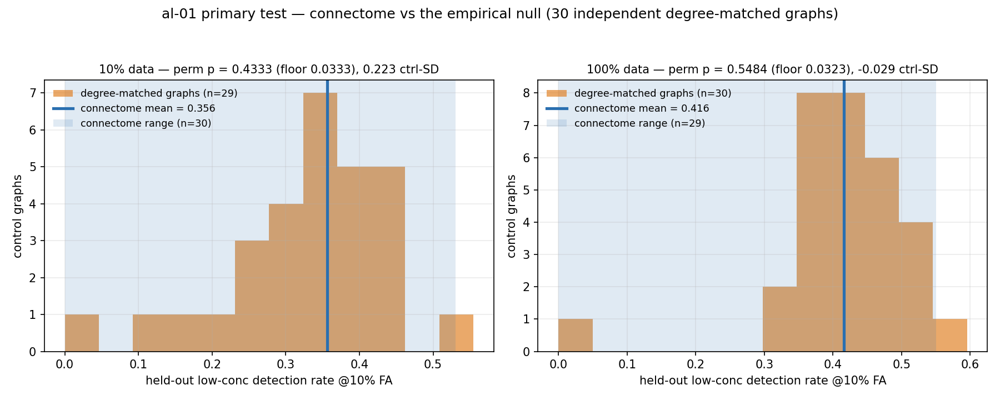
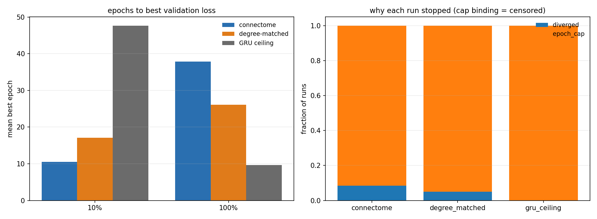

# Experiment al-01 — Antennal-lobe connectome vs degree-matched wiring on turbulent gas detection

**Date started:** 2026-07-18
**Status:** **Concluded 2026-07-19 — clean NULL at the GRU ceiling.** The connectome does not beat
degree-matched wiring (perm-p 0.433 / 0.548 against floors of 0.033 / 0.032). The pre-registered
prediction — that the mb-01/02/06 advantage would reappear because this task is classification-shaped
— **failed**. Analysis and figures were generated 2026-07-19 and reproduce the audit exactly. ⚠️ One
loose end remains: the activation-scale confound is unaudited. See *Open items*.

**First experiment of a new `al` (antennal lobe) track.** It re-runs, at house protocol, a question
a collaborator already asked in [`docs/results/antennal_lobe_gas`](../../docs/results/antennal_lobe_gas)
— that study is a **separate lineage** and no code is shared with it, `src/`, or `scripts/`.

**Code:** [`../experiment_al_01_turbulent_gas/`](../experiment_al_01_turbulent_gas/) ·
frozen record [`run.py`](../experiment_al_01_turbulent_gas/run.py) ·
README [`README.md`](../experiment_al_01_turbulent_gas/README.md).

## Purpose

Does the antennal-lobe connectome detect a faint target gas better than the same graph degree-rewired,
at matched spectral radius?

The antennal lobe is the fly's first olfactory relay, and the task — pick out ethylene in turbulent
air against a methane or CO distractor, having only ever trained on strong whiffs — is close to what
that circuit evolved to do. So this is a **task–region alignment** test in the same family as cx-01,
but on a **classification**-shaped problem rather than regression. That matters: every connectome win
so far (mb-01, mb-02, mb-06) came on classification, and cx-01 found only a tie on regression. If the
advantage is classification-specific, it should appear here.

### Why re-run something already run

The collaborator's study reported a small connectome edge (0.690 vs 0.652 detection at a fixed 10%
false-alarm rate). A review found the **direction sound but the evidence unresolvable**:

- **6 control graphs.** The house permutation floor is `1/(n+1) = 0.143` — significance was
  unreachable no matter how clean the result.
- **Cohen's *d* on pseudo-replicated runs** as the headline. The connectome arm's "seeds" are
  re-trainings of *one* graph, so *d* treats training noise as graph sampling.
- **30-epoch cap, patience 6.** Checked against that study's own `metrics_by_run.csv`: the *sparse*
  arms were not differentially truncated (connectome 21.6 vs degree 21.2 mean epochs), so its
  connectome-vs-degree comparison stands as far as it goes. Its **dense** arms, though, stopped at
  ~14 epochs and reached the cap in only 3% of runs — so its loudest claim, *"dense controls cannot
  even learn the task"*, is confounded with truncation.

al-01 re-runs **only the comparison the review found sound**. Dense and spectrum-matched arms are out
of scope; re-testing that claim properly needs its own experiment, since it also requires the mb-06
activation-RMS match to be fair.

## Methods

**Substrate.** FlyWire 783, ROI-anchored: every proofread neuron with ≥1 synapse in `AL_L`/`AL_R`,
induced subgraph — the recipe mb-01 used for the mushroom body and cx-01 for the central complex.
Built from the feather already on disk; no download and no external annotation table needed.

- N = 4,947 neurons, 276,366 edges, 1,487,993 synapses
- 100% NT sign coverage, **35.3% inhibitory** (per-presynaptic dominant fast transmitter, cx-01 logic)
- stored `M[post, pre]` and raw; ρ rescaling happens at run time

The collaborator's study selected neurons by `cell_class` (ORN / ALLN / ALPN) because it wired
biological input and output ports. al-01 runs **generic all-neuron I/O**, which needs no cell
identity — dropping that dependency and matching mb/cx.

**Model.** House dynamics, not the prior study's leaky-tanh: ReLU full-replacement map,
`h ← relu(M h + W_in x_t + b)`, K = 2 microsteps per input step (receptor → local → projection is
2 hops), no leak, readout at the final timestep. Trainable = edge *values* on the frozen wiring, plus
`W_in`, bias, readout. **Parameter counts are identical across arms (335,731 verified).**

**Task.** UCI 309 turbulent gas mixtures, 180 trials, 8 metal-oxide sensors + temperature/humidity at
10 Hz. Train on medium/high ethylene, **test on held-out low concentration**. Trial-level splits —
no window crosses train/test. 10 s windows at 5 Hz, z-scored on train statistics only.

**Arms and matching.**

- `connectome` × 30 training-seed replicates of the one real graph
- `degree_matched` × 30 **independent** degree-preserving rewirings (the empirical null)
- both rescaled to ρ = 0.95; generic I/O; identical parameter counts

**Training.** 150-epoch cap, `PATIENCE = EPOCHS` → **plateau early-stop disabled** (the mb-02 lesson).
Adam, lr 1e-3, batch 128, grad clip 1.0. Model selection on **validation** loss, never test.
Fractions 10% and 100% of training windows. Dense GRU ceiling × 3 seeds per fraction, so a null can be
read as a tie rather than a floor (cx-01's gate convention). **126 runs total.**

**Primary metric:** `test_low` recall at a fixed 10% false-alarm rate. *Not* accuracy or AUPRC — the
low-concentration split is **89% positive**, so an always-say-yes detector scores 0.889 on both.

**Primary test:** permutation null, `p = (beat+1)/(n_ctrl+1)`, floor **0.032** with 30 control graphs.
This is primary precisely because the connectome arm is pseudo-replicated.

### Known limitation, carried forward deliberately

`test_low` holds 48 positive trials but only **6 negative trials**, so the false-alarm threshold that
defines the primary metric is set by ~17 windows from 6 trials. We keep the collaborator's split for
comparability rather than re-cutting it — re-cutting would cost training negatives, already the
minority class. Mitigation is structural: arm-vs-arm inference rests on the 30-graph permutation null
rather than within-test-set precision, and every primary number carries a **trial-level bootstrap CI**.
A 2-epoch check gave a CI of roughly [0.42, 0.78] around a point estimate of 0.50 — wide, and that
width is the honest uncertainty.

### Open lever, not exercised in this run

mb-06 added an **activation-RMS match** (via a non-recurrent input gain) on top of ρ-matching, having
found ρ alone does not equalize drive between arms. al-01 does **not** apply it, matching mb-01/02/05
instead. If the arms turn out to differ in activation scale, that is the first thing to test in a
follow-up subrun.

## Results

**The connectome ties its degree-matched shuffle, and the tie is at a ceiling rather than a floor.**
124 of 126 runs landed. Numbers below were recomputed directly from the 62 per-shard CSVs in
`outputs/` — see *Open items*, the collect step never ran.

### The primary test

`test_low` recall at a fixed 10% false-alarm rate, connectome mean against the distribution of
independent control graphs, `p = (beat+1)/(n_ctrl+1)`:

| fraction | connectome | degree_matched | Δ | rank | perm-p | floor |
|---|---|---|---|---|---|---|
| 10% | 0.356 ± 0.115 (n=30) | 0.332 ± 0.111 (n=29) | +0.025 | 13 / 30 | **0.433** | 0.033 |
| 100% | 0.416 ± 0.131 (n=29) | 0.419 ± 0.104 (n=30) | −0.003 | 17 / 31 | **0.548** | 0.032 |

The connectome mean sits in the dead centre of the null at both fractions, and the direction **flips
sign** between them — the signature of noise, not of a suppressed effect. All 14 secondary metrics
(`test_low` AUROC / AUPRC / balanced-acc / recall@5%FAR, and the `test_iid` equivalents) are also
null, p 0.45–0.74 with scattered signs. No post-hoc metric choice manufactures a win, which is
reassuring rather than damning: the null is robust to analytic flexibility.

### The gate: a tie, not a floor

| fraction | GRU seeds | GRU min | best recurrent run | separation |
|---|---|---|---|---|
| 10% | 0.704 / 0.654 / 0.674 | 0.654 | 0.555 | complete, +0.100 |
| 100% | 0.618 / 0.630 / 0.634 | 0.618 | 0.596 | complete, +0.022 |

Every GRU seed beats every one of the 118 recurrent runs at both fractions — with **fewer** trainable
parameters (206,081 vs 335,731) and 150–190× less wall-clock. The task is comfortably learnable above
where both wiring arms sit, so this is a genuine tie between the arms, not the uninterpretable
double-floor of vis-01.

### Censoring and divergence: clean

- **No truncation.** Zero runs peaked in the last 10% of their epochs; the maximum `best_epoch`
  anywhere is 97 against a 150 cap, and no run recorded `stopped_reason == "plateau"`. Patience was
  genuinely disabled. The cap was ample and non-binding — the cx-02 failure mode avoided.
- **Divergence is symmetric.** 8 runs diverged, all at the 10% fraction: 5/30 connectome vs 3/29
  degree-matched, Fisher exact p = 0.71. They kept their best-validation checkpoints and scored
  slightly *higher* than completed runs (0.374 vs 0.340), because `best_epoch` was early anyway. Not
  a fairness confound.

### What this null can and cannot bear

**It cannot bear "the connectome has no advantage here."** To clear the permutation floor the
connectome mean had to beat *all 30* control graphs — about **+0.177, or ~1.7 control-SD**. The effect
being chased (the collaborator's +0.038) is roughly **4.6× smaller than this design can ever declare
significant**. Raising the control count from 6 to 30 fixed the *floor* (0.143 → 0.033) but did
nothing for the *resolution*, which is set by the control-graph SD (~0.11) — and that SD is dominated
by training noise and the tiny test split, not by graph structure. The honest framing is **"no effect
detectable at this design's resolution."**

**It does bear "no positive evidence for an effect."** The observed difference is ~0 and sign-flipping,
not "positive but blurry." Nothing here points toward an advantage that better power would sharpen.

### Against the collaborator's study — not a refutation

| | collaborator (`docs/results/antennal_lobe_gas`) | al-01 |
|---|---|---|
| substrate | 3,499 neurons by `cell_class` (ORN/LN/PN, ~61 glomeruli) | 4,947 ROI-anchored on `AL_L`/`AL_R` |
| I/O | biological — sensors → ORNs, readout ← PNs | generic all-neuron |
| dynamics | leaky-tanh | house ReLU full-replacement, K=2, no leak |
| statistic | Cohen's *d* over 6 pseudo-replicated seeds | permutation over 30 independent graphs |
| result @f100 | 0.690 vs 0.652, *d* = 1.74 — "suggestive, not proven" | 0.416 vs 0.419 — null, p = 0.548 |

The statistics here are strictly better. But **al-01 scores ~0.27 lower on both arms**, and its GRU
ceiling (0.62) lands *below* the collaborator's connectome (0.690) — this configuration runs the task
substantially worse, which leaves less room for any topology effect to show. Four things changed at
once (substrate, I/O, dynamics, statistics), so the disagreement cannot be attributed to any one of
them. This is a rigorous null on a different, weaker configuration, **not** a refutation of the prior
result.

*Speculative, and the obvious thing to test:* the generic all-neuron I/O discards the glomerular
channel structure — and that structure is itself much of the topology under test. Pushing sensor input
into 4,947 undifferentiated neurons and reading from all of them may remove the very organization the
experiment was trying to measure. The collaborator's own README reports biological I/O performing as
well as or better than free wiring, which is consistent with this. It would be killed by an arm that
restores `cell_class` I/O and still ties.

### What it means for the track

al-01 pre-registered the prediction that the mb-01/02/06 advantage would reappear here because the
task is **classification**-shaped, unlike cx-01's regression tie. **That prediction failed.** The
classification-specificity hypothesis now has a counterexample, and region×task alignment or substrate
identity looks like the likelier discriminating variable. Note the caveat above, though: with the I/O
confound unresolved, al-01 weakens the classification hypothesis rather than settling it.

### Open items — this result is not fully validated

1. ~~**`run.py --collect` was never run.**~~ **Resolved 2026-07-19.** The analysis step was run
   directly on the local shards (skipping the S3 sync, which the fleet no longer needs), producing
   `outputs/analysis.json`, `outputs/metrics_by_run.csv` (124 runs), `outputs/loss_history.csv` and
   figures 1–4. **The canonical numbers reproduce the audit exactly** — f100 `p_perm` 0.5484 with
   16/31 controls beating the connectome mean, floor 0.0323 — so nothing above changes.
   `fig4_censoring_check.png` confirms the censoring guard passes: no plateau stops in any arm, mean
   best epoch 10–38 against the 150 cap, and divergence at 8% (connectome) vs 5% (degree-matched).
2. **Shard 15 is missing** — 124/126 runs. Specifically `connectome__u07__f100` and
   `degree_matched__u09__f010`. This leaves n_ctrl = 29 at the 10% fraction, so the floor there is
   **0.0333**, not the 0.032 quoted above in Methods and in `run.py` / README. Immaterial at p = 0.43.
3. ~~**Real bug at `common.py:266`.**~~ **Fixed 2026-07-19 — but the landed grid keeps the old
   numbers.** The strict `>` against the false-alarm threshold zeroed runs whose outputs saturate:
   positives landing *exactly on* the threshold were excluded, so 5 runs scored exactly 0.0 on the
   primary despite AUROC 0.72–0.81, and 23% of the grid was zeroed at the 5% FAR. `recall_at_fpr` now
   reads the operating point off the ROC curve by linear interpolation (the standard definition,
   matching the trapezoidal convention `roc_auc` already used), with tied scores resolving as a block.
   Verified: on the saturated case it returns 0.87 where the old form returned 0.0 (AUROC 0.943), and
   it is a **no-op on well-behaved scores** — identical to the old form across 200 realistic
   continuous draws (max |Δ| 0.00000). **The 124-run grid was not recomputed and cannot be:** raw
   scores were never saved, and `analyze()` only re-aggregates metrics computed at training time. So
   every number in this entry still carries the old definition. The effect on the conclusion is
   nil — the audit re-ran the permutation excluding the zeroed runs and got p = 0.41 / 0.40, still
   null — but arm SD stays inflated ~2× (f100 connectome 0.131 → 0.066 without them), which means the
   **resolution limit above is pessimistic**: a re-run under the fixed metric would have a tighter
   control band and could resolve a smaller effect. That is the main reason to re-run rather than a
   correction to the result.
4. **The activation-scale confound is unaudited.** mb-06 found that ρ-matching alone does *not*
   equalize drive between arms and added an activation-RMS match; al-01 deliberately did not apply it
   (see *Open lever* above). The implementation-fairness review that would have measured this was not
   completed, so it remains **unknown** whether the two arms sit at different activation scales at
   matched ρ. With ReLU and no leak this is plausible. Until checked, the null carries an unexamined
   fairness assumption.

### Next

The clean follow-up changes **one** variable: keep al-01's 30-graph permutation design, ReLU dynamics
and 150-epoch cap, and restore the collaborator's biological `cell_class` I/O (sensors → ORNs, readout
← PNs). If the effect reappears, the AL advantage is I/O-dependent and the prior study was right about
mechanism; if it stays null at that study's performance level, the original +0.038 was seed noise.
Worth pairing with the activation-RMS match so item 4 is closed at the same time. Lower priority:
re-cutting the test split for more than 6 negative trials, and training each control graph on several
seeds so the null distribution reflects graph sampling rather than training noise — both attack the
resolution limit, which more control graphs cannot.

Data: `outputs/metrics_shard*.csv`, `outputs/result_shard*.json`, `outputs/history_shard*.csv`
(62 shards, git-ignored).
