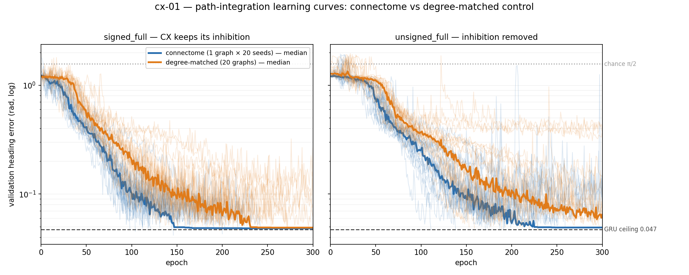
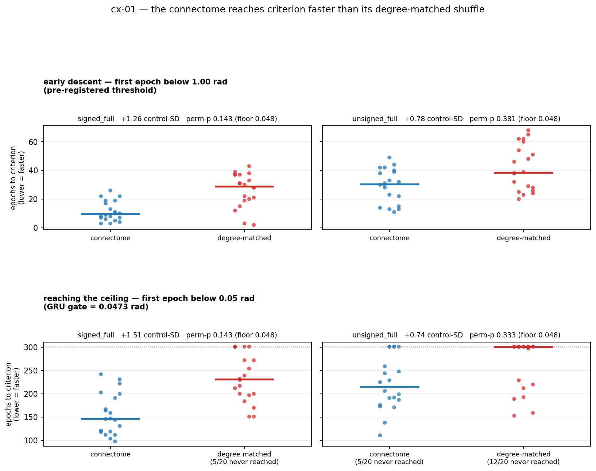
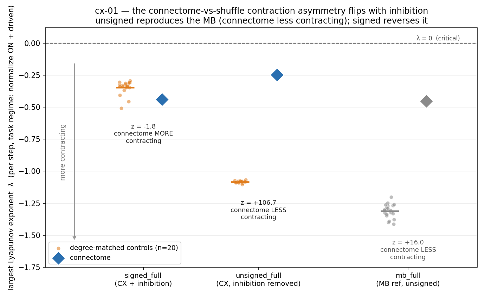
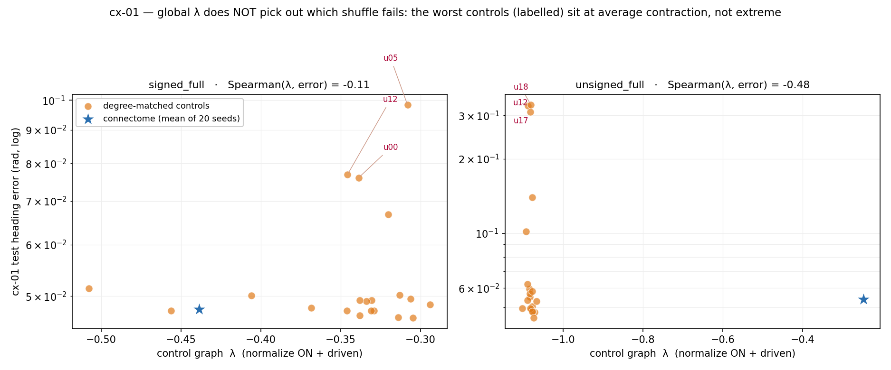
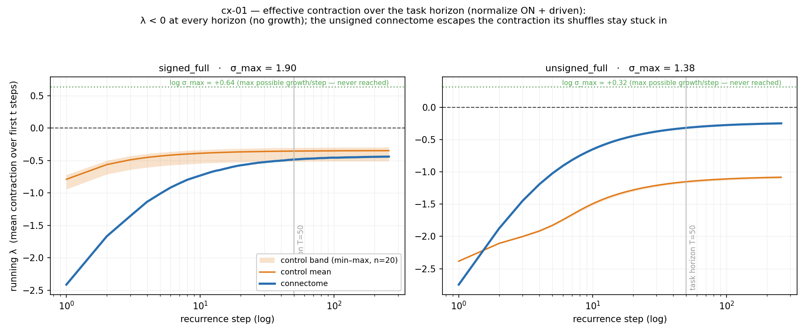

# Experiment cx-01 — CX connectome vs degree-matched controls on path integration

**Date started:** 2026-07-15
**Status:** **Subrun 01 complete (2026-07-16); dynamics follow-up added (2026-07-17); speed analysis
added (2026-07-18).** The result has **two halves, and the second was missed on first reading.**

**(1) Accuracy — the pre-registered tie.** On the central complex's *own* dead-reckoning task, with
ρ=0.95 and normalization matched across arms, the connectome does **not** beat its degree-matched
shuffle on final heading error (perm-p 0.38 `signed_full` / 0.52 `unsigned_full`, both far from the
1/21 ≈ 0.048 floor; the connectome mean sits inside the control p05–p95 band). This is a tie **at the
ceiling, not a floor**: both arms reach the GRU's ~0.047 rad (~2.7°), so it is a *clean* null, unlike
vis-01's floored one.

**(2) Speed — where the connectome does separate.** On **how fast** the two arms get to that shared
ceiling, the connectome leads by **+1.26 to +1.51 control-SD on `signed_full`** — roughly 3× faster
through early descent (median 9.5 vs 29 epochs) and ~1.6× faster to the ceiling (147 vs 231 epochs),
with 20/20 connectome seeds arriving against 15/20 shuffles. **This is the largest connectome-vs-control
effect in the experiment**, ~3× the accuracy effect (0.51 SD), and it is *not* explained by conditioning
(see Results → Speed). It is, however, **underpowered: perm-p 0.143 — 2 of 20 control graphs still beat
the connectome mean**, and with 20 control graphs the test cannot resolve it further.

So the honest one-line summary is **not** "no advantage." It is: **the connectome does not reach a
better answer, but it reaches the same answer faster and more reliably than degree-matched wiring —
suggestively, not significantly.** The original entry recorded this only as a caveat inside a
reliability sentence; it is a primary finding and is now written as one. See *Results → Speed* for why
it was nearly missed (a threshold-scaling bug in the instrumentation, worth its own note).

A follow-up ran dyn-01's Lyapunov probe on the CX substrate to connect the result to the dynamics; it
complicated the tidy contraction story rather than confirming it (see Results → Dynamics).
**Code:** [`../experiment_cx_01_path_integration/`](../experiment_cx_01_path_integration/) ·
launcher [`subruns/01_main/run.py`](../experiment_cx_01_path_integration/subruns/01_main/run.py) ·
README [`README.md`](../experiment_cx_01_path_integration/README.md).

**First experiment of a new `cx` (central complex) track.** The prior CX path-integration work
elsewhere in the repo (`docs/results/cx_*`, `scripts/path/`, `src/`) is a **separate lineage** and is
deliberately not reused — no imports, no shared code. See *Relationship to the prior CX work*.

## Purpose

Every connectome-vs-control **win** so far (mb-01, mb-02, mb-06) came on **classification**-shaped
tasks — the answer is available at a moment, and the network settles onto it. vis-01 then ran the same
comparison on continuous **regression** (track a moving signal) and found the optic-lobe connectome
only **ties** its degree-matched shuffle; dyn-01 supplied the mechanism (every substrate contracts, so
the state collapses to a fixed point and the readout emits the per-episode mean).

That leaves the central question of the whole arc unanswered: **is the connectome advantage genuine
task–region alignment, or is it classification-specific?**

The central complex is the sharpest available test. Its heading system is a **ring attractor** —
heading is a bump on a low-dimensional ring manifold, maintained and shifted by the connectivity
itself. It is the one circuit whose computation *is* its topology, on a *tracking* task. If any
connectome should beat its degree-matched shuffle on regression, it is this one on its own native
task. A win is the strongest result available; a tie is a real and publishable narrowing.

## Hypothesis + falsification

**Hypothesis:** on `cx_polar_bump` (the CX-native dead-reckoning task), under generic all-neuron I/O
with trainable edges and ρ=0.95 matched across arms, the connectome's heading error is **lower** than
the degree-matched control distribution — permutation-rank at/near the 1/21 floor with a positive
effect in control-SD units, on at least one substrate variant.

**Falsification:** a **tie** (connectome mean inside the control p05–p95 band) once ρ is matched shows
the advantage does not carry to regression even in the region whose computation is its topology —
which would localize the mb-01/02/06 result to classification-shaped tasks and corroborate vis-01.

**Third outcome (explicitly in scope):** **both arms at chance** (π/2 ≈ 1.5708 rad). vis-01 floored
60/60 runs on this task class. If cx-01 floors the same way, that is informative in itself — it says
the blocker is the *dynamics* of these sparse RNNs on regression, not the region — and subrun 02 then
asks whether the vis-01 medicine (normalization off + stronger `W_in` drive) is the same medicine
here or whether the CX needs a different one. The GRU gate is what makes that reading valid.

**Scope:** n=1 biological graph → "this connectome," not "topology as a class." The connectome arm is
20 **training-seed replicates of one graph** (pseudo-replication) against 20 **independent** control
graphs, so the permutation rank is primary and the rank-sum is not.

**Note on what the hypothesis covers.** Both the hypothesis and the falsification above are stated over
**final heading error only**. Time-to-criterion was instrumented (see *Optimisation + protocol*) but no
prediction was registered for it. The speed result in *Results → Speed* is therefore reported as a
strong observation on a planned measurement, **not** as a pre-registered test — the distinction matters
for how much weight it can carry, and this experiment exists partly to correct a lineage that blurred it.

## Methods

### Substrate — built fresh from FlyWire 783

[`build_cx_substrate.py`](../experiment_cx_01_path_integration/build_cx_substrate.py) reads only the
shared, pinned FlyWire 783 release already on disk (no neuPrint, no credentials) and writes the
**signed, full** adjacency plus a core index vector. All four variants derive at load
(`common.load_substrate(sign=…, scope=…)`); nothing is rebuilt per variant.

- **nodes** — every neuron with ≥1 synapse in the CX neuropils `{EB, PB, FB, NO}` (the CX is a midline
  structure, so these are unpaired — there is no left/right decision to make, unlike vis-01's optic lobe).
- **edges** — synapses *between* those nodes falling in the CX neuropils, aggregated to
  pre→post = summed `syn_count`. Same ROI-restricted convention as `build_ol_substrate.py`.
- **sign** — per-presynaptic-neuron dominant fast transmitter (ACh → +1; GABA/Glut → −1), same rule
  as vis-01.
- **orientation** — post × pre, so `rec = M @ h` is biologically forward (the Exp 4–6 / vis-01 convention).
- **ρ** — raw spectral radius stored; the run rescales to 0.95.

| variant | N | edges | inhibitory |
|---|---:|---:|---:|
| `signed_full` | 6,195 | 304,027 | 55.3% |
| `signed_core` | 2,874 | 290,118 | 55.9% |
| `unsigned_full` | 6,195 | 304,027 | 0% |
| `unsigned_core` | 2,874 | 290,118 | 0% |

**Sign coverage is 100%** of edges — the point of departure from the prior CX substrate, which
recorded `sign_coverage: 0.0` (see below).

**The halo — the Exp-2 lesson, found again.** ROI-anchoring with no synapse threshold pulls in passing
fibres, exactly as it did for the MB. The CX-anchored 6,195 is sharply bimodal: the median anchored
neuron spends only **~3.6%** of its synapses in the CX (p25 ≈ 0.4%), while p75 ≈ 94%. Two independent
cuts agree on where the real circuit is — `cell_class == "CX"` (Schlegel et al. 2024) gives **2,874**
neurons, and a >10%-of-synapses threshold gives 2,978 — and that core carries **95.4% of the edges on
46% of the nodes**, which is strong evidence the halo really is passing traffic. It is the mirror image
of Exp-2's finding: 454 Kenyon cells, 80 DAN, 20 MBON and 2,483 unlabelled fragments sit in the
CX-anchored graph, just as 639 CX neurons sat in the MB substrate. The canonical ring-attractor cast is
all present and pooled for later use (EPG 51, PEN 42, PFN 443, PFL 50, PFR 31, ER 278, Δ7 42, hΔ 189,
vΔ 391).

### Task — `cx_polar_bump`, kept as-is

[`path_task.py`](../experiment_cx_01_path_integration/path_task.py) is a fresh, self-contained
reimplementation (nothing under `src/` is imported). The locked decision was to keep the task
unchanged, so every constant and the generator are ported faithfully.

- **input** `[T, 2]` — forward speed + angular velocity from a **correlated run-and-tumble** walk
  (alternating run segments of 6–18 steps and turn segments of 2–7). Pure idiothetic self-motion.
- **target** `[T, 35]` — 32-bin von Mises heading bump (κ=8) ++ **egocentric** home bearing cos/sin ++
  home distance / 25. The home vector is egocentric and never an input, so the network must hold both
  a heading estimate and an integrated position estimate. Genuine dead reckoning.
- **loss** — `bump + bearing + 0.5·distance` (MSE, sigmoid on the bump logits).
- **primary metric** — heading-bump angular error, **radians, lower = better**, via population-vector
  decode. **Chance = π/2 ≈ 1.5708** and is recorded on every result row and in the analysis, so a
  floored arm is impossible to miss. (The prior CX writeups did not report chance, which is how a
  near-floor comparison came to be presented as a 27σ win.)
- T = 50; 10,000 train / 2,000 val / 2,000 test trajectories; batch 256.

**Port verification** (run before anything was built on it): on a shared RNG stream the controls,
integrated state and targets are **bit-identical** to `src/task.py`, and the loss matches `src/train.py`
to 8 decimal places. A random-prediction sanity check scores 1.579 rad ≈ chance.

### Model

[`model.py`](../experiment_cx_01_path_integration/model.py) — `CXRNN`, copy-adapted from vis-01's
`FlowRNN` (itself from the Exp-1/5/6 `MatrixEpisodicRNN`). Keeping the class identical to vis-01's is
deliberate: it makes the cx-01 vs vis-01 contrast a comparison of substrate and task, not of model code.

- `h ← relu(W_rec @ h + W_in x + b_rec)`, readout every step; **generic all-neuron I/O** (dense
  trainable `W_in` 2→N and readout N→35). Not biological ports — that is a later experiment (cx-02);
  the pools are already built and shipped.
- **trainable edge values on the fixed connectome support** — the `observed` analogue, i.e. the regime
  mb-01…06 used. Not a frozen reservoir.
- `microsteps = 3` — the prior CX work's estimated K for this substrate.
- The MB engine's `MatrixEpisodicRNN` could not be used: it is a classifier (categorical readout,
  masked cross-entropy at query steps), and this task is per-timestep 35-D regression.

### Controls + matching

- **primary control** `degree_matched` — genuine degree-preserving rewiring (`mb.degree_preserving_random_like`,
  directed double-edge swaps preserving in/out degree sequence *and* the weight multiset including signs).
- 20 connectome training seeds vs **20 independent** control graphs, per substrate.
- every arm rescaled to **ρ = 0.95**; in-model activity normalization **on** for both arms, which
  bounds activity regardless of σ_max, so no operator-level RMS match is needed and the control's ρ
  stays at 0.95 too.
- per-arm conditioning diagnostics (ρ, σ_max, pre-normalization activation-RMS) recorded per run.

### Why normalization is left ON

vis-01 floored with normalization on and only broke the floor with it **off**; dyn-01 then showed the
normalization is the *dominant* contraction lever, dwarfing ρ. We could pre-bake that fix. The locked
decision is not to: whether the CX floors the same way the optic lobe did — and whether it needs the
same medicine or a different one — is itself the informative result. If subrun 01 floors, subrun 02
turns normalization off, and must then also switch on `--match-control-act-rms` (with the
normalization gone, the control's larger σ_max is no longer bounded, so activity would confound the
comparison — vis-01 subrun 07's fix).

### Learnability gate

A dense GRU (hidden 256, 3 seeds) on **byte-identical** data, run locally. It says what heading error
is achievable on this task at this operating point; the fleet says what the substrates achieve. Without
a ceiling a connectome floor is ambiguous — vis-01 burned 60 seeds × 300 epochs before a GRU showed its
stimulus was readable at all.

Note on how it came to be run: the decision at launch was to proceed **without** waiting on the gate —
a floor here is still a meaningful result, because the primary question (connectome vs degree-matched)
is a *within*-experiment contrast that a floor answers regardless of ceiling. The gate ran anyway
because `run.py::launch()` fires it automatically after staging the fleet; it is local and cheap
(~3 min) and does not touch the fleet's budget. It is recorded here because it landed and it is
informative, not because the run was gated on it. Result in Results → Gate.

### Optimisation + protocol

- 300-epoch cap, **`PATIENCE = EPOCHS` → plateau early-stop OFF** (the Exp-2 lesson: patience=40 cut
  late-grokking control graphs and manufactured a bimodality artifact). Converged-stop only.
- Adam, constant lr = 1e-3, grad-clip 1.0. Best-by-**validation** (minimum heading error), never test.
- Per-epoch atomic checkpoint + resume; idempotent (finished runs short-circuit on `result.json`).
- **Time-to-criterion was instrumented before launch:** `common.GROK_THRESHOLDS = (1.40, 1.20, 1.00)`
  records, for every run, the epoch / gradient-step / wall-second at which val heading error first
  crosses *downward* through each level. So speed is a planned measurement, not a post-hoc one — but
  the levels were chosen when a **floor** was a live outcome, and they turned out to be badly scaled
  for the regime the run landed in (see Results → Speed).
- **Stats:** permutation rank primary (`higher_is_better=False` — the engine supports it natively, so
  no metric is negated anywhere), led by **effect size in control-SD** and **min/max separation**. The
  perm floor is recorded explicitly: with 20 control graphs the +1-smoothed p cannot go below
  1/21 ≈ 0.048 — a resolution limit, not an effect size.

### Subrun 01 (pinned; launched 2026-07-15)

`signed_full` **and** `unsigned_full` × (20 connectome + 20 degree-matched) = **80 runs**. The pairing
does double duty: `unsigned_full` is the strict comparability arm (mb-01…06 all ran unsigned, and the
prior CX work was unsigned by necessity), while `signed_full` adds the inhibition the ring-attractor
story requires — so contrasting them asks *does the CX need its inhibition?*, a question the old
substrate could not pose at all.

- **fleet** — `FLEET_SIZE=40`, `WORKERS_PER_INSTANCE=1`, all on-demand (`USE_SPOT=false`): 2 runs per
  instance, run sequentially → **~11.4 h** wall-clock. Cost tracks GPU-hours, not fleet size, so 40 vs
  80 instances is the same spend (~380–570 GPU-h, ~$340–510) at 2× the wall-clock.
- **quota, for the record** — us-east-1 on-demand G/VT is **768 vCPU** (192 × g6.xlarge; 40 needs 160).
  The 64-vCPU figure in `aws_fleet/README.md` is the **spot** quota (16 × g6.xlarge) and does not bind
  while `USE_SPOT=false`. Quota was not the reason for 40; blast radius against capacity shortfall was.
- **instance mix (observed at launch)** — the fleet's capacity fallback engaged: the 40 boxes came up
  as a **mix of g6.xlarge and g5.xlarge**, g6 being intermittently short in us-east-1 (the shortfall the
  fleet README documents). Both carry a single GPU (L4 / A10G) and `WORKERS_PER_INSTANCE=1` holds, so
  the comparison is unaffected — but **per-run wall-clock is not homogeneous across the fleet**, so
  wall-clock-to-accuracy should be read per instance type, not pooled, if it is reported at all.
- **timing baseline** — measured **68.3 s/epoch** for `signed_full` on the local RTX 5060 Ti → ~5.7 h
  per 300-epoch run.

The `core` variants are built and one flag away (`--substrates signed_core unsigned_core`) but are not
run here.

## Relationship to the prior CX work

The repo already contains CX path-integration results (`docs/results/cx_structure_polar`,
`cx_eigval_vs_eigvec`, `cx_dense_trainable`, `hp_spectrum_sweep_cx`, `cx_biological_io`,
`cx_biology_convergence`). This experiment **shares no code with them** and does not build on their
conclusions. Three substantive differences:

1. **Trainable edges, not a frozen reservoir.** The prior results ran `--train-recurrent frozen` (only
   I/O trains). This is the `observed` analogue — the mb-01…06 regime.
2. **FlyWire 783, not hemibrain/neuPrint.** The prior CX graph needed live credentials against an
   unpinned server, and its metadata recorded **`sign_coverage: 0.0`** — hemibrain's neuPrint export
   carries no neurotransmitter prediction, so every CX edge entered that model as excitatory. The
   "local excitation + global inhibition" mechanism those writeups invoked was therefore not
   instantiated in the matrix they tested. Ours is 100% sign-covered and 55.3% inhibitory.
3. **Controls, stats and chance reported from day one.** The prior headline CX cell was n=1 seed; its
   frozen-regime σ values (21–27σ) do not reproduce from the shipped per-seed CSVs (recomputed paired
   t = 11.9–18.1, and "σ" on 2 d.o.f. is not a z-score); and the frozen comparison sat near chance
   (at T=200: cx_bpu 1.440 vs random 1.467 vs **no_recurrence 1.469**, against chance 1.571 — the
   no-recurrence control *ties* random, so recurrence bought nothing in that regime). Reporting chance
   on every row here is a direct response to that.

Nothing above is a claim that the prior results are wrong in their own regime — only that they do not
constrain this one, which is why this is a fresh build rather than an extension.

## Results

### Gate — the task is comprehensively learnable (in, 2026-07-15)

A dense GRU (hidden 256) on byte-identical data essentially **solves** `cx_polar_bump`:

| | heading error (rad) | vs chance |
|---|---:|---:|
| GRU, mean of 3 seeds | **0.0473** | −1.5235 |
| GRU, best seed | 0.0456 | −1.5252 |
| chance (uniform circular error, π/2) | 1.5708 | — |

Per-seed 0.0456 / 0.0487 / 0.0476 — tight. ≈ **2.7° of heading error**; all three seeds tripped the
converged-stop (val ≤ 0.05 rad). Data: [`subruns/01_main/outputs/gru_ceiling.json`](../experiment_cx_01_path_integration/subruns/01_main/outputs/gru_ceiling.json).

Two consequences:

1. **Any connectome floor in this experiment is now unambiguous.** A near-chance result cannot be
   blamed on an unlearnable task or a broken operating point — the data supports ~2.7° from a
   2-input recurrent net. This is the reading vis-01 lacked for 60 runs.
2. **It reframes the prior CX work.** Its best trainable (`observed`) result on this same task was
   **0.435 rad at T=50** (`docs/results/cx_structure_polar`), and its *frozen* regime — the one its
   headline "connectome beats every control, 21–27σ" rests on — sat at **1.054–1.441 rad against
   chance 1.571**. A plain GRU reaches 0.047. So the frozen CX comparison was not a contest between a
   good integrator and a slightly worse one; it was a contest between two networks that were barely
   integrating at all, ~30× off what the task admits. (Recorded as context for why cx-01 exists, not
   as a claim about that experiment's own regime.)

### Accuracy — the pre-registered tie (in, 2026-07-16)

All 80 runs finished (58 converged, 22 hit the 300-epoch cap); the shipped
[`analysis.json`](../experiment_cx_01_path_integration/subruns/01_main/outputs/analysis.json) matches
the per-run `result.json` values on re-aggregation. Both arms learn the task to near the GRU ceiling on
both substrates. The connectome does **not** beat its degree-matched shuffle on the primary permutation
test:

| substrate | arm | heading error (rad), mean ± SD | min–max | perm-p (floor 0.048) | effect (ctrl-SD) | complete sep? |
|---|---|---|---|---:|---:|---|
| `signed_full` | connectome | **0.0477 ± 0.0020** | 0.0428–0.050 | — | — | — |
| | degree-matched | 0.0546 ± 0.0135 | 0.046–0.098 | **0.381** | 0.51 | no |
| `unsigned_full` | connectome | **0.0540 ± 0.0132** | 0.047–0.096 | — | — | — |
| | degree-matched | 0.0999 ± 0.0962 | 0.045–0.331 | **0.524** | 0.48 | no |

The connectome mean sits **inside** the control p05–p95 band on both substrates, and perm-p (0.38, 0.52)
is nowhere near the 1/21 ≈ 0.048 floor — the pre-registered falsification criterion (connectome mean
inside the control band once ρ is matched) is met. The rank-sum trend favours the connectome (p 0.068
`signed`, 0.015 `unsigned`) but that is the explicitly non-primary statistic — the connectome arm is 20
training seeds of *one* graph (pseudo-replication), so the permutation rank across independent control
graphs is what counts, and it is a tie.

**A tie at the ceiling, not a floor.** Both medians settle onto the GRU's 0.047 rad — the connectome's
classification advantage does not reproduce here on *accuracy*, and it fails to reproduce because the
task is *solved*, not because it is unlearnable. The forward-filled medians in the figure hold each
converged run at its final value to avoid a survivorship artifact at the tail.

What the curves also show — and what this entry originally recorded only as a caveat — is that the two
arms **get to that shared ceiling at very different rates**. The connectome's 20 seeds cluster tightly
and early; the shuffles have a fat right tail (unsigned controls strand at 0.10–0.33), and every tail
run hit the **300-epoch cap still descending** (best-epoch 258–300). Reading that as a small
reliability footnote was the mistake: on the speed axis it is the largest effect in the experiment.
That analysis is next.

### Speed — the connectome reaches criterion faster (in, 2026-07-18)

Scoring **time-to-criterion** instead of final error separates the arms far more cleanly than accuracy
does. Code: [`speed_analysis.py`](../experiment_cx_01_path_integration/speed_analysis.py); data:
[`outputs/speed_analysis.json`](../experiment_cx_01_path_integration/outputs/speed_analysis.json).

Two criteria, deliberately at opposite ends of training:

- **early descent — first epoch below 1.00 rad.** *Pre-registered* (`common.GROK_THRESHOLDS`), read
  straight out of each run's recorded `grok` field.
- **the ceiling — first epoch below 0.05 rad.** *Post-hoc*: this level could only be picked once the
  GRU gate (0.0473 rad) had run.

Same statistic as the accuracy analysis — permutation rank of the connectome mean against the 20
independent control **graphs**. Runs that never cross are scored at 301 epochs, the *minimum* their true
value could take, so the control arm's slowness is understated rather than inflated.

| substrate | criterion | connectome (median ep) | degree-matched (median ep) | effect (ctrl-SD) | perm-p |
|---|---|---:|---:|---:|---:|
| `signed_full` | 1.00 rad (pre-reg) | **9.5** (20/20) | 29.0 (20/20) | **+1.26** | 0.143 |
| `signed_full` | 0.05 rad (ceiling) | **146.5** (20/20) | 231.0 (15/20) | **+1.51** | 0.143 |
| `unsigned_full` | 1.00 rad (pre-reg) | **30.5** (20/20) | 38.5 (20/20) | +0.78 | 0.381 |
| `unsigned_full` | 0.05 rad (ceiling) | **215.5** (15/20) | 301.0 (8/20) | +0.74 | 0.333 |

Four things follow.

1. **It is the experiment's largest connectome-vs-control effect.** +1.51 control-SD on `signed_full`
   against +0.51 for accuracy — roughly 3×. On the same substrate every connectome seed reaches the
   ceiling and a quarter of the shuffles never do.
2. **It is not a threshold artifact.** The two criteria sit at opposite ends of training — one just
   below chance, one at the GRU ceiling — and agree on both direction and substrate ordering
   (signed ≫ unsigned). A speed difference visible at both ends is not an artifact of where the line
   was drawn.
3. **It is not conditioning.** Both arms are rescaled to ρ=0.95, but ρ does not pin σ_max, and σ_max is
   what sets transient one-step gain — exactly the early-training regime in question (the Exp-2
   eigenvector-control lesson: ρ and σ_max decouple). Measured on the operators the runs actually used
   ([`sigma_max_check.py`](../experiment_cx_01_path_integration/sigma_max_check.py) →
   [`outputs/sigma_max_check.json`](../experiment_cx_01_path_integration/outputs/sigma_max_check.json)):

   | substrate | connectome σ_max | control σ_max (n=20) | ratio |
   |---|---:|---:|---:|
   | `signed_full` | 1.900 | 3.133 ± 0.276 | **0.61** |
   | `unsigned_full` | 1.379 | 1.150 ± 0.005 | 1.20 |

   On `signed_full` — the substrate carrying the strong effect — the connectome learns faster while
   operating at **0.61× the gain** of its shuffles. The conditioning confound runs *against* the
   finding there, which strengthens the topological reading. On `unsigned_full` the connectome does
   have more gain (1.20×), so conditioning stays a live alternative on that arm — but that is also the
   arm where the speed effect is weak (+0.74 SD, perm-p 0.33). **The clean effect and the clean
   confound-check coincide on `signed_full`.**
4. **It is underpowered, and that is the honest limit.** perm-p 0.143 on `signed_full` — 2 of 20
   control graphs still beat the connectome mean. It does not clear the pre-registered bar and is not
   claimed as significant. With 20 control graphs the +1-smoothed p floor is 0.048, so resolving this
   is a matter of **more control graphs**, not more training seeds (the connectome arm is already 20
   seeds of *one* graph — adding seeds only sharpens a pseudo-replicated mean).

**Also worth recording: why this was nearly missed.** `GROK_THRESHOLDS = (1.40, 1.20, 1.00)` was
instrumented before launch, but the levels were scaled for a run that might **floor** — 1.40 and 1.20
sit just under chance (1.5708), and once both arms sailed past them at epoch 1, the `grok` field looked
degenerate and went unread. Nobody rescaled the thresholds after the GRU gate showed 0.047 was
reachable, and no time-to-criterion statistic entered `analysis.json`. The instrumentation was built for
the wrong regime and then not revisited when the regime turned out otherwise. **Lesson for later
subruns: when a gate moves the expected operating point, re-scale the criterion thresholds with it.**
This compounds the Exp-5 pre-flight lesson (band-setting checks must run to the epoch cap) — both are
failures to re-tune instrumentation after the target range moved.

**Signed vs unsigned — the CX and its inhibition.** Both connectome arms solve the task; `signed_full`
is far tighter (±0.002 vs ±0.013), and the fat tail is much worse in `unsigned_full` (control mean 0.100
vs 0.055) than `signed_full`. Inhibition mainly buys **stability**, not a topology-specific accuracy
edge — the ring-attractor's inhibition keeps both arms, and especially the random shuffles, out of the
bad tail.

The speed analysis sharpens this: `signed_full` is where the connectome-vs-shuffle speed gap is strong
(+1.26/+1.51 SD) and `unsigned_full` is where it is weak (+0.78/+0.74). **Inhibition is what makes the
connectome's wiring advantage visible at all** on this task — with signs stripped, the connectome and
its shuffles converge at similar rates. That is the opposite of the accuracy picture, where signed and
unsigned both tie, and it is the first result in the arc that turns on the E/I structure specifically.

### Why it did not floor — the reading against vis-01 / dyn-01

vis-01 floored 60/60 on continuous regression, and dyn-01 attributed that to contraction: normalization
on → state collapses to a fixed point → readout emits the per-episode mean. By that logic cx-01, which
also ran normalization **on**, should have floored. It did not. The reconciliation that survives all
three experiments: **contraction is a low-pass filter, and what matters is the target's temporal
spectrum, not whether the task is "regression."** vis-01's optic-flow target changes frame-to-frame (a
low-pass state destroys it); cx-01's heading is piecewise-constant — held across 6–18-step runs, updated
at tumbles — and is the running integral of a strong, low-dimensional self-motion drive, which a leaky
integrator approximates well. This is *not* a horizon effect (cx-01's T=50 exceeds vis-01's T=32); it is
the target's bandwidth.

That makes cx-01 the **stronger** falsification. vis-01 was a tie *at the floor* — an ambiguous null,
because nobody succeeded. cx-01 is a tie *at the ceiling* — a clean null that removes the
"task-was-unlearnable" escape hatch. The connectome's classification advantage genuinely does not
transfer to this task.

### Dynamics — the Lyapunov probe on the CX substrate (in, 2026-07-17)

To connect the reliability effect to the dynamics, we ran **dyn-01's** largest-Lyapunov probe
(twin-trajectory / Benettin, λ<0 = contracting) directly on the CX operators — reusing dyn-01's probe
and its rho-rescale + degree-preserving control unchanged, so the CX λ is comparable to dyn-01's MB
rows and the 20 control graphs *are* the graphs cx-01 trained on. Code:
[`lyapunov_cx.py`](../experiment_cx_01_path_integration/lyapunov_cx.py); data:
[`outputs/lyapunov_cx.json`](../experiment_cx_01_path_integration/outputs/lyapunov_cx.json). The result
**complicated the tidy hypothesis** (that the connectome simply contracts *less* than its shuffle, as on
the MB):

Everything contracts (λ<0 everywhere), but the connectome-vs-shuffle asymmetry **flips sign with
inhibition** (task regime = normalize on + driven; per-step natural log):

| substrate | connectome λ | control λ (mean ± SD) | z | connectome is… |
|---|---:|---:|---:|---|
| `signed_full` | −0.439 | −0.346 ± 0.052 | **−1.8** | **more** contracting (2/20 controls below it) |
| `unsigned_full` | −0.248 | −1.082 ± 0.008 | **+107** | **less** contracting (0/20 below it) |
| *mb_full (dyn-01 ref, unsigned)* | *−0.454* | *−1.312 ± 0.054* | *+16* | *less contracting* |

- The **unsigned CX reproduces the MB** (both unsigned — the mb-01…06 regime): connectome far less
  self-contracting than its shuffles, amplified here (z +107 vs +16). "The connectome contracts less
  than its shuffle" is robust *in the unsigned regime*, now on a second region.
- **Inhibition reverses it** — a regime dyn-01 could never test (`sign_coverage: 0.0`): the biological
  E/I arrangement makes the real signed circuit contract *more* than a degree-matched E/I shuffle
  (z −1.8), consistent with a ring attractor using inhibition to contract onto the bump manifold.
- The connectome's λ is **stable to dropping inhibition** (−0.44→−0.25, a 0.19 swing) where the
  shuffles' is not (−0.35→−1.08, a 0.74 swing): the biological wiring sits in a moderate band regardless;
  its shuffles get flung to extremes. The two real connectomes (signed CX, MB) even land at nearly the
  same λ ≈ −0.45. The sign of every asymmetry is consistent across normalize on/off, so it is structural,
  not a normalization artifact.

**A global scalar λ does not explain *which* shuffle fails.** Across the 20 control graphs, Spearman(λ,
heading error) is −0.11 (`signed`) and −0.48 (`unsigned`); even the −0.48 is soft — the unsigned control
λ's are nearly identical (SD 0.008) while their errors span 7×, and the actual fat-tail graphs sit at
*average* λ, not extreme:

So the reliability edge is a **class-level** property (unsigned shuffles as a group over-contract, λ
≈ −1.08, consistent with state collapse), not a per-graph readout of this global λ. The running-λ
curves confirm there is **no perturbation growth at any horizon** — λ<0 throughout, even over the T=50
task window — so the state genuinely settles; the connectome-vs-control ordering is horizon-dependent
(the unsigned connectome climbs out of contraction fast; its shuffles stay stuck):

**Corrected interpretation.** The connectome's advantage is *sitting in a stable, moderate contraction
band that is robust to structural perturbation* — **not** "contracting less" (false on `signed`). The
"less-contracting" claim is scoped to the unsigned / MB-comparable arm; a scalar λ explains the ensemble
separation but not the individual failures, which likely live in specific low-D modes a global λ averages
over (the ring subspace) rather than in the mean contraction rate.

**How this lines up with the speed result (added 2026-07-18).** The two analyses point at the same
substrate. `signed_full` is both where the connectome sits in the moderate, inhibition-robust
contraction band *and* where it converges fastest relative to its shuffles; `unsigned_full` is where the
λ asymmetry is enormous (z +107) but the speed gap is weak. So the large *global* λ separation on
`unsigned` does **not** buy convergence speed, while the modest, well-placed contraction on `signed`
coincides with it. That is consistent with the reading above — a scalar λ is the wrong summary — and it
suggests the mechanism behind the speed effect is *where* the operator contracts (which modes), not *how
much*. The bump-subspace probe below is the way to test that directly.

### What's next

**First priority — power the speed finding.** It is the largest effect in the experiment and it sits at
perm-p 0.143 purely for lack of resolution: with 20 control graphs the p-floor is 0.048 and 2 controls
beat the connectome mean. The fix is **more independent control graphs on `signed_full`** (the strong,
confound-clean arm) — not more training seeds, which only sharpen a pseudo-replicated mean. This is
cheap relative to a new experiment and would settle whether the effect is real.

**This bears directly on cx-02, which is staged but not launched.** cx-02 currently **drops** the
degree-matched control on the grounds that "cx-01 settled that." That was written when the tie on
accuracy was the whole result. It is no longer accurate: cx-01 settled the *accuracy* question and left
the *speed* question open and underpowered. Dropping the control forecloses the cheapest route to
resolving the experiment's strongest signal. **Open decision — revisit before cx-02 launches.**

The dynamics also point to two mechanism tests, both on `cx_polar_bump`:

1. **Target-spectrum sweep** — speed up the walk / raise the angular-velocity bandwidth so heading varies
   faster. If contraction-as-low-pass is the mechanism, both arms should degrade toward the vis-01 floor
   *here*, directly testing "temporal spectrum, not task category."
2. **Long horizon (T=200), normalization on** — a leaky integrator loses the integral over long horizons
   (the prior CX work sat near chance at T=200). If the connectome contracts more gracefully, long-horizon
   dead-reckoning is where a connectome advantage could finally emerge on a regression task — *because of*
   the contraction story, not in spite of it.

A per-graph dynamical probe targeted at the bump subspace (leading Jacobian spectrum / participation in
the ring modes) is the right tool both for the mechanism behind the individual control failures and for
the "which modes, not how much" question the speed result raises.

Monitor / reproduce: `uv run python scott/experiment_cx_01_path_integration/subruns/01_main/run.py --status`;
figures via `plot_learning_curves.py`, `plot_lyapunov.py` and `speed_analysis.py`; dynamics via
`lyapunov_cx.py`; conditioning check via `sigma_max_check.py`.
