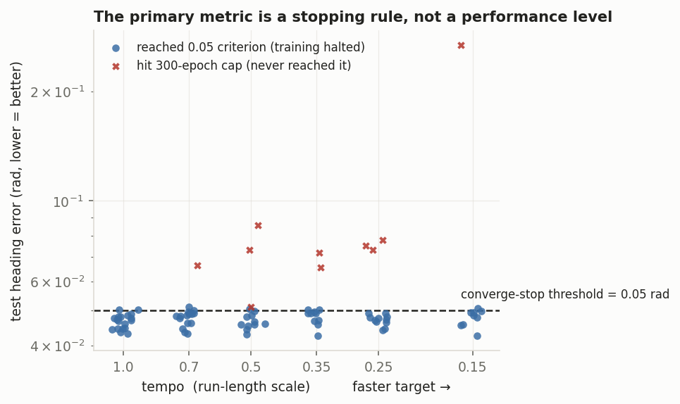
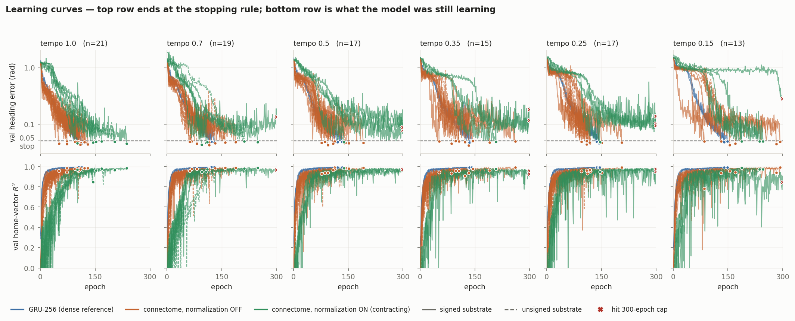
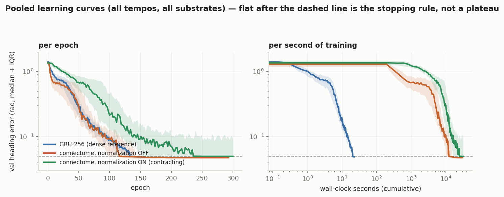
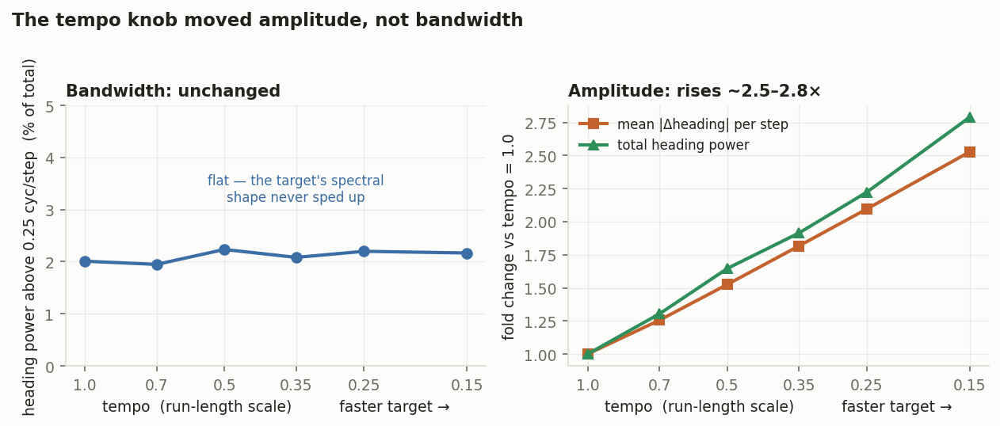
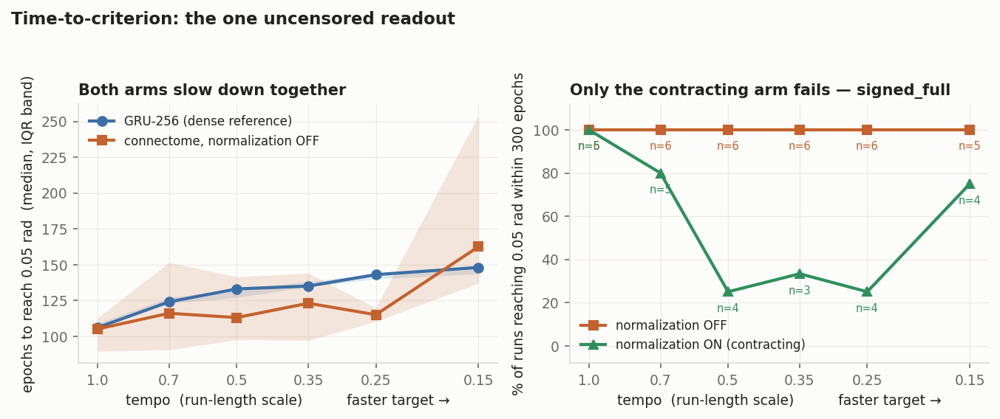
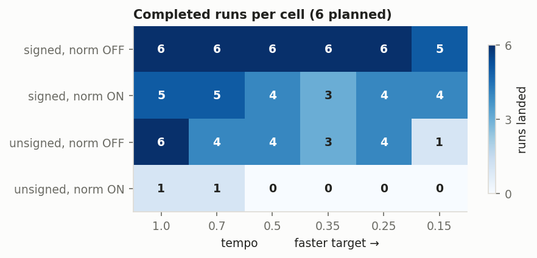

# Experiment cx-02 — stimulus-spectrum sweep: does the connectome floor when the target speeds up?

**Date started:** 2026-07-17
**Status:** **Ran 2026-07-18 — NON-RESULT; does not answer its question. Re-run required.** The sweep
landed (84 of 144 runs) but three independent problems make it uninterpretable for the low-pass
hypothesis: the primary metric was censored by the converge-stop, the tempo knob moved stimulus
*amplitude* rather than *bandwidth*, and the `unsigned_full` × normalization-ON arm has 2 of 36 runs.
Not a null — the design could not have produced an answer either way. See Results.
**Code:** [`../experiment_cx_02_stimulus_spectrum/`](../experiment_cx_02_stimulus_spectrum/) ·
launcher/record [`run.py`](../experiment_cx_02_stimulus_spectrum/run.py) ·
README [`README.md`](../experiment_cx_02_stimulus_spectrum/README.md).

Second experiment of the `cx` (central complex) track. Directly follows cx-01's conclusion.

## Purpose

cx-01 was the pre-registered tie — the connectome did not beat its degree-matched shuffle on the CX's
own dead-reckoning task — but the tie was **at the GRU ceiling (~0.047 rad), not a floor**: both arms
solve the task. The theory for why cx-01 succeeded where vis-01 floored on regression is that
**contraction acts as a low-pass filter**: harmless for cx-01's slow, piecewise-constant heading target,
fatal for vis-01's fast optic-flow target. So the axis that separates "succeeds" from "floors" would be
the **target's temporal spectrum**, not whether the task is nominally regression.

The problem: cx-01 vs vis-01 **confounds** target-spectrum with **drive strength**. cx-01 has *both* a
slow target *and* a strong, low-dimensional (2-channel), sustained self-motion drive; vis-01 has neither
(fast target *and* a weak, high-dimensional visual drive it needed a stronger `W_in` to inject). Either
could explain cx-01's success, and vis-01's own fix (normalization off + stronger `W_in`, not slowing
its target) is a thumb on the scale for the drive leg.

cx-02 isolates the target-spectrum leg. **Hypothesis:** with task, model, substrate, and per-step drive
magnitude all held fixed, speeding up the heading target pushes the connectome from the ceiling toward
the floor — and it degrades **faster than a dense GRU on identical data** (a widening gap), because the
GRU is not heavily contracting. **Falsification:** performance stays flat / tracks the GRU as the target
speeds up — then the low-pass leg was not the active one, and drive strength was carrying cx-01's
success (a result that would redirect cx-03 to a drive-strength manipulation).

## Methods (planned)

### The spectrum knob — "tempo" (shorten runs, turns intact: same-size heading steps, more often)

The run-and-tumble walk alternates **run** segments (heading held, ω≈0) and **turn** segments (heading
changes, |ω| large). Faster spectrum = heading persists for less time = shorter runs = higher tumble
rate. The knob scales the **run-segment length** by a factor `s` and **leaves the turns exactly as
cx-01's** (same duration, same |ω|), so each turn makes the **same-size heading step** and they just
come more often. `s = 1.0` is cx-01's baseline; `s < 1` is faster.

We deliberately do **not** try to hold the per-step drive magnitude fixed. You can't make the heading
change faster at a fixed step size without the ω *input* getting bigger — the ω input **is** the
time-derivative of the heading target, so more turning per unit time means a larger mean |ω|. An earlier
design ("choice A") held drive fixed only by scaling turn durations down too, i.e. by **shrinking the
heading steps** — which distorts what "faster" means. We let ω rise instead, because its direction is
**conservative** and converts the confound into the discriminator: the two hypotheses now predict
**opposite signs** — low-pass says a faster target is *worse*, drive-strength says a stronger ω drive is
*better*. So a degradation is attributable to target speed (it happened despite more drive), and an
improvement/flat would indict drive strength. To keep the *other* input channel clean, the **speed
channel is held fixed** (v rescaled to constant mean speed across tempos), so v-drive and the
position/home-vector target don't co-vary; only ω rises. Because `s` is only the *nominal* knob, the
real x-axis is the **measured spectrum of the delivered stimuli**, collected per tempo point (below).

### Design

- **Substrates:** `signed_full` + `unsigned_full` — carries cx-01's inhibition contrast into the
  spectrum question (does inhibition help track a faster target?).
- **Arm:** connectome only, `SEEDS` training-seed replicates per (substrate, tempo, normalize) cell.
  **The degree-matched control is dropped** — cx-01 settled connectome-vs-shuffle (a tie), and the
  variable of interest here is the spectrum. (A small control at only the fastest 1–2 tempo points, to
  catch a possible hard-regime connectome win, is an explicitly deferred option.)

  > ⚠️ **Open decision, added 2026-07-18 — revisit before launch.** The premise above ("cx-01 settled
  > connectome-vs-shuffle") is now only half true. cx-01's revision shows it settled the contrast on
  > **accuracy** and left it **open on speed**, where the connectome leads by +1.26/+1.51 control-SD on
  > `signed_full` — the largest effect in that experiment — but at **perm-p 0.143**, underpowered purely
  > because 20 control graphs put the p-floor at 0.048. Resolving that needs *more control graphs*, and
  > cx-02 as designed runs none. Two options: (a) leave cx-02 as-is and power the speed result in a
  > separate cheap cx-01 subrun (more `signed_full` control graphs, no new task code), or (b) promote
  > the deferred partial control here into the main design. (a) keeps cx-02's question clean and is
  > probably cheaper; (b) gets both answers from one launch. **Not decided — do not launch cx-02 on the
  > current justification without choosing.**
- **Regimes:** normalization **on** and **off** (the dominant contraction lever). Prediction: norm-off
  (less contraction) tolerates faster targets before flooring → its degradation curve shifts to higher
  frequency. With no control, norm-off needs no activation-RMS matching — it just runs.
- **GRU gate at every tempo point** (dense GRU, hidden 256, 3 seeds, byte-identical data). With the
  control dropped, the gate does its old job: the learnability reference *and* the comparison curve. The
  theory's signature is the connectome diverging *below* the GRU as the target speeds up.
- **Tempo grid** (provisional): `s ∈ {1.0, 0.70, 0.50, 0.35, 0.25, 0.15}`, floored at 1-step segments.
- **Held fixed at cx-01's operating point:** T=50, 10k/2k/2k trajectories, 32-bin von Mises bump +
  egocentric home vector, the same loss, ρ=0.95, generic all-neuron I/O, trainable edges on the fixed
  connectome support, 300-epoch cap with converged-stop only (plateau off). Only the walk generator's
  segment-length tempo changes.
- **Primary metric:** heading angular error (rad, lower = better); chance = π/2 ≈ 1.5708 on every row.

Provisional run count: 2 substrates × 6 tempos × 2 normalize × `SEEDS` seeds (= 144 at SEEDS=6) — tunable
before launch; cost flagged in `run.py`'s plan banner.

### Stimulus-spectrum metrics (the measured x-axis)

Per tempo point, from actual generated trajectories, collect and store: realized **heading
autocorrelation time**; **angular-velocity and heading power spectra** with a scalar summary (spectral
centroid / median frequency); realized **mean run length / tumble rate**; and per-channel **(v, ω) drive
RMS**. The last **documents** what covaried with the spectrum — confirming the speed (v) channel was held
fixed and quantifying how far the ω drive rose (the conservative direction). Results plot against the
measured spectrum, not the nominal `s`.

### Implementation (built; CPU-smoke-green 2026-07-17)

All three pieces landed and `run.py` is launch-ready (`_IMPLEMENTED = True`): **T1** the tempo-parameterized
generator (`spectrum_task.py` — cx-01's generator + the run-length `s` knob + the mean-speed rescale);
**T2** the engine's `--tempo-grid` **and** `--normalize-modes` plan axes, threaded into the data
(`get_splits` caches per tempo), the model build, and the `run_id`, with the GRU gate run per tempo;
**T3** `stimulus_spectrum_metrics`, attached per tempo in `analysis.json` next to the connectome−GRU gap.
Reuses cx-01's `model.py` + `common.py` (copied in); substrate copied into the experiment folder for a
self-contained frozen record. The smoke confirmed the knob behaves as designed: tempo 1.0→0.5 shortens
the heading autocorrelation time (12→8 steps) and mean run length (10.8→5.6), raises the ω drive
(RMS 0.19→0.25, the conservative direction), and holds the speed drive ~fixed. Launch is 144 runs
(2 substrates × 6 tempos × 2 normalize × 6 seeds), ~$550–920 — tunable before spending.

## Results

*Run 2026-07-18. Reviewed by two independent audits (task/metric code; statistics and run selection).*

**Headline: this is a non-result, not a null.** The sweep's surface reading — heading error flat at
~0.047 rad across every tempo, tracking the GRU — looked like clean falsification of the low-pass leg.
It is not. The metric that produced that flatness could not have shown anything else, the knob did not
manipulate the variable it was named for, and one quarter of the design is missing. Each of the three is
independently sufficient to void the conclusion.

### 1. The primary metric is a stopping threshold, not a performance level

`run.py:102` sets `CONVERGE_HEADING_ERROR = 0.05`, and `common.py:507-508` halts training the first
epoch validation heading error crosses it. **92 of 102 completed runs stopped that way — including all
57 normalization-OFF runs and all 18 GRU runs.** Their test errors span 0.0425–0.0511: a total range of
0.0086 rad, or 0.55% of chance (1.5708). That is resampling noise against a hard threshold.

Every blue point is a run that was stopped *because* it hit the dashed line. The flat ~0.047 curve is
the value of the stopping constant, not a property of the substrate. The only runs free to report a
real number are the 10 red ones that never reached criterion in 300 epochs — so the metric is bimodal by
construction: "hit the threshold" or "didn't". `analysis.json`'s `at_floor: false` is wrong in the
opposite direction; everything is pinned at a rule-imposed floor.

Corroborating: among converged runs, test heading error is statistically independent of actual path
integration quality (Spearman vs `home_r2` = +0.137, p = 0.25). The GRU has much better home-vector
accuracy (r² 0.993 vs 0.963) at an *identical* heading error. The metric has no resolution left.

**An alternative explanation was tested and ruled out.** We suspected 0.047 rad might be a decoding
floor from the 32-bin von Mises bump. It is not: error is computed against the *decoded* target, so
discretization cancels, and an oracle decode returns exactly 0.000000 rad. For calibration, adding
N(0, 0.05) noise to the target bump gives 0.026 rad and copying the previous step's bump gives 0.110 rad.
0.047 rad is a genuine, informative performance level — it is simply unreachable-past by the stop rule.

#### The same point as learning curves

Added 2026-07-19 (figures only; no new runs). Every run wrote a per-epoch history, so the censoring can
be shown directly rather than inferred from endpoint scatter — a curve that reaches the dashed line
simply *stops*, mid-descent.

Top row: validation heading error, one line per run, terminal dot = where training halted. In every
tempo panel the blue (GRU) and orange (normalization-OFF) curves are still falling steeply when they
touch 0.05 and terminate — none of them plateaus first. That is what makes the endpoint "flat 0.047"
uninformative. The green (normalization-ON) curves descend visibly more slowly and stay noisier, and at
the fast tempos several are still descending at the 300-epoch cap (red ×) — the same reach-rate effect
reported in §3, here as trajectories rather than a rate.

Bottom row: validation home-vector R², which no stopping rule touches. It saturates early — within
~30 epochs for the GRU, ~60 for the connectome — and then separates the arms by *stability* rather than
level: final median 0.993 (GRU) vs 0.967 / 0.972 (connectome OFF / ON), with the connectome showing
large transient dropouts throughout training (tail SD 0.038 / 0.026 vs the GRU's 0.006). So home R² is
uncensored but nearly as saturated; a re-run needs a criterion set well below 0.05, not just a second
metric.

Pooled across tempo and substrate (median + IQR; runs held at their last value after stopping, so the
flat right-hand tails are the stopping rule, not convergence). Per epoch the connectome with
normalization off is *ahead of* the GRU for the first ~100 epochs and reaches criterion in slightly
fewer epochs (median 116 vs 134); the contracting arm needs ~168. Per second of training that ordering
is irrelevant: the GRU reaches criterion in a median 20 s against the connectome's 12,192 s
(normalization off) and 17,590 s (on) — a ~600× wall-clock gap at comparable epoch counts, which is the
practical cost of the sparse substrate at this scale and belongs in the re-run's pre-registration
alongside epochs-to-criterion.

### 2. The tempo knob moved amplitude, not bandwidth

The knob was designed to speed up the target's *temporal spectrum* while leaving turns intact. Measuring
the delivered stimuli directly shows that "turns intact" is exactly the condition that pins the
target's frequency content:

Across the full 6.7× knob range the heading target's high-frequency power *fraction* is invariant
(2.0% → 2.2%), and peak |ω| is flat to within 5%. What rose is amplitude: total heading power 2.8×,
mean per-step heading change 2.5×. The flat ω-PSD centroid already in `analysis.json` (0.1037 → 0.1049)
was reporting this correctly — it is not a broken metric, it is the manipulation not happening.

This matters because **amplitude is the *opposing* hypothesis.** The design's central argument was that
letting ω rise is "conservative" because the two legs then predict opposite signs. But a knob that
raises drive power ~3× at constant bandwidth is predominantly a drive-strength manipulation wearing a
spectrum label. The realized change in the spectral variables that did move is modest — heading
autocorrelation time 11 → 5 steps — nowhere near the 6.7× nominal knob.

### 3. What the data *can* bear: time-to-criterion

Because error is pinned, the surviving signal is how long it took to get there — the readout this
project already treats as a real outcome rather than a nuisance.

- **Faster targets are harder to optimize for every architecture.** The GRU needs 106 → 148 epochs as
  tempo goes 1.0 → 0.15 (Spearman ρ = −0.94, p = 9e-9). This is the one clean, well-powered finding, and
  it confirms the manipulation did make the task meaningfully harder.
- **The connectome tracks the GRU when normalization is off** (median 105 → 162 epochs, vs the GRU's
  106 → 148 over the same range). It degrades slightly
  faster, but the interaction is **not significant** (z = −1.06), and the fastest-tempo cell drives all
  of it. No connectome-specific low-pass signature.
- **Only the contracting arm fails.** With normalization ON, `signed_full` runs fail to reach criterion
  at a rate that rises with target speed (0/5 at tempo 1.0 → 3/4 at 0.5 and 0.25), versus **0 of 35
  failures** with normalization off (Fisher p = 4.3e-5). This is the one result pointing the way the
  low-pass hypothesis predicts.

That last point is suggestive but cannot be promoted. It is a reach-*rate* result, not an accuracy
result; the cells behind it have n = 3–4; and it is **non-monotone** — the reach rate rebounds to 75% at
the fastest tempo. Splitting the arm by stop reason shows zero overlap (converged ≤ 0.0503, capped
≥ 0.0512), so the apparent error "trend" in `analysis.json` is entirely cap-rate. Restricted to runs
that converged, the trend vanishes (ρ = −0.365, p = 0.181), and the 0.1041 mean at tempo 0.15 is one run
(`u00_..._tempo0.15_norm1`, test 0.2686) whose validation error was still oscillating near 0.8 at epoch
300.

### 4. Coverage: a quarter of the design is absent

84 of 144 connectome runs landed; 28 more started but were cut off, and 32 never launched.
**`unsigned_full` × normalization-ON has 2 completed runs out of 36**, so the substrate × normalization
contrast — the inhibition question cx-02 inherited from cx-01 — is unestimable. `analysis.json` reports
these cells without flagging them as structurally absent.

The attrition is *not* selective dropping of diverged runs: no run recorded `diverged`, there are no
NaNs in any of the 130 epoch logs, and all 28 partial runs last wrote within a **118-second window**
(2026-07-18 15:13:43–15:15:41) — a fleet-wide teardown. But a wall-clock teardown censors on
time-to-converge, which is the quantity of interest: normalization-ON takes ~2× the wall clock
(median 236 vs 119 epochs), so it lost 11 runs to the teardown against normalization-OFF's 1.

### Other findings worth recording

- **The GRU is not capacity-matched, and the connectome is the larger model** — 208,675 trainable
  parameters vs 539,473 (2.6×). The GRU comparison is fair on data (`make_splits` seeds only from
  `data_seed`; both see byte-identical corpora per tempo) but rules out any parameter-efficiency reading.
- **`home_r2` is not saturated** (connectome 0.963 vs GRU 0.993) and does show tempo structure the
  heading metric cannot see (`unsigned_full` norm-OFF: ρ = +0.622, p = 0.0020). It is the better primary
  metric for a re-run.
- **ρ = 0.95 is an initialization only.** `W_rec_values` is trainable and unconstrained thereafter, and
  no weights are checkpointed, so post-training contraction cannot be measured at all. Recorded
  `sigma_max_after ≈ 1.90` (signed) means the operator is strongly non-normal and expansive in its worst
  direction even at init.
- **The pre-launch open decision was never resolved.** The 2026-07-18 note in this entry flagged that
  dropping the degree-matched control foreclosed the cheapest route to powering cx-01's speed result,
  and said "do not launch on the current justification without choosing." It launched anyway.

### What this changes

Nothing about the low-pass vs drive-strength question. cx-01's reconciliation with vis-01 stands exactly
where it did — untested. The cost of this run (~84 GPU-runs, 1.5–8.9 h each) bought one solid negative
methodological finding and one well-powered but uninteresting fact (harder targets take longer to
learn, for everyone).

### Re-run requirements

1. **Remove the converge-stop** for analysis runs, or drop it far below the achievable floor (~0.01), and
   train every arm to a fixed budget. This is the pre-flight epoch-cap lesson recurring in a new form —
   last time a cap hid a slow grok, this time a *floor* hid all gradation.
2. **Pre-register time-to-criterion as primary**, with the 300-epoch cap treated as right-censoring
   (log-rank / Cox) and reach-rate as a separate binomial outcome. Add `home_r2` as the unsaturated
   accuracy metric.
3. **Build a knob that actually moves bandwidth** — shorten turn *duration* while holding the per-turn
   heading step, which raises |ω| amplitude and the target's cutoff frequency together. The current knob
   cannot test the claim under any analysis.
4. **Run the primary comparison in the contracting regime** (normalization ON), since that is where the
   hypothesised mechanism lives, and checkpoint `W_rec_values` so post-training ρ / σ_max are measurable.
5. **Re-run `unsigned_full` × normalization-ON from scratch**, and size the fleet budget to the
   normalization-ON wall clock (~2× normalization-OFF) so teardown does not censor the slow arm again.

Data: [`outputs/analysis.json`](../experiment_cx_02_stimulus_spectrum/outputs/analysis.json),
per-run table [`outputs/metrics_by_run.csv`](../experiment_cx_02_stimulus_spectrum/outputs/metrics_by_run.csv)
(130 rows incl. the 28 incomplete, flagged `has_result=False`),
[`outputs/time_to_criterion_by_run.csv`](../experiment_cx_02_stimulus_spectrum/outputs/time_to_criterion_by_run.csv),
figures [`figures/`](../experiment_cx_02_stimulus_spectrum/figures/) (regenerate with
`uv run python scott/experiment_cx_02_stimulus_spectrum/make_figures.py`).
