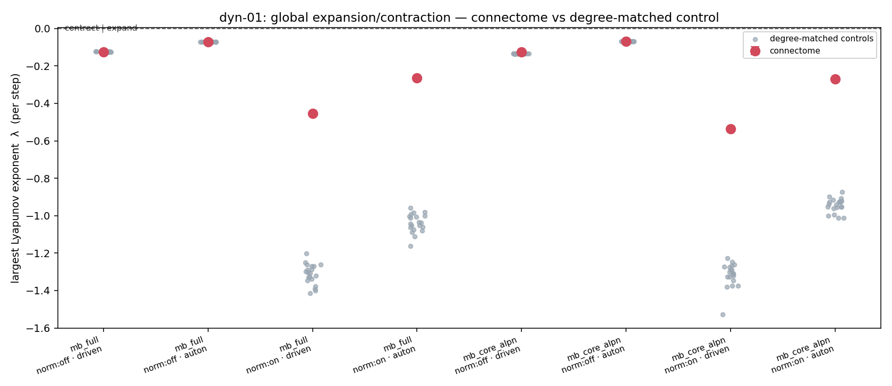
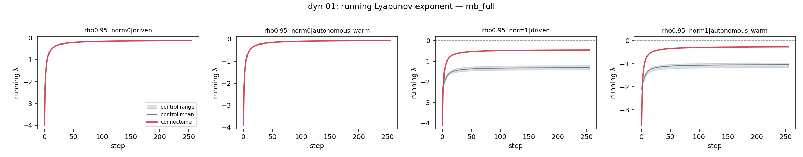

# Experiment dyn-01 — global expansion/contraction of the connectome-as-RNN

**Date started:** 2026-07-13
**Status (updated 2026-07-13):** Mushroom-body run complete (`mb_full`, `mb_core_alpn`); optic lobe
(`ol_left`) still to run. Headline: **all MB substrates contract in every regime; the connectome is not
more contracting than its degree-matched shuffle — in the task-effective (normalized) regime it is the
least-contracting graph, and the RMS normalization is the dominant contraction lever.** See Results.
**Code:** [`../experiment_dyn_01_global_lyapunov/`](../experiment_dyn_01_global_lyapunov/) ·
launcher/record [`run.py`](../experiment_dyn_01_global_lyapunov/run.py) ·
probe [`lyapunov_probe.py`](../experiment_dyn_01_global_lyapunov/lyapunov_probe.py) ·
scaffolding [`dynlib.py`](../experiment_dyn_01_global_lyapunov/dynlib.py).

## Purpose

First experiment of a new **`dyn`** (dynamics) track: characterize the *phase space* of the
connectome-as-RNN directly, independent of any task. The concrete question here is the simplest one —
**on average, does the connectome recurrence expand or contract nearby states?** — plus its structural
follow-up: **is the connectome's wiring different from a degree-matched random shuffle** at the same
spectral radius?

The motivation is the pattern across the earlier tracks. The mushroom-body connectome beats
degree-matched controls on *classification-like* tasks (associative recall mb-01/02, odor→valence
mb-05, evidence integration mb-06) but the same style of network **floors on a continuous-regression
task** (optic flow, vis-01) — and it floors for a mechanical reason the vis-01 debug pinned down: the
recurrent state **collapses to a fixed point**, so a linear readout can only emit the per-episode mean.

That suggests a single organizing idea worth testing directly: a network whose dynamics **contract**
(pull nearby states together toward fixed points) is *good* at *settle-to-an-answer* tasks and *bad* at
*track-a-moving-signal* tasks. If the connectome is strongly contracting, one property could explain
both the classification wins and the regression failure. dyn-01 measures the contraction directly, and
turns the vis-01 side-finding ("the real connectome keeps its activity stable where random rewiring
explodes") into a proper dynamical quantity — while checking whether "keeps activity bounded" and
"contracts perturbations" are even the same thing (they need not be).

## Methods

**The measurement — largest Lyapunov exponent (λ), twin-trajectory / Benettin.** Drive a ReLU
recurrent network built on the substrate; alongside the reference trajectory, evolve a **twin** whose
hidden state is nudged by a tiny perturbation. Each step, measure how the separation between the two
grew or shrank, add up the log of that growth, and **renormalize** the separation back to a small size
(keeping it in the linear regime). The running average of log-growth is λ:

- **λ < 0 → contracting** (perturbations forgotten; state collapses toward a fixed point),
- **λ ≈ 0 → critical** (edge of chaos),
- **λ > 0 → expanding** (perturbations amplified).

λ is reported **per step** (natural log per recurrence application). Because ReLU gates units on and
off, the local stretch rate is state-dependent, so λ **must** be measured along real trajectories
(this probe) rather than from the eigenvalues of the weight matrix. The **shape** of the running-λ
curve is itself informative: a *non-normal* operator (largest singular value σ_max ≫ spectral radius ρ)
shows an early bump — the perturbation grows for a few steps, then decays to a negative plateau — which
matters because the vis-01 task clips are only 32 frames long, so the transient regime is most of what
the network experiences.

**What is compared** (all pinned in `run.py`):

- **Substrates:** `mb_full` (14,025 neurons / 574,660 edges), `mb_core_alpn` (6,014 / 471,292), and
  `ol_left` (48,894 / 4,205,392, optic lobe — built and run separately, heavier).
- **Wiring:** connectome (n = 1 graph) vs **degree-matched control** (20 shuffles) — the *same*
  degree-preserving random rewiring the task experiments use (same in/out degree per neuron + weight
  multiset), pulled from the shared Exp-1 primitives so it is byte-identical. A permutation-rank
  framing: does the connectome's λ sit outside the control spread, and by how many control-SDs (z)?
- **normalize:** OFF (the *intrinsic* wiring dynamics — primary) and ON (the *task-effective* regime —
  the in-model RMS activity-normalization the failing vis-01 runs used, which pins the state magnitude
  every step and so measures on-manifold dynamics). These answer different questions and are reported
  separately.
- **drive:** "driven" (white-noise input on throughout — the operating-regime λ, and literally the
  "white-noise injection" this analysis was recommended around) and "autonomous_warm" (drive on for a
  warmup, then cut — the free recurrence). White noise is used as a task-agnostic drive so the number
  is a property of the wiring, not of a particular stimulus.
- **ρ:** rescaled to 0.95 (the matched value every task experiment used); the operator build reuses the
  shared spectral rescale, so both arms get the same ρ and a λ difference reflects the wiring **shape**.

**Numerics.** Twin-trajectory in **float64** with a perturbation sized **relative to the state norm**
(≈ 10⁻⁶·‖h‖), renormalized each step; 128 independent (input, nudge) samples per graph averaged into
each λ (giving its standard error), 256 measured steps after a 32-step warmup. Forward passes only (no
training, no gradients); runs locally on the RTX 5060 Ti. `run.py` builds the operators, runs the
probe, writes `outputs/analysis.json` (+ `outputs/curves.npz` for the running-λ curves), and
regenerates the figures.

**A precision bug caught and fixed before any result was trusted.** The first smoke run reported
λ ≈ +2.6 — a growth of ~13× per step, which is physically impossible for an operator whose largest
singular value is 1.08 (a perturbation cannot grow faster than the operator's largest gain). The cause:
under `normalize=False` with the drive on, the state magnitude grows, and an *absolute* float32
perturbation of 10⁻⁶ underflows float32's ~7-digit precision against a large state — so the measured
"separation" degraded to roundoff *proportional to* ‖h‖, and λ leaked the **state's growth rate**
instead of the true Lyapunov exponent. (Tellingly, the connectome and controls still separated — the
bug was leaking the real "connectome explodes less than random" signal through the wrong quantity.) The
fix (float64 + relative perturbation) brought the smoke to λ ≈ −0.22, safely below the log(σ_max) ≈
0.08 ceiling. This is recorded because the buggy version's connectome-vs-control gap looked *larger* and
had the *opposite sign* — a good reminder that the effect must be read from the corrected probe only.

**Controls / matching recap.** Degree-matched shuffle isolates the wiring *pattern* — every arm has the
same neuron count, edge count, per-neuron in/out degree, weight multiset, and ρ; only which neuron
connects to which differs. So any λ difference is attributable to the connectome's structure, not to
size, sparsity, weight scale, or the (hand-set) spectral radius.

## Results — mushroom body (2026-07-13)

Both MB substrates ran to completion (connectome vs 20 degree-matched controls, both `normalize` × both
`drive`, 128 samples × 256 steps each; ~460 s local). Optic lobe still pending
(`build_substrates.py --ol`). Data: `outputs/analysis.json`, `outputs/curves.npz`.

**Headline 1 — everything contracts.** Every substrate in every regime has **λ < 0**: the MB
connectome-as-RNN is a contracting system, whichever way it is measured. This is consistent with the
vis-01 finding that the recurrent state collapses to a fixed point on the regression task. At the coarse
level the organizing idea holds — these networks pull states together, which fits *settle-to-an-answer*
tasks and fights *track-a-moving-signal* tasks.

**Headline 2 — but the connectome is NOT more contracting than random; in the task regime it is
markedly LESS.** The wiring's effect depends entirely on whether the in-model RMS activity-normalization
is in the loop:

| substrate | regime | connectome λ | control λ (mean ± sd) | Δλ (conn − ctrl) | z |
|---|---|---:|---:|---:|---:|
| mb_full | norm **off**, driven | −0.1264 | −0.1242 ± 0.0006 | −0.0022 | −3.9 |
| mb_full | norm **off**, autonomous | −0.0720 | −0.0716 ± 0.0004 | −0.0004 | −1.0 |
| mb_full | norm **on**, driven | **−0.4541** | **−1.3124 ± 0.054** | **+0.858** | **+16.0** |
| mb_full | norm **on**, autonomous | −0.2639 | −1.0397 ± 0.048 | +0.776 | +16.1 |
| mb_core_alpn | norm **off**, driven | −0.1250 | −0.1346 ± 0.0004 | +0.0096 | +22.4 |
| mb_core_alpn | norm **off**, autonomous | −0.0699 | −0.0694 ± 0.0003 | −0.0005 | −1.7 |
| mb_core_alpn | norm **on**, driven | **−0.5360** | **−1.3168 ± 0.063** | **+0.781** | **+12.3** |
| mb_core_alpn | norm **on**, autonomous | −0.2710 | −0.9450 ± 0.037 | +0.674 | +18.5 |

- **Intrinsic wiring (`normalize=off`): the wiring shape barely matters.** Connectome and control λ agree
  to the third decimal (|Δλ| ≤ 0.01), and the sign of the tiny difference even flips between substrates.
  The large z-values are **not** a real effect — the degree-preserving shuffle leaves the bulk Lyapunov
  exponent almost unchanged (control sd ≈ 0.0004), so a 0.002 gap reads as "many SD" while being
  scientifically negligible. **Read honestly: intrinsically, the connectome contracts at the same rate as
  its own random rewiring.** The vis-01 "connectome stays stable where random explodes" side-finding is
  therefore about *activity magnitude* (operator norm / σ_max), **not** about perturbation contraction —
  these are different properties, and at MB scale σ_max is nearly identical for both (≈1.08), so no gap is
  expected here. (Whether the activity gap reappears at optic-lobe scale, where σ_max = 2.44, is the OL
  run's job.)

- **Task-effective regime (`normalize=on`): two large, consistent effects.** First, the RMS normalization
  is itself a **dominant contractor** — it drives λ from ≈ −0.12 down to ≈ −0.45 (connectome) and ≈ −1.3
  (control). It roughly triples the connectome's contraction and ~10×'s the control's. This independently
  corroborates vis-01 subrun-05's suspicion that **the RMS-norm, not ρ, is what pins the state** (it
  explains why the ρ-sweep never moved the floor: normalization re-imposes contraction regardless of ρ).
  Second, **the connectome resists that normalization-contraction far better than random wiring does** —
  it plateaus near −0.45 while its degree-matched shuffles sit near −1.3 (Δλ ≈ 0.7–0.86, z = 12–18, and
  here the effect is large in *magnitude* as well as significance). The connectome's specific wiring keeps
  it much closer to the critical edge (λ = 0) once divisive gain-control is in the loop.

**Convergence / transient (rigor check).** The running-λ curves settle to their plateau within ~100 of
the 256 steps in every cell, so the estimate is converged (the early dip to ≈ −4 is the standard Benettin
transient as the random nudge aligns with the maximal-growth direction, not a feature of the dynamics).
No pronounced non-normal *upward* transient appears at MB scale, as expected for these near-normal
operators (σ_max/ρ ≈ 1.14); the optic lobe (σ_max/ρ ≈ 2.6) is where a real transient bump might show.

**What this does and doesn't support.**
- **Supports** the coarse theory: the connectome-as-RNN is net-contracting in every regime, consistent
  with the vis-01 fixed-point collapse and with being suited to settling rather than tracking. Even the
  connectome's least-contracting number (λ ≈ −0.45/step ⇒ perturbation half-life ≈ 1.5 steps) is a short
  memory — so *all* substrates contract too hard to hold a signal across a 32-frame clip, matching vis-01,
  where every substrate floored *equally* despite the connectome being marginally the gentlest.
- **Refutes** the finer guess that the connectome wins classification by being *more* contracting. It is
  not more contracting — intrinsically it ties its shuffle, and in the task regime it is the *least*
  contracting graph. So contraction-strength is not the axis on which the connectome's task advantage
  lives.
- **Redirects the vis-01 fix.** Normalization is quantified as the dominant contraction lever (dwarfs ρ),
  so the promising fixes are the ones that reduce or bypass it — `normalize=off` runs and a **stronger
  input drive** that keeps re-perturbing the state — not further ρ manipulation.
- **Separates two ideas** that were being used interchangeably: "keeps activity bounded" (an operator-norm
  property) and "contracts perturbations" (the Lyapunov exponent) are **not** the same thing.

**Caveats.** n = 1 connectome graph per substrate (the perm-rank is over control shuffles, not over
connectomes). White-noise drive, not the task stimulus — a deliberate choice to make λ a property of the
wiring, but it means these numbers are the *generic* operating regime, not the exact optic-flow one. MB
only; the optic lobe (the substrate whose activity-explosion motivated this) is not yet run. The
"connectome less contracting" effect exists **only** with normalization in the loop — it is a property of
the wiring *interacting with divisive gain-control*, and the mechanism (activity sparsity? the mild
non-normality?) is not yet pinned.

**Next.** Build and run the optic lobe (`--ol`) — the σ_max = 2.44 substrate is where both the activity
gap and a non-normal transient should be largest. Then, if useful for the vis-01 fix, a `normalize=off`
+ stronger-`W_in` dynamics probe, and a per-direction (spectrum-of-exponents) measurement to replace this
single global number.
