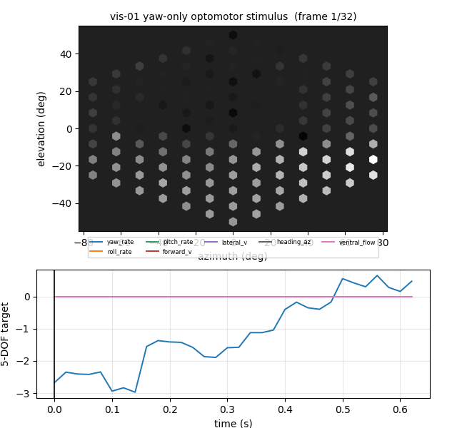
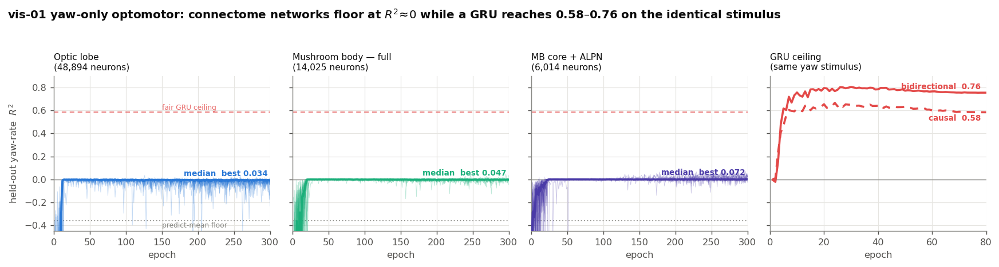
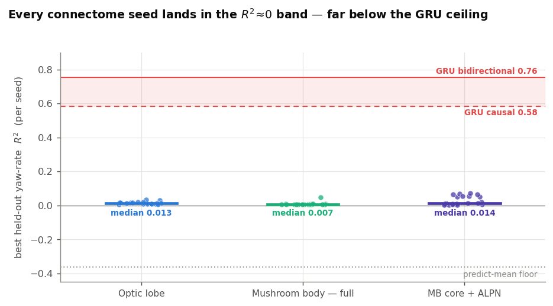
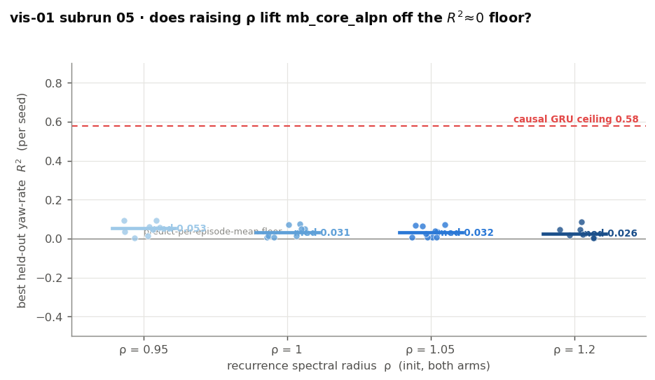
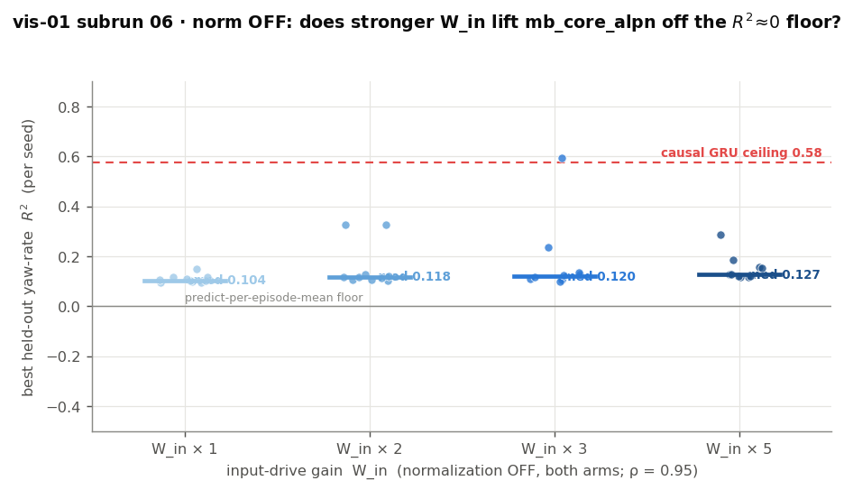
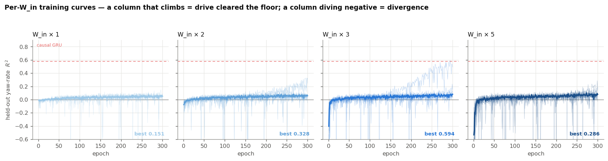
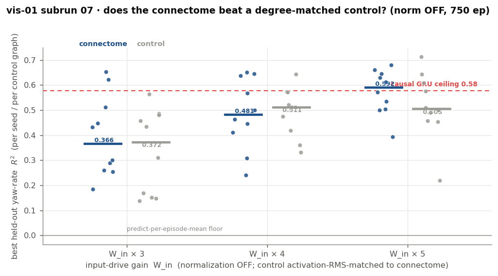
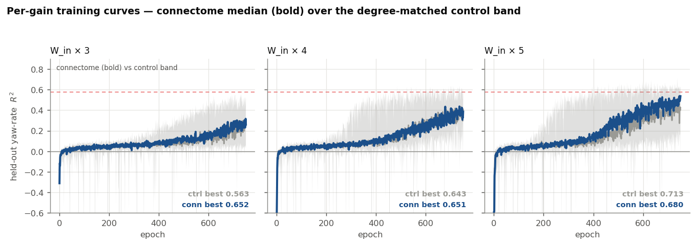

# Experiment vis-01 — optic-lobe connectome vs degree-matched controls on optic flow

**Date started:** 2026-07-09
**Status (updated 2026-07-14):** *Latest:* **subrun 07 ran — the fair control test lands on "connectome ≈
control."** With normalization **off** on `mb_core_alpn`, 750 epochs, `W_in` ∈ {3, 4, 5}, and the
degree-matched control fairly activity-RMS-matched, the connectome now learns yaw regression well (×5 median
best-val R² 0.59 ≈ the 0.58 GRU ceiling) — but so does the control: the connectome's edge is small (Δ ≤ 0.10
test R², +0.4–0.7 control-SD), higher-mean at every gain and more *reliable* at ×5, yet **not significant on
the pre-registered permutation rank** (*p* = 0.36–0.55). So the floor-break was about **dynamics**
(normalization off + drive), **not the specific wiring** — a genuine contrast with mb-01/02/06, and coherent
with dyn-01 (norm-off, the connectome ties its shuffle on contraction). Both arms still climbing at the cap;
n = 1 connectome graph. See "Update 2026-07-14" below. *(Prior:)* the dynamics experiment
[dyn-01](experiment_dyn_01_global_lyapunov.md) found the **RMS activity-normalization is the dominant force
freezing the state** (it triples the contraction, dwarfing ρ — which is why subrun 05's ρ sweep did
nothing), and **subrun 06 first broke the R² ≈ 0 floor** (connectome-only probe, best seed test R² 0.449). *(Prior status retained:)* **Subruns 03 + 04 finished — the connectome FlowRNN floors on EVERY substrate.**
The yaw-only learnability run completed on the fleet: 20 optic-lobe seeds and 40 mushroom-body seeds
(`mb_full` + `mb_core_alpn`) all trained to the full 300-epoch budget, and **not one of the 60 networks cleared
held-out R² ≈ 0** against a GRU ceiling of 0.58 (causal) / 0.76 (bidirectional) on the identical stimulus.
Optic lobe and mushroom body floor **equally**, so this is the pre-registered *model/training* outcome, not a
vision-specific one — the difficulty is training these sparse connectome FlowRNNs on continuous regression,
not the optic lobe's wiring. The headline connectome-vs-control test (subrun 02) stays **blocked** until a
model/training fix gets a substrate above floor; validate any fix on the cheap `mb_core_alpn` (~3 h/run)
before rerunning the optic lobe (~26 h/run). See the **Results** section below. *(Prior status retained for
the record:)* **Subrun 02 (the definitive 5-DOF run) ran on the AWS fleet and FLOORED —
both the connectome AND the degree-matched control sat at val R² ≈ 0.** Local debugging traced this to the
**model/training path, not the task or the connectome**: on a reduced **yaw-only** stimulus a high-capacity
GRU reference reaches R² ≈ 0.74 (the signal is learnable), while the sparse `FlowRNN` can memorize a fixed
batch (R² ≈ 0.92) but does **not** generalize, and — a real bug — the shipped **activity-normalization
default diverged**. Two fixes landed: (1) `model.py` now **detaches the RMS-norm denominator** (forward
gain-control unchanged, the unstable `1/rms` backward no longer diverges), and (2) the task gained a
first-class **`rot_axes` knob** (`all` | `yaw`) so the yaw-only 1-D stimulus is reproducible without
monkeypatching. A dedicated **subrun 03 (yaw-only learnability run)** is now staged: the connectome FlowRNN
×20 seeds at the full 300-epoch budget vs a GRU ceiling on the identical stimulus. **The framing is
explicit: a null there would say the connectome is *not plug-and-play* for optic flow — hard, not
impossible — not that it can never learn.** See "Update 2026-07-10" below. **A companion subrun 04 is also
staged: the same yaw task on the *mushroom body* (14k full + ~6k core+ALPN, ×20 seeds each = 40 runs) — a
substrate-swap control that tells us whether any floor is about vision specifically or about training these
connectome networks in general.** *(Earlier side-finding stands: the real connectome keeps its activity
stable where random rewiring explodes — split off as a follow-up.)*
**Code:** [`../experiment_vis_01_optic_flow/`](../experiment_vis_01_optic_flow/) ·
task [`optic_flow_task.py`](../experiment_vis_01_optic_flow/optic_flow_task.py) ·
model [`model.py`](../experiment_vis_01_optic_flow/model.py) ·
engine [`run_experiment.py`](../experiment_vis_01_optic_flow/run_experiment.py) ·
substrate [`build_ol_substrate.py`](../experiment_vis_01_optic_flow/build_ol_substrate.py) ·
flight-statistics review [`SACCADE_STATS.md`](../experiment_vis_01_optic_flow/SACCADE_STATS.md).

## Purpose

Experiments mb-01…06 found the fly **mushroom-body** connectome's specific wiring beats degree-matched
random wiring on memory and evidence-integration tasks. Does that carry to a **different brain region** and
a **different, physically grounded task**? This is the vision analogue of MB Experiment 1: does the
**optic-lobe** connectome's wiring beat matched random wiring at reading the fly's own motion from what its
eye sees? A clean win opens the `vis_` track; a tie says the mushroom-body result does not simply generalize
to the visual system. *(Scope: one real connectome — "this graph," not "topology in general"; and generic
wiring-only I/O — a later experiment tests the biologically-correct photoreceptor → T4/T5 → output-cell
ports.)*

## What the network sees and does (the task)

`optic_flow_task.py` — fresh, self-contained code (nothing imported from the other author's `scripts/flow/`).

- **The eye.** A fly-like **hexagonal grid of ~127 "eye units"** (ommatidia) with blur that mimics fly
  optics. Each frame is the brightness each eye unit sees; a trial is ~44 frames of that — a short movie.
- **The world.** A genuine 3D scene: a far background (natural-looking texture, effectively at infinity), a
  textured ground plane, and **dense near-field clutter** — 48 non-moving objects (think trees/posts) at
  **fixed random depths (0.3–3 m)**, rendered as real spheres that correctly block each other and shift more
  when near than when far (true motion parallax). *Why the clutter: a bare scene gives almost no motion cue
  for translation; nearby objects at known-statistics depths give the network something to gauge forward/
  sideways motion against.*
- **The motion.** A virtual fly flies through the scene while **continuously turning** (yaw, roll, pitch) and
  translating. *Why continuous turning (not the earlier "saccade" bursts): once we found translation can't be
  read anyway, the bursty design just made turning trivial to detect; smooth continuous turning is the real
  "optomotor" computation the optic lobe is known for, and it's harder and more meaningful.*
- **Separate trial types.** Some trials **turn only** (no translation); some **translate only** (no turning).
  *Why: turning produces large image motion that drowns out the small motion from translating, so mixing them
  makes translation unreadable. Separating them lets us measure each cleanly — and it mirrors what real flies
  do, turning in bursts and translating in between.*
- **What the network reports, each frame.** On turn trials: the three **turn rates** (yaw, roll, pitch). On
  translate trials: the **observable** translation cues — **ground-flow rate** (how fast the ground streams
  by, which is speed ÷ height) and **heading** (which direction it's going). *Why not plain forward/sideways
  speed: from one eye you physically cannot tell fast-and-far from slow-and-near, so absolute speed isn't
  recoverable — the fly doesn't read it either; it reads these relative cues. See "why translation is hard"
  below.* Each cue is scored only on the trials where it actually varies.

A full difficulty ladder is exposed (contrast, noise, object density/depth, turn/translation strength,
sequence length). The task can render **videos** (the eye's movie plus the true motion traces, and
single-motion sanity clips) so the physics can be watched — `figures/*.gif`.

## The network and the comparison

- **Network (`model.py`, `FlowRNN`).** The recurrent connections **are** the optic-lobe wiring (~4.2M
  connections, their strengths trainable); input is fed to all neurons and the motion readout is taken from
  all neurons (generic wiring-only I/O). Activation is ReLU. A custom memory-efficient gradient
  (`_SparseEdgeMatmul`) lets the full 48,894-neuron network train in ~0.5 GB instead of running out of
  memory. **Activity normalization** (a divisive gain-control step, applied identically to every network)
  keeps each network's overall activity at a steady level at every step. *Why: real optic-lobe neurons do
  exactly this (gain control / brightness adaptation), it keeps activity in a trainable range, and — the key
  reason — it makes the connectome-vs-control comparison fair (see next).*
- **Control (what "beats a control" means).** The same network with the wiring **randomly rewired** while
  keeping the same number of connections and the same in/out connection counts per neuron (a
  degree-preserving shuffle). Everything else is identical; only the wiring pattern differs. Both networks are
  held at the same recurrent gain (ρ = 0.95) and get the same normalization, so a difference reflects the
  wiring *shape*. Per-network activity statistics (ρ, largest gain σ_max, activity level) are recorded on
  every run. Extra bracket controls (weight-shuffle, fully random) are available.
- **Scoring.** How well predicted motion matches true motion (R²), per motion cue. The headline test is a
  **permutation rank**: is the real connectome above the whole spread of random-control graphs? — reported
  with the effect size in units of the control spread. Pilot with 10 seeds, then 20.

## Substrate (`build_ol_substrate.py`)

Single **left** optic lobe from the FlyWire 783 release: every neuron with a synapse in the left optic-lobe
regions `{LA_L, ME_L, LO_L, LOP_L, AME_L}`, all synapses between them, signed by each neuron's dominant
transmitter (excitatory +1 / inhibitory −1). *Why one lobe: the two optic lobes are ~99% independent (only
~1.3% of connections cross between them), so using one halves the size with essentially no loss of wiring.*
Built result: **N = 48,894, 4,205,392 edges, 99.4% transmitter-covered, 43.8% inhibitory**, rescaled to
recurrent gain **ρ = 0.95**. A cell-type join (FlyWire 783 annotations) can label the motion-detector cells
(T4/T5), photoreceptors, and wide-field output cells (HS/VS) as an analysis lens (used later; the substrate
itself is region-defined and complete without it).

## Why translation is hard, and rotation is the clean signal (what building the task taught us)

Two review rounds and a "can a strong model even learn this?" probe (a powerful reference network trained
directly on each cue — `strong_model_gate.py`) drove the design:

- **Turning (rotation) is cleanly readable.** Turning moves the whole image by the same amount regardless of
  distance, so it doesn't depend on the scene's depth. The reference model reads it well; these are exactly
  the motions the optic lobe's wide-field output cells are known to encode. This is the **core scored task**.
- **Absolute translation speed is physically unreadable from one eye.** Image motion from translating equals
  speed ÷ distance, so the same image can mean fast-far or slow-near. No model — and no fly — can undo that.
  *So we switched translation targets to the cues that ARE readable: ground-flow rate (speed ÷ height) and
  heading.*
- **Even those readable translation cues were weak at fly cruising speed.** The motion from translating is
  small (~0.6° per frame) versus turning (~36°), so it gets buried. Adding dense near-field clutter (more
  parallax) helped in principle but did not rescue it when tested **with turning present** — turning swamped
  it. **This is exactly what the turn-only / translate-only trial split addresses**, and it hasn't yet had a
  fair test in isolation. So translation stays **recorded and given its own trials**, but the headline
  connectome-vs-control claim is currently **rotation** (turning) estimation — honestly a narrower claim than
  "self-motion," and the appropriate one for the optic lobe's core job.

*(The earlier "saccade-and-fixate" flight design and per-axis gaze-stabilization gains — built from the fly
free-flight literature in `SACCADE_STATS.md`, e.g. Tammero & Dickinson 2002, Cellini et al. 2021, van Hateren
& Schilstra 1999 — are kept as an available mode but are OFF by default; the continuous-rotation task
replaced them.)*

## The conditioning side-finding → a follow-up experiment

Setting up the fair comparison surfaced a real result. At the same recurrent gain (ρ = 0.95), the **real
connectome keeps its neural activity stable** (well-behaved, bounded), while **random rewiring makes activity
explode** — by a factor of ~1000–2000× at this scale. You cannot make a random control match the connectome's
activity level without effectively switching its recurrence off. In plain terms: **the connectome's wiring is
intrinsically "well-conditioned" — it naturally keeps its own activity under control — in a way random wiring
with the same connection counts is not.**

This matters two ways:
- **For vis-01:** it's why we add normalization (auto-volume for both networks), so the wiring-shape
  comparison isn't just measuring which network blows up.
- **On its own:** it's an interesting structural property of the connectome worth measuring directly.
  **Slotted as a follow-up experiment (vis-conditioning):** quantify how well-conditioned the connectome is
  versus matched random graphs (and versus other brain regions), as a property of the wiring itself —
  separate from any task. This mirrors the "structure-as-conditioner" theme from mb-03.

## Engine fixes (done, validated on the real 48,894-neuron substrate)

1. **Memory.** The naive gradient built a dense 48,894 × 48,894 matrix (~8.9 GB) and ran out of memory. The
   custom edge-only gradient trains at **0.5 GB** (batch 4), linear in batch size, identical math.
2. **Fair matching.** The previous attempt scaled the control's wiring down to match activity, which switched
   its recurrence off — a broken comparison. **Normalization** (above) replaces it: both networks keep working
   recurrence at ρ = 0.95 and are held at a steady, comparable activity level. Per-network (ρ, σ_max, activity)
   recorded every run.
3. **Balanced loss.** The training signal was dominated by the highest-variance motion channel; it now weights
   each scored channel equally so none is starved.

## Status, what's built, what's pending

- **Built and checked:** the substrate; the task (hex eye, 3D scene, dense fixed-depth clutter with correct
  occlusion and parallax, continuous rotation); the memory fix; balanced loss; videos; and the physics check
  (turning drives horizontal image motion, pitch drives vertical — as it must).
- **Decided this round, being added:** activity **normalization** for both networks, and the **turn-only /
  translate-only trial split**.
- **Not yet done:** the actual connectome-vs-control run. It has **not** been run at a fair budget — an early
  24-epoch probe sat near "no better than guessing," but mushroom-body networks routinely learn only after
  many more epochs, so that probe is not a fair test and no conclusion is drawn from it.

## Update 2026-07-10 — subrun 02 floored; a yaw-only learnability run (subrun 03)

**What happened.** Subrun 01 (calibration) was skipped by user decision and the definitive 5-DOF run
(subrun 02: connectome ×20 vs degree-matched ×20, continuous rotation on all three axes + translation
trials, dense clutter) was launched directly on the AWS spot-GPU fleet. It ran for hours with **nothing
converging**: `CONVERGE_R2 = 0.995` is unreachable, plateau-stop was off, and — the real problem — **every
run sat at val R² ≈ 0**. Critically, the **degree-matched control floored too**, so this is *not* a
connectome-vs-control signal; both arms simply failed to learn.

**Is "the connectome can't learn" the finding? No — not as it stood.** A null is only meaningful against a
positive control. So we reduced the task to its simplest form — **yaw-only** (roll & pitch zeroed,
translation off, no clutter): estimate instantaneous turn rate from the movie — and asked two questions:

- **Is the signal there?** A high-capacity **GRU reference** (`strong_model_gate.py`), direct-supervised
  on the *identical* stimulus, reads yaw cleanly (naive mean-predictor floor ≈ −0.22). Two ceilings are
  kept as separate records: a **bidirectional** GRU — which may use the whole clip, future frames included —
  reaches **yaw R² = 0.80** (the *generous* best-case, readability regardless of causality); and a
  **causal (unidirectional)** GRU — strictly past→present, no peeking ahead — reaches **yaw R² = 0.67**.
  The causal number is the **fair upper limit** to hold the connectome against, because the FlowRNN is
  itself causal; the bidirectional one is the generous bound. Either way the signal is there and the task
  is learnable. *(Both are freshly-run ceilings on this exact config, in `subruns/03_yaw1d/outputs/`
  as `gate_yaw1d.json` and `gate_yaw1d_causal.json`.)*
- **Can the sparse FlowRNN learn it?** It **memorizes a fixed batch to R² ≈ 0.92** (so the architecture
  *can* represent yaw — no fundamental gradient/architecture bug), but on fresh data its recurrent state
  stays near a fixed point (temporal std ≈ 0.08 vs 0.93 overall) → the linear readout emits the per-episode
  mean → **R² ≈ 0 on held-out data**. A ~19-config sweep (lr ∈ {1e-4, 2e-4, 1e-3, 2e-3}, input gain,
  activation, microsteps, readout-lr, weight-decay, fixed-vs-fresh data) at ≤60 epochs cleared zero on none.

**Two bugs/fixes found.**
1. **Real bug — the shipped `normalize=True` default diverged.** The per-step RMS-norm
   `h/(rms+ε)·gain` (`model.py`) has a `1/rms` backward that destabilizes on sparse ReLU states (small
   rms) → val R² → −5.7, oscillating loss, across every lr. **Fix:** detach the denominator — the state is
   still renormalized to fixed magnitude each microstep (forward identical), but the divergent
   `d/dh(1/rms)` term no longer propagates. Verified: yaw-only training now descends monotonically instead
   of blowing up.
2. **Reproducibility — yaw-only was a monkeypatch.** Added a first-class **`rot_axes` config** (`all` =
   yaw+roll+pitch, default; `yaw` = 1-D de-risk with roll/pitch held at 0) to `optic_flow_task.py`, wired
   through `common.py`, `run_experiment.py`, and `strong_model_gate.py`. The exact subrun-03 stimulus is
   rendered at [`subruns/03_yaw1d/figures/stimulus_yaw1d.mp4`](../experiment_vis_01_optic_flow/subruns/03_yaw1d/figures/stimulus_yaw1d.mp4).

**Subrun 03 — the yaw-only learnability run (staged, not yet launched).** With the normalize fix in and the
budget question the ≤60-epoch debug could not settle (a prior MB pre-flight once missed a slow grok to
R² = 0.976 — so a short plateau does *not* rule out learning), subrun 03 runs the **connectome FlowRNN ×20
seeds at the full 300-epoch budget** on the yaw-only stimulus, against **two GRU ceilings on the identical
stimulus** (run locally, `--gate`): bidirectional (0.80, generous) and **causal (0.67, the fair bar vs the
causal FlowRNN)**. Launcher + exact pinned config:
[`subruns/03_yaw1d/run.py`](../experiment_vis_01_optic_flow/subruns/03_yaw1d/run.py). **Interpretation set in
advance:** if the connectome clears zero, the earlier floor was a training-path artifact now fixed; if it
still floors while the GRU ceiling clears, the honest conclusion is **"the optic-lobe connectome is not a
plug-and-play optic-flow substrate — getting it to learn is non-trivial,"** *not* "it cannot learn." Either
way the result is worth reporting (n = 1 graph; a learnability probe, not the connectome-vs-control test).

## Update 2026-07-10 (cont.) — subrun 04: the same yaw task on the mushroom body (staged, not yet launched)

**Purpose — a substrate swap.** Subrun 03 asks whether the *optic-lobe* connectome can learn yaw at all.
Subrun 04 asks the identical question with the identical task, model, and budget, but swaps the optic lobe
for the **mushroom body** — a **non-visual** (olfactory/learning) connectome, the substrate from the
concluded mb-01…06 arc. It is a control on what subrun 03's result means:

- if **both** the optic lobe and the mushroom body floor → the difficulty is a **model/training** story
  (these sparse connectome FlowRNNs are just hard to train on this task), nothing special about vision;
- if the **optic lobe learns and the mushroom body floors** → evidence the optic lobe's *specific visual
  wiring* carries the task (substrate identity matters — the point of the whole `vis` track);
- if **both learn** → the substrate is generic for this task.

Either outcome is reportable. This is a learnability / substrate-contrast probe, not a connectome-vs-control test.

**Methods — deliberately minimal ("swap the substrate, keep everything else").**
- **Two mushroom-body arms**, each ×20 training-seed replicates (**40 fleet runs**):
  - `mb_full` — the whole **14,025-neuron** FlyWire-783 mushroom-body graph (574,660 edges), taken verbatim.
  - `mb_core_alpn` — the **~6,014-neuron** MB core + ALPN sub-graph (471,292 edges): the *same node set*
    exp-04/05/06 used (Kenyon cells / MBON / DAN / MBIN + antennal-lobe projection neurons).
- **Unsigned** adjacency (both arms), matching the mushroom body's **version of record** — every mb-*
  experiment loaded the unsigned 14k. *Note the asymmetry to keep in mind when reading 03 and 04 together:
  the MB arm is unsigned while subrun 03's optic lobe is signed; mb-* continuity was judged the more
  important axis (user decision).* ρ rescaled to 0.95 at run time, same convention as the optic lobe.
- **Everything else identical to subrun 03:** yaw-only continuous rotation (roll/pitch = 0), turn-only, no
  clutter, hex_rings = 6 (127 ommatidia), T = 32, microsteps = 1, noise 0.03, normalize ON (detached-
  denominator fix), score yaw_rate only, 300-epoch budget, lr = 1e-3.
- **GRU ceiling is shared, not re-run.** The ceiling is a property of the *task* (the yaw stimulus), which
  is byte-identical to subrun 03, so subrun 03's recorded ceilings (bidirectional 0.80 / causal 0.67) carry
  over verbatim — copied into `subruns/04_mb_yaw1d/outputs/`.
- **New code (non-destructive):** `build_mb_substrate.py` builds the two MB substrates from the existing
  mb-* connectome data; `common.load_substrate` gained a substrate-name registry (`ol_left` unchanged, so
  subruns 01–03 are untouched). Launcher + exact pinned config:
  [`subruns/04_mb_yaw1d/run.py`](../experiment_vis_01_optic_flow/subruns/04_mb_yaw1d/run.py).
- **Fleet:** 40 GPUs = one run each, single wave. The account's spot quota is 16 g6.xlarge (64 vCPUs), so
  this is ~16 spot + ~24 on-demand — ~30% more $ than a 16-wide pure-spot fleet, bought for ~2.5× faster
  wall-clock. The mushroom body is 7–9× smaller in edges than the optic lobe, so per-epoch cost is well
  under subrun 03's ~313 s; est. ~300–500 GPU-hours total (~$165–400).
- **Verified before launch:** both arms train end-to-end through `run_experiment.py` (no errors); the
  registry loads all three substrates and leaves `ol_left` identical. **Not yet launched** (timing: it
  should wait for subrun 03's fleet to free the spot quota, else all 40 runs land on on-demand).

## Results

### Update 2026-07-12 — subruns 03 + 04 ran to completion; **both floored on every substrate**

**Headline.** The yaw-only learnability run finished on the fleet: 20 optic-lobe seeds (subrun 03) and 40
mushroom-body seeds (subrun 04: `mb_full` ×20 + `mb_core_alpn` ×20), each trained to the **full 300-epoch
budget**. **Not one of the 60 connectome networks learned to read yaw rate** — every seed on every substrate
sits at held-out R² ≈ 0, far below a GRU trained on the identical stimulus (causal 0.58, bidirectional 0.76).
Because the **optic lobe and the mushroom body floored equally**, this is the pre-registered "model/training"
outcome, not the "vision-specific" one: the difficulty is in **training these sparse connectome FlowRNNs on
this continuous-regression task**, not in the optic lobe's wiring. The headline connectome-vs-control test
(subrun 02) stays **blocked** — you cannot compare wiring shapes when neither wiring learns the task.

**The stimulus** (subrun 03/04 config: yaw-only, roll/pitch = 0, no clutter, 127-ommatidia hex eye, T = 32).
Only the yaw-rate trace varies; every other DOF is held at zero:

**Training curves — the whole result in one figure.** Held-out yaw-rate R² per epoch: every connectome seed
(thin) with the median (bold), against the two GRU ceilings (right panel). The connectome traces snap to ≈ 0
within ~20 epochs and stay flat for the remaining 280; the GRU reaches its ceiling by ~epoch 15. The
slow-grok escape hatch that the ≤60-epoch debug could not rule out (a prior MB pre-flight once groked only
at epoch ~200) is now **closed for this config** — the curves are dead flat to epoch 300.

**Per-seed summary.** Best held-out yaw-rate R² for each seed, against the GRU ceiling band and the
predict-the-mean floor:

| Substrate | N neurons | edges | seeds | best val R² (mean) | best val R² (max) | test R² (mean) | median best-epoch | wall/run |
|---|---:|---:|---:|---:|---:|---:|---:|---:|
| **Optic lobe** (`ol_left`, signed) | 48,894 | 4,205,392 | 20 | 0.016 | 0.034 | −0.010 | 248 | ~26 h |
| **MB full** (`mb_full`, unsigned) | 14,025 | 574,660 | 20 | 0.009 | 0.047 | −0.004 | 247 | ~3.6 h |
| **MB core + ALPN** (`mb_core_alpn`) | 6,014 | 471,292 | 20 | 0.030 | 0.072 | −0.004 | 254 | ~3.1 h |
| GRU ceiling — causal (fair bar) | — | — | — | — | **0.58** | — | ~15 | <1 min |
| GRU ceiling — bidirectional (generous) | — | — | — | — | **0.76** | — | ~15 | <1 min |

*(Predict-the-mean naive floor for yaw-rate R² ≈ −0.36. The connectome sits just above it — the networks
learn a faint trace, not nothing — but nowhere near the 0.58 fair ceiling. `mb_core_alpn` is marginally the
least-floored arm (40% of seeds clear val R² 0.05, one test seed 0.053) but still trivial. All 60 runs hit
the 300-epoch cap; none converged or early-stopped. Data: `subruns/03_yaw1d/outputs/` and
`subruns/04_mb_yaw1d/outputs/` — per-seed `runs/*/result.json` + `metrics_epochs.csv`, aggregated
`analysis.json`; GRU curves in `gate_yaw1d_curve.json` / `gate_yaw1d_causal_curve.json`.)*

**Why it floors (mechanism, from the earlier local debug, now confirmed at scale).** The recurrent state
stays near a fixed point rather than developing input-driven temporal dynamics, so the linear readout emits
the per-episode mean → R² ≈ 0 on held-out data even though the same architecture memorizes a fixed batch to
R² ≈ 0.92. The `normalize=True` divergence bug is fixed (training now descends), but the fix let the loss go
down without making the state track the stimulus. This is a **dynamics/optimization** failure, not a task,
substrate, or gradient-plumbing failure.

**What this does and doesn't settle.**
- **Settles:** the floor is *not* about vision. Swapping to a non-visual connectome (mushroom body) at three
  sizes reproduces it. At this configuration the sparse FlowRNN is not a plug-and-play optic-flow (or
  yaw-regression) substrate — getting it to learn is non-trivial. (n = 1 graph per substrate; a learnability
  probe, not the connectome-vs-control test.)
- **Does not settle:** whether the optic-lobe *wiring* beats a matched control — that comparison is
  meaningless until the model learns above floor. It also doesn't say the connectome *cannot* learn; it says
  this training recipe doesn't get it there in 300 epochs.
- **Cost note (wall-clock is a reportable outcome, not a footnote):** the optic lobe costs **~26 h/run** vs
  ~3 h for the mushroom body (7–9× the edges), so any future FlowRNN-training fix should be validated on the
  cheap MB substrate first before spending ~500 GPU-hours on an optic-lobe rerun.

**Next step is a model/training fix, not more seeds or another substrate. The leading candidate is the one
damping knob we never actually varied: the spectral-radius (ρ = 0.95) initialization.** The debug sweep
tested turning *off* the RMS activity-normalization (it cured a divergence bug but the network still floored
at the predict-the-mean plateau) and swept input-gain, activation, microsteps, weight-decay, and readout-lr
— but ρ was held fixed at 0.95 throughout, because it's a *matching constraint* (every arm is normed to the
same ρ so the comparison isn't a recurrent-gain artifact). So the most direct anti-fixed-point manipulation
available has **not been tried**: a network initialized with eigenvalues < 1 relaxes to a fixed point, and
raising ρ toward / above 1 is the standard fix for exactly this state-collapse failure. Two caveats keep it
from being a sure thing: (i) ρ = 0.95 is only the *initialization* and the recurrent weights are trainable,
yet SGD never raised the effective gain on its own — it sat at the fixed point anyway; and (ii) at real
scale ρ = 0.95 already coexists with σ_max = 2.44 (the operator is non-normal), so raising ρ could flip the
network from floor straight to divergence rather than into a healthy live regime — the two dampers interact.
The cheap first experiment is therefore a **ρ sweep on `mb_core_alpn`** (e.g. 0.95 → 1.0 → 1.05 → 1.2,
applied to *both* arms to preserve matching; ~3 h/run), before the more involved fixes.
Other candidate directions, if the ρ sweep doesn't clear it: a **temporal-difference input channel** (feed
frame-to-frame changes, not raw luminance), a **stronger `W_in`** so the movie keeps re-perturbing the state,
and an explicit **temporal-derivative / anti-constant-output loss** term. Validate every fix on `mb_core_alpn`
(cheapest) before rerunning the optic lobe. Only once a substrate clears the fair GRU bar does the original
subrun-02 connectome-vs-degree-matched comparison become runnable.

## Update 2026-07-12 (cont.) — subrun 05: the spectral-radius (ρ) sweep (ran 2026-07-13 — ρ does not clear the floor)

**Purpose.** Run the leading fix-attempt from the paragraph above: does raising the recurrence spectral
radius ρ lift a connectome FlowRNN off the R²≈0 floor? ρ<1 is precisely what makes the state contract to the
fixed point that forces the readout to emit the per-episode mean; raising ρ toward/above 1 is the standard
anti-collapse move, and it's the one damping knob the subrun-03/04 debug never varied (it was pinned at 0.95
as a matching constraint). This is a **single-arm learnability probe**, not the connectome-vs-control test —
the degree-matched control only matters once *something* clears the floor, so adding it now would double cost
to answer a question we aren't yet asking.

**Methods.**
- **Substrate:** `mb_core_alpn` only (~6,014 neurons / 471,292 unsigned edges) — the cheapest substrate
  (~3 h/run), deliberately chosen to validate a fix here before paying to rerun the optic lobe (~26 h/run).
- **Sweep:** ρ ∈ {0.95, 1.0, 1.05, 1.2}, rescaling the recurrence operator at init. ρ=0.95 is the first grid
  point and doubles as the sweep's **own control** — it re-confirms subrun 04's floor under identical fresh
  conditions. 1.0 = critical; 1.05/1.2 = supercritical.
- **Replicates:** connectome × **10 training seeds per ρ** = **40 fleet runs** (1 substrate × 4 ρ × 10),
  one GPU per run (~16 spot + ~24 on-demand, single ~3 h wave). Est. ~100–160 GPU-hours.
- **Everything else pinned identical to subrun 04:** yaw-only continuous rotation (roll/pitch=0), turn-only,
  no clutter, hex_rings=6 (127 ommatidia), T=32, microsteps=1, noise 0.03, normalize ON (detached-denominator
  fix), score `yaw_rate` only, 300 epochs (converged-stop only), lr=1e-3, unsigned mb_core_alpn. GRU ceiling
  is a property of the (identical) task, so it is **shared** with subruns 03/04 (causal 0.58 / bidirectional
  0.76), copied into the subrun's `outputs/`, not re-minted.
- **Engine change (additive, backward-compatible):** ρ became a sweep axis in `run_experiment.py` exactly
  parallel to `--lr-grid`, via a new `--rho-grid` (default `[0.95]`). The four frozen subrun `run.py` files
  (01–04) are untouched, and the default path reproduces them byte-for-byte — verified: single-ρ run_ids are
  unchanged (no `_rho` tag), ρ still rescales to 0.95, the smoke test is green. The `_rho{g}` run_id tag
  appears only when the grid has >1 value, so seed×ρ cells don't collide.
- **Read the top end with care:** ρ=0.95 already coexists with σ_max≈2.44 (non-normal), so the ρ=1.2 (and
  maybe 1.05) seeds may **diverge** rather than learn. That is an informative bound on usable ρ, not a failed
  run. **Decision rule:** a ρ whose median clears the floor toward the GRU ceiling → promote that ρ to the
  optic lobe; if none clears it → move to the temporal-difference input / stronger `W_in` fixes.

**Code:** `subruns/05_rho_sweep/run.py` (frozen record of the launch), figures via
`make_rho_sweep_figures.py` (R²-vs-ρ summary + per-ρ training curves). Results dir
`subruns/05_rho_sweep/outputs/`.

**Results (2026-07-13) — negative: raising ρ does not lift the substrate off the floor.** The fleet ran;
6 of 40 runs were lost to spot preemption (seeds u00–u01 at ρ=0.95, 1.0, 1.2), leaving n = 8 / 8 / 10 / 8
— enough to read the result, which is flat. Every seed at every ρ sits in the R²≈0 band, far below the
causal GRU ceiling (0.58), and the median best held-out yaw R² if anything **declines** as ρ rises:

| ρ | n | median best val R² | best single seed | median test R² |
|---|---|---|---|---|
| 0.95 | 8 | 0.053 | 0.095 | ≈0 |
| 1.0  | 8 | 0.031 | 0.076 | ≈0 |
| 1.05 | 10 | 0.032 | 0.073 | ≈0 |
| 1.2  | 8 | 0.026 | 0.087 | ≈0 |

Two findings beyond the headline:

- **No divergence at the high end.** The predicted failure mode — ρ=1.2 (non-normal, σ_max≈2.44) flipping the
  network from floor straight to blow-up — did **not** occur: those runs completed all 300 epochs and settled
  back to ≈0. There *are* transient negative excursions in val R² during training (worst-epoch dips to −3…−8
  then recover), but they appear at **every** ρ including 0.95, so the instability is ρ-independent, not a
  high-ρ effect. Raising ρ neither helped nor destabilized — the state settles to the predict-the-mean floor
  regardless of its init spectral radius.
- **This falsifies the "fixed-point collapse curable by ρ" hypothesis for this knob.** If eigenvalues < 1 were
  what pinned the state, ρ→1.0/1.05/1.2 should have kept it moving; it didn't. The new leading suspect is the
  **in-model RMS activity normalization** (ON here, inherited from subrun 04): it divides the recurrent state
  by its own magnitude every step, which can re-impose an effective contraction *independent of ρ* — so ρ
  never gets to matter. (The recurrent weights are also trainable and SGD never raised the effective gain on
  its own, consistent with the same reading.)

**Next step (reframed).** ρ is spent as a lever. Cheapest follow-ups, both on `mb_core_alpn`: **(1) a ρ-sweep
with normalize OFF** (the detached-denominator fix made normalize-off stable) — a near-free test of whether
the RMS-norm is the real contraction masking ρ; **(2)** if still flat, the **temporal-difference input
channel** (feed frame-to-frame deltas, not raw luminance) — change what *drives* the state rather than how it
decays. The subrun-02 connectome-vs-degree-matched comparison stays blocked until some fix clears the floor.

Code: `subruns/05_rho_sweep/run.py` (frozen launch record); per-run results under
`subruns/05_rho_sweep/outputs/runs/`; figures `subruns/05_rho_sweep/figures/` via `make_rho_sweep_figures.py`.

## Update 2026-07-13 — subrun 06: normalization-off + stronger-W_in learnability (ran — **the floor broke**)

**The story so far, in plain terms.** The network kept failing this task because its internal state
**freezes** — it settles to a fixed value and stops following the moving stimulus, so the readout can
only guess the average (R² ≈ 0). We first blamed the recurrence's "gain" knob (ρ) and swept it (subrun
05) — no effect. To find the real cause we stepped out of the task entirely and **measured the network's
dynamics directly** in a new experiment, [dyn-01](experiment_dyn_01_global_lyapunov.md): how fast does a
small nudge to the state grow or fade? The answer: these networks **contract** — a nudge fades quickly,
i.e. the state forgets and collapses to a fixed point. And the single biggest cause of that forgetting is
**not** ρ; it is the network's **activity normalization** — the "auto-volume" step that rescales all the
neurons' activity back to the same level every frame. dyn-01 showed that normalization roughly *tripled*
the contraction (it moved the forgetting-rate from −0.12 to −0.45), dwarfing ρ. That is exactly why the ρ
sweep did nothing: normalization was doing the pinning no matter what ρ was set to.

**So this subrun attacks the two things dyn-01 pointed at:**
1. **Turn the normalization off** — remove the dominant thing freezing the state.
2. **Drive the input harder (a stronger `W_in`)** — so the movie keeps *pushing* the state around each
   frame instead of letting the recurrence quietly settle it. (dyn-01's picture: the state froze partly
   because the input was too weak to overcome the recurrence's pull.)

**Design (a learnability probe, connectome only — no control).** On the cheap `mb_core_alpn` substrate
(~3 h/run; validate here before the 26 h optic lobe), normalization **off**, four input-strength arms —
`W_in` gain ∈ {1.0, 2.0, 3.0, 5.0} × 10 seeds = **40 runs**. The 1.0 arm is the clean "normalization off,
nothing else changed" rung; 2/3/5 add progressively stronger input drive. The stronger arm is
**bracketed** rather than a single value because a 2-epoch local pre-flight showed `W_in` = 5 with
normalization off inflates activity hard (starting loss ~7× the 1.0 arm) — so the bracket traces where
input drive starts to *help* and where it starts to *destabilize*, in one launch. Everything else is
identical to subruns 04/05 (yaw-only, T = 32, ρ = 0.95, lr = 1e-3, 300 epochs); the GRU ceiling (causal
0.58) is shared. **No degree-matched control here on purpose:** turning normalization off removes the very
mechanism that made the connectome-vs-control comparison fair (without it the control's activity
explodes), so a control arm would not yet be interpretable — that is subrun 02's job, once *something*
clears the floor. Fleet: 40 GPUs, **all on-demand** (no spot, no preemption; ~$81–126). Engine change is
additive — a new `--w-in-gain-grid` axis exactly parallel to subrun 05's `--rho-grid`; the default path
reproduces subruns 01–05 byte-for-byte (verified).

**Interpretation set in advance.** If any arm's median climbs off the floor toward the GRU ceiling, the
floor was a dynamics problem — over-contraction from normalization (± too-weak input) — now fixable, and
that config gets promoted to the optic lobe. If every arm stays at floor, normalization was necessary but
not sufficient, and the next lever is a **temporal-difference input channel** (feed frame-to-frame changes
rather than raw brightness). Either way it is a learnability result (n = 1 graph), not the
connectome-vs-control test. Launcher + pinned config:
[`subruns/06_normoff_win/run.py`](../experiment_vis_01_optic_flow/subruns/06_normoff_win/run.py).

### Results (all 40 runs in; ran 2026-07-13, all on-demand, 300 epochs each)

**Headline: turning normalization off broke the R² ≈ 0 floor.** The normalized ρ-sweep (subrun 05) sat at
zero on every rung. With normalization off, the connectome now tracks yaw — and the **best single seed
reached test R² 0.449 (held-out), with its validation curve peaking at 0.594 — essentially the causal GRU
ceiling of 0.58.** dyn-01's prediction was right: the floor was a dynamics problem (an over-contracting,
state-freezing network), not an inability of the connectome to do regression.

**But it is a high-variance, seed-dependent win, not a solid plateau.** Across all 40 runs the *typical*
seed is still low (test-R² mean 0.082, median 0.065); only 8/40 clear test 0.10, 4/40 clear 0.20, and 2
seeds diverged to negative R². The result is that the network *can* now climb, not that it reliably does.

**Input drive matters and has a sweet spot** — removing normalization alone is necessary but not
sufficient. Per-arm held-out yaw R² (best-val = peak of each seed's validation curve; test = held-out at
that early-stop epoch):

| `W_in` gain | best-val median | best-val mean | test-R² mean | test-R² max | diverged |
|---|---|---|---|---|---|
| ×1 (norm-off baseline) | 0.104 | 0.110 | 0.055 | 0.095 | 0/10 |
| ×2 | 0.118 | 0.157 | 0.068 | 0.283 | 1/10 |
| **×3** | **0.120** | **0.176** | **0.113** | **0.449** | 0/10 |
| ×5 | 0.127 | 0.151 | 0.092 | 0.237 | 1/10 |

- **Norm-off alone (×1) barely lifts off the floor** — test-R² mean 0.055, and no seed exceeds 0.10. So
  normalization was the blocker, but simply removing it only gets you to the edge of the floor.
- **The strong-R² seeds all need `W_in` ≥ 2**, and **×3 has the best *snapshot* numbers** (highest test
  mean 0.113 and the 0.449 top seed). This matches dyn-01's second lever: a stronger input keeps
  re-perturbing the state so the recurrence can't quietly settle it.
- **×5 is noisy but NOT saturated — and by the end of training it is the *fastest-climbing* arm** (see the
  tail analysis below). Its training curves carry more transient downward spikes (why its early-stop test
  mean, 0.092, sits below ×3's), but those spikes recover; the underlying median keeps rising and is
  climbing ~2.7× faster than ×3 at epoch 300. So its 300-epoch rank *understates* it — the earlier read
  of "×5 overshoots / destabilizes" was wrong; it is the most undertrained arm, not the broken one.

**Tail analysis — who is still climbing at the 300-epoch cap (median held-out yaw R² across the 10 seeds):**

| `W_in` | median R² ep100–140 | median R² ep260–300 | tail slope (per 100 ep, last 60) |
|---|---|---|---|
| ×1 | 0.031 | 0.048 | +0.003 (flat) |
| ×2 | 0.035 | 0.058 | +0.002 (flat) |
| ×3 | 0.038 | 0.063 | +0.006 |
| **×5** | 0.037 | **0.069** | **+0.016 (steepest)** |

The ×5 median *starts lowest and overtakes* — it ends highest of any arm and is still accelerating, with
several ×5 seeds peaking at the literal final epoch (u01 peak 0.186 @ep299, u02 0.286 @ep298). ×3 only
"wins" on the peak/early-stop snapshot, carried by one exceptional seed (u09). By central tendency at the
cap, **×5 ≥ ×3 and rising faster.** This is the key reason the follow-up must not prematurely lock in ×3.

*Per-seed best held-out yaw R² by input-drive gain. Every arm now sits above the predict-the-mean floor
(unlike the ρ sweep), and the ×3 arm reaches up to the GRU ceiling on its best seed. Medians (~0.10–0.13)
are well below the ceiling — the win is in the tail, not the center.*

**The good seeds were still climbing when we cut them off — they are undertrained, not saturated.** The
training curves make this the clearest single takeaway: in the ×3 panel one seed rises steadily to 0.594
and is *still ascending at the 300-epoch cap* (best epochs across the strong seeds cluster at 279–299, and
that seed's last-20-epoch mean is 0.497 — a plateau-in-progress, not an isolated spike). The ×5 panel
looks the noisiest (many transient downward spikes), but read the *trend*, not the spikes: its median rises
fastest of all arms and several of its seeds are peaking at the very last epoch — it is climbing, not
diverging.

*Per-W_in validation curves (thin = each seed, bold = median). ×1 hugs zero; ×2/×3 climb (×3 reaches the
ceiling on one seed and is still rising at the cap); ×5 is the noisiest but its median is climbing fastest
and is still rising hard at the cap — undertrained, not diverging. Best seed per panel labeled.*

**Data:** [`subruns/06_normoff_win/outputs/runs/`](../experiment_vis_01_optic_flow/subruns/06_normoff_win/outputs/)
(per-run `result.json` + `metrics_epochs.csv`), figures regenerated by
[`make_win_sweep_figures.py`](../experiment_vis_01_optic_flow/make_win_sweep_figures.py). Note the collected
`outputs/analysis.json` groups only by (substrate, condition), so it collapses to a single n=10 row — the
per-`W_in` breakdown above comes from the raw `result.json` files, which carry `w_in_gain`.

**What this changes, and what's next.** It flips subrun 05's conclusion: the connectome *can* do this
regression once it stops over-contracting. This is still a learnability result on one graph, not the fair
test. The clean follow-up (a **new subrun** — subrun 07 — since it changes what's launched): normalization
off, **train much longer (750 epochs)** because every strong seed was still climbing at 300, and carry the
gain forward as a **short bracket `W_in` ∈ {3, 4, 5}** rather than a single locked value — because ×3 wins
the 300-epoch snapshot but ×5's median is climbing fastest, so which gain wins at convergence is genuinely
unresolved (×4 is the untested midpoint). Crucially, subrun 07 **re-introduces the degree-matched control**
at each gain (10 connectome seeds + 10 control graphs per gain = 60 runs), so it is finally the fair
connectome-vs-control test — subject to the normalize-off control-fairness caveat noted for that subrun
(with normalization off, the degree control's larger σ_max is no longer bounded by the in-model
auto-volume, so the arms must be matched on activity another way for the comparison to isolate wiring
shape).

## Update 2026-07-14 — subrun 07: the fair connectome-vs-control test (norm OFF, 750 epochs) — ran; **connectome ≈ control**

**Purpose.** Subrun 06 broke the floor but was connectome-only (a learnability probe). Now that something
clears the floor, run the actual question of the whole vis-01 arc: **with normalization off, does the real
connectome beat a degree-matched random rewiring on yaw regression?** Two design choices carry straight
from 06's data: **train much longer (750 epochs)** because every strong seed was still climbing at 300, and
**carry the bracket `W_in` ∈ {3, 4, 5}** because ×3 won the snapshot but ×5's median was climbing fastest —
which gain wins at convergence is unresolved (×4 is the untested midpoint).

**The fairness fix (why this needed an engine change, in plain terms).** The connectome-vs-control
comparison used to be made fair by the in-model normalization: it rescales every neuron's activity back to
the same level each frame, so it doesn't matter that the degree-matched control is wired to amplify signals
much more strongly (its "transient gain" σ_max is far larger). Turn that normalization **off** — which is
exactly what let the connectome learn — and nothing bounds the control's hotter activity anymore. On
`mb_core_alpn` the control's σ_max ≈ **2.23 vs the connectome's 1.08** (~2×). So a raw R² gap could just be
"the control runs louder," not "the wiring is worse." To keep the test about **wiring shape**, subrun 07
rescales each control so its actual activity level (pre-normalization activation-RMS) matches the
connectome's; the connectome itself is left untouched. Because a single volume knob can't hold both the
activity level and the spectral radius ρ at once, the control's ρ is allowed to drift off 0.95 — the right
trade here, since with no normalization it is the activity level, not ρ, that the linear readout actually
sees. (This is the same resolution exp-02 reached for its eigenvector controls.) Implemented as an additive
engine flag `--match-control-act-rms` (default off ⇒ subruns 01–06 reproduce byte-for-byte); validated on
the real substrate — the control's activation-RMS gap to the connectome drops from ~42% to <1%.

**Methods.**
- Substrate `mb_core_alpn` (6,014 neurons); normalization **off**; ρ = 0.95 (connectome); lr = 1e-3.
- Conditions: **connectome ×10 training seeds** vs **degree_matched ×10 independent control graphs**, at
  each gain `W_in` ∈ {3, 4, 5} → **60 runs**. Control activation-RMS-matched to the connectome per graph.
- **750 epochs** (converged-stop only; plateau off). Everything else identical to subruns 04/05/06
  (yaw-only continuous rotation, T = 32, microsteps = 1, no clutter, hex_rings = 6, score yaw_rate only).
  Grad-clip (norm 1.0) is on in the engine, as in every prior subrun. GRU ceiling (causal 0.58) shared.
- Fleet: 60 GPUs, all on-demand (`USE_SPOT=false`). Est. ~430–540 GPU-h ≈ **$390–490** (~4× subrun 06).
- Launcher + pinned config:
  [`subruns/07_normoff_control/run.py`](../experiment_vis_01_optic_flow/subruns/07_normoff_control/run.py);
  figures via [`make_control_compare_figures.py`](../experiment_vis_01_optic_flow/make_control_compare_figures.py).

**Interpretation set in advance.** Per gain, connectome vs degree-matched on held-out yaw R² (permutation
rank + control-SD effect size, same machinery as the MB experiments). **Connectome > control** at a gain →
wiring *shape* helps this regression (the vision analogue of the mb-01/exp-02 finding). **Connectome ≈
control** → the floor-break was about *dynamics* (normalization + drive), not the specific wiring. Both are
real, reportable answers; n = 1 connectome graph vs 10 control graphs per gain.

### Results (all 60 runs in; ran 2026-07-14, all on-demand, 750 epochs each)

**Headline: the floor stays broken at scale — but the connectome does *not* cleanly beat the control.** This
lands on the pre-registered **"connectome ≈ control"** branch: the floor-break was about *dynamics*
(normalization off + strong drive), not the specific optic-lobe wiring. Two things are true at once, and both
matter.

**1. The subrun-06 win replicates and gets stronger with the longer run.** At `W_in` × 5 the connectome's
median best-val R² is **0.59 — essentially at the 0.58 causal-GRU ceiling** — and several seeds sit at or
above it. Turning the RMS activity-normalization off and driving the input hard is a real, reproducible fix,
not a subrun-06 fluke.

**2. Once the control is fairly activity-matched, a degree-matched random rewiring learns this task about as
well as the connectome.** Per gain, on held-out **test** R² (10 connectome seeds vs 10 independent control
graphs):

| gain | connectome (mean ± SD) | degree-matched (mean ± SD) | Δ | Δ in ctrl-SD | perm-rank *p* |
|---|---|---|---|---|---|
| `W_in` × 3 | 0.339 ± 0.158 | 0.273 ± 0.163 | +0.066 | +0.40 | 0.55 |
| `W_in` × 4 | 0.431 ± 0.133 | 0.423 ± 0.087 | +0.009 | +0.10 | 0.55 |
| `W_in` × 5 | 0.526 ± 0.086 | 0.430 ± 0.147 | +0.096 | +0.66 | 0.36 |

The connectome mean is higher at **every** gain, and at ×5 it is also the **more reliable** arm (SD 0.086 vs
the control's 0.147 — fewer collapsed seeds). But the two distributions overlap heavily: the single best
control graph (test 0.620 at ×5) edges out the single best connectome seed (0.617), and 3–5 of 10 control
graphs clear the connectome mean at each gain. **Permutation rank — the pre-registered primary — is
non-significant at all three gains** (*p* = 0.36–0.55). The `analysis.json` also reports a rank-sum *p* =
0.011, but that number is not admissible as primary: all 10 connectome seeds share **one** graph, so it is
pseudo-replication (10 seeds of the same wiring, not 10 wirings), which `analysis.json` flags itself.

*Per gain: connectome seeds (blue) vs degree-matched control graphs (grey), each point one seed/graph's best
held-out yaw R², medians barred. The connectome sits a little higher at all three gains and tightens up at
×5, but the strips overlap and the best control point beats the best connectome point.*

**3. Both arms are still climbing at the 750-epoch cap** (steepest at ×5), so these are undertrained ceilings
for *both* — the gap is not frozen and could move either way with more training.

*Connectome median (bold blue) over the degree-matched control band (grey min–max). The two track each other
closely throughout; ×5 shows the connectome nudging above the band late but still rising at epoch 750.*

**What it means, and why it's coherent.** On this vision *regression* task the connectome shows a small,
consistent, reliability-flavored edge but does **not** separate from a degree-matched shuffle — a genuine
contrast with mb-01 / mb-02 / mb-06, where the same kind of control was cleanly beaten on
*classification / integration* tasks. This fits **dyn-01**: the connectome's task advantage was tied to its
settle-to-an-answer *contraction* regime, and dyn-01 showed that with normalization **off** the connectome
*ties* its degree-matched shuffle on contraction (it only separates with normalization *on*). Subrun 07 is
the behavioral echo — remove the contraction that made the wiring special, and the wiring stops being
special. So the wiring shape is not what let vision be learned here; the *dynamics* (normalization off +
drive) did.

Two honest limits on the conclusion: **n = 1 connectome graph** vs 10 control graphs (the pseudo-replication
ceiling is structural — more seeds of one graph can't fix it), and **both arms undertrained** at the cap.
Data: `subruns/07_normoff_control/outputs/` (per-run `result.json` + `metrics_epochs.csv`), `analysis.json`,
and `figures/fig_control_*.png`.

## Open questions flagged for a reviewer

1. **The scored claim is currently rotation (turning), not full self-motion.** Translation is recorded and
   given its own trials, but whether the trial split + dense clutter makes it readable is untested.
2. **Whether the real network can learn the task at all is unconfirmed at a fair budget.** The strong-reference
   probe shows the *signal* is there for turning; the actual sparse network must be shown to learn it (and to
   land in a range where connectome and control can differ) before the headline run.
3. **Normalization is a deliberate change from the mushroom-body experiments** (they didn't normalize). It's
   justified — the optic lobe really does gain control, and it's needed for a fair comparison here — but it
   should be stated plainly as a difference.
4. **One real connectome (n = 1 graph).** The claim is about "this optic-lobe connectome," not topology as a
   class.
